# Package Dependency Graph

<!-- AUTO-GENERATED FILE - DO NOT EDIT MANUALLY -->
<!-- Generated by: pnpm run docs:package-deps -->

This diagram shows the inter-package dependencies within the monorepo's `packages/` directory.

## Diagram

## Legend

- **CORE subgraph**: Foundational packages with minimal dependencies (types, constants, utils, errors, schema)
- **FEATURE subgraph**: Business domain packages (auth, core, events, i18n, tasks)
- **INFRASTRUCTURE subgraph**: Technical capability packages (databases, caching, messaging, observability)
- **Arrows**: Package depends on target package (`A --> B` means A imports from B)

## Mermaid Source

```mermaid
flowchart TD
    subgraph "CORE"
        constants["@package/constants"]
        errors["@package/errors"]
        schema["@package/schema"]
        types["@package/types"]
        utils["@package/utils"]
    end
    subgraph "FEATURE"
        auth["@package/auth"]
        core["@package/core"]
        events["@package/events"]
        i18n["@package/i18n"]
        tasks["@package/tasks"]
    end
    subgraph "INFRASTRUCTURE"
        db-core["@package/db-core"]
        db-outbox["@package/db-outbox"]
        email["@package/email"]
        encryption["@package/encryption"]
        observability["@package/observability"]
        opa["@package/opa"]
        pubsub["@package/pubsub"]
        queues["@package/queues"]
        redis["@package/redis"]
        secrets["@package/secrets"]
        storage["@package/storage"]
        test-utils["@package/test-utils"]
    end

    auth --> constants
    auth --> core
    auth --> db-core
    auth --> redis
    email --> core
    email --> queues
    events --> core
    events --> db-outbox
    events --> observability
    events --> pubsub
    events --> queues
    events --> schema
    events --> tasks
    observability --> core
    pubsub --> constants
    pubsub --> core
    pubsub --> observability
    queues --> core
    queues --> observability
    queues --> pubsub
    queues --> redis
    queues --> tasks
    redis --> core
    secrets --> core
    storage --> core
    tasks --> core
    tasks --> observability
    test-utils --> db-core
    test-utils --> db-outbox
    types --> constants
```

## Package Summary

| Package                | Category       | Dependencies                                                  |
| ---------------------- | -------------- | ------------------------------------------------------------- |
| @package/auth          | feature        | constants, core, db-core, redis                               |
| @package/constants     | core           | —                                                             |
| @package/core          | feature        | —                                                             |
| @package/db-core       | infrastructure | —                                                             |
| @package/db-outbox     | infrastructure | —                                                             |
| @package/email         | infrastructure | core, queues                                                  |
| @package/encryption    | infrastructure | —                                                             |
| @package/errors        | core           | —                                                             |
| @package/events        | feature        | core, db-outbox, observability, pubsub, queues, schema, tasks |
| @package/i18n          | feature        | —                                                             |
| @package/observability | infrastructure | core                                                          |
| @package/opa           | infrastructure | —                                                             |
| @package/pubsub        | infrastructure | constants, core, observability                                |
| @package/queues        | infrastructure | core, observability, pubsub, redis, tasks                     |
| @package/redis         | infrastructure | core                                                          |
| @package/schema        | core           | —                                                             |
| @package/secrets       | infrastructure | core                                                          |
| @package/storage       | infrastructure | core                                                          |
| @package/tasks         | feature        | core, observability                                           |
| @package/test-utils    | infrastructure | db-core, db-outbox                                            |
| @package/types         | core           | constants                                                     |
| @package/utils         | core           | —                                                             |

## Statistics

- **Total packages**: 22
- **Total dependency edges**: 30
- **Circular dependencies**: 0
- **Packages with no dependencies**: 10 (constants, core, db-core, db-outbox, encryption, errors, i18n, opa, schema, utils)
- **Most dependencies**: events (7), queues (5), auth (4)
