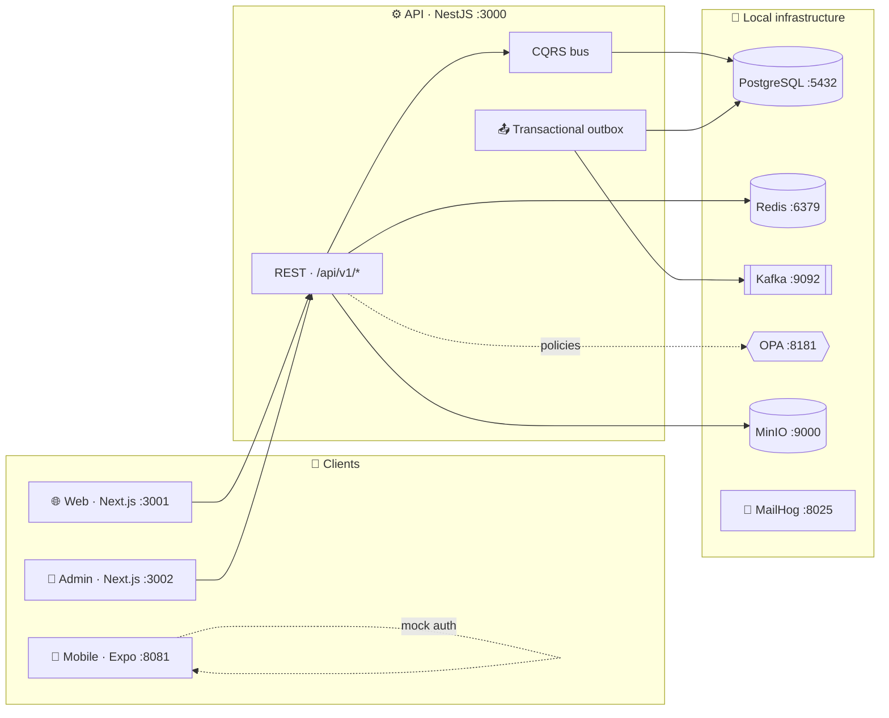
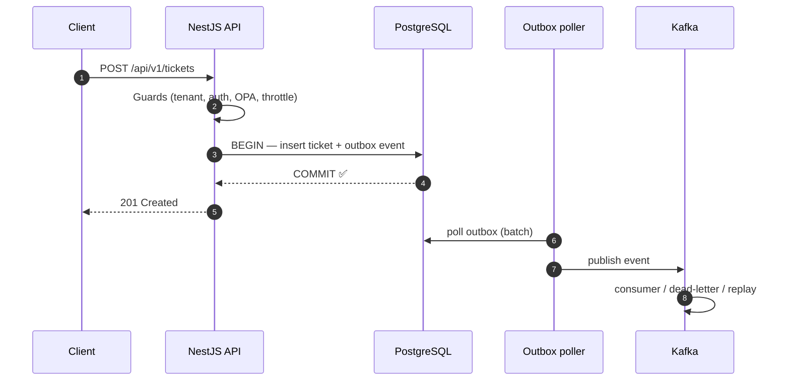

# 🧱 MiviaLabs Node Monorepo Boilerplate

An open-source **Nx + pnpm workspace** for building TypeScript services and web
applications. The starter ships a **NestJS API** (CQRS + PostgreSQL + Kafka +
Redis + OPA), **Next.js** web & admin apps, an **Expo** mobile app, 22 shared
packages, and a full local infrastructure stack via Docker Compose.

> ⚠️ This is a foundation for your own application, not a hosted product.
> Review authentication, authorization, data handling, and infrastructure
> defaults before running anything outside local development.

[](LICENSE)


---

## 🗺️ At a glance



Every state change goes through a **transactional outbox**: the command writes
domain rows and an outbox row in one PostgreSQL transaction, a poller publishes
to Kafka, and consumers handle delivery, dead-letters, and replay.



## 📦 What is included

| Area        | Path                     | What it is                                                                             |
| ----------- | ------------------------ | -------------------------------------------------------------------------------------- |
| 🛠️ API      | `apps/api`               | NestJS + CQRS, Drizzle, multi-tenant guards, OpenAPI/Redoc — **v1-only** (`/api/v1/*`) |
| 🌐 Web      | `apps/web`               | Next.js customer app (auth, projects, issues, content)                                 |
| 🧭 Admin    | `apps/admin`             | Next.js operator console (tenants, users, outbox, DLQ)                                 |
| 📱 Mobile   | `apps/mobile`            | Expo (SDK 54) + expo-router starter with mocked auth                                   |
| 🧩 Packages | `packages/`              | 22 shared packages — see [docs/packages.md](docs/packages.md)                          |
| 🐳 Infra    | `docker-compose.dev.yml` | PostgreSQL, Redis, OPA, Kafka, Zookeeper, MinIO, MailHog                               |
| 🔧 Tooling  | `tools/`, `scripts/`     | docs generators, security scanners, observability configs                              |

## 🚀 Start locally

```bash
git clone https://github.com/MiviaLabs/node-monorepo-boilerplate.git
cd node-monorepo-boilerplate
pnpm install
cp .env.example .env

pnpm dev:start      # 🐳 infrastructure up
pnpm dev:health     # ✅ wait until healthy
pnpm db:migrate     # 🗄️ apply schema migrations
```

Run apps in separate terminals:

```bash
pnpm dev:api        # 🛠️ Terminal 1
pnpm dev:web        # 🌐 Terminal 2
pnpm dev:mobile     # 📱 optional
pnpm dev:admin:docker  # 🧭 optional (PgAdmin profile)
```

| App                      | URL                                                             |
| ------------------------ | --------------------------------------------------------------- |
| API                      | <http://localhost:3000>                                         |
| API docs (Swagger/Redoc) | <http://localhost:3000/api/docs>                                |
| Web                      | <http://localhost:3001>                                         |
| Admin                    | <http://localhost:3002>                                         |
| Mobile (Expo)            | <http://localhost:8081> — QR code via Expo Go, or press `i`/`a` |

Seed demo data or reset the database:

```bash
pnpm dev:seed       # 🌱 seed datasets
pnpm dev:reset-db   # ♻️ drop & recreate
```

## 🧭 API surface (v1)

All routes live under **`/api/v1`** — there is no v2. Highlights:

| Base path                       | Domain                                                          |
| ------------------------------- | --------------------------------------------------------------- |
| `/api/v1/iam`                   | 🔐 login, registration, tokens, OAuth, sessions, password reset |
| `/api/v1/people`                | 👥 people directory, addresses (encrypted PII), key rotation    |
| `/api/v1/workspaces`            | 🏢 tenants, members, invitations                                |
| `/api/v1/spaces`                | 🗂️ projects & project members                                   |
| `/api/v1/tickets`               | 🎫 issues, comments, labels, watchers                           |
| `/api/v1/pages`                 | 📄 content entries, comments, attachments                       |
| `/api/v1/objects`               | 🗄️ file uploads & downloads (S3/MinIO)                          |
| `/api/v1/secure-vault`          | 🔒 field-level encrypted storage                                |
| `/api/v1/console`               | 🧭 operator console, DLQ & inbound-mail operations              |
| `/api/v1/platform`              | 🛠️ settings, metrics, event replay                              |
| `/api/v1/webhooks/inbound-mail` | 📥 provider webhook ingestion                                   |
| `/api/v1/ops/health`            | 💓 health indicators                                            |
| `/api/v1/setup`                 | 🍼 first-run bootstrap                                          |

👉 Full route catalog: [docs/api.md](docs/api.md)

## 🐳 Local services

| Service             | Address                                           |
| ------------------- | ------------------------------------------------- |
| PostgreSQL          | `localhost:5432`                                  |
| Redis               | `localhost:6379`                                  |
| OPA                 | <http://localhost:8181>                           |
| Zookeeper / Kafka   | `localhost:2181` / `localhost:9092`               |
| MinIO API / Console | <http://localhost:9000> / <http://localhost:9001> |
| MailHog             | <http://localhost:8025>                           |

Optional profiles:

```bash
pnpm dev:admin:docker                                    # 🧙 PgAdmin :5050
docker compose -f docker-compose.dev.yml --profile observability up -d
# 📈 Jaeger :16686 · Prometheus :9090 · Grafana :3030
```

Lifecycle: `pnpm dev:ps` · `dev:logs` · `dev:restart` · `dev:stop` · `dev:clean`

## 🧪 Quality gates

```bash
pnpm lint:all          # 🧹 ESLint across the workspace
pnpm typecheck:all     # 🔍 TypeScript
pnpm test:api:unit     # 🧪 API unit tests (jest)
pnpm test:api:e2e      # 🌍 API e2e (testcontainers)
pnpm test:web:e2e      # 🎭 Playwright
pnpm test:admin        # 🧭 admin (vitest)
pnpm analyze:all       # 🔐 trufflehog + checkov + actionlint + hadolint
```

👉 Details: [docs/testing.md](docs/testing.md)

## 📚 Documentation

| Doc                                        | Contents                                               |
| ------------------------------------------ | ------------------------------------------------------ |
| [Docs index](docs/README.md)               | start here                                             |
| [Architecture](docs/architecture.md)       | 🏗️ system, request lifecycle, outbox, package layering |
| [API guide](docs/api.md)                   | 🔌 v1 route catalog, auth, throttling, errors          |
| [Packages](docs/packages.md)               | 🧩 all 22 packages explained                           |
| [Database](docs/database.md)               | 🗄️ tables, migrations, Drizzle workflow, outbox schema |
| [Testing](docs/testing.md)                 | 🧪 commands, strategies, testcontainers                |
| [Operations](docs/operations.md)           | ⚙️ env flags, observability, scanning, CI              |
| [Mobile](docs/mobile.md)                   | 📱 Expo app conventions                                |
| [Security](docs/security/authorization.md) | 🛡️ authorization reference                             |

Package-level behavior lives next to the code in `packages/*/README.md` and
`apps/api/docs/`. Verify source and tests before treating any doc as a
stability promise.

## 🔐 Security defaults

Designed around tenant isolation, protected operations, secret handling, and
evidence-backed validation. Never commit credentials or real user data. See
[SECURITY.md](SECURITY.md) before reporting a vulnerability.

## 📜 Status

Actively evolving starter. Interfaces and infrastructure defaults are starter
conventions, not compatibility promises — pin and review dependencies before
production deployment.
