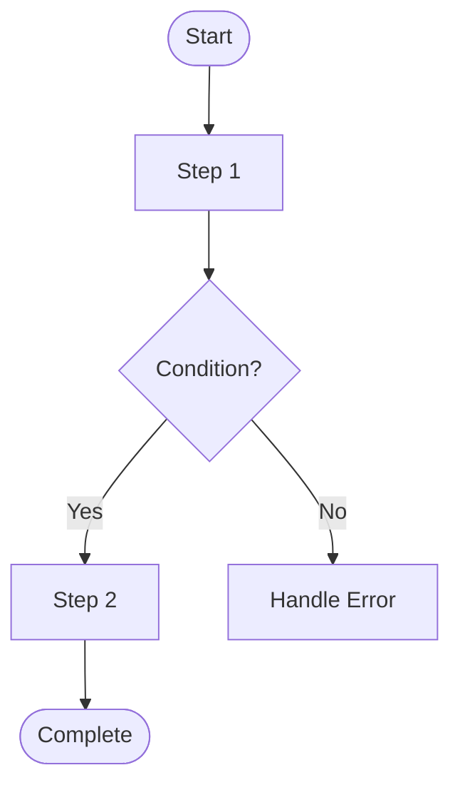
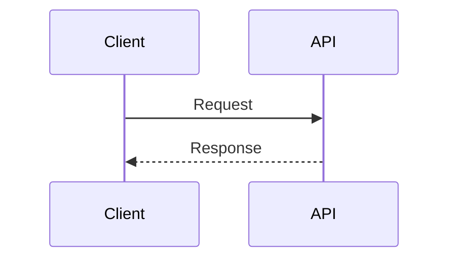
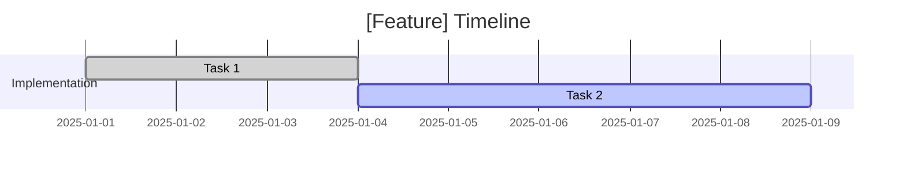

# API Documentation - Claude AI Guidelines

This document provides instructions for Claude AI when writing or updating API documentation in this directory.

## Documentation Requirements

### Mandatory Mermaid Diagrams

**Every documentation file MUST include at least one Mermaid diagram.**

Diagrams enhance understanding and should be placed **before** the related text content.

### Diagram Type Selection

Choose the appropriate diagram type based on content:

| Content Type             | Recommended Diagram    | Example Use Case                           |
| ------------------------ | ---------------------- | ------------------------------------------ |
| System architecture      | C4 Context/Container   | Overview, system boundaries, containers    |
| Request/response flows   | Sequence diagram       | API calls, service interactions            |
| Decision processes       | Flowchart              | Validation logic, error handling           |
| State transitions        | State diagram          | Version lifecycle, deprecation flow        |
| Time-based schedules     | Gantt chart            | Migration timelines, deprecation schedules |
| Class/Type relationships | Class diagram          | Decorator hierarchy, data models           |
| Process comparison       | Graph (with subgraphs) | Strategy comparison, architecture options  |
| Documentation structure  | Mindmap                | Table of contents, topic organization      |
| Data relationships       | ER diagram             | Database schemas, entity relationships     |
| Version evolution        | Timeline/Gantt         | Release history, lifecycle tracking        |

### Diagram Placement Guidelines

1. **Place diagrams before text**: Readers see the visual first, then read explanation
2. **Add descriptive titles**: Every diagram should have a clear title
3. **Use consistent styling**: Apply similar colors across related diagrams
4. **Keep diagrams focused**: Each diagram should illustrate one concept clearly

### Diagram Styling Conventions

Use these color codes for consistent styling:

```mermaid
classDiagram
    %% Color Palette
    %% Success/Green: #51cf66
    %% Info/Blue: #a5d8ff
    %% Warning/Yellow: #ffd43b
    %% Error/Red: #ff6b6b, #ff8787, #c92a2a
    %% Database: #e7f5ff
    %% Neutral: #f8f9fa
```

## File Organization

### Directory Structure

```
docs/
├── README.md                    # Main documentation index
├── AGENTS.md                    # This file
└── versioning/                  # Versioning documentation
    ├── overview.md              # Architecture overview
    ├── configuration.md         # Environment setup
    ├── usage.md                 # Usage examples
    ├── migration.md             # Migration guide
    ├── deprecation.md           # Deprecation strategy
    ├── decorators.md            # Decorator reference
    ├── guards.md                # Guard reference
    └── guide.md                 # Complete guide
```

### Creating New Documentation

When adding new documentation:

1. **Determine the category**:
   - Existing category (e.g., `versioning/`)
   - New category (create subdirectory)

2. **Choose appropriate filename**:
   - Use lowercase, hyphenated names
   - Example: `caching-strategy.md`, `error-handling.md`

3. **Include diagrams**:
   - At least one Mermaid diagram per file
   - Place diagrams before explanatory text

4. **Update README.md**:
   - Add entry to documentation index table
   - Include diagram type column
   - Update mindmap if adding new category

## Content Guidelines

### Markdown Formatting

1. **Headers**: Use `#` for title, `##` for main sections
2. **Code blocks**: Specify language for syntax highlighting
3. **Tables**: Use for reference information
4. **Lists**: Use for procedures and options
5. **Links**: Use relative paths for internal links

### Code Examples

````markdown
## Example Section

```typescript
// Always specify language
const example = 'value';
```
````

````

### Diagram Code Blocks

```markdown
## Section Title

```mermaid
flowchart TD
    A[Start] --> B[End]
````

Explanation of the diagram...

````

## TOC Maintenance

### When to Update TOC

Update the main README.md when:

1. Adding new documentation files
2. Renaming existing files
3. Restructuring directories
4. Changing diagram types in existing files

### TOC Format

The documentation index table must include:

| Column        | Description                           |
| ------------- | ------------------------------------- |
| Document      | Link to file with title               |
| Description   | Brief summary of content               |
| Diagrams      | Comma-separated list of diagram types  |

### Mindmap Updates

When adding new categories, update the mindmap in README.md:

```mermaid
mindmap
  root((API Docs))
    existing_category(Existing)
    new_category(New Category)
      new_doc(New Doc)
````

## Version-Specific Guidelines

### Versioning Documentation

When documenting API versioning features:

1. **Always include diagrams** for:
   - Version lifecycle (state diagram)
   - Migration process (flow or gantt)
   - Architecture (C4 or flow diagram)

2. **Use consistent terminology**:
   - "active", "deprecated", "sunset" for status
   - "prefix" for URL version (v1, v2)
   - "semantic version" for version numbers (1.0.0)

3. **Include examples** for:
   - Configuration (`.env` format)
   - Controllers (TypeScript code)
   - Requests (curl examples)

### Deprecated Content

When documenting deprecated features:

1. Use state diagram to show lifecycle
2. Include timeline for deprecation
3. Show migration path to new feature
4. Add warning styling to diagrams

## Quality Checklist

Before marking documentation as complete, verify:

- [ ] At least one Mermaid diagram included
- [ ] Diagram placed before related text
- [ ] Diagram has clear, descriptive title
- [ ] Consistent styling with other docs
- [ ] Code examples have language specified
- [ ] Internal links use relative paths
- [ ] README.md updated with new entry
- [ ] Mindmap updated if new category
- [ ] Spelling and grammar checked
- [ ] Technical accuracy verified

## Common Patterns

### Architecture Documentation

```mermaid
C4Context
    title [Feature] System Context
    Person(user, "User", "Description")
    Container(api, "API", "Technology", "Description")
    Rel(user, api, "Protocol", "Format")
```

### Process Documentation



### Sequence Documentation



### Timeline Documentation



## Additional Resources

- [Mermaid Diagram Syntax](https://mermaid.js.org/syntax/flowchart.html)
- [C4 Model Documentation](https://c4model.com/)
- [Markdown Guide](https://www.markdownguide.org/)
