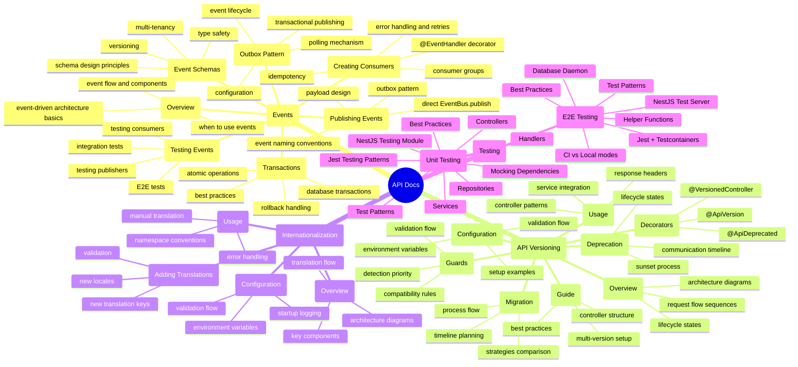

# API Documentation

This directory contains documentation for the NestJS API application.

## Documentation Map



## Events

The API uses **event-driven architecture** with the outbox pattern for reliable, transactional event publishing to Kafka.

### Documentation Index

| Document                                           | Description                                               | Diagrams              |
| -------------------------------------------------- | --------------------------------------------------------- | --------------------- |
| [Overview](events/overview.md)                     | Event-driven architecture basics, event flow, components  | C4 Context, Sequence  |
| [Publishing Events](events/publishing-events.md)   | Direct vs outbox publishing, naming conventions, payloads | Flow, Sequence        |
| [Outbox Pattern](events/outbox-pattern.md)         | Transactional event publishing, polling, configuration    | Sequence, State, Flow |
| [Transactions](events/transactions.md)             | Database transactions with events, atomic operations      | Sequence, Flow        |
| [Creating Consumers](events/creating-consumers.md) | Event consumers, @EventHandler decorator, idempotency     | Class, Sequence       |
| [Event Schemas](events/event-schemas.md)           | Schema design, type safety, versioning, multi-tenancy     | Class, Table          |
| [Testing Events](events/testing-events.md)         | Testing publishers, consumers, integration, E2E           | Flow, Sequence        |

## API Versioning

The API uses **semantic versioning** with URL-based version prefixes (e.g., `/api/v1/`, `/api/v2/`). This allows multiple API versions to run simultaneously for gradual migration and deprecation.

## Internationalization

The API uses the `@package/errors` package for comprehensive i18n support with automatic locale detection and translation.

### Documentation Index

| Document                                           | Description                                            | Diagrams                   |
| -------------------------------------------------- | ------------------------------------------------------ | -------------------------- |
| [Overview](i18n/overview.md)                       | Architecture, translation flow, and component overview | C4 Context, Flow, Sequence |
| [Configuration](i18n/configuration.md)             | Environment setup and validation details               | Flow, State                |
| [Usage](i18n/usage.md)                             | How to use i18n in controllers and services            | Flow, Sequence             |
| [Adding Translations](i18n/adding-translations.md) | How to add new translations and locales                | Flow, Mermaid              |

## Running Tests

The API uses **Jest + Testcontainers** for end-to-end testing with a real PostgreSQL database.

### Documentation Index

| Document                                            | Description                                                | Diagrams              |
| --------------------------------------------------- | ---------------------------------------------------------- | --------------------- |
| [E2E Testing Guide](testing/e2e-testing-guide.md)   | Complete guide to E2E testing with Jest and Testcontainers | Flow, State, Sequence |
| [Unit Testing Guide](testing/unit-testing-guide.md) | Comprehensive guide to unit testing with Jest              | Class, Sequence, Flow |

## Authentication

The API uses **@package/auth** for enterprise-grade authentication with Keycloak, JWT tokens, role-based access control, and multi-tenant support.

### Documentation Index

| Document                               | Description                                            | Diagrams                   |
| -------------------------------------- | ------------------------------------------------------ | -------------------------- |
| [Overview](auth/overview.md)           | Architecture and authentication flow                   | Flow, Sequence, C4 Context |
| [Quick Start](auth/quick-start.md)     | Get started in 5 minutes                               | Sequence, Flow             |
| [Configuration](auth/configuration.md) | Environment variables and module setup                 | Flow, State                |
| [Guards](auth/guards.md)               | Using JwtAuthGuard, RolesGuard, PermissionsGuard       | Flow, Class                |
| [Decorators](auth/decorators.md)       | @Public, @Roles, @RequirePermissions, @User, @TenantId | Class, Sequence            |
| [Multi-Tenancy](auth/multi-tenancy.md) | How tenant ID is handled in tokens                     | Flow, State                |
| [Testing](auth/testing.md)             | How to test with mock provider                         | Sequence, Flow             |

## API Versioning

The API uses **semantic versioning** with URL-based version prefixes (e.g., `/api/v1/`, `/api/v2/`). This allows multiple API versions to run simultaneously for gradual migration and deprecation.

### Documentation Index

| Document                                     | Description                                       | Diagrams                   |
| -------------------------------------------- | ------------------------------------------------- | -------------------------- |
| [Overview](versioning/overview.md)           | Architecture and request flow                     | C4 Context, Sequence       |
| [Configuration](versioning/configuration.md) | Environment setup and validation                  | Flow, State                |
| [Usage](versioning/usage.md)                 | Controller patterns and response headers          | Sequence, Flow             |
| [Migration](versioning/migration.md)         | Migration strategies and planning                 | Gantt, Graph, Flow         |
| [Deprecation](versioning/deprecation.md)     | Deprecation lifecycle and communication           | State, Timeline, Flow      |
| [Decorators](versioning/decorators.md)       | @ApiVersion, @ApiDeprecated, @VersionedController | Class, Sequence            |
| [Guards](versioning/guards.md)               | ApiVersionGuard validation flow                   | Flow, State                |
| [Guide](versioning/guide.md)                 | Complete setup guide with best practices          | C4 Context, Flow, Sequence |

### Documentation Features

All documentation files include **Mermaid diagrams** to visualize:

- **Architecture diagrams**: C4 model for system context and containers
- **Flow diagrams**: Decision processes and validation flows
- **Sequence diagrams**: Request/response interactions between components
- **State diagrams**: Version lifecycle and deprecation states
- **Gantt charts**: Migration timelines and deprecation schedules
- **Class diagrams**: Decorator hierarchy and relationships

### Quick Start

**Configuration:**

```env
# Required format: prefix:version:status[:sunsetDate]
API_VERSIONS=v1:1.0.0:active,v2:2.0.0:active
API_DEFAULT_VERSION=v1
API_DEPRECATION_WARNING_DAYS=90
```

**Controller:**

```typescript
@VersionedController('v1', 'users')
export class UsersControllerV1 {
  @Get()
  findAll() {
    return [];
  }
}
// Routes to: /api/v1/users
```

**Deprecation:**

```env
API_VERSIONS=v1:1.0.0:deprecated:2026-06-30,v2:2.0.0:active
```

### Version Status

| Status       | Description                             |
| ------------ | --------------------------------------- |
| `active`     | Current stable version                  |
| `deprecated` | Scheduled for removal, warnings enabled |
| `sunset`     | Past sunset date, no longer accessible  |

### Response Headers

Deprecated versions return these headers:

| Header              | Example                            |
| ------------------- | ---------------------------------- |
| `X-API-Version`     | `v1`                               |
| `X-API-Deprecated`  | `true`                             |
| `X-API-Sunset`      | `2026-06-30`                       |
| `X-API-Deprecation` | Human-readable deprecation message |
