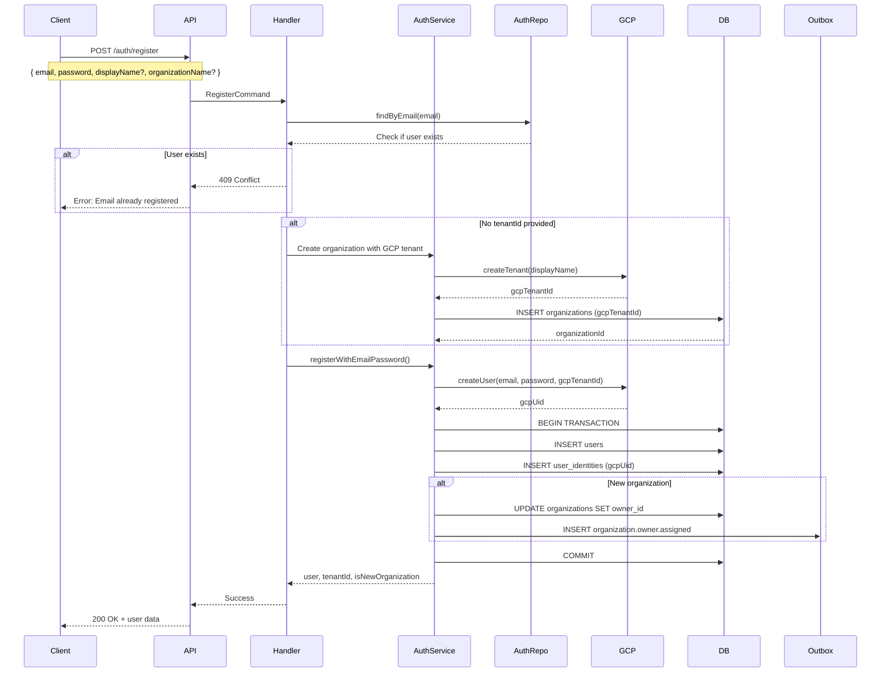
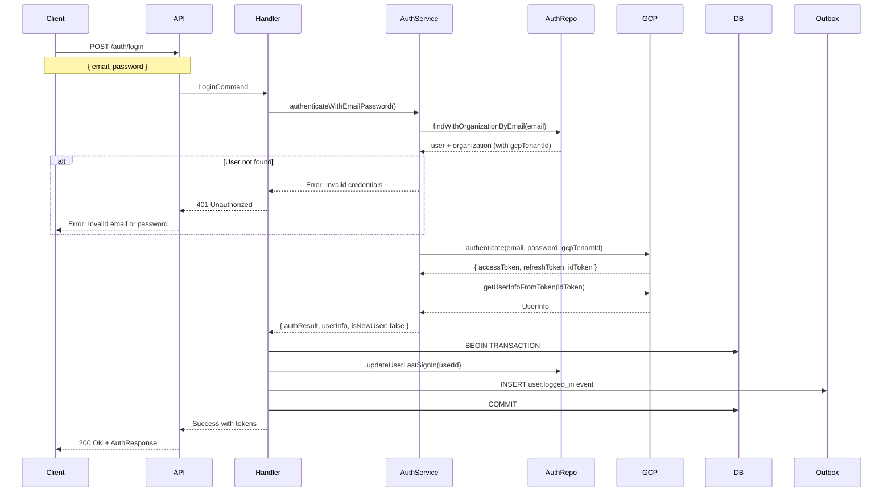
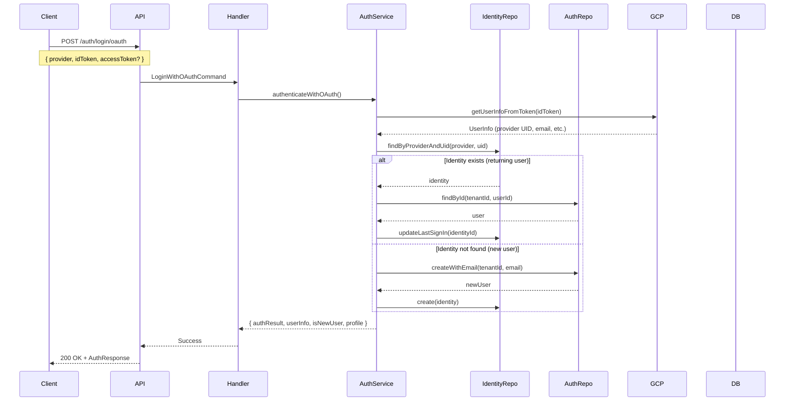
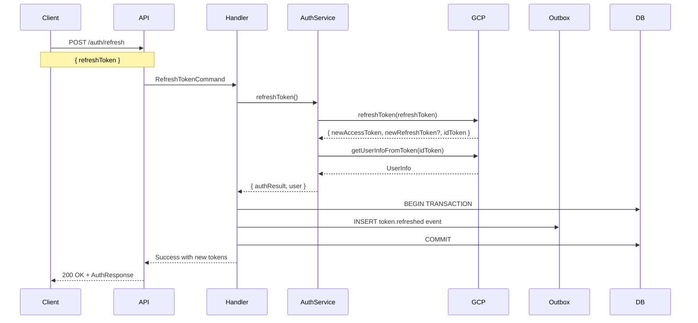
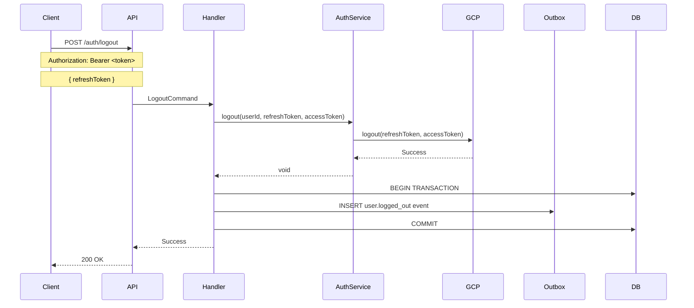
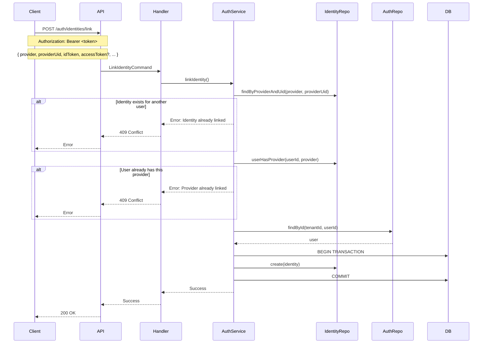

# Authentication Flows

This document details the authentication flows in the auth module, including sequence diagrams, request/response formats, and error scenarios.

## Table of Contents

- [Registration Flow](#registration-flow)
- [Login Flow (Email/Password)](#login-flow-emailpassword)
- [OAuth Login Flow](#oauth-login-flow)
- [Token Refresh Flow](#token-refresh-flow)
- [Logout Flow](#logout-flow)
- [Password Reset Flow](#password-reset-flow)
- [Identity Linking Flow](#identity-linking-flow)
- [Session Management](#session-management)
- [Error Scenarios](#error-scenarios)

## Registration Flow

### Overview

New user registration with email/password. Creates organization (if new tenant) and provisions user in GCP Identity Platform synchronously.

### Sequence Diagram



### Request Format

**Endpoint:** `POST /api/v1/auth/register`

**Headers:**

```http
Content-Type: application/json
x-tenant-id: <tenant-id>  # Optional - if not provided, creates new org
```

**Body:**

```json
{
  "email": "user@example.com",
  "password": "SecurePass123!",
  "displayName": "John Doe", // Optional
  "organizationName": "Acme Inc", // Optional (required if no tenantId)
  "isVerified": true, // Optional, default: true
  "isActive": true // Optional, default: true
}
```

**Validation Rules:**

- `email`: Valid email format
- `password`: Min 8 chars, requires uppercase, lowercase, number, special char
- `displayName`: 2-50 characters (optional)
- `organizationName`: 2-100 characters, sanitized to 4-20 chars for GCP tenant

### Response Format

**Success (200 OK):**

```json
{
  "user": {
    "id": "123",
    "email": "user@example.com",
    "name": "John Doe",
    "tenantId": "abc-123",
    "organizationId": "456",
    "isVerified": true,
    "isActive": true,
    "createdAt": "2024-01-08T12:00:00Z"
  },
  "tenantId": "abc-123",
  "isNewOrganization": true,
  "gcpTenantId": "tenant-xyz",
  "message": "Registration successful. You can login immediately."
}
```

**Error (409 Conflict):**

```json
{
  "statusCode": 409,
  "message": "User with this email already exists",
  "error": "Conflict",
  "code": "AUTH_002"
}
```

### Rollback on Failure

If database transaction fails:

1. Delete GCP user (if created)
2. Delete GCP tenant (if new organization)
3. Return error to client

This ensures atomic operation - all resources created or none.

## Login Flow (Email/Password)

### Overview

Authenticate user with email and password via GCP Identity Platform. Returns JWT tokens.

### Sequence Diagram



### Request Format

**Endpoint:** `POST /api/v1/auth/login`

**Headers:**

```http
Content-Type: application/json
x-tenant-id: <tenant-id>  # Optional for public auth routes
```

**Body:**

```json
{
  "email": "user@example.com",
  "password": "SecurePass123!"
}
```

### Response Format

**Success (200 OK):**

```json
{
  "accessToken": "eyJhbGciOiJSUzI1NiIsImtpZCI6Ij...",
  "refreshToken": "eyJhbGciOiJSUzI1NiIsImtpZCI6Ij...",
  "idToken": "eyJhbGciOiJSUzI1NiIsImtpZCI6Ij...",
  "expiresIn": 3600,
  "refreshExpiresIn": 1209600,
  "user": {
    "userId": "123",
    "username": "user@example.com",
    "email": "user@example.com",
    "emailVerified": true,
    "roles": ["user"],
    "permissions": [],
    "tenantId": "abc-123"
  },
  "isNewUser": false
}
```

**Error (401 Unauthorized):**

```json
{
  "statusCode": 401,
  "message": "Invalid email or password",
  "error": "Unauthorized",
  "code": "AUTH_001"
}
```

### Token Structure

**Access Token (JWT):**

```json
{
  "header": {
    "alg": "RS256",
    "typ": "JWT",
    "kid": "key-id"
  },
  "payload": {
    "sub": "123", // User ID
    "email": "user@example.com",
    "email_verified": true,
    "tenant_id": "abc-123",
    "roles": ["user"],
    "permissions": [],
    "iat": 1704715200, // Issued at
    "exp": 1704718800, // Expires at (1 hour)
    "iss": "https://identitytoolkit.googleapis.com/...",
    "aud": "project-id"
  }
}
```

## OAuth Login Flow

### Overview

Authenticate user with OAuth provider (Google, Microsoft, etc.). Creates user if first login.

### Sequence Diagram



### Request Format

**Endpoint:** `POST /api/v1/auth/login/oauth`

**Headers:**

```http
Content-Type: application/json
x-tenant-id: <tenant-id>
```

**Body:**

```json
{
  "provider": "google.com",
  "idToken": "eyJhbGciOiJSUzI1NiIsImtpZCI6Ij...",
  "accessToken": "ya29.a0AfH6SMBx..." // Optional
}
```

**Supported Providers:**

- `google.com` - Google OAuth
- `microsoft.com` - Microsoft OAuth
- `apple.com` - Apple OAuth
- `linkedin.com` - LinkedIn OAuth
- `github.com` - GitHub OAuth
- `facebook.com` - Facebook OAuth

### Response Format

Same as email/password login, with `isNewUser` indicating if account was created.

## Token Refresh Flow

### Overview

Refresh expired access token using refresh token.

### Sequence Diagram



### Request Format

**Endpoint:** `POST /api/v1/auth/refresh`

**Headers:**

```http
Content-Type: application/json
x-tenant-id: <tenant-id>  # Optional for public auth routes
```

**Body:**

```json
{
  "refreshToken": "eyJhbGciOiJSUzI1NiIsImtpZCI6Ij..."
}
```

### Response Format

**Success (200 OK):**

```json
{
  "accessToken": "eyJhbGciOiJSUzI1NiIsImtpZCI6Ij...",
  "refreshToken": "eyJhbGciOiJSUzI1NiIsImtpZCI6Ij...",
  "idToken": "eyJhbGciOiJSUzI1NiIsImtpZCI6Ij...",
  "expiresIn": 3600,
  "refreshExpiresIn": 1209600,
  "user": {
    "userId": "123",
    "email": "user@example.com",
    "tenantId": "abc-123"
  },
  "isNewUser": false
}
```

**Error (401 Unauthorized):**

```json
{
  "statusCode": 401,
  "message": "Invalid or expired refresh token",
  "error": "Unauthorized",
  "code": "AUTH_007"
}
```

## Logout Flow

### Overview

Invalidate user's access and refresh tokens.

### Sequence Diagram



### Request Format

**Endpoint:** `POST /api/v1/auth/logout`

**Headers:**

```http
Content-Type: application/json
Authorization: Bearer <access-token>
x-tenant-id: <tenant-id>
```

**Body:**

```json
{
  "refreshToken": "eyJhbGciOiJSUzI1NiIsImtpZCI6Ij..."
}
```

### Response Format

**Success (200 OK):**

```json
{
  "message": "Logged out successfully"
}
```

## Password Reset Flow

The password reset flow operates as follows:

1. User requests password reset
2. System sends reset link via email
3. User clicks link with reset token
4. User submits new password
5. System updates password in GCP
6. User redirected to login

## Identity Linking Flow

### Overview

Link additional OAuth provider to existing user account.

### Sequence Diagram



### Request Format

**Endpoint:** `POST /api/v1/auth/identities/link`

**Headers:**

```http
Content-Type: application/json
Authorization: Bearer <access-token>
x-tenant-id: <tenant-id>
```

**Body:**

```json
{
  "provider": "google.com",
  "providerUid": "google-user-id",
  "idToken": "eyJhbGciOiJSUzI1NiIsImtpZCI6Ij...",
  "accessToken": "ya29.a0AfH6SMBx...",
  "displayName": "John Doe",
  "photoUrl": "https://example.com/photo.jpg"
}
```

### Response Format

**Success (200 OK):**

```json
{
  "message": "Identity linked successfully"
}
```

**Error (409 Conflict):**

```json
{
  "statusCode": 409,
  "message": "This identity is already linked to another account",
  "error": "Conflict",
  "code": "AUTH_013"
}
```

## Session Management

### Get User Sessions

**Endpoint:** `GET /api/v1/auth/sessions`

**Response:**

```json
[
  {
    "sessionId": "session-123",
    "userId": "123",
    "deviceInfo": "Chrome on Windows",
    "ipAddress": "192.168.1.1",
    "lastActivity": "2024-01-08T12:00:00Z",
    "expiresAt": "2024-01-15T12:00:00Z"
  }
]
```

### Get User Identities

**Endpoint:** `GET /api/v1/auth/identities`

**Response:**

```json
[
  {
    "id": "1",
    "provider": "email_password",
    "providerUid": "123",
    "displayName": "John Doe",
    "emailVerified": true,
    "isPrimary": true,
    "lastSignInAt": "2024-01-08T12:00:00Z",
    "createdAt": "2024-01-01T12:00:00Z"
  },
  {
    "id": "2",
    "provider": "google.com",
    "providerUid": "google-123",
    "displayName": "John Doe",
    "photoUrl": "https://example.com/photo.jpg",
    "emailVerified": true,
    "isPrimary": false,
    "lastSignInAt": "2024-01-07T12:00:00Z",
    "createdAt": "2024-01-05T12:00:00Z"
  }
]
```

## Error Scenarios

### Common Error Codes

| Code     | HTTP Status | Description                    | Scenario                           |
| -------- | ----------- | ------------------------------ | ---------------------------------- |
| AUTH_001 | 401         | Invalid credentials            | Wrong email/password               |
| AUTH_002 | 404         | User not found                 | User doesn't exist                 |
| AUTH_003 | 404         | Identity not found             | Identity doesn't exist             |
| AUTH_004 | 400         | Provider not supported         | Invalid OAuth provider             |
| AUTH_005 | 401         | Token invalid                  | Malformed or tampered token        |
| AUTH_006 | 401         | Token expired                  | Access token expired               |
| AUTH_007 | 401         | Refresh token invalid          | Invalid refresh token              |
| AUTH_008 | 401         | Session expired                | Session timeout                    |
| AUTH_009 | 403         | Account locked                 | Too many failed attempts           |
| AUTH_010 | 403         | Email not verified             | Email verification required        |
| AUTH_011 | 400         | Weak password                  | Password doesn't meet requirements |
| AUTH_013 | 409         | Identity already linked        | Provider already linked            |
| AUTH_014 | 400         | Cannot unlink primary identity | Primary identity required          |
| AUTH_015 | 404         | Account not found              | Account doesn't exist              |

### Error Response Format

**Standard Error:**

```json
{
  "statusCode": 401,
  "message": "Invalid email or password",
  "error": "Unauthorized",
  "code": "AUTH_001"
}
```

**Validation Error:**

```json
{
  "statusCode": 400,
  "message": "Validation failed",
  "error": "Bad Request",
  "errors": [
    {
      "field": "email",
      "constraint": "Must be a valid email address"
    },
    {
      "field": "password",
      "constraint": "Password must be at least 8 characters"
    }
  ]
}
```

### Rate Limiting

**Login Attempts:**

- Limit: 5 attempts per 15 minutes
- Response: `429 Too Many Requests`

```json
{
  "statusCode": 429,
  "message": "Too many login attempts. Please try again in 15 minutes.",
  "error": "Too Many Requests",
  "retryAfter": 900
}
```

**Registration Attempts:**

- Limit: 3 attempts per hour
- Response: `429 Too Many Requests`

### Account State Errors

**Account Locked:**

```json
{
  "statusCode": 403,
  "message": "Account is locked due to suspicious activity",
  "error": "Forbidden",
  "code": "AUTH_009"
}
```

**Email Not Verified:**

```json
{
  "statusCode": 403,
  "message": "Email verification required",
  "error": "Forbidden",
  "code": "AUTH_010"
}
```

## Best Practices

### Client Implementation

1. **Token Storage:**
   - Store access token in memory (not localStorage for XSS protection)
   - Store refresh token in httpOnly cookie (if possible)
   - Clear tokens on logout

2. **Token Refresh:**
   - Refresh token before expiration (e.g., 5 minutes before)
   - Retry failed requests after refreshing token
   - Logout user if refresh fails

3. **Error Handling:**
   - Handle 401 errors by refreshing token
   - Handle 429 errors with exponential backoff
   - Show user-friendly error messages

4. **Security:**
   - Never log tokens
   - Use HTTPS only
   - Validate SSL certificates
   - Implement CSRF protection

### Server Implementation

1. **Token Validation:**
   - Validate on every request (via JwtAuthGuard)
   - Check tenant context matches token
   - Verify token signature and expiration

2. **Audit Logging:**
   - Log all auth events (login, logout, token refresh)
   - Include actor ID, IP address, user agent
   - Store in immutable event log

3. **Multi-Tenancy:**
   - Always scope queries to tenant
   - Validate tenant ownership
   - Use composite indexes for performance

4. **Rate Limiting:**
   - Implement per-IP rate limiting
   - Track failed login attempts
   - Lock accounts after threshold

## Documentation References

- [Architecture](./architecture.md) - Module architecture and design
- [Configuration](./configuration.md) - Environment configuration
- [Guards](./guards.md) - Authentication guards
- [Testing](./testing.md) - Testing authentication flows
- [Quick Start](./quick-start.md) - Getting started guide
