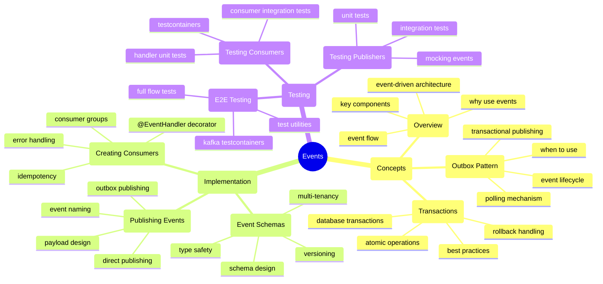
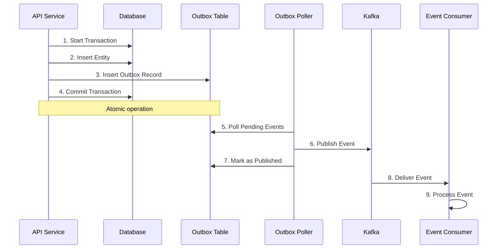

# Events Documentation

This directory contains comprehensive documentation for event-driven architecture in the API application.

## Documentation Map



## Quick Start

### 1. Your First Event (5 minutes)

**The Simple Way - Direct Publishing:**

```typescript
import { eventBus } from '@package/events';

// Publish an event
await eventBus.publish('user.created', {
  userId: 'user-123',
  email: 'user@example.com',
  name: 'John Doe'
});
```

**The Production Way - Outbox Pattern:**

```typescript
import { OutboxRepository } from '@package/events';

async execute(command: CreateUserCommand) {
  return this.db.transaction(async (tx) => {
    // 1. Create user
    const [user] = await tx.insert(users).values(command.data).returning();

    // 2. Store event in outbox (SAME transaction)
    await this.outboxRepo.insert(tx, {
      eventId: randomUUID(),
      eventType: 'user.created',
      aggregateId: user.id,
      payload: { userId: user.id, email: user.email },
      tenantId: command.tenantId,
    });

    // 3. Both commit atomically
    return user;
  });
}
```

### 2. Your First Consumer (3 minutes)

```typescript
import { Injectable } from '@nestjs/common';
import { EventHandler } from '@package/events';
import type { EventMessage } from '@package/events';

@Injectable()
export class UserCreatedConsumer {
  @EventHandler('user.created')
  handleUserCreated(event: EventMessage) {
    console.log('User created:', event.data.userId);
    // Send welcome email, update cache, etc.
  }
}
```

### 3. Choose Your Path

| Your Situation               | Recommended Approach                                                 |
| ---------------------------- | -------------------------------------------------------------------- |
| **Learning events**          | Start with [Overview](overview.md)                                   |
| **Need reliability**         | Use [Outbox Pattern](outbox-pattern.md)                              |
| **Simple notifications**     | Use [Direct Publishing](publishing-events.md#direct-eventbuspublish) |
| **Critical business events** | Use [Outbox Pattern](outbox-pattern.md)                              |
| **Building a consumer**      | See [Creating Consumers](creating-consumers.md)                      |
| **Designing events**         | See [Event Schemas](event-schemas.md)                                |
| **Testing events**           | See [Testing Events](testing-events.md)                              |

## When to Use Events

### Good Use Cases for Events

- **Cross-domain communication** - Notify other services when data changes
- **Async processing** - Offload long-running tasks (email, PDF generation)
- **Data synchronization** - Keep multiple data sources in sync
- **Audit logging** - Track all state changes for compliance
- **Multi-step workflows** - Coordinate complex business processes
- **Cache invalidation** - Invalidate caches when data changes
- **Analytics** - Track user behavior and metrics

### When NOT to Use Events

- **Simple CRUD** - Direct database calls are simpler
- **Request/response** - Use REST or tRPC for synchronous responses
- **Low-latency requirements** - Events add overhead
- **Simple queries** - Events are for notifications, not queries

## Key Concepts

### Event Delivery Patterns

The monorepo supports two event delivery patterns:

#### 1. Direct EventBus.publish()

**Characteristics:**

- Events published directly to Kafka
- Fast but no transactional guarantee
- Events can be lost if Kafka is down
- Good for non-critical events

**Use for:**

- Analytics events
- Cache invalidation hints
- Low-stakes notifications

**See:** [Publishing Events - Direct](publishing-events.md#direct-eventbuspublish)

#### 2. Outbox Pattern

**Characteristics:**

- Events stored in database table
- Background worker publishes to Kafka
- Transactional guarantees
- At-least-once delivery
- Event replay capability

**Use for:**

- Critical business events
- Orders, payments, user lifecycle
- Events that must not be lost

**See:** [Outbox Pattern Guide](outbox-pattern.md)

### Event Naming Convention

Events use **dot notation** with `{aggregate}.{past-tense-verb}`:

```typescript
// Format: {entity}.{past-tense-verb}
'user.created'; // ✅ GOOD
'user.updated'; // ✅ GOOD
'order.completed'; // ✅ GOOD
'payment.processed'; // ✅ GOOD

// Bad examples
'userCreate'; // ❌ WRONG - not dot notation
'create_user'; // ❌ WRONG - not dot notation
'USER_CREATED'; // ❌ WRONG - not lowercase
'user'; // ❌ WRONG - no action
'user.creation'; // ❌ WRONG - not past tense
```

**See:** [Publishing Events - Naming](publishing-events.md#event-naming-conventions)

### Transactional Consistency

**Critical:** Events representing business transactions must use the outbox pattern:

```typescript
// ❌ WRONG - Event published outside transaction
async execute(command: CreateUserCommand) {
  const user = await this.repository.create(command.data);
  // If this fails, user exists but event is lost
  await this.eventBus.publish('user.created', userData);
}

// ✅ GOOD - Event in outbox (same transaction)
async execute(command: CreateUserCommand) {
  return this.db.transaction(async (tx) => {
    const user = await this.repository.create(tx, command.data);
    // Both commit atomically or both rollback
    await this.outboxRepo.insert(tx, eventData);
    return user;
  });
}
```

**See:** [Transactions Guide](transactions.md)

### Consumer Requirements

**All event handlers must be idempotent** (safe to run multiple times):

```typescript
// ❌ WRONG - Not idempotent (sends email twice)
async handle(event: UserCreatedEvent) {
  await this.emailService.sendWelcome(event.data.email);
}

// ✅ GOOD - Idempotent (tracks processed events)
async handle(event: UserCreatedEvent) {
  const processed = await this.processedRepo.findById(event.eventId);
  if (processed) return; // Skip if already processed

  await this.emailService.sendWelcome(event.data.email);
  await this.processedRepo.insert({ eventId: event.eventId });
}
```

**See:** [Creating Consumers - Idempotency](creating-consumers.md#idempotent-consumers)

## Documentation Index

| Document                                    | Description                                                             | Diagrams              |
| ------------------------------------------- | ----------------------------------------------------------------------- | --------------------- |
| [Overview](overview.md)                     | Event-driven architecture basics, event flow, key components            | C4 Context, Sequence  |
| [Outbox Pattern](outbox-pattern.md)         | Transactional event publishing, polling mechanism, configuration        | Sequence, State, Flow |
| [Transactions](transactions.md)             | Database transactions with events, atomic operations, rollback handling | Sequence, Flow        |
| [Publishing Events](publishing-events.md)   | How to publish events, direct vs outbox, naming conventions             | Flow, Sequence        |
| [Creating Consumers](creating-consumers.md) | How to create event consumers, @EventHandler decorator, consumer groups | Class, Sequence       |
| [Event Schemas](event-schemas.md)           | Event schema design, type safety, versioning, payload design            | Class, Table          |
| [Testing Events](testing-events.md)         | Testing publishers, consumers, integration tests, testcontainers        | Flow, Sequence        |

## Common Workflows

### Workflow 1: Create a New Event Type

1. Define event schema in `/events/{entity}-events.schema.ts`
2. Add event type constant in `/events/{entity}-event-types.constants.ts`
3. Publish event in command handler (with outbox)
4. Create consumer with `@EventHandler` decorator
5. Test event flow end-to-end

**See:** [Event Schemas](event-schemas.md), [Publishing Events](publishing-events.md), [Creating Consumers](creating-consumers.md)

### Workflow 2: Add Event to Existing Command

1. Open command handler file
2. Wrap operation in transaction (if not already)
3. Insert outbox record in same transaction
4. Test transaction rollback
5. Test event delivery

**See:** [Transactions](transactions.md), [Outbox Pattern](outbox-pattern.md)

### Workflow 3: Debug Event Flow

1. Check outbox table for pending events
2. Check health endpoint: `GET /v1/health`
3. Review consumer logs for errors
4. Check dead-letter queue for failed events
5. Verify event schema matches payload

**See:** [Dead Letter Queue](./dead-letter.md)

## Architecture Overview



## Configuration

### Environment Variables

```bash
# Required
KAFKA_BROKERS=localhost:9092
KAFKA_CLIENT_ID=api-service

# Outbox Poller (optional)
OUTBOX_POLLER_ENABLED=true
OUTBOX_POLL_INTERVAL=1000
OUTBOX_BATCH_SIZE=10
OUTBOX_MAX_RETRIES=5
```

**See:** [Outbox Pattern - Configuration](outbox-pattern.md#configuration)

### Module Setup

```typescript
import { Module } from '@nestjs/common';
import { EventsModule } from '@package/events';

@Module({
  imports: [
    EventsModule.forRootAsync({
      imports: [ConfigModule],
      inject: [ConfigService],
      useFactory: (config: ConfigService) => ({
        kafka: {
          brokers: config.get('KAFKA_BROKERS').split(','),
          clientId: config.get('KAFKA_CLIENT_ID')
        }
      })
    })
  ]
})
export class AppModule {}
```

**See:** [Overview - Setup](overview.md#setup)

## Best Practices Checklist

When working with events:

- [ ] **Choose the right pattern** - Direct for non-critical, Outbox for critical
- [ ] **Use proper naming** - `{aggregate}.{past-tense-verb}`
- [ ] **Include complete data** - Self-contained payloads
- [ ] **Add tenant context** - Always include `tenantId`
- [ ] **Use transactions** - Wrap state + outbox in same transaction
- [ ] **Make consumers idempotent** - Handle duplicate events safely
- [ ] **Version your schemas** - Use `schemaVersion` field
- [ ] **Test your flows** - Unit tests + integration tests
- [ ] **Monitor health** - Check `/v1/health` for outbox status
- [ ] **Handle failures** - Configure DLQ and retry logic

## Learning Path

### Beginner (New to Events)

1. Read [Overview](overview.md) - Understand event-driven architecture
2. Read [Publishing Events](publishing-events.md) - Learn to publish events
3. Read [Creating Consumers](creating-consumers.md) - Learn to consume events
4. Practice with simple events (analytics, notifications)

### Intermediate (Comfortable with Basics)

1. Read [Outbox Pattern](outbox-pattern.md) - Master transactional publishing
2. Read [Transactions](transactions.md) - Understand transaction boundaries
3. Read [Event Schemas](event-schemas.md) - Design better event payloads
4. Practice with business-critical events

### Advanced (Production Experience)

1. Read [Testing Events](testing-events.md) - Comprehensive testing strategies
2. Read [Dead Letter Queue](./dead-letter.md) - Debug failed deliveries
3. Review [Transactions](./transactions.md) - Understand delivery boundaries
4. Contribute to event patterns and standards

## Documentation References

### API Documentation

- [API Documentation Home](../README.md)
- [CQRS Guide](../auth/cqrs.md)
- [Testing Guide](../testing/unit-testing-guide.md)

### Infrastructure Documentation

- [Infrastructure Events Overview](./overview.md)
- [Outbox Pattern Deep Dive](./outbox-pattern.md)
- [Creating Consumers](./creating-consumers.md)

### Standards

- [Core Guardrails](../../../../.agents/governance/core-guardrails.md)
- [Auth Multi-Tenancy](../auth/multi-tenancy.md)

## Getting Help

### Common Issues

| Issue                  | Solution                                                                                               |
| ---------------------- | ------------------------------------------------------------------------------------------------------ |
| Events not publishing  | Check Kafka connectivity, see [Dead Letter Queue](./dead-letter.md)                                    |
| Consumer not receiving | Check consumer group, see [Creating Consumers](creating-consumers.md)                                  |
| Duplicate events       | Ensure idempotency, see [Creating Consumers - Idempotency](creating-consumers.md#idempotent-consumers) |
| Transaction errors     | Check transaction boundaries, see [Transactions](transactions.md)                                      |
| Outbox growing         | Check poller health, see [Outbox Pattern - Monitoring](outbox-pattern.md#monitoring)                   |

### External Resources

- [Transactional Outbox Pattern (Chris Richardson)](https://microservices.io/patterns/data/transactional-outbox.html)
- [Event-Driven Architecture (Martin Fowler)](https://martinfowler.com/articles/microservices.html#EventDrivenArchitecture)
- [Kafka Documentation](https://kafka.apache.org/documentation/)
- [Outbox Pattern (Microsoft)](https://docs.microsoft.com/en-us/azure/architecture/patterns/transactional-outbox)

## Summary

This documentation provides everything you need to:

- **Understand** event-driven architecture concepts
- **Publish** events reliably using the outbox pattern
- **Consume** events safely with idempotent handlers
- **Test** event-driven code effectively
- **Troubleshoot** common event issues

Start with the [Overview](overview.md) if you're new to events, or jump to the specific guide you need.
