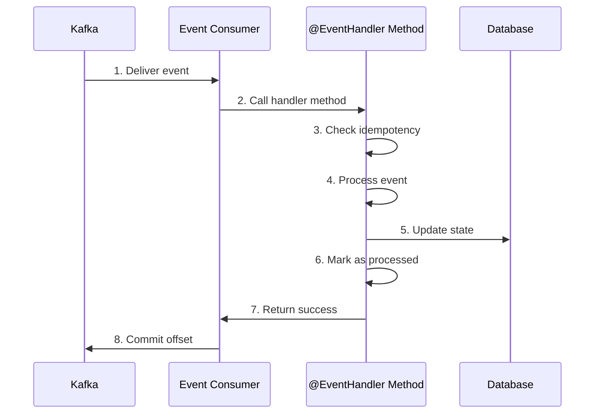
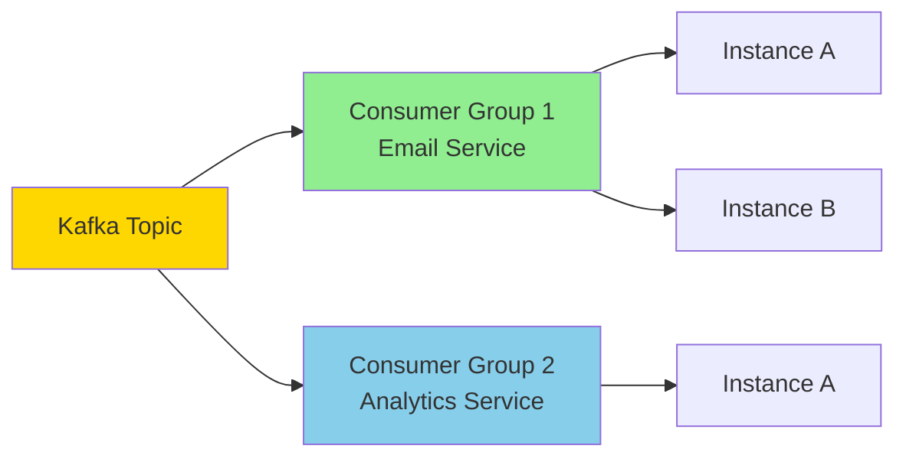
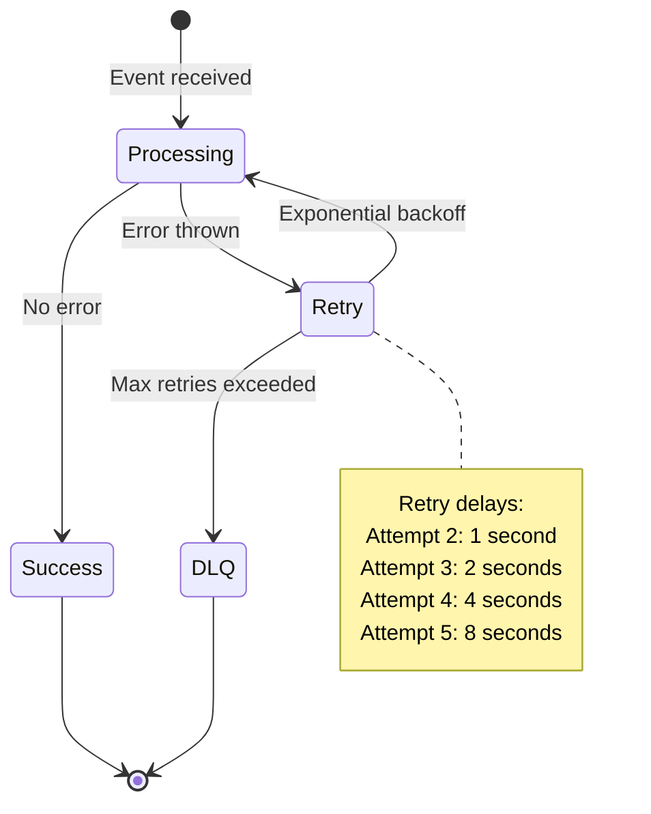

# Creating Event Consumers Guide

**This guide explains how to create event consumers that listen for and process events from Kafka.**

## Table of Contents

- [What are Event Consumers?](#what-are-event-consumers)
- [Quick Start](#quick-start)
- [The @EventHandler Decorator](#the-eventhandler-decorator)
- [Consumer Groups and Scaling](#consumer-groups-and-scaling)
- [Error Handling and Retries](#error-handling-and-retries)
- [Idempotent Consumers](#idempotent-consumers)
- [Testing Consumers](#testing-consumers)
- [Common Patterns](#common-patterns)
- [Best Practices](#best-practices)

---

## What are Event Consumers?

**Event consumers** are services that listen for events from Kafka and process them. They react to state changes that occur in other services.

### Analogy

Think of consumers like subscribers to a newspaper:

- **Publisher** writes articles (events)
- **Kafka** delivers newspapers to subscribers (consumers)
- **Consumers** read and process articles (events)
- Multiple consumers can subscribe to the same topic

### Architecture

```mermaid
C4_Container
    title Event Consumer Architecture
    ContainerQueue(kafka, Apache Kafka, "Event Streaming")
    Container(consumer, Event Consumer, "NestJS Service", "Processes Events")
    ContainerDb(db, PostgreSQL, "Database")
    ContainerApi(external, External Services, "Third-party APIs")

    Rel(kafka, consumer, "Delivers Events")
    Rel(consumer, db, "Updates State")
    Rel(consumer, external, "Calls APIs")
```

### Consumer Flow



---

## Quick Start

### Step 1: Create Consumer Class

**File:** `apps/api/src/modules/users/handlers/consumers/user-created.consumer.ts`

```typescript
import { Injectable } from '@nestjs/common';
import { EventHandler } from '@package/events';
import type { EventMessage } from '@package/events';

@Injectable()
export class UserCreatedConsumer {
  @EventHandler('user.created')
  handleUserCreated(event: EventMessage) {
    console.log('User created:', event.data.userId);
    // Process event (send email, update cache, etc.)
  }
}
```

### Step 2: Add Type Safety

```typescript
import type { UserCreatedData } from '../../events';

@Injectable()
export class UserCreatedConsumer {
  @EventHandler('user.created')
  handleUserCreated(event: EventMessage<UserCreatedData>) {
    // event.data is now typed as UserCreatedData
    console.log('User created:', event.data.userId);
    console.log('Tenant:', event.data.tenantId);
  }
}
```

### Step 3: Register Consumer

**File:** `apps/api/src/modules/users/users.module.ts`

```typescript
import { Module } from '@nestjs/common';
import { EventsModule } from '@package/events';

import { UserCreatedConsumer } from './handlers/consumers/user-created.consumer';

@Module({
  imports: [EventsModule],
  providers: [
    UserCreatedConsumer // Register consumer
  ]
})
export class UsersModule {}
```

### Step 4: Verify Consumer is Running

Check logs for consumer registration:

```bash
kubectl logs -f api-pod-xxx | grep "UserCreatedConsumer"
```

You should see:

```
[LOG] Registered handler: user.created -> UserCreatedConsumer.handleUserCreated
```

---

## The @EventHandler Decorator

### Basic Usage

```typescript
import { EventHandler } from '@package/events';

@Injectable()
export class MyConsumer {
  @EventHandler('user.created')
  handleUserCreated(event: EventMessage) {
    // Process event
  }
}
```

### How It Works

The `@EventHandler` decorator:

1. **Registers the handler** with the EventsModule on application startup
2. **Subscribes to the Kafka topic** (e.g., `user-created`)
3. **Creates a consumer group** (auto-generated or specified)
4. **Deserializes events** from Kafka
5. **Calls your handler method** when events arrive

### Decorator Options

```typescript
@EventHandler('user.created', {
  groupId: 'email-service',           // Consumer group ID
  fromBeginning: false,                // Start from newest or oldest
  autoCreateTopic: true,               // Auto-create topic if missing
  subscriptionTimeout: 30000,          // Subscribe timeout (ms)
})
handleUserCreated(event: EventMessage) {
  // Process event
}
```

### Multiple Handlers

```typescript
@Injectable()
export class UserConsumer {
  @EventHandler('user.created')
  handleUserCreated(event: EventMessage) {
    // Handle user creation
  }

  @EventHandler('user.updated')
  handleUserUpdated(event: EventMessage) {
    // Handle user update
  }

  @EventHandler('user.deleted')
  handleUserDeleted(event: EventMessage) {
    // Handle user deletion
  }
}
```

### Event Message Structure

```typescript
interface EventMessage<T = unknown> {
  // Identification
  readonly eventType: string; // 'user.created'
  readonly eventId: string; // UUID
  readonly timestamp: Date; // Event creation time

  // Payload
  readonly data: T; // Event data (typed)

  // Aggregation
  readonly aggregateId?: string; // Entity ID
  readonly aggregateVersion?: number;

  // Tracing
  readonly correlationId?: string; // For distributed tracing
  readonly causationId?: string; // Event chain

  // Schema
  readonly schemaVersion: string; // '1.0', '1.1', etc.

  // Multi-tenancy
  readonly tenantId?: string; // Tenant identifier
}
```

---

## Consumer Groups and Scaling

### What are Consumer Groups?

A **consumer group** is a set of consumers that work together to process events from a topic.

**Key behaviors:**

- Each consumer group gets a **copy** of every message
- Within a group, messages are **partitioned** among consumers
- Enables both **fanout** (multiple groups) and **competing consumers** (within group)

### Example: Multiple Services

```typescript
// Service 1: Email Service
@Injectable()
export class EmailServiceConsumer {
  @EventHandler('user.created', {
    groupId: 'email-service' // Consumer group 1
  })
  async handleUserCreated(event: EventMessage) {
    await this.emailService.sendWelcome(event.data.email);
  }
}

// Service 2: Analytics Service
@Injectable()
export class AnalyticsServiceConsumer {
  @EventHandler('user.created', {
    groupId: 'analytics-service' // Consumer group 2
  })
  async handleUserCreated(event: EventMessage) {
    await this.analytics.track('user.created', event.data);
  }
}
```

**Result:** Each service receives a copy of the event (fanout pattern).

### Example: Scaling Within a Service

```typescript
// Service: Email Service (3 instances)
// Each instance has same consumer group ID

@Injectable()
export class EmailServiceConsumer {
  @EventHandler('user.created', {
    groupId: 'email-service' // Same group for all instances
  })
  async handleUserCreated(event: EventMessage) {
    await this.emailService.sendWelcome(event.data.email);
  }
}
```

**Result:** Events are partitioned among the 3 instances (load balancing).

### Consumer Group Behavior



### Specifying Consumer Group

```typescript
// Option 1: Specify in decorator
@EventHandler('user.created', {
  groupId: 'my-consumer-group',
})
handle(event: EventMessage) {
  // Process
}

// Option 2: Auto-generated (unique group)
@EventHandler('user.created')
// Auto-generates: handler-user-created-{UUID}
handle(event: EventMessage) {
  // Process - this instance gets all events
}
```

### When to Use Which Pattern?

| Pattern             | Use When                                |
| ------------------- | --------------------------------------- |
| **Shared group**    | Multiple instances of same service      |
| **Unique group**    | Each instance should process all events |
| **Multiple groups** | Different services need same events     |

---

## Error Handling and Retries

### Automatic Retry

The infrastructure provides automatic retry with exponential backoff:

```typescript
@Injectable()
export class MyConsumer {
  @EventHandler('user.created', {
    maxRetries: 5, // Retry up to 5 times
    retryDelay: 1000, // Start with 1 second delay
    deadLetterTopic: 'user-created-dlq' // Failed events go here
  })
  async handleUserCreated(event: EventMessage) {
    // If this throws, event will be retried
    await this.flakyOperation(event.data);
  }
}
```

### Retry Flow



### Handling Errors

```typescript
@Injectable()
export class RobustConsumer {
  @EventHandler('user.created')
  async handleUserCreated(event: EventMessage) {
    try {
      await this.processEvent(event.data);
    } catch (error) {
      // Log error but don't throw
      // Event won't be retried
      this.logger.error('Failed to process event', error);

      // Store error for manual review
      await this.errorRepo.insert({
        eventId: event.eventId,
        error: error.message
      });
    }
  }
}
```

### Dead Letter Queue (DLQ)

Events that exceed max retries are sent to DLQ:

```typescript
@Injectable()
export class DLQConsumer {
  @EventHandler('user-created-dlq', {
    groupId: 'dlq-processor'
  })
  async handleFailedEvent(event: EventMessage) {
    // Log alert
    this.logger.error(`
      Event permanently failed:
      Event ID: ${event.eventId}
      Type: ${event.eventType}
      Data: ${JSON.stringify(event.data)}
    `);

    // Send alert (PagerDuty, Slack, etc.)
    await this.alertService.sendAlert('Event processing failed', event);

    // Manual investigation needed
  }
}
```

---

## Idempotent Consumers

### Why Idempotency Matters

Kafka provides **at-least-once** delivery, meaning events may be delivered multiple times. Consumers must be **idempotent** (safe to run multiple times).

### Idempotency Strategies

#### Strategy 1: Event Log Table

```typescript
@Injectable()
export class IdempotentConsumer {
  constructor(private readonly processedEventsRepo: ProcessedEventsRepository) {}

  @EventHandler('user.created')
  async handleUserCreated(event: EventMessage) {
    // 1. Check if already processed
    const existing = await this.processedEventsRepo.findById(event.eventId);
    if (existing) {
      this.logger.debug(`Event ${event.eventId} already processed, skipping`);
      return; // Idempotent - safe to call multiple times
    }

    // 2. Process event
    await this.emailService.sendWelcome(event.data.email);

    // 3. Mark as processed
    await this.processedEventsRepo.insert({
      eventId: event.eventId,
      eventType: event.eventType,
      processedAt: new Date()
    });
  }
}
```

#### Strategy 2: Database Constraints

```typescript
@Injectable()
export class DatabaseIdempotentConsumer {
  @EventHandler('user.created')
  async handleUserCreated(event: EventMessage) {
    // Idempotent insert - if user exists, do nothing
    await this.db
      .insert(users)
      .values({
        id: event.data.userId,
        email: event.data.email
      })
      .onConflictDoNothing(); // Idempotent
  }
}
```

#### Strategy 3: Conditional Updates

```typescript
@Injectable()
export class ConditionalUpdateConsumer {
  @EventHandler('order.shipped')
  async handleOrderShipped(event: EventMessage) {
    // Only update if order is in correct state
    const result = await this.db
      .update(orders)
      .set({ status: 'shipped', shippedAt: new Date() })
      .where(
        and(
          eq(orders.id, event.data.orderId),
          eq(orders.status, 'ready_to_ship') // Only if not already shipped
        )
      );

    if (result.rowCount === 0) {
      this.logger.debug(`Order ${event.data.orderId} already shipped`);
    }
  }
}
```

#### Strategy 4: Natural Idempotence

```typescript
@Injectable()
export class NaturallyIdempotentConsumer {
  @EventHandler('user.cache.invalidate')
  async handleCacheInvalidate(event: EventMessage) {
    // Cache invalidation is naturally idempotent
    await this.cache.del(`user:${event.data.userId}`);
    // Safe to run multiple times
  }
}
```

---

## Testing Consumers

### Unit Testing

```typescript
import { mock } from 'node:test';

describe('UserCreatedConsumer', () => {
  it('should send welcome email', async () => {
    const emailService = {
      sendWelcome: mock.fn(async (email) => {
        assert.equal(email, 'user@example.com');
      })
    };

    const consumer = new UserCreatedConsumer(emailService);

    const event: EventMessage<UserCreatedData> = {
      eventType: 'user.created',
      eventId: 'event-123',
      timestamp: new Date(),
      data: {
        userId: 'user-123',
        email: 'user@example.com',
        tenantId: 'tenant-1',
        createdAt: '2024-01-01T00:00:00.000Z'
      },
      schemaVersion: '1.0'
    };

    await consumer.handleUserCreated(event);

    assert.equal(emailService.sendWelcome.mock.calls.length, 1);
  });
});
```

### Integration Testing

```typescript
describe('UserCreatedConsumer Integration', () => {
  it('should process user.created event', async () => {
    const { app, kafka } = await setupTestEnvironment();

    // Register consumer
    const consumer = app.get(UserCreatedConsumer);

    // Produce test event
    await kafka.produce({
      topic: 'user-created',
      messages: [
        {
          value: JSON.stringify({
            eventType: 'user.created',
            eventId: randomUUID(),
            data: { userId: 'user-123', email: 'test@example.com' }
          })
        }
      ]
    });

    // Wait for processing
    await new Promise((resolve) => setTimeout(resolve, 1000));

    // Verify side effects
    const emails = await mockEmailService.getSentEmails();
    assert.equal(emails.length, 1);
    assert.equal(emails[0].to, 'test@example.com');
  });
});
```

---

## Common Patterns

### Pattern 1: Send Email

```typescript
@Injectable()
export class EmailConsumer {
  @EventHandler('user.created')
  async handleUserCreated(event: EventMessage<UserCreatedData>) {
    await this.emailService.sendWelcome({
      to: event.data.userId,
      template: 'welcome'
    });
  }
}
```

### Pattern 2: Update Cache

```typescript
@Injectable()
export class CacheConsumer {
  @EventHandler('user.updated')
  async handleUserUpdated(event: EventMessage<UserUpdatedData>) {
    // Invalidate stale cache
    await this.cache.del(`user:${event.data.userId}`);
    await this.cache.del(`users:all`);
  }
}
```

### Pattern 3: Update Search Index

```typescript
@Injectable()
export class SearchConsumer {
  @EventHandler('user.created')
  async handleUserCreated(event: EventMessage<UserCreatedData>) {
    await this.searchService.index({
      id: event.data.userId,
      email: event.data.email,
      name: event.data.name,
      tenantId: event.data.tenantId
    });
  }
}
```

### Pattern 4: Sync to External System

```typescript
@Injectable()
export class CRMConsumer {
  @EventHandler('user.created')
  async handleUserCreated(event: EventMessage<UserCreatedData>) {
    await this.crmService.createContact({
      externalId: event.data.userId,
      email: event.data.email,
      tenantId: event.data.tenantId
    });
  }
}
```

### Pattern 5: Aggregate Data

```typescript
@Injectable()
export class AnalyticsConsumer {
  @EventHandler('user.created')
  async handleUserCreated(event: EventMessage<UserCreatedData>) {
    await this.analyticsRepo.insert({
      eventType: 'user.created',
      tenantId: event.data.tenantId,
      timestamp: new Date()
    });

    // Update daily stats
    await this.statsRepo.increment(event.data.tenantId, 'users_created', new Date());
  }
}
```

---

## Best Practices

### 1. Always Make Handlers Idempotent

```typescript
// ✅ GOOD: Idempotent
@EventHandler('user.created')
async handle(event: EventMessage) {
  const processed = await this.processedRepo.findById(event.eventId);
  if (processed) return;

  await this.process(event.data);
  await this.processedRepo.insert({ eventId: event.eventId });
}

// ❌ BAD: Not idempotent
@EventHandler('user.created')
async handle(event: EventMessage) {
  await this.emailService.send(event.data.email); // Sends twice!
}
```

### 2. Use Typed Event Data

```typescript
// ✅ GOOD: Typed
@EventHandler('user.created')
async handle(event: EventMessage<UserCreatedData>) {
  console.log(event.data.userId); // TypeScript knows this exists
}

// ❌ BAD: Untyped
@EventHandler('user.created')
async handle(event: EventMessage) {
  console.log(event.data.userId); // No type safety
}
```

### 3. Handle Errors Gracefully

```typescript
// ✅ GOOD: Error handling
@EventHandler('user.created')
async handle(event: EventMessage) {
  try {
    await this.process(event.data);
  } catch (error) {
    this.logger.error('Failed to process', error);
    // Don't throw if you don't want retry
  }
}

// ❌ BAD: Unhandled errors
@EventHandler('user.created')
async handle(event: EventMessage) {
  await this.process(event.data); // Errors cause retry
}
```

### 4. Use Appropriate Consumer Groups

```typescript
// ✅ GOOD: Shared group for scaling
@EventHandler('user.created', {
  groupId: 'email-service', // All instances share load
})
async handle(event: EventMessage) {
  await this.sendEmail(event.data.email);
}

// ❌ BAD: Unique group when scaling needed
@EventHandler('user.created')
async handle(event: EventMessage) {
  // Each instance gets all events - no load balancing
  await this.sendEmail(event.data.email);
}
```

### 5. Keep Handlers Fast

```typescript
// ✅ GOOD: Fast handler
@EventHandler('user.created')
async handle(event: EventMessage) {
  // Queue slow operation
  await this.jobQueue.add('send-welcome-email', event.data);
}

// ❌ BAD: Slow handler
@EventHandler('user.created')
async handle(event: EventMessage) {
  // Blocks event processing
  await this.emailService.sendWelcome(event.data.email); // Slow!
}
```

---

## Summary

**Key Takeaways:**

1. **@EventHandler decorator** registers consumers automatically
2. **Consumer groups** enable scaling and fanout patterns
3. **Idempotency** is required for at-least-once delivery
4. **Error handling** controls retry behavior
5. **Testing** ensures reliability

**Quick Reference:**

```typescript
@Injectable()
export class MyConsumer {
  @EventHandler('user.created', {
    groupId: 'my-service',
    maxRetries: 5
  })
  async handleUserCreated(event: EventMessage<UserCreatedData>) {
    // Check idempotency
    if (await this.isProcessed(event.eventId)) return;

    // Process event
    await this.process(event.data);

    // Mark as processed
    await this.markProcessed(event.eventId);
  }
}
```

**Next Steps:**

- [Publishing Events](publishing-events.md) - How to publish events
- [Event Schemas](event-schemas.md) - Design event payloads
- [Testing Events](testing-events.md) - Test consumers
