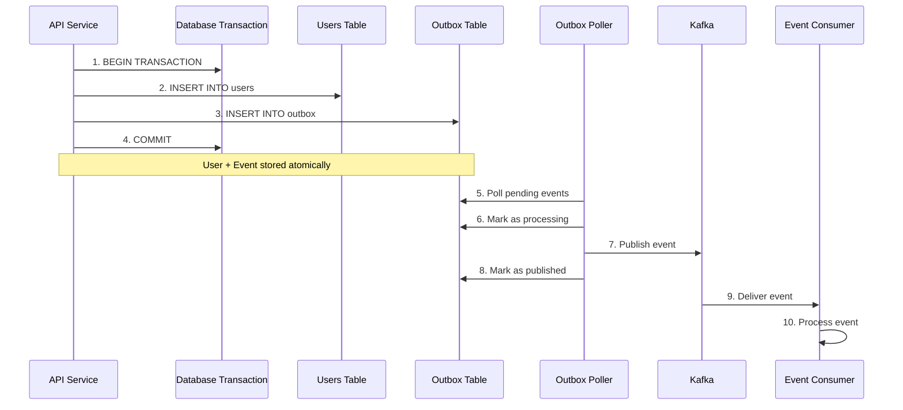
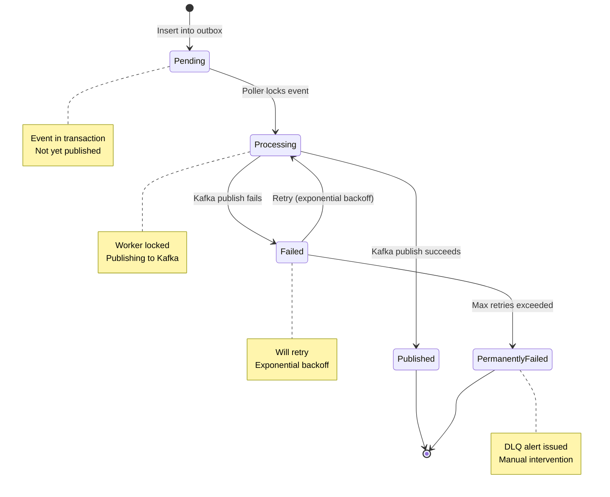

# Outbox Pattern Guide

**The Outbox Pattern ensures transactional event publishing by storing events in a database table within the same transaction as state changes.**

## Table of Contents

- [What is the Outbox Pattern?](#what-is-the-outbox-pattern)
- [The Problem It Solves](#the-problem-it-solves)
- [How It Works](#how-it-works)
- [Architecture](#architecture)
- [Quick Start](#quick-start)
- [Configuration](#configuration)
- [When to Use Outbox vs Direct Publish](#when-to-use-outbox-vs-direct-publish)
- [Implementation Patterns](#implementation-patterns)
- [Monitoring and Health Checks](#monitoring-and-health-checks)
- [Common Pitfalls](#common-pitfalls)
- [Best Practices](#best-practices)

---

## What is the Outbox Pattern?

The **Outbox Pattern** is a design pattern for ensuring **transactional event publishing** in distributed systems. It solves the critical problem of maintaining consistency between database state changes and event publication.

### Core Concept

Store events in an **outbox table** within the **same database transaction** as the state change. A background worker (poller) then reads these events and publishes them to Kafka.

**Key Idea:** The database transaction becomes the source of truth for both state and events.

### Why "Outbox"?

Think of it like an email outbox:

- You compose an email and click send
- Email goes to your outbox folder
- Background process sends emails from outbox
- If network is down, emails stay in outbox until sent
- You can see which emails were sent, which are pending

Same concept for database events:

- Your code creates a user and adds event to outbox
- Outbox is in the same transaction as user creation
- Background poller publishes events from outbox to Kafka
- If Kafka is down, events stay in outbox until published
- You can see which events were published, which are pending

---

## The Problem It Solves

### The Dual-Write Problem

Without the outbox pattern, you face the **dual-write problem**: two separate systems (database + message broker) must both succeed, but they can't be in the same transaction.

```typescript
// ❌ PROBLEMATIC: Non-transactional event publishing
async execute(command: CreateUserCommand) {
  return this.db.transaction(async (tx) => {
    const [user] = await tx.insert(users).values(command.data).returning();
    return user;
  })
  .then(async (user) => {
    // If this fails, user exists but event is lost!
    await this.eventBus.publish('user.created', userData);
  });
}
```

**What can go wrong:**

1. **Kafka is down** - User created, event lost forever
2. **Network failure** - User created, event never published
3. **Service crash** - User created, service crashes before publishing
4. **Timeout** - User created, Kafka publish times out

**Result:** Inconsistent state - user exists in database but downstream services never know.

### The Solution: Outbox Pattern

Store the event in the database **within the same transaction** as the state change:

```typescript
// ✅ CORRECT: Transactional event publishing with outbox
async execute(command: CreateUserCommand) {
  return this.db.transaction(async (tx) => {
    // 1. Create user
    const [user] = await tx.insert(users).values(command.data).returning();

    // 2. Insert outbox record (in SAME transaction)
    await this.outboxRepo.insert(tx, {
      eventId: randomUUID(),
      eventType: 'user.created',
      aggregateId: user.id,
      payload: { userId: user.id, email: user.email },
      tenantId: command.tenantId,
    });

    // 3. Both commit atomically or both rollback
    return user;
  });
}
```

**Guarantees:**

1. **Atomicity** - User and event commit together or rollback together
2. **No lost events** - Event stored before transaction commits
3. **Event replay** - Full event log in outbox table
4. **No dual-write** - Single transactional write to database

---

## How It Works

### Step-by-Step Flow



### Detailed Explanation

**Phase 1: Transaction (Atomic)**

1. **Begin Transaction** - API starts database transaction
2. **State Change** - Insert/update/delete domain entities
3. **Event Storage** - Insert event record into outbox table
4. **Commit** - Transaction commits both state and event

**Phase 2: Polling (Background)**

5. **Poll** - Background poller checks for pending events
6. **Lock** - Mark event as "processing" (worker lock)
7. **Publish** - Publish event to Kafka
8. **Confirm** - Mark event as "published"

**Phase 3: Consumption (Async)**

9. **Deliver** - Kafka delivers event to consumers
10. **Process** - Consumer handles event

### Event Lifecycle



**States:**

- **Pending** - Event stored, waiting to be published
- **Processing** - Poller is publishing event to Kafka
- **Published** - Event successfully published to Kafka
- **Failed** - Publish failed, will retry
- **PermanentlyFailed** - Max retries exceeded, requires manual intervention

---

## Architecture

### System Components

```mermaid
C4_Container
    title Outbox Pattern Architecture
    Person(developer, Developer)
    Container(api, API Service, "NestJS API", "Handles requests")
    ContainerDb(db, PostgreSQL, "Database", "Stores state and events")
    Container(poller, Outbox Poller, "Background Worker", "Publishes events")
    ContainerQueue(kafka, Apache Kafka, "Event Streaming", "Delivers events")
    Container(consumer, Event Consumers, "Worker Services", "Process events")

    Rel(developer, api, "Develops")
    Rel(api, db, "Transactional Write\n(State + Outbox)")
    Rel(poller, db, "Polls Outbox")
    Rel(poller, kafka, "Publishes Events")
    Rel(kafka, consumer, "Delivers Events")
```

### Outbox Table Schema

**File:** `packages/db-outbox/src/schema/outbox.schema.ts`

```typescript
import { pgTable, text, timestamp, integer, jsonb } from 'drizzle-orm/pg-core';

export const outbox = pgTable('outbox', {
  // Identification
  eventId: text('event_id').primaryKey(),
  eventType: text('event_type').notNull(),
  aggregateId: text('aggregate_id').notNull(),

  // Event data (JSON payload)
  payload: jsonb('payload').notNull(),

  // Metadata
  tenantId: text('tenant_id'),
  correlationId: text('correlation_id'),
  causationId: text('causation_id'),
  schemaVersion: text('schema_version'),
  aggregateVersion: text('aggregate_version'),

  // Status tracking
  status: text('status').notNull(), // pending, processing, published, failed
  retryCount: integer('retry_count').notNull().default(0),
  nextRetryAt: timestamp('next_retry_at'),
  errorMessage: text('error_message'),

  // Worker locking
  lockedAt: timestamp('locked_at'),
  lockedBy: text('locked_by'),

  // Timestamps
  createdAt: timestamp('created_at').notNull(),
  publishedAt: timestamp('published_at')
});
```

### Outbox Poller Service

**File:** `packages/events/src/outbox/outbox-poller.service.ts`

**Responsibilities:**

1. **Polling** - Check for pending and retryable events every 1 second
2. **Locking** - Mark events as "processing" to prevent duplicate processing
3. **Publishing** - Publish events to Kafka
4. **Retrying** - Implement exponential backoff for failed events
5. **Cleanup** - Delete published events older than 7 days

**Configuration:**

```typescript
export const outboxPollerConfig = {
  pollInterval: 1000, // Poll every 1 second
  batchSize: 10, // Process 10 events per batch
  maxRetries: 5, // Retry up to 5 times
  initialRetryDelay: 1000, // Start with 1 second delay
  retryBackoffMultiplier: 2, // Double delay each retry
  cleanupInterval: 3600000, // Clean up every hour
  retentionDays: 7, // Keep published events for 7 days
  workerId: `worker-${process.pid}-${Date.now()}`,
  enabled: true
};
```

---

## Quick Start

### Step 1: Inject OutboxRepository

```typescript
import { Injectable } from '@nestjs/common';
import { OutboxRepository } from '@package/events';

@Injectable()
export class CreateUserHandler {
  constructor(private readonly outboxRepo: OutboxRepository) {}
}
```

### Step 2: Use in Transaction

```typescript
import { randomUUID } from 'node:crypto';
import { db } from '@package/db-core';
import { users } from '@package/db-core/schema';

async execute(command: CreateUserCommand) {
  return db.transaction(async (tx) => {
    // 1. Create user
    const [user] = await tx.insert(users).values({
      organizationId: command.organizationId,
      isActive: true,
    }).returning();

    // 2. Insert outbox record (SAME transaction)
    await this.outboxRepo.insert(tx, {
      eventId: randomUUID(),
      eventType: 'user.created',
      aggregateId: String(user.id),
      payload: {
        userId: String(user.id),
        tenantId: String(command.tenantId),
        organizationId: String(command.organizationId),
        createdAt: new Date().toISOString(),
      },
      tenantId: String(command.tenantId),
    });

    // 3. Both commit atomically
    return user;
  });
}
```

### Step 3: Verify Event Delivery

Check the health endpoint:

```bash
curl http://localhost:3000/v1/health
```

**Response:**

```json
{
  "status": "ok",
  "data": {
    "status": "healthy",
    "details": {
      "outbox": {
        "status": "up",
        "details": {
          "isProcessing": false,
          "workerId": "worker-12345-1704345600000",
          "pendingCount": 0,
          "failedCount": 0
        }
      }
    }
  }
}
```

---

## Configuration

### Environment Variables

```bash
# Kafka Configuration
KAFKA_BROKERS=localhost:9092
KAFKA_CLIENT_ID=api-service

# Outbox Poller Configuration
OUTBOX_POLLER_ENABLED=true
OUTBOX_POLL_INTERVAL=1000
OUTBOX_BATCH_SIZE=10
OUTBOX_MAX_RETRIES=5
OUTBOX_INITIAL_RETRY_DELAY=1000
OUTBOX_RETRY_BACKOFF_MULTIPLIER=2
OUTBOX_CLEANUP_INTERVAL=3600000
OUTBOX_RETENTION_DAYS=7
```

### Module Configuration

**File:** `apps/api/src/config/events.config.ts`

```typescript
import { OutboxRepository } from '@package/events';

export const outboxPollerConfig = {
  pollInterval: Number(process.env.OUTBOX_POLL_INTERVAL) || 1000,
  batchSize: Number(process.env.OUTBOX_BATCH_SIZE) || 10,
  maxRetries: Number(process.env.OUTBOX_MAX_RETRIES) || 5,
  initialRetryDelay: Number(process.env.OUTBOX_INITIAL_RETRY_DELAY) || 1000,
  retryBackoffMultiplier: Number(process.env.OUTBOX_RETRY_BACKOFF_MULTIPLIER) || 2,
  cleanupInterval: Number(process.env.OUTBOX_CLEANUP_INTERVAL) || 3600000,
  retentionDays: Number(process.env.OUTBOX_RETENTION_DAYS) || 7,
  workerId: `worker-${process.pid}-${Date.now()}`,
  enabled: process.env.OUTBOX_POLLER_ENABLED !== 'false'
};

export const outboxRepositoryProvider = {
  provide: OutboxRepository,
  useFactory: (drizzle: NodePgDatabase) => new OutboxRepository(drizzle),
  inject: [DATABASE_CONNECTION]
};
```

---

## When to Use Outbox vs Direct Publish

### Decision Matrix

| Scenario                            | Use Outbox | Use Direct Publish |
| ----------------------------------- | ---------- | ------------------ |
| **Critical business event**         | ✅ Yes     | ❌ No              |
| **User cannot tolerate event loss** | ✅ Yes     | ❌ No              |
| **Analytics/telemetry**             | ❌ No      | ✅ Yes             |
| **Cache invalidation hint**         | ❌ No      | ✅ Yes             |
| **High event volume**               | ✅ Yes     | ❌ No              |
| **Need event replay**               | ✅ Yes     | ❌ No              |
| **Simple notification**             | ❌ No      | ✅ Yes             |

### Use Outbox Pattern When:

**1. Event represents critical business transaction**

```typescript
// ✅ Use outbox for critical events
await this.outboxRepo.insert(tx, {
  eventType: 'order.created',
  aggregateId: order.id,
  payload: { orderId, userId, items, total }
});

await this.outboxRepo.insert(tx, {
  eventType: 'payment.processed',
  aggregateId: payment.id,
  payload: { paymentId, amount, currency }
});
```

**2. Event loss is unacceptable**

```typescript
// ✅ User lifecycle events must not be lost
await this.outboxRepo.insert(tx, {
  eventType: 'user.created',
  aggregateId: user.id,
  payload: { userId, email, tenantId }
});
```

**3. Need event replay capability**

```typescript
// Query outbox for event history
const events = await db
  .select()
  .from(outbox)
  .where(eq(outbox.aggregateId, 'user-123'))
  .orderBy(asc(outbox.createdAt));

// Replay events to rebuild state
for (const event of events) {
  await this.replayEvent(event);
}
```

### Use Direct Publish When:

**1. Non-critical analytics**

```typescript
// ✅ Direct publish for analytics
await this.eventBus.publish('page.viewed', {
  userId,
  page,
  timestamp: Date.now()
});
```

**2. Cache invalidation hints**

```typescript
// ✅ Direct publish for cache hints
await this.eventBus.publish('cache.invalidate', {
  key: `user:${userId}`
});
// Not critical if missed - cache will refresh on next access
```

**3. Low-stakes notifications**

```typescript
// ✅ Direct publish for low-stakes events
await this.eventBus.publish('notification.sent', {
  userId,
  message: 'Welcome!'
});
```

---

## Implementation Patterns

### Pattern 1: Create with Event

```typescript
async execute(command: CreateUserCommand) {
  return db.transaction(async (tx) => {
    // 1. Create entity
    const [user] = await tx.insert(users).values(command.data).returning();

    // 2. Publish event
    await this.outboxRepo.insert(tx, {
      eventId: randomUUID(),
      eventType: 'user.created',
      aggregateId: user.id,
      payload: { userId: user.id, ... },
      tenantId: command.tenantId,
    });

    return user;
  });
}
```

### Pattern 2: Update with Event

```typescript
async execute(command: UpdateUserCommand) {
  return db.transaction(async (tx) => {
    // 1. Update entity
    const [user] = await tx.update(users)
      .set(command.changes)
      .where(eq(users.id, command.userId))
      .returning();

    // 2. Publish event
    await this.outboxRepo.insert(tx, {
      eventId: randomUUID(),
      eventType: 'user.updated',
      aggregateId: user.id,
      payload: {
        userId: user.id,
        changes: command.changes,
      },
      tenantId: command.tenantId,
    });

    return user;
  });
}
```

### Pattern 3: Delete with Event

```typescript
async execute(command: DeleteUserCommand) {
  return db.transaction(async (tx) => {
    // 1. Get user before delete
    const [user] = await tx.select()
      .from(users)
      .where(eq(users.id, command.userId));

    // 2. Delete entity
    await tx.delete(users)
      .where(eq(users.id, command.userId));

    // 3. Publish event
    await this.outboxRepo.insert(tx, {
      eventId: randomUUID(),
      eventType: 'user.deleted',
      aggregateId: user.id,
      payload: {
        userId: user.id,
        deletionType: 'soft',
      },
      tenantId: command.tenantId,
    });
  });
}
```

### Pattern 4: Multiple Events in Transaction

```typescript
async execute(command: CreateOrderCommand) {
  return db.transaction(async (tx) => {
    // 1. Create order
    const [order] = await tx.insert(orders).values(command.data).returning();

    // 2. Create order items
    const [items] = await tx.insert(orderItems).values(command.items).returning();

    // 3. Publish multiple events
    await this.outboxRepo.insert(tx, {
      eventId: randomUUID(),
      eventType: 'order.created',
      aggregateId: order.id,
      payload: { orderId: order.id, userId: order.userId },
      tenantId: command.tenantId,
    });

    await this.outboxRepo.insert(tx, {
      eventId: randomUUID(),
      eventType: 'order.items.added',
      aggregateId: order.id,
      payload: { orderId: order.id, items },
      tenantId: command.tenantId,
    });

    return order;
  });
}
```

---

## Monitoring and Health Checks

### Health Endpoint

The outbox poller exposes health information:

```bash
GET /v1/health
```

**Response:**

```json
{
  "status": "ok",
  "data": {
    "status": "healthy",
    "details": {
      "outbox": {
        "status": "up",
        "details": {
          "isProcessing": false,
          "workerId": "worker-12345-1704345600000",
          "enabled": true,
          "pendingCount": 5,
          "failedCount": 0
        }
      }
    }
  }
}
```

### Health Status Meanings

| Status       | Meaning                             | Action                  |
| ------------ | ----------------------------------- | ----------------------- |
| **up**       | Poller is running, no issues        | None                    |
| **degraded** | High pending count (> 100)          | Monitor closely         |
| **down**     | Poller stopped or Kafka unreachable | Investigate immediately |

### Monitoring Metrics

Track these metrics:

1. **pendingCount** - Number of events waiting to be published
2. **failedCount** - Number of events that failed to publish
3. **isProcessing** - Whether poller is currently processing
4. **workerId** - Which worker instance is processing

### Alerting Rules

**Alert if:**

- `pendingCount > 1000` - Events backing up
- `failedCount > 10` - Too many failed events
- `status = down` - Poller not running
- `isProcessing = true` for > 5 minutes - Possible stuck poller

---

## Common Pitfalls

### Pitfall 1: Not Using Transactions

```typescript
// ❌ WRONG - Outbox insert outside transaction
async execute(command: CreateUserCommand) {
  const user = await this.usersRepo.create(command.data);
  await this.outboxRepo.insert(db, { // Not in transaction!
    eventType: 'user.created',
    aggregateId: user.id,
  });
}

// ✅ GOOD - Both in same transaction
async execute(command: CreateUserCommand) {
  return db.transaction(async (tx) => {
    const user = await this.usersRepo.create(tx, command.data);
    await this.outboxRepo.insert(tx, {
      eventType: 'user.created',
      aggregateId: user.id,
    });
    return user;
  });
}
```

### Pitfall 2: Missing Tenant Context

```typescript
// ❌ WRONG - No tenantId
await this.outboxRepo.insert(tx, {
  eventType: 'user.created',
  aggregateId: user.id,
  payload: { userId: user.id }
  // Missing tenantId!
});

// ✅ GOOD - Includes tenantId
await this.outboxRepo.insert(tx, {
  eventType: 'user.created',
  aggregateId: user.id,
  payload: { userId: user.id, tenantId },
  tenantId: command.tenantId // Always include
});
```

### Pitfall 3: Incomplete Event Payload

```typescript
// ❌ WRONG - Missing data
await this.outboxRepo.insert(tx, {
  eventType: 'user.created',
  aggregateId: user.id,
  payload: { userId: user.id }
  // Consumer would need to query database for email, name, etc.
});

// ✅ GOOD - Complete, self-contained data
await this.outboxRepo.insert(tx, {
  eventType: 'user.created',
  aggregateId: user.id,
  payload: {
    userId: user.id,
    email: user.email,
    name: user.name,
    organizationId: user.organizationId,
    createdAt: user.createdAt
  }
});
```

### Pitfall 4: Forgetting Event ID

```typescript
// ❌ WRONG - No eventId
await this.outboxRepo.insert(tx, {
  // No eventId - will cause primary key error!
  eventType: 'user.created',
  aggregateId: user.id
});

// ✅ GOOD - Unique eventId
await this.outboxRepo.insert(tx, {
  eventId: randomUUID(), // Always include
  eventType: 'user.created',
  aggregateId: user.id
});
```

---

## Best Practices

### 1. Always Use Transactions

```typescript
// ✅ Wrap state + event in transaction
return db.transaction(async (tx) => {
  const entity = await this.repository.create(tx, data);
  await this.outboxRepo.insert(tx, eventData);
  return entity;
});
```

### 2. Include Complete Data

```typescript
// ✅ Include all data consumer needs
payload: {
  userId: user.id,
  email: user.email,
  name: user.name,
  organizationId: user.organizationId,
  createdAt: user.createdAt.toISOString(),
}
```

### 3. Add Tenant Context

```typescript
// ✅ Always include tenantId
await this.outboxRepo.insert(tx, {
  eventType: 'user.created',
  aggregateId: user.id,
  tenantId: command.tenantId // Multi-tenancy support
});
```

### 4. Use UUID for Event ID

```typescript
import { randomUUID } from 'node:crypto';

// ✅ Generate unique event ID
await this.outboxRepo.insert(tx, {
  eventId: randomUUID(),
  eventType: 'user.created',
  aggregateId: user.id
});
```

### 5. Monitor Health

```bash
# Check outbox health regularly
curl http://localhost:3000/v1/health

# Alert if pendingCount > 1000
# Alert if failedCount > 10
```

### 6. Handle Rollbacks

```typescript
// ✅ Transaction handles rollback automatically
try {
  return db.transaction(async (tx) => {
    const user = await this.usersRepo.create(tx, data);
    await this.outboxRepo.insert(tx, eventData);

    // If this throws, both user and event rollback
    await this.validateUser(user);

    return user;
  });
} catch (error) {
  // Both user and event rolled back
  this.logger.error('Failed to create user', error);
  throw error;
}
```

---

## Next Steps

- **[Transactions Guide](transactions.md)** - Deep dive into transaction patterns
- **[Publishing Events](publishing-events.md)** - Complete guide to event publishing
- **[Creating Consumers](creating-consumers.md)** - How to build event consumers
- **[Testing Events](testing-events.md)** - How to test outbox pattern

---

## Summary

**The Outbox Pattern guarantees:**

1. **Transactional consistency** - Events and state commit together
2. **No lost events** - Events stored before transaction commits
3. **Event replay** - Full event log in outbox table
4. **Fault tolerance** - Events published even if Kafka temporarily down

**Key Implementation:**

```typescript
return db.transaction(async (tx) => {
  const entity = await this.repository.create(tx, data);
  await this.outboxRepo.insert(tx, eventData);
  return entity;
});
```

**Monitor:**

- Health endpoint: `GET /v1/health`
- Pending count: Should be low (< 100)
- Failed count: Should be zero

The outbox pattern is the **recommended approach** for all critical business events in the system.
