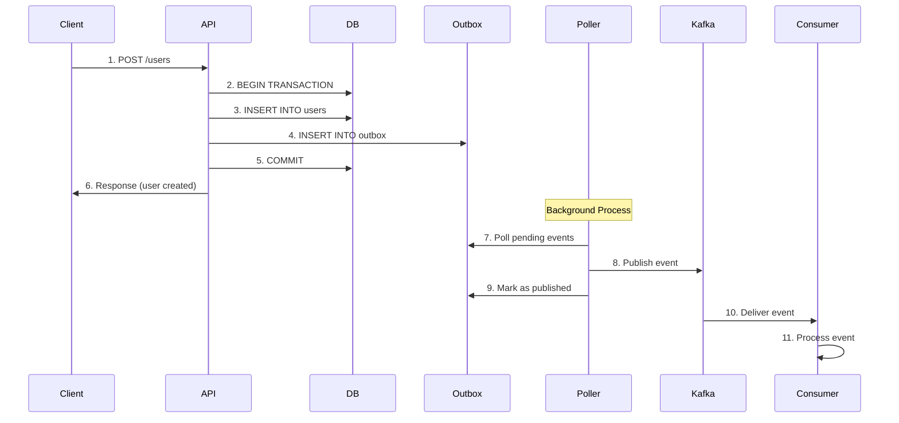
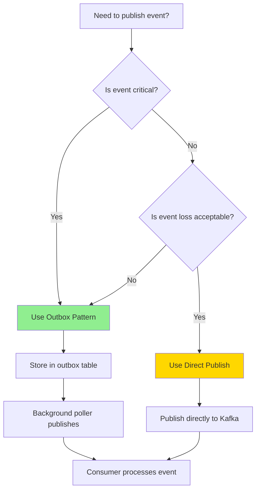

# Event-Driven Architecture Overview

## Table of Contents

- [What is Event-Driven Architecture?](#what-is-event-driven-architecture)
- [Why Use Events?](#why-use-events)
- [Event Flow in the System](#event-flow-in-the-system)
- [Key Components](#key-components)
- [Event Delivery Patterns](#event-delivery-patterns)
- [When to Use Events vs Direct APIs](#when-to-use-events-vs-direct-apis)
- [Quick Start Example](#quick-start-example)

---

## What is Event-Driven Architecture?

Event-Driven Architecture (EDA) is a software architecture pattern where services communicate asynchronously through **events**. Instead of services calling each other directly (synchronous), they emit events when things happen (asynchronous).

### Core Concept

**Traditional Architecture (Synchronous):**

```typescript
// Service A calls Service B directly
const result = await serviceB.processOrder(order);
// Service A waits for Service B to respond
```

**Event-Driven Architecture (Asynchronous):**

```typescript
// Service A emits an event
await eventBus.publish('order.created', orderData);
// Service A continues immediately, doesn't wait

// Service B listens for the event
@EventHandler('order.created')
async handleOrderCreated(event) {
  await this.processOrder(event.data);
}
```

### Key Characteristics

Events are **facts that have occurred**:

- **Immutable** - Once published, they never change
- **Asynchronous** - Producers don't wait for consumers
- **At-least-once delivery** - Consumers may receive duplicates
- **Loosely coupled** - Producers don't know who is listening

### Real-World Analogy

Think of events like a newspaper:

- **Publisher** writes an article (event)
- **Distribution** delivers newspapers to subscribers (Kafka)
- **Subscribers** read articles at their own pace (consumers)
- **Publisher** doesn't know who read the article or when

---

## Why Use Events?

### Benefits

#### 1. Loose Coupling

Services don't need to know about each other:

```typescript
// ✅ GOOD - No dependency on email service
await eventBus.publish('user.created', userData);
// Email service can be added/removed without affecting this code

// ❌ BAD - Tight coupling
await this.emailService.sendWelcomeEmail(userData);
// If email service changes, this code breaks
```

#### 2. Scalability

Consumers can scale independently:

```typescript
// Multiple instances of email service can process events
// Each event goes to only one instance (load balancing)
@EventHandler('user.created')
async handleUserCreated(event) {
  await this.emailService.sendWelcome(event.data);
}
```

#### 3. Fault Tolerance

If one consumer fails, others continue processing:

```typescript
// If analytics service is down, email service still works
// Events are stored in Kafka until analytics recovers
```

#### 4. Audit Trail

All events are logged automatically:

```sql
-- Query the outbox table for event history
SELECT * FROM outbox WHERE aggregate_id = 'user-123' ORDER BY created_at;
```

#### 5. Flexibility

Easy to add new consumers without changing producers:

```typescript
// Add new feature: Sync user to CRM
@EventHandler('user.created')
async syncToCRM(event) {
  await this.crmService.createUser(event.data);
}
// No changes needed to user creation code!
```

### Trade-offs

| Consideration   | Impact                                     |
| --------------- | ------------------------------------------ |
| **Complexity**  | Events add architectural complexity        |
| **Debugging**   | Harder to trace flow through async systems |
| **Latency**     | Events add processing overhead             |
| **Consistency** | Eventual consistency, not immediate        |
| **Testing**     | Requires integration testing with Kafka    |

---

## Event Flow in the System

### Architecture Overview

```mermaid
C4_Context
    title Event-Driven Architecture
    Person(developer, Developer, "Application Developer")
    Person(user, User, "End User")
    SystemQueue(kafka, Apache Kafka, "Event Streaming Platform")
    System_1(api, API Service, "Event Producer")
    System_2(workers, Worker Services, "Event Consumers")
    SystemDb(db, PostgreSQL, "Database + Outbox")
    System_3(monitoring, Monitoring, "Health Checks & Metrics")

    Rel(user, api, "Makes Changes")
    Rel(api, db, "Stores State + Events")
    Rel(db, kafka, "Background Poller")
    Rel(kafka, workers, "Delivers Events")
    Rel(workers, monitoring, "Reports Status")
    Rel(developer, monitoring, "Monitors Health")
```

### Event Flow Sequence



### Flow Explained

1. **Client Request** - User makes API call (e.g., create user)
2. **Database Transaction** - API starts transaction
3. **State Change** - API inserts user record
4. **Event Storage** - API inserts outbox record (same transaction)
5. **Commit** - Both user and event commit atomically
6. **Response** - API responds to client
7. **Polling** - Background poller checks for pending events
8. **Publishing** - Poller publishes event to Kafka
9. **Confirmation** - Poller marks event as published
10. **Delivery** - Kafka delivers event to consumers
11. **Processing** - Consumer processes event

---

## Key Components

### 1. EventBus

**Purpose:** High-level API for publishing events

**Location:** `@package/events`

```typescript
import { eventBus } from '@package/events';

// Simple publish
await eventBus.publish('user.created', {
  userId: 'user-123',
  email: 'user@example.com'
});

// With options
await eventBus.publish('order.created', orderData, {
  key: order.id, // Partition by order ID
  headers: {
    'correlation-id': traceId,
    'tenant-id': tenantId
  }
});
```

**When to use:**

- Non-critical events (analytics, telemetry)
- Fire-and-forget scenarios
- Low-volume events

### 2. Outbox Repository

**Purpose:** Store events transactionally in database

**Location:** `@package/events`

```typescript
import { OutboxRepository } from '@package/events';

async execute(command: CreateUserCommand) {
  return this.db.transaction(async (tx) => {
    // Create user
    const [user] = await tx.insert(users).values(command.data).returning();

    // Store event in outbox (same transaction)
    await this.outboxRepo.insert(tx, {
      eventId: randomUUID(),
      eventType: 'user.created',
      aggregateId: user.id,
      payload: { userId: user.id, email: user.email },
      tenantId: command.tenantId,
    });

    return user;
  });
}
```

**When to use:**

- Critical business events
- Events requiring transactional guarantees
- Events that must not be lost

### 3. Outbox Poller

**Purpose:** Background worker that publishes events from outbox to Kafka

**Location:** `@package/events`

**Features:**

- Polls for pending events every 1 second (configurable)
- Processes events in batches (default: 10)
- Implements retry logic with exponential backoff
- Marks permanently failed events (after max retries)
- Cleans up old published events (7-day retention)

**Configuration:**

```typescript
// apps/api/src/config/events.config.ts
export const outboxConfig = {
  pollInterval: 1000, // Poll every 1 second
  batchSize: 10, // Process 10 events at a time
  maxRetries: 5, // Retry up to 5 times
  initialRetryDelay: 1000, // Start with 1 second delay
  retryBackoffMultiplier: 2, // Double delay each retry
  cleanupInterval: 3600000, // Clean up every hour
  retentionDays: 7 // Keep published events for 7 days
};
```

### 4. Event Consumers

**Purpose:** Process events from Kafka

**Location:** Application modules (e.g., `apps/api/src/modules/*/handlers/consumers/`)

```typescript
import { Injectable } from '@nestjs/common';
import { EventHandler } from '@package/events';
import type { EventMessage } from '@package/events';

@Injectable()
export class UserCreatedConsumer {
  @EventHandler('user.created')
  handleUserCreated(event: EventMessage<UserCreatedData>) {
    // Process event (send email, update cache, etc.)
    console.log('User created:', event.data.userId);
  }
}
```

**Features:**

- Decorator-based registration (`@EventHandler`)
- Automatic consumer group management
- Retry logic and DLQ support
- OpenTelemetry tracing

---

## Event Delivery Patterns

### Pattern 1: Direct EventBus.publish()

**How it works:** Publish directly to Kafka after database commit

```typescript
async execute(command: CreateUserCommand) {
  return this.db
    .transaction(async (tx) => {
      const [user] = await tx.insert(users).values(command.data).returning();
      return user;
    })
    .then(async (user) => {
      // Publish AFTER transaction commits
      await this.eventBus.publish('user.created', {
        userId: user.id,
        email: user.email,
      });
    });
}
```

**Characteristics:**

- Fast and simple
- No transactional guarantee
- Event can be lost if Kafka is down
- No replay capability

**Use when:**

- Analytics events
- Cache invalidation hints
- Non-critical notifications

**See:** [Publishing Events - Direct](publishing-events.md#direct-eventbuspublish)

### Pattern 2: Outbox Pattern

**How it works:** Store events in database, publish via background worker

```typescript
async execute(command: CreateUserCommand) {
  return this.db.transaction(async (tx) => {
    const [user] = await tx.insert(users).values(command.data).returning();

    // Store event in outbox (SAME transaction)
    await this.outboxRepo.insert(tx, {
      eventId: randomUUID(),
      eventType: 'user.created',
      aggregateId: user.id,
      payload: { userId: user.id, email: user.email },
      tenantId: command.tenantId,
    });

    return user;
  });
  // Background poller will publish event to Kafka
}
```

**Characteristics:**

- Transactional guarantees
- At-least-once delivery
- Event replay capability
- Slightly more complex

**Use when:**

- Critical business events
- Events that must not be lost
- Event replay needed

**See:** [Outbox Pattern Guide](outbox-pattern.md)

### Decision Tree



---

## When to Use Events vs Direct APIs

### Use Events When:

**1. Multiple services need to react to a change**

```typescript
// ✅ GOOD - Event notifies multiple services
await eventBus.publish('user.created', userData);
// Email service, analytics service, CRM service all react
```

**2. Processing can happen asynchronously**

```typescript
// ✅ GOOD - User doesn't wait for email
await eventBus.publish('user.created', userData);
// Response returns immediately, email sent in background
```

**3. You need loose coupling**

```typescript
// ✅ GOOD - Add new consumers without changing producer
await eventBus.publish('order.created', orderData);
// New analytics consumer can be added later
```

**4. You need an audit trail**

```typescript
// ✅ GOOD - All events are logged in outbox
await this.outboxRepo.insert(tx, eventData);
// Can query event history later
```

### Use Direct APIs When:

**1. Client needs immediate response**

```typescript
// ❌ BAD - Event doesn't return data to client
await eventBus.publish('user.get', { userId });
// Client won't receive user data

// ✅ GOOD - Direct API call returns data
const user = await this.usersService.findById(userId);
return user;
```

**2. Operation is simple CRUD**

```typescript
// ❌ BAD - Overkill for simple query
await eventBus.publish('user.findById', { userId });

// ✅ GOOD - Direct database call
return this.usersRepo.findById(userId);
```

**3. You need synchronous error handling**

```typescript
// ❌ BAD - Errors happen asynchronously
await eventBus.publish('payment.process', paymentData);
// Can't catch errors in consumer

// ✅ GOOD - Direct call with error handling
try {
  await this.paymentService.process(paymentData);
} catch (error) {
  // Handle error immediately
}
```

### Comparison Table

| Aspect             | Events                               | Direct APIs                 |
| ------------------ | ------------------------------------ | --------------------------- |
| **Communication**  | Asynchronous                         | Synchronous                 |
| **Coupling**       | Loose                                | Tight                       |
| **Response**       | Fire-and-forget                      | Request/response            |
| **Error Handling** | Async (DLQ, retries)                 | Sync (try/catch)            |
| **Scalability**    | High (consumers scale independently) | Limited (API server scales) |
| **Complexity**     | Higher                               | Lower                       |
| **Debugging**      | Harder (distributed tracing)         | Easier (call stack)         |
| **Use Case**       | Notifications, workflows             | Queries, mutations          |

---

## Quick Start Example

Let's walk through a complete example: User creation with events.

### Step 1: Define Event Schema

**File:** `apps/api/src/modules/users/events/user-events.schema.ts`

```typescript
export interface UserCreatedData {
  readonly tenantId: string;
  readonly userId: string;
  readonly organizationId: string;
  readonly emailHash: string;
  readonly createdAt: string;
}
```

### Step 2: Publish Event (with Outbox)

**File:** `apps/api/src/modules/users/commands/create-user.handler.ts`

```typescript
import { randomUUID } from 'node:crypto';
import { CommandHandler, type ICommandHandler } from '@nestjs/cqrs';
import { db } from '@package/db-core';
import { users } from '@package/db-core/schema';
import { OutboxRepository } from '@package/events';

@CommandHandler(CreateUserCommand)
export class CreateUserHandler implements ICommandHandler<CreateUserCommand> {
  constructor(private readonly outboxRepo: OutboxRepository) {}

  async execute(command: CreateUserCommand) {
    return db.transaction(async (tx) => {
      // 1. Create user
      const [user] = await tx
        .insert(users)
        .values({
          organizationId: command.organizationId,
          isActive: true,
          isVerified: false
        })
        .returning();

      // 2. Store event in outbox (SAME transaction)
      await this.outboxRepo.insert(tx, {
        eventId: randomUUID(),
        eventType: 'user.created',
        aggregateId: String(user.id),
        aggregateVersion: '1',
        payload: {
          tenantId: String(command.tenantId),
          userId: String(user.id),
          organizationId: String(command.organizationId),
          emailHash: 'hash...', // Hash email for privacy
          createdAt: new Date().toISOString()
        },
        tenantId: String(command.tenantId),
        schemaVersion: '1.0'
      });

      // 3. Both commit atomically
      return user;
    });
  }
}
```

### Step 3: Create Consumer

**File:** `apps/api/src/modules/users/handlers/consumers/user-created.consumer.ts`

```typescript
import { Injectable } from '@nestjs/common';
import { EventHandler } from '@package/events';
import type { EventMessage } from '@package/events';
import type { UserCreatedData } from '../../events';

@Injectable()
export class UserCreatedConsumer {
  @EventHandler('user.created')
  handleUserCreated(event: EventMessage<UserCreatedData>) {
    console.log(`
      User Created Event Received:
      - User ID: ${event.data.userId}
      - Tenant ID: ${event.data.tenantId}
      - Organization: ${event.data.organizationId}
    `);

    // TODO: Implement actual business logic
    // - Send welcome email
    // - Update analytics
    // - Invalidate cache
    // - Sync to external systems
  }
}
```

### Step 4: Register Consumer

**File:** `apps/api/src/modules/users/users.module.ts`

```typescript
import { Module } from '@nestjs/common';
import { CqrsModule } from '@nestjs/cqrs';
import { EventsModule } from '@package/events';

import { CreateUserHandler } from './commands/create-user.handler';
import { UserCreatedConsumer } from './handlers/consumers/user-created.consumer';

@Module({
  imports: [CqrsModule, EventsModule],
  providers: [
    CreateUserHandler,
    UserCreatedConsumer // Register consumer
  ]
})
export class UsersModule {}
```

### Step 5: Test the Flow

**File:** `apps/api/test/users-events.e2e.spec.ts`

```typescript
it('should publish user.created event', async () => {
  // 1. Create user via API
  const response = await server.request({
    method: 'POST',
    url: '/users',
    body: { organizationId: tenantId, isActive: true }
  });

  expect(response.status).toBe(201);

  // 2. Wait for outbox processing (max 5 seconds)
  await new Promise((resolve) => setTimeout(resolve, 5000));

  // 3. Verify outbox health
  const health = await server.request({
    method: 'GET',
    url: '/v1/health'
  });

  expect(health.body.data.details.outbox.details.pendingCount).toBeLessThanOrEqual(1);
  expect(health.body.data.details.outbox.details.failedCount).toBe(0);
});
```

---

## Next Steps

Now that you understand the basics, explore these guides:

- **[Outbox Pattern](outbox-pattern.md)** - Deep dive into transactional event publishing
- **[Transactions](transactions.md)** - How to use database transactions with events
- **[Publishing Events](publishing-events.md)** - Complete guide to publishing events
- **[Creating Consumers](creating-consumers.md)** - How to build event consumers
- **[Testing Events](testing-events.md)** - How to test event-driven code

---

## Summary

**Key Takeaways:**

1. **Events are facts** - Immutable records of things that happened
2. **Asynchronous communication** - Producers don't wait for consumers
3. **Two delivery patterns** - Direct (fast) vs Outbox (reliable)
4. **Loose coupling** - Services can evolve independently
5. **Eventual consistency** - System settles into consistent state over time

**When to use events:**

- Multiple services need to react
- Processing can be asynchronous
- You need loose coupling
- You need an audit trail

**When NOT to use events:**

- Client needs immediate response
- Simple CRUD operations
- You need synchronous error handling

Start with the [Outbox Pattern](outbox-pattern.md) for production-ready event publishing.
