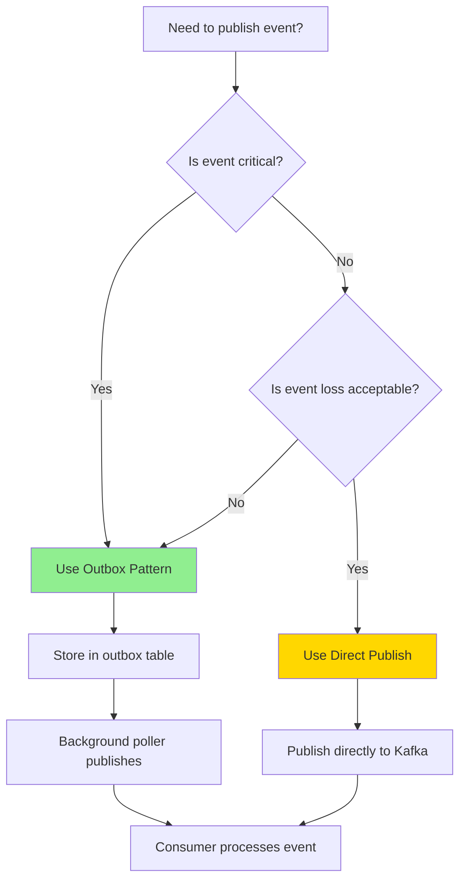

# Publishing Events Guide

**This guide explains how to publish events using both direct EventBus.publish() and the outbox pattern.**

## Table of Contents

- [Overview](#overview)
- [Choosing Your Publishing Method](#choosing-your-publishing-method)
- [Direct EventBus.publish()](#direct-eventbuspublish)
- [Outbox Pattern](#outbox-pattern)
- [Event Naming Conventions](#event-naming-conventions)
- [Event Payload Design](#event-payload-design)
- [Publishing Options](#publishing-options)
- [Common Patterns](#common-patterns)
- [Testing Event Publishing](#testing-event-publishing)
- [Troubleshooting](#troubleshooting)

---

## Overview

When a state change occurs in your system, you often need to notify other services about that change. This is done by **publishing events**.

### Two Publishing Methods

This monorepo supports two event publishing methods:

1. **Direct EventBus.publish()** - Fast, simple, no transactional guarantee
2. **Outbox Pattern** - Reliable, transactional, requires background poller

### Quick Comparison

| Aspect            | Direct Publish      | Outbox Pattern    |
| ----------------- | ------------------- | ----------------- |
| **Speed**         | Fast (milliseconds) | Slower (seconds)  |
| **Complexity**    | Simple              | More complex      |
| **Transactional** | No                  | Yes               |
| **Reliability**   | Events can be lost  | Events never lost |
| **Replay**        | No                  | Yes               |
| **Use Case**      | Analytics, hints    | Business events   |

**Recommendation:** Start with **Outbox Pattern** for all business-critical events. Use Direct Publish only for non-critical events.

---

## Choosing Your Publishing Method

### Decision Tree



### Use Direct Publish When:

- **Analytics and telemetry** - Page views, clicks, metrics
- **Cache invalidation hints** - Not critical if missed
- **Low-stakes notifications** - Optional notifications
- **High-volume, low-value events** - Log aggregation

**Examples:**

```typescript
// Analytics tracking
await this.eventBus.publish('page.viewed', {
  userId,
  page,
  timestamp: Date.now()
});

// Cache invalidation hint
await this.eventBus.publish('cache.invalidate', {
  key: `user:${userId}`
});

// Telemetry
await this.eventBus.publish('api.request', {
  endpoint,
  duration,
  status: 'success'
});
```

### Use Outbox Pattern When:

- **Business transactions** - Orders, payments, user lifecycle
- **Multi-step workflows** - Order processing, provisioning
- **Audit requirements** - Compliance, legal requirements
- **Event replay needed** - State rebuilding, debugging
- **Event loss unacceptable** - Critical business events

**Examples:**

```typescript
// User lifecycle
await this.outboxRepo.insert(tx, {
  eventType: 'user.created',
  aggregateId: user.id,
  payload: { userId, email, tenantId }
});

// Order processing
await this.outboxRepo.insert(tx, {
  eventType: 'order.created',
  aggregateId: order.id,
  payload: { orderId, userId, items, total }
});

// Payment processing
await this.outboxRepo.insert(tx, {
  eventType: 'payment.processed',
  aggregateId: payment.id,
  payload: { paymentId, orderId, amount }
});
```

---

## Direct EventBus.publish()

### Basic Usage

```typescript
import { eventBus } from '@package/events';

// Simple publish
await this.eventBus.publish('user.created', {
  userId: 'user-123',
  email: 'user@example.com',
  name: 'John Doe'
});
```

### With Options

```typescript
await this.eventBus.publish('order.created', orderData, {
  topic: 'orders-topic', // Custom topic (optional)
  key: order.id, // Partition by order ID (optional)
  headers: {
    'correlation-id': traceId, // For distributed tracing
    'tenant-id': tenantId, // For multi-tenancy
    'event-id': randomUUID(), // Unique event ID
    'schema-version': '1.0' // Schema version
  }
});
```

### In Command Handler

```typescript
@CommandHandler(CreateUserCommand)
export class CreateUserHandler implements ICommandHandler<CreateUserCommand> {
  constructor(private readonly eventBus: EventBus) {}

  async execute(command: CreateUserCommand) {
    return this.db
      .transaction(async (tx) => {
        const [user] = await tx.insert(users).values(command.data).returning();
        return user;
      })
      .then(async (user) => {
        // Publish AFTER transaction commits
        await this.eventBus.publish('user.created', {
          userId: user.id,
          email: user.email,
          name: user.name
        });

        return user;
      });
  }
}
```

### Limitations

```typescript
// ❌ Limitation 1: No transactional guarantee
async execute(command: CreateUserCommand) {
  const user = await this.usersRepo.create(command.data);

  // If this fails, user exists but event is lost!
  await this.eventBus.publish('user.created', userData);
}

// ❌ Limitation 2: No replay capability
// Events are published directly to Kafka
// Cannot query event history later

// ❌ Limitation 3: Tied to Kafka availability
// If Kafka is down, publish fails
```

---

## Outbox Pattern

### Basic Usage

```typescript
import { randomUUID } from 'node:crypto';
import { OutboxRepository } from '@package/events';

async execute(command: CreateUserCommand) {
  return this.db.transaction(async (tx) => {
    // 1. Create user
    const [user] = await tx.insert(users).values(command.data).returning();

    // 2. Insert outbox event
    await this.outboxRepo.insert(tx, {
      eventId: randomUUID(),        // Required: Unique event ID
      eventType: 'user.created',    // Required: Event type
      aggregateId: String(user.id), // Required: Entity ID
      payload: {                    // Required: Event data
        userId: String(user.id),
        email: user.email,
        name: user.name,
        createdAt: user.createdAt.toISOString(),
      },
      tenantId: String(command.tenantId), // Required for multi-tenancy
      schemaVersion: '1.0',               // Required: Schema version
    });

    // 3. Both commit atomically
    return user;
  });
  // Background poller will publish event to Kafka
}
```

### Complete Example

```typescript
@CommandHandler(CreateUserCommand)
export class CreateUserHandler implements ICommandHandler<CreateUserCommand> {
  constructor(private readonly outboxRepo: OutboxRepository) {}

  async execute(command: CreateUserCommand) {
    return db.transaction(async (tx) => {
      // 1. Validate
      const existing = await tx.query.users.findFirst({
        where: eq(users.email, command.email)
      });

      if (existing) {
        throw new ConflictException('User already exists');
      }

      // 2. Create user
      const [user] = await tx
        .insert(users)
        .values({
          organizationId: command.organizationId,
          isActive: true,
          isVerified: false
        })
        .returning();

      // 3. Publish event to outbox
      await this.outboxRepo.insert(tx, {
        eventId: randomUUID(),
        eventType: 'user.created',
        aggregateId: String(user.id),
        aggregateVersion: '1',
        payload: {
          tenantId: String(command.tenantId),
          userId: String(user.id),
          organizationId: String(command.organizationId),
          emailHash: this.hashEmail(command.email),
          createdAt: new Date().toISOString()
        },
        tenantId: String(command.tenantId),
        correlationId: command.correlationId,
        causationId: command.causationId,
        schemaVersion: '1.0'
      });

      // 4. Return result
      return user;
    });
  }

  private hashEmail(email: string): string {
    // Hash email for privacy
    return createHash('sha256').update(email).digest('hex');
  }
}
```

---

## Event Naming Conventions

### Format

Events use **dot notation** with `{aggregate}.{past-tense-verb}`:

```typescript
// ✅ CORRECT: {entity}.{past-tense-verb}
'user.created'; // User was created
'user.updated'; // User was updated
'user.deleted'; // User was deleted
'order.completed'; // Order was completed
'payment.processed'; // Payment was processed

// ❌ WRONG: Other formats
'userCreate'; // Not dot notation
'create_user'; // Snake case
'USER_CREATED'; // All caps
'user'; // No action
'user.creation'; // Not past tense
'users.created'; // Plural entity
```

### Topic Mapping

Event types are automatically mapped to Kafka topics:

```typescript
// eventType -> topic
'user.created'      -> 'user-created'
'order.completed'   -> 'order-completed'
'payment.processed' -> 'payment-processed'
```

**Rules:**

- Replace dots with hyphens
- Keep lowercase

### Aggregate Names

Use **singular** aggregate names:

```typescript
// ✅ GOOD: Singular
'user.created';
'order.shipped';
'payment.authorized';

// ❌ WRONG: Plural
'users.created';
'orders.shipped';
'payments.authorized';
```

### Action Verbs

Use **past tense** for actions:

```typescript
// ✅ GOOD: Past tense
'user.created';
'user.updated';
'user.deleted';
'email.sent';
'order.shipped';

// ❌ WRONG: Not past tense
'user.create';
'user.update';
'user.delete';
'email.send';
'order.ship';
```

### Complex Events

For complex domains, use additional levels:

```typescript
// Format: {domain}.{aggregate}.{action}
'inventory.item.added';
'inventory.item.removed';
'inventory.stock.adjusted';

// Nested aggregates
'checkout.cart.item.added';
'checkout.cart.item.removed';
'checkout.order.placed';
```

---

## Event Payload Design

### Include Complete State

**Good payloads contain complete, self-contained data:**

```typescript
// ✅ GOOD: Complete data
await this.outboxRepo.insert(tx, {
  eventType: 'user.created',
  aggregateId: user.id,
  payload: {
    userId: String(user.id),
    email: user.email,
    name: user.name,
    organizationId: user.organizationId,
    role: user.role,
    isActive: user.isActive,
    createdAt: user.createdAt.toISOString()
  }
});

// ❌ WRONG: Incomplete data
await this.outboxRepo.insert(tx, {
  eventType: 'user.created',
  aggregateId: user.id,
  payload: {
    userId: user.id
    // Consumer would need to query database for email, name, etc.
  }
});
```

### Use Descriptive Field Names

```typescript
// ✅ GOOD: Descriptive
{
  orderId: 'order-123',
  orderTotal: 99.99,
  currency: 'USD',
  items: [
    { productId: 'prod-1', quantity: 2, price: 49.99 }
  ],
}

// ❌ WRONG: Vague abbreviations
{
  oid: 'order-123',
  tot: 99.99,
  cur: 'USD',
  itms: [...],
}
```

### Include Tenant Context

```typescript
// ✅ GOOD: Includes tenant context
await this.outboxRepo.insert(tx, {
  eventType: 'user.created',
  aggregateId: user.id,
  payload: {
    userId: user.id,
    email: user.email,
    tenantId: command.tenantId // Always include
  },
  tenantId: command.tenantId // Include at top level too
});

// ❌ WRONG: Missing tenant context
await this.outboxRepo.insert(tx, {
  eventType: 'user.created',
  aggregateId: user.id,
  payload: {
    userId: user.id,
    email: user.email
    // No tenantId - consumer can't scope to tenant
  }
});
```

### Use ISO 8601 for Dates

```typescript
// ✅ GOOD: ISO 8601 format
{
  createdAt: '2024-01-01T00:00:00.000Z',
  updatedAt: '2024-01-01T12:30:45.123Z',
}

// ❌ WRONG: Non-standard formats
{
  createdAt: '01/01/2024',
  updatedAt: 1699999999,  // Unix timestamp
}
```

### Respect Kafka Message Size Limit

Kafka has a **1MB message size limit**:

```typescript
// ❌ WRONG: Payload too large
await this.outboxRepo.insert(tx, {
  eventType: 'file.uploaded',
  aggregateId: file.id,
  payload: {
    fileId: file.id,
    content: 'X'.repeat(2_000_000) // 2MB - exceeds limit
  }
});

// ✅ GOOD: Store large data separately
const s3Key = await this.storage.upload(fileContent);

await this.outboxRepo.insert(tx, {
  eventType: 'file.uploaded',
  aggregateId: file.id,
  payload: {
    fileId: file.id,
    s3Key,
    size: fileContent.length,
    contentType: 'application/pdf'
  }
});
```

---

## Publishing Options

### Partition Key

Control which partition an event goes to:

```typescript
await this.eventBus.publish('order.created', orderData, {
  key: order.id // Partition by order ID
  // All events for same order go to same partition
  // Maintains ordering per order
});
```

### Custom Headers

Add metadata for tracing and routing:

```typescript
await this.eventBus.publish('user.created', userData, {
  headers: {
    'correlation-id': traceId, // Link related events
    'causation-id': parentEventId, // Event chain
    'tenant-id': tenantId, // Multi-tenancy
    'event-id': randomUUID(), // Unique event ID
    'schema-version': '1.0', // Schema version
    'user-id': userId // User context
  }
});
```

### Custom Topic

Override default topic mapping:

```typescript
await this.eventBus.publish('user.created', userData, {
  topic: 'custom-user-topic' // Custom topic name
});
```

### Batch Publishing

Publish multiple events efficiently:

```typescript
await this.eventBus.publishBatch([
  {
    eventType: 'user.created',
    data: user1Data,
    options: { key: user1.id }
  },
  {
    eventType: 'user.created',
    data: user2Data,
    options: { key: user2.id }
  },
  {
    eventType: 'user.created',
    data: user3Data,
    options: { key: user3.id }
  }
]);
```

---

## Common Patterns

### Pattern 1: Create with Event

```typescript
async execute(command: CreateUserCommand) {
  return db.transaction(async (tx) => {
    const [user] = await tx.insert(users).values(command.data).returning();

    await this.outboxRepo.insert(tx, {
      eventId: randomUUID(),
      eventType: 'user.created',
      aggregateId: user.id,
      payload: { userId: user.id, email: user.email },
      tenantId: command.tenantId,
    });

    return user;
  });
}
```

### Pattern 2: Update with Event

```typescript
async execute(command: UpdateUserCommand) {
  return db.transaction(async (tx) => {
    const [user] = await tx.update(users)
      .set(command.changes)
      .where(eq(users.id, command.userId))
      .returning();

    await this.outboxRepo.insert(tx, {
      eventId: randomUUID(),
      eventType: 'user.updated',
      aggregateId: user.id,
      payload: {
        userId: user.id,
        changes: command.changes,
        previousState: command.previousState,
      },
      tenantId: command.tenantId,
    });

    return user;
  });
}
```

### Pattern 3: Delete with Event

```typescript
async execute(command: DeleteUserCommand) {
  return db.transaction(async (tx) => {
    const [user] = await tx.select()
      .from(users)
      .where(eq(users.id, command.userId));

    await tx.delete(users)
      .where(eq(users.id, command.userId));

    await this.outboxRepo.insert(tx, {
      eventId: randomUUID(),
      eventType: 'user.deleted',
      aggregateId: user.id,
      payload: {
        userId: user.id,
        deletionType: 'soft',
        deletedAt: new Date().toISOString(),
      },
      tenantId: command.tenantId,
    });
  });
}
```

### Pattern 4: Multiple Events

```typescript
async execute(command: CreateOrderCommand) {
  return db.transaction(async (tx) => {
    const [order] = await tx.insert(orders).values(command.data).returning();

    // Publish multiple events
    await this.outboxRepo.insert(tx, {
      eventId: randomUUID(),
      eventType: 'order.created',
      aggregateId: order.id,
      payload: { orderId: order.id, userId: order.userId },
    });

    await this.outboxRepo.insert(tx, {
      eventId: randomUUID(),
      eventType: 'order.items.added',
      aggregateId: order.id,
      payload: { orderId: order.id, items: command.items },
    });

    return order;
  });
}
```

---

## Testing Event Publishing

### Unit Testing

```typescript
import { mock } from 'node:test';

describe('CreateUserHandler', () => {
  it('should publish user.created event', async () => {
    // Mock outbox repository
    const outboxRepo = {
      insert: mock.fn(async (tx, data) => {
        assert.equal(data.eventType, 'user.created');
        assert.equal(data.aggregateId, 'user-123');
      })
    };

    const handler = new CreateUserHandler(outboxRepo);

    await handler.execute(command);

    // Verify event was inserted
    assert.equal(outboxRepo.insert.mock.calls.length, 1);
  });
});
```

### Integration Testing

```typescript
describe('CreateUserHandler Integration', () => {
  it('should store event in outbox table', async () => {
    const { testDb, handler } = await setupTestEnvironment();

    await handler.execute(command);

    // Verify event in outbox
    const events = await testDb.query.outbox.findMany();
    assert.equal(events.length, 1);
    assert.equal(events[0].eventType, 'user.created');
    assert.equal(events[0].status, 'pending');
  });
});
```

---

## Troubleshooting

### Issue: Events Not Being Published

**Symptoms:**

- Outbox table shows events with status `pending`
- No events in Kafka topics
- Poller logs show errors

**Solutions:**

1. **Check Kafka connectivity:**

   ```bash
   curl http://localhost:3000/v1/health
   # Look for Kafka status
   ```

2. **Check poller logs:**

   ```bash
   # Look for poller errors
   kubectl logs -f api-pod-xxx | grep OutboxPoller
   ```

3. **Verify poller is running:**
   ```bash
   curl http://localhost:3000/v1/health
   # Look for outbox.details.isProcessing
   ```

### Issue: High Pending Count

**Symptoms:**

- `pendingCount` > 1000
- Events backing up in outbox

**Solutions:**

1. **Increase batch size:**

   ```typescript
   OUTBOX_BATCH_SIZE = 50; // Default: 10
   ```

2. **Add more worker instances:**

   ```bash
   kubectl scale deployment api --replicas=3
   ```

3. **Check Kafka performance:**
   ```bash
   # Kafka might be slow
   kubectl exec -it kafka-0 -- kafka-topics.sh --describe
   ```

---

## Summary

**Key Takeaways:**

1. **Choose the right method** - Outbox for critical events, Direct for non-critical
2. **Follow naming conventions** - `{aggregate}.{past-tense-verb}`
3. **Include complete data** - Self-contained payloads
4. **Add tenant context** - Always include `tenantId`
5. **Use transactions** - Wrap state + outbox in same transaction
6. **Monitor health** - Check `/v1/health` endpoint

**Quick Reference:**

```typescript
// Direct publish
await this.eventBus.publish('user.created', userData);

// Outbox pattern
await db.transaction(async (tx) => {
  const user = await tx.insert(users).values(data).returning();
  await this.outboxRepo.insert(tx, eventData);
  return user;
});
```

**Next Steps:**

- [Creating Consumers](creating-consumers.md) - How to consume events
- [Event Schemas](event-schemas.md) - Design event payloads
- [Testing Events](testing-events.md) - Test event publishing
