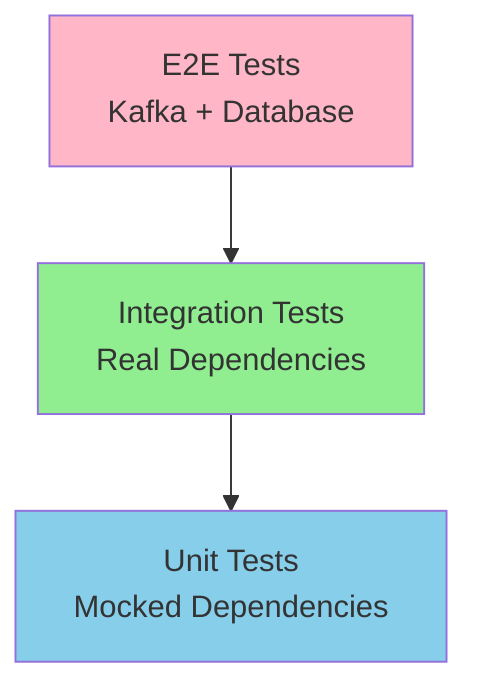

# Testing Events Guide

**This guide explains how to test event publishers, consumers, and the complete event flow.**

## Table of Contents

- [Testing Strategy](#testing-strategy)
- [Testing Event Publishers](#testing-event-publishers)
- [Testing Event Consumers](#testing-event-consumers)
- [Integration Testing](#integration-testing)
- [E2E Testing with Testcontainers](#e2e-testing-with-testcontainers)
- [Testing Transactions](#testing-transactions)
- [Testing Idempotency](#testing-idempotency)
- [Common Testing Patterns](#common-testing-patterns)
- [Best Practices](#best-practices)

---

## Testing Strategy

### Testing Pyramid



**Levels:**

1. **Unit Tests** - Test publishers/consumers in isolation with mocks
2. **Integration Tests** - Test with real database but mocked Kafka
3. **E2E Tests** - Test complete flow with real Kafka and database

### What to Test at Each Level

| Level           | Test Publisher                 | Test Consumer    | Test Transaction |
| --------------- | ------------------------------ | ---------------- | ---------------- |
| **Unit**        | Event called with correct data | Handler logic    | N/A              |
| **Integration** | Event stored in outbox         | Event processing | Atomicity        |
| **E2E**         | Event published to Kafka       | Event consumed   | Full flow        |

---

## Testing Event Publishers

### Unit Testing with Mocks

**Test that publisher calls outbox with correct data:**

```typescript
import { describe, it, mock } from 'node:test';
import assert from 'node:assert';
import { randomUUID } from 'node:crypto';

describe('CreateUserHandler - Unit Tests', () => {
  it('should insert outbox event with correct data', async () => {
    // Arrange
    const outboxRepo = {
      insert: mock.fn(async (tx, data) => {
        // Verify data structure
        assert.equal(data.eventType, 'user.created');
        assert.equal(data.aggregateId, '123');
        assert.equal(data.payload.userId, '123');
        assert.equal(data.tenantId, 'tenant-1');
        assert.ok(data.eventId);
      })
    };

    const handler = new CreateUserHandler(outboxRepo);
    const command = new CreateUserCommand({
      tenantId: 'tenant-1',
      organizationId: 1,
      isActive: true
    });

    // Act
    await handler.execute(command);

    // Assert
    assert.equal(outboxRepo.insert.mock.calls.length, 1);
  });

  it('should use same transaction for user and event', async (t) => {
    // Arrange
    const transactionCalls = [];
    const tx = {
      insert: mock.fn((table) => ({
        values: mock.fn((data) => ({
          returning: mock.fn(() => {
            transactionCalls.push(table);
            return [{ id: 123 }];
          })
        }))
      }))
    };

    const db = {
      transaction: mock.fn(async (callback) => {
        return await callback(tx);
      })
    };

    const handler = new CreateUserHandler(outboxRepo, db);

    // Act
    await handler.execute(command);

    // Assert
    assert.equal(db.transaction.mock.calls.length, 1);
    assert.equal(transactionCalls.length, 2); // users + outbox
  });
});
```

### Integration Testing with Database

**Test that event is actually stored in outbox table:**

```typescript
import { describe, it, before, after } from 'node:test';
import { setupTestDatabase } from '../helpers/database';

describe('CreateUserHandler - Integration Tests', () => {
  let testDb;

  before(async () => {
    testDb = await setupTestDatabase();
  });

  after(async () => {
    await testDb.teardown();
  });

  it('should store event in outbox table', async () => {
    // Arrange
    const handler = new CreateUserHandler(outboxRepo, testDb);
    const command = new CreateUserCommand({
      tenantId: 'tenant-1',
      organizationId: 1,
      isActive: true
    });

    // Act
    await handler.execute(command);

    // Assert: Check user was created
    const users = await testDb.query.users.findMany();
    assert.equal(users.length, 1);
    assert.equal(users[0].id, 123);

    // Assert: Check event was stored
    const events = await testDb.query.outbox.findMany();
    assert.equal(events.length, 1);
    assert.equal(events[0].eventType, 'user.created');
    assert.equal(events[0].status, 'pending');
    assert.equal(events[0].aggregateId, '123');
  });

  it('should rollback both user and event on error', async () => {
    // Arrange
    const handler = new CreateInvalidUserHandler(outboxRepo, testDb);
    const command = new CreateUserCommand({
      // Invalid data that causes error
      email: 'invalid-email'
    });

    // Act & Assert
    await assert.rejects(async () => await handler.execute(command), { message: 'Invalid email' });

    // Assert: Both rolled back
    const users = await testDb.query.users.findMany();
    assert.equal(users.length, 0);

    const events = await testDb.query.outbox.findMany();
    assert.equal(events.length, 0);
  });
});
```

---

## Testing Event Consumers

### Unit Testing Consumer Logic

**Test consumer handler in isolation:**

```typescript
import { describe, it, mock } from 'node:test';
import assert from 'node:assert';

describe('UserCreatedConsumer - Unit Tests', () => {
  it('should send welcome email', async () => {
    // Arrange
    const emailService = {
      sendWelcome: mock.fn(async (userId, email) => {
        assert.equal(userId, 'user-123');
        assert.equal(email, 'user@example.com');
      })
    };

    const consumer = new UserCreatedConsumer(emailService);

    const event: EventMessage<UserCreatedData> = {
      eventType: 'user.created',
      eventId: 'event-123',
      timestamp: new Date(),
      data: {
        userId: 'user-123',
        email: 'user@example.com',
        tenantId: 'tenant-1',
        createdAt: '2024-01-01T00:00:00.000Z'
      },
      schemaVersion: '1.0'
    };

    // Act
    await consumer.handleUserCreated(event);

    // Assert
    assert.equal(emailService.sendWelcome.mock.calls.length, 1);
  });

  it('should skip already processed events', async () => {
    // Arrange
    const processedRepo = {
      findById: mock.fn(async (eventId) => {
        return { eventId, processedAt: new Date() };
      })
    };

    const consumer = new IdempotentConsumer(processedRepo);

    const event = createTestEvent();

    // Act
    await consumer.handleUserCreated(event);

    // Assert
    assert.equal(processedRepo.findById.mock.calls.length, 1);
    // Email should NOT be sent
    assert.equal(emailService.sendWelcome.mock.calls.length, 0);
  });
});
```

### Integration Testing with Kafka

**Test consumer processes events from Kafka:**

```typescript
import { describe, it, before, after } from 'node:test';
import { setupKafka, setupTestDatabase } from '../helpers/setup';

describe('UserCreatedConsumer - Integration Tests', () => {
  let kafka, testDb, app;

  before(async () => {
    testDb = await setupTestDatabase();
    kafka = await setupKafka();
    app = await createTestApp();
  });

  after(async () => {
    await app.close();
    await kafka.teardown();
    await testDb.teardown();
  });

  it('should process user.created event from Kafka', async () => {
    // Arrange
    const event = {
      eventType: 'user.created',
      eventId: randomUUID(),
      timestamp: new Date().toISOString(),
      data: {
        userId: 'user-123',
        email: 'user@example.com',
        tenantId: 'tenant-1',
        createdAt: '2024-01-01T00:00:00.000Z'
      },
      schemaVersion: '1.0'
    };

    // Act: Produce event to Kafka
    await kafka.produce({
      topic: 'user-created',
      messages: [
        {
          key: 'user-123',
          value: JSON.stringify(event)
        }
      ]
    });

    // Wait for consumer processing
    await new Promise((resolve) => setTimeout(resolve, 2000));

    // Assert: Check side effects
    const emails = await mockEmailService.getSentEmails();
    assert.equal(emails.length, 1);
    assert.equal(emails[0].to, 'user@example.com');
    assert.equal(emails[0].template, 'welcome');
  });
});
```

---

## Integration Testing

### Testing with Testcontainers

**Full integration test with real Kafka and database:**

```typescript
import { describe, it, before, after } from 'node:test';
import { setupE2ETestEnvironment } from '../helpers/e2e-setup';

describe('User Events - Integration Tests', () => {
  let env;

  before(async () => {
    env = await setupE2ETestEnvironment({
      kafka: true,
      database: true
    });
  });

  after(async () => {
    await env.teardown();
  });

  it('should publish event when user is created', async () => {
    // Arrange
    const { app, kafka } = env;

    // Act: Create user via API
    const response = await app.request({
      method: 'POST',
      url: '/users',
      headers: {
        'x-tenant-id': 'tenant-1',
        'Content-Type': 'application/json'
      },
      body: {
        organizationId: 1,
        isActive: true
      }
    });

    assert.equal(response.status, 201);
    const userId = response.body.data.id;

    // Wait for outbox processing (max 5 seconds)
    await waitForOutboxProcessing(app, 5000);

    // Assert: Check event was published to Kafka
    const events = await kafka.consume('user-created', {
      fromBeginning: true,
      maxWaitTime: 5000
    });

    assert.ok(events.length >= 1);
    const userCreatedEvent = events.find((e) => e.data.userId === userId);
    assert.ok(userCreatedEvent);
    assert.equal(userCreatedEvent.eventType, 'user.created');
  });
});

async function waitForOutboxProcessing(app, timeout) {
  const startTime = Date.now();
  while (Date.now() - startTime < timeout) {
    const health = await app.request({
      method: 'GET',
      url: '/v1/health'
    });

    const pendingCount = health.body.data.details.outbox.details.pendingCount;
    if (pendingCount <= 1) break; // Event processed

    await new Promise((resolve) => setTimeout(resolve, 100));
  }
}
```

---

## E2E Testing with Testcontainers

### Complete Event Flow Test

**File:** `apps/api/test/users-events.e2e.spec.ts`

```typescript
import { describe, it, before, after } from 'node:test';
import { setupE2ETestDatabaseJest } from './helpers/database';
import { setupKafkaE2E } from '@package/test-utils';
import { startTestServer } from './helpers/bootstrap';

describe('User Events E2E Tests', () => {
  let server, kafka, tenantId;

  before(async () => {
    // 1. Setup test database
    await setupE2ETestDatabaseJest();

    // 2. Setup Kafka (slow startup, 10-30 seconds)
    kafka = await setupKafkaE2E();

    // 3. Start test server
    server = await startTestServer();

    // 4. Create test tenant
    tenantId = await createTestOrganization(server.app);
  });

  after(async () => {
    await server?.close();
    await kafka?.teardown();
  });

  it('should consume user.created event after user creation', async () => {
    // 1. Create user via API
    const createResponse = await server.request({
      method: 'POST',
      url: '/users',
      headers: {
        'x-tenant-id': tenantId.toString(),
        'Content-Type': 'application/json'
      },
      body: {
        organizationId: tenantId,
        isActive: true,
        isVerified: false
      }
    });

    assert.equal(createResponse.status, 201);
    const userId = createResponse.body.data.id;

    // 2. Wait for outbox processing and Kafka delivery
    const maxWait = 5000;
    const interval = 100;
    let elapsed = 0;
    let healthResponse = null;

    while (elapsed < maxWait) {
      await new Promise((resolve) => setTimeout(resolve, interval));
      elapsed += interval;

      // Check outbox status via health endpoint
      healthResponse = await server.request({
        method: 'GET',
        url: '/v1/health'
      });

      const { outbox } = healthResponse.body.data.details || {};

      // Event should be processed (pendingCount back to 0 or 1 baseline)
      if (outbox && outbox.pendingCount <= 1) {
        break;
      }
    }

    // 3. Verify the user was created
    const getResponse = await server.request({
      method: 'GET',
      url: `/users/${userId}`,
      headers: {
        'x-tenant-id': tenantId.toString()
      }
    });

    assert.equal(getResponse.status, 200);
    assert.equal(getResponse.body.data.id, userId);

    // 4. Verify outbox health status
    if (healthResponse) {
      const { outbox } = healthResponse.body.data.details;
      assert.equal(outbox.details.failedCount, 0);
      assert.equal(outbox.details.pendingCount, 0);
    }
  });

  it('should process multiple user.created events in sequence', async () => {
    const userCount = 3;
    const createdUserIds = [];

    // Create multiple users
    for (let i = 0; i < userCount; i++) {
      const response = await server.request({
        method: 'POST',
        url: '/users',
        headers: {
          'x-tenant-id': tenantId.toString(),
          'Content-Type': 'application/json'
        },
        body: {
          organizationId: tenantId,
          isActive: true
        }
      });

      assert.equal(response.status, 201);
      createdUserIds.push(response.body.data.id);
    }

    // Wait for outbox processing
    await new Promise((resolve) => setTimeout(resolve, 3000));

    // Verify all users were created
    assert.equal(createdUserIds.length, userCount);

    // Verify outbox health (no failed events)
    const healthResponse = await server.request({
      method: 'GET',
      url: '/v1/health'
    });

    assert.equal(healthResponse.status, 200);
    const { outbox } = healthResponse.body.data.details;
    assert.equal(outbox.details.failedCount, 0);
  });
});
```

---

## Testing Transactions

### Test Atomicity

**Verify that state changes and events commit together or rollback together:**

```typescript
describe('Transaction Tests', () => {
  it('should commit both user and event on success', async () => {
    const testDb = await setupTestDatabase();
    const handler = new CreateUserHandler(outboxRepo, testDb);

    await handler.execute(command);

    // Both should exist
    const users = await testDb.query.users.findMany();
    assert.equal(users.length, 1);

    const events = await testDb.query.outbox.findMany();
    assert.equal(events.length, 1);
  });

  it('should rollback both user and event on error', async () => {
    const testDb = await setupTestDatabase();
    const handler = new CreateInvalidUserHandler(outboxRepo, testDb);

    try {
      await handler.execute(invalidCommand);
      assert.fail('Should have thrown error');
    } catch (error) {
      // Expected error
    }

    // Neither should exist
    const users = await testDb.query.users.findMany();
    assert.equal(users.length, 0);

    const events = await testDb.query.outbox.findMany();
    assert.equal(events.length, 0);
  });

  it('should rollback event if user creation fails', async () => {
    const testDb = await setupTestDatabase();
    const handler = new CreateUserHandler(outboxRepo, testDb);

    // Mock user insert to fail
    testDb.mock.users.insert = () => {
      throw new Error('Database error');
    };

    try {
      await handler.execute(command);
    } catch (error) {
      // Expected
    }

    // Event should not exist
    const events = await testDb.query.outbox.findMany();
    assert.equal(events.length, 0);
  });
});
```

---

## Testing Idempotency

### Test Consumer Idempotency

```typescript
describe('Idempotency Tests', () => {
  it('should not process same event twice', async () => {
    const consumer = new IdempotentConsumer(processedRepo, emailService);
    const event = createTestEvent();

    // First processing
    await consumer.handleUserCreated(event);
    assert.equal(emailService.sendWelcome.mock.calls.length, 1);

    // Second processing (should skip)
    await consumer.handleUserCreated(event);
    assert.equal(emailService.sendWelcome.mock.calls.length, 1); // Still 1
  });

  it('should handle duplicate events from Kafka', async () => {
    const consumer = new IdempotentConsumer(processedRepo, emailService);
    const event = createTestEvent();

    // Simulate Kafka delivering same event twice
    await consumer.handleUserCreated(event);
    await consumer.handleUserCreated(event);

    // Should only process once
    assert.equal(emailService.sendWelcome.mock.calls.length, 1);
  });
});
```

---

## Common Testing Patterns

### Pattern 1: Test Event Data Structure

```typescript
it('should create event with correct structure', async () => {
  await handler.execute(command);

  const events = await testDb.query.outbox.findMany();
  const event = events[0];

  // Verify event structure
  assert.equal(event.eventType, 'user.created');
  assert.ok(event.eventId);
  assert.ok(event.aggregateId);
  assert.ok(event.payload);
  assert.equal(event.tenantId, 'tenant-1');
  assert.equal(event.schemaVersion, '1.0');
  assert.equal(event.status, 'pending');
});
```

### Pattern 2: Test Event Payload

```typescript
it('should include complete event payload', async () => {
  await handler.execute(command);

  const events = await testDb.query.outbox.findMany();
  const payload = events[0].payload;

  // Verify payload contains all required fields
  assert.equal(payload.userId, '123');
  assert.equal(payload.email, 'user@example.com');
  assert.equal(payload.tenantId, 'tenant-1');
  assert.ok(payload.createdAt);
});
```

### Pattern 3: Test Consumer Side Effects

```typescript
it('should send welcome email when user created', async () => {
  const consumer = new UserCreatedConsumer(emailService);
  const event = createTestEvent();

  await consumer.handleUserCreated(event);

  // Verify side effect
  assert.equal(emailService.sendWelcome.mock.calls.length, 1);
  assert.equal(emailService.sendWelcome.mock.calls[0].arguments[0], 'user-123');
});
```

---

## Best Practices

### 1. Test at Multiple Levels

```typescript
// Unit test: Fast, isolated
it('should call outbox.insert with correct data', async () => {
  const outboxRepo = { insert: mock.fn() };
  await handler.execute(command);
  assert.equal(outboxRepo.insert.mock.calls.length, 1);
});

// Integration test: Slower, real dependencies
it('should store event in outbox table', async () => {
  const testDb = await setupTestDatabase();
  await handler.execute(command);
  const events = await testDb.query.outbox.findMany();
  assert.equal(events.length, 1);
});

// E2E test: Slowest, complete flow
it('should publish event to Kafka', async () => {
  const env = await setupE2EEnvironment();
  await handler.execute(command);
  const events = await env.kafka.consume('user-created');
  assert.ok(events.length >= 1);
});
```

### 2. Use Test Doubles Judiciously

```typescript
// ✅ GOOD: Mock external services
const emailService = {
  sendWelcome: mock.fn()
};

// ✅ GOOD: Use real database for integration tests
const testDb = await setupTestDatabase();

// ❌ BAD: Mock database (loses integration test value)
const db = {
  transaction: mock.fn()
};
```

### 3. Test Edge Cases

```typescript
it('should handle missing tenant ID', async () => {
  const command = new CreateUserCommand({
    // No tenantId
  });

  await assert.rejects(async () => await handler.execute(command), {
    message: 'tenantId is required'
  });
});

it('should handle invalid event data', async () => {
  const consumer = new UserCreatedConsumer();
  const event = {
    eventType: 'user.created',
    data: {
      // Missing required fields
    }
  };

  await assert.rejects(async () => await consumer.handleUserCreated(event), {
    message: 'Invalid event data'
  });
});
```

### 4. Clean Up Test Data

```typescript
describe('My Tests', () => {
  let testDb;

  before(async () => {
    testDb = await setupTestDatabase();
  });

  afterEach(async () => {
    // Clean up after each test
    await testDb.query.users.delete();
    await testDb.query.outbox.delete();
  });

  after(async () => {
    await testDb.teardown();
  });
});
```

---

## Summary

**Key Takeaways:**

1. **Test at multiple levels** - Unit, integration, E2E
2. **Test transaction atomicity** - Both commit or both rollback
3. **Test idempotency** - Consumers handle duplicate events
4. **Use Testcontainers** - Real Kafka and database for integration tests
5. **Clean up test data** - Isolate tests from each other

**Testing Checklist:**

- [ ] Unit tests for event publishers
- [ ] Unit tests for event consumers
- [ ] Integration tests for outbox storage
- [ ] Integration tests for consumer processing
- [ ] E2E tests for complete event flow
- [ ] Transaction rollback tests
- [ ] Idempotency tests

**Next Steps:**

- [Outbox Pattern](outbox-pattern.md) - Deep dive into outbox implementation
- [Transactions](transactions.md) - How to test transactions
- [Creating Consumers](creating-consumers.md) - Consumer implementation guide
