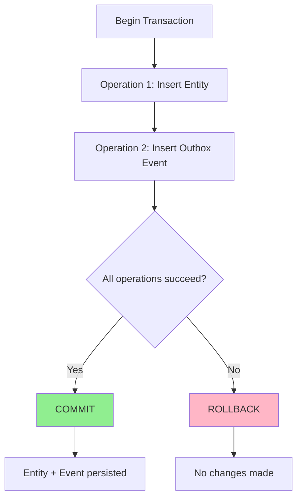
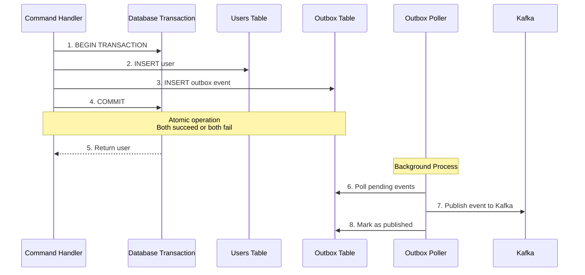

# Transactions with Events Guide

**This guide explains how to use database transactions with the outbox pattern to ensure atomic state changes and event publishing.**

## Table of Contents

- [Why Transactions Matter for Events](#why-transactions-matter-for-events)
- [Transaction Basics](#transaction-basics)
- [The Transaction + Outbox Pattern](#the-transaction--outbox-pattern)
- [Implementation Patterns](#implementation-patterns)
- [Error Handling and Rollback](#error-handling-and-rollback)
- [Common Transaction Patterns](#common-transaction-patterns)
- [Edge Cases and Gotchas](#edge-cases-and-gotchas)
- [Testing Transactions](#testing-transactions)
- [Best Practices](#best-practices)

---

## Why Transactions Matter for Events

### The Problem: Dual-Write

Without transactions, you face the **dual-write problem**: writing to two separate systems (database + Kafka) that can't be atomic.

```typescript
// ❌ PROBLEM: Two separate writes
async execute(command: CreateUserCommand) {
  // Write 1: Database
  const user = await this.usersRepo.create(command.data);

  // Write 2: Kafka
  await this.eventBus.publish('user.created', userData);

  // What if Kafka fails after database commits?
  // User exists but event is lost!
}
```

**Possible Failure Scenarios:**

1. **Kafka is down** - User created, event lost forever
2. **Network timeout** - User created, event never reaches Kafka
3. **Service crash** - User created, service crashes before publishing
4. **Partial failure** - User created in one DB shard, Kafka publish fails

**Result:** System inconsistency - user exists but downstream services never know.

### The Solution: Atomic Transaction

The outbox pattern solves this by storing events in the **same database transaction** as state changes:

```typescript
// ✅ SOLUTION: Single atomic transaction
async execute(command: CreateUserCommand) {
  return db.transaction(async (tx) => {
    // Both writes happen in same transaction
    const user = await this.usersRepo.create(tx, command.data);
    await this.outboxRepo.insert(tx, eventData);

    // Both commit together or both rollback
    return user;
  });
}
```

**Guarantees:**

- **Atomicity** - User and event commit together
- **Consistency** - No orphaned users or lost events
- **Isolation** - Other transactions don't see partial state
- **Durability** - Both persisted to disk before commit returns

---

## Transaction Basics

### What is a Database Transaction?

A transaction is a **sequence of database operations** that are treated as a single unit of work.

**ACID Properties:**

- **A**tomicity - All operations succeed or all fail
- **C**onsistency - Database moves from one valid state to another
- **I**solation - Concurrent transactions don't interfere
- **D**urability - Committed changes survive failures

### Transaction Flow



### Drizzle ORM Transactions

This monorepo uses **Drizzle ORM** with PostgreSQL:

```typescript
import { db } from '@package/db-core';

// Basic transaction
return db.transaction(async (tx) => {
  // All database operations use `tx` instead of `db`
  const [user] = await tx.insert(users).values(data).returning();
  return user;
});

// With error handling
try {
  return db.transaction(async (tx) => {
    const user = await tx.insert(users).values(data).returning();
    await this.outboxRepo.insert(tx, eventData);
    return user;
  });
} catch (error) {
  // Transaction automatically rolled back
  this.logger.error('Transaction failed', error);
  throw error;
}
```

---

## The Transaction + Outbox Pattern

### Architecture



### Key Principle

**The outbox record MUST be in the same transaction as the state change.**

```typescript
// ✅ CORRECT: Same transaction
return db.transaction(async (tx) => {
  const user = await tx.insert(users).values(data).returning();
  await this.outboxRepo.insert(tx, eventData); // Same tx
  return user;
});

// ❌ WRONG: Separate transactions
const user = await db.transaction(async (tx) => {
  return tx.insert(users).values(data).returning();
});

await this.outboxRepo.insert(db, eventData); // Different tx!
```

---

## Implementation Patterns

### Pattern 1: Create with Event

```typescript
import { randomUUID } from 'node:crypto';
import { db } from '@package/db-core';
import { users } from '@package/db-core/schema';

async execute(command: CreateUserCommand) {
  return db.transaction(async (tx) => {
    // 1. Create user
    const [user] = await tx.insert(users).values({
      organizationId: command.organizationId,
      isActive: true,
      isVerified: false,
    }).returning();

    // 2. Insert outbox event (SAME transaction)
    await this.outboxRepo.insert(tx, {
      eventId: randomUUID(),
      eventType: 'user.created',
      aggregateId: String(user.id),
      payload: {
        userId: String(user.id),
        tenantId: String(command.tenantId),
        organizationId: String(command.organizationId),
        emailHash: 'hash...',
        createdAt: new Date().toISOString(),
      },
      tenantId: String(command.tenantId),
      schemaVersion: '1.0',
    });

    // 3. Return result
    return user;
  });
}
```

### Pattern 2: Update with Event

```typescript
async execute(command: UpdateUserCommand) {
  return db.transaction(async (tx) => {
    // 1. Get original user
    const [original] = await tx.select()
      .from(users)
      .where(eq(users.id, command.userId));

    // 2. Update user
    const [user] = await tx.update(users)
      .set(command.changes)
      .where(eq(users.id, command.userId))
      .returning();

    // 3. Insert outbox event
    await this.outboxRepo.insert(tx, {
      eventId: randomUUID(),
      eventType: 'user.updated',
      aggregateId: String(user.id),
      payload: {
        userId: String(user.id),
        changes: command.changes,
        previousState: original,
      },
      tenantId: String(command.tenantId),
    });

    return user;
  });
}
```

### Pattern 3: Delete with Event

```typescript
async execute(command: DeleteUserCommand) {
  return db.transaction(async (tx) => {
    // 1. Get user before delete
    const [user] = await tx.select()
      .from(users)
      .where(eq(users.id, command.userId));

    // 2. Delete user
    await tx.delete(users)
      .where(eq(users.id, command.userId));

    // 3. Insert outbox event
    await this.outboxRepo.insert(tx, {
      eventId: randomUUID(),
      eventType: 'user.deleted',
      aggregateId: String(user.id),
      payload: {
        userId: String(user.id),
        deletionType: 'soft',
        deletedAt: new Date().toISOString(),
      },
      tenantId: String(command.tenantId),
    });
  });
}
```

### Pattern 4: Multiple Entities with Event

```typescript
async execute(command: CreateOrderCommand) {
  return db.transaction(async (tx) => {
    // 1. Create order
    const [order] = await tx.insert(orders).values({
      userId: command.userId,
      total: command.total,
    }).returning();

    // 2. Create order items
    const items = await tx.insert(orderItems).values(
      command.items.map(item => ({
        orderId: order.id,
        productId: item.productId,
        quantity: item.quantity,
      }))
    ).returning();

    // 3. Update inventory
    for (const item of command.items) {
      await tx.update(products)
        .set({ stock: sql`${products.stock} - ${item.quantity}` })
        .where(eq(products.id, item.productId));
    }

    // 4. Insert outbox event
    await this.outboxRepo.insert(tx, {
      eventId: randomUUID(),
      eventType: 'order.created',
      aggregateId: String(order.id),
      payload: {
        orderId: String(order.id),
        userId: String(command.userId),
        items: items,
        total: order.total,
      },
      tenantId: String(command.tenantId),
    });

    return order;
  });
}
```

---

## Error Handling and Rollback

### Automatic Rollback

Drizzle automatically rolls back transactions if an error is thrown:

```typescript
// ✅ Automatic rollback on error
try {
  return db.transaction(async (tx) => {
    const user = await tx.insert(users).values(data).returning();

    // This validation throws an error
    if (user.email.includes('invalid')) {
      throw new Error('Invalid email');
    }

    // This never executes
    await this.outboxRepo.insert(tx, eventData);

    return user;
  });
} catch (error) {
  // User and event both rolled back automatically
  this.logger.error('User creation failed', error);
  throw error;
}
```

### Manual Rollback

You can also manually roll back:

```typescript
import { DB } from 'drizzle-orm';

async execute(command: CreateUserCommand) {
  return db.transaction(async (tx) => {
    const user = await tx.insert(users).values(data).returning();

    // Manual rollback
    if (someCondition) {
      await tx.rollback();
      throw new Error('Manual rollback');
    }

    await this.outboxRepo.insert(tx, eventData);
    return user;
  });
}
```

### Transaction Isolation

Drizzle uses **READ COMMITTED** isolation by default:

```typescript
// Default: READ COMMITTED
return db.transaction(async (tx) => {
  // Only sees committed changes from other transactions
  const user = await tx.insert(users).values(data).returning();
  return user;
});

// Custom isolation level
return db.transaction(
  async (tx) => {
    // Transaction logic
  },
  {
    isolationLevel: 'serializable' // Highest isolation
  }
);
```

---

## Common Transaction Patterns

### Pattern 1: Validation Before Transaction

```typescript
async execute(command: CreateUserCommand) {
  // 1. Validate outside transaction (faster, no lock)
  const existing = await db.query.users.findFirst({
    where: eq(users.email, command.email),
  });

  if (existing) {
    throw new ConflictException('User already exists');
  }

  // 2. Transaction for state change + event
  return db.transaction(async (tx) => {
    const [user] = await tx.insert(users).values(command.data).returning();
    await this.outboxRepo.insert(tx, eventData);
    return user;
  });
}
```

### Pattern 2: Transaction with Validation

```typescript
async execute(command: CreateUserCommand) {
  return db.transaction(async (tx) => {
    // 1. Check existence within transaction
    const [existing] = await tx.select()
      .from(users)
      .where(eq(users.email, command.email))
      .limit(1);

    if (existing) {
      throw new ConflictException('User already exists');
    }

    // 2. Create user
    const [user] = await tx.insert(users).values(command.data).returning();

    // 3. Insert outbox event
    await this.outboxRepo.insert(tx, eventData);

    return user;
  });
}
```

### Pattern 3: Nested Transactions (Savepoints)

```typescript
async execute(command: ComplexCommand) {
  return db.transaction(async (tx) => {
    // Outer transaction
    const user = await tx.insert(users).values(data).returning();

    // Inner transaction (savepoint)
    try {
      await tx.transaction(async (tx2) => {
        await this.optionalOperation(tx2);
      });
    } catch (error) {
      // Inner transaction rolled back, outer continues
      this.logger.warn('Optional operation failed', error);
    }

    // Outer transaction continues
    await this.outboxRepo.insert(tx, eventData);
    return user;
  });
}
```

---

## Edge Cases and Gotchas

### Gotcha 1: Transaction Scope Too Large

```typescript
// ❌ WRONG: Transaction includes slow operations
return db.transaction(async (tx) => {
  const user = await tx.insert(users).values(data).returning();

  // Slow operation inside transaction!
  await this.emailService.sendWelcome(user.email);

  await this.outboxRepo.insert(tx, eventData);
  return user;
});

// ✅ GOOD: Transaction only for DB operations
return db
  .transaction(async (tx) => {
    const user = await tx.insert(users).values(data).returning();
    await this.outboxRepo.insert(tx, eventData);
    return user;
  })
  .then(async (user) => {
    // Slow operation outside transaction
    await this.emailService.sendWelcome(user.email);
    return user;
  });
```

### Gotcha 2: Forgetting to Use `tx`

```typescript
// ❌ WRONG: Using `db` instead of `tx`
return db.transaction(async (tx) => {
  const user = await db.insert(users).values(data).returning(); // Wrong!
  await this.outboxRepo.insert(tx, eventData);
  return user;
});

// ✅ GOOD: Always use `tx` inside transaction
return db.transaction(async (tx) => {
  const user = await tx.insert(users).values(data).returning(); // Correct!
  await this.outboxRepo.insert(tx, eventData);
  return user;
});
```

### Gotcha 3: Missing Event ID

```typescript
// ❌ WRONG: No eventId (primary key error)
return db.transaction(async (tx) => {
  const user = await tx.insert(users).values(data).returning();
  await this.outboxRepo.insert(tx, {
    // No eventId!
    eventType: 'user.created',
    aggregateId: user.id
  });
  return user;
});

// ✅ GOOD: Always include eventId
return db.transaction(async (tx) => {
  const user = await tx.insert(users).values(data).returning();
  await this.outboxRepo.insert(tx, {
    eventId: randomUUID(), // Required!
    eventType: 'user.created',
    aggregateId: user.id
  });
  return user;
});
```

### Gotcha 4: Event After Return

```typescript
// ❌ WRONG: Event insert after return
return db.transaction(async (tx) => {
  const user = await tx.insert(users).values(data).returning();
  return user; // Transaction commits here!

  // This never executes
  await this.outboxRepo.insert(tx, eventData);
});

// ✅ GOOD: Event insert before return
return db.transaction(async (tx) => {
  const user = await tx.insert(users).values(data).returning();
  await this.outboxRepo.insert(tx, eventData);
  return user; // Now commits both
});
```

### Gotcha 5: Async Operations in Transaction

```typescript
// ❌ WRONG: Promise.all inside transaction
return db.transaction(async (tx) => {
  const user = await tx.insert(users).values(data).returning();

  // Parallel operations can cause issues
  await Promise.all([
    this.outboxRepo.insert(tx, eventData),
    this.anotherRepo.insert(tx, otherData)
  ]);

  return user;
});

// ✅ GOOD: Sequential operations
return db.transaction(async (tx) => {
  const user = await tx.insert(users).values(data).returning();
  await this.outboxRepo.insert(tx, eventData);
  await this.anotherRepo.insert(tx, otherData);
  return user;
});
```

---

## Testing Transactions

### Unit Testing with Mocks

```typescript
import { mock } from 'node:test';

describe('CreateUserHandler', () => {
  it('should create user and event in transaction', async () => {
    // Mock transaction
    const tx = mock.mock(db.transaction);
    const txMock = {
      insert: mock.fn(),
      values: mock.fn(),
      returning: mock.fn()
    };

    tx.mock.callback(async (callback) => {
      return await callback(txMock);
    });

    // Execute
    await handler.execute(command);

    // Verify transaction was called
    assert.equal(tx.mock.calls.length, 1);
  });
});
```

### Integration Testing with Testcontainers

```typescript
import { describe, it, before, after } from 'node:test';
import { setupTestDatabase } from './helpers/database';

describe('CreateUserHandler Integration', () => {
  let testDb;

  before(async () => {
    testDb = await setupTestDatabase();
  });

  after(async () => {
    await testDb.teardown();
  });

  it('should commit user and event atomically', async () => {
    const handler = new CreateUserHandler(outboxRepo);

    // Execute
    const user = await handler.execute(command);

    // Verify user created
    const users = await testDb.query.users.findMany();
    assert.equal(users.length, 1);

    // Verify event in outbox
    const events = await testDb.query.outbox.findMany();
    assert.equal(events.length, 1);
    assert.equal(events[0].eventType, 'user.created');
  });

  it('should rollback both on error', async () => {
    const handler = new CreateUserHandler(outboxRepo);

    // Force error
    const command = new CreateUserCommand({ ... });

    try {
      await handler.execute(command);
      assert.fail('Should have thrown');
    } catch (error) {
      // Expected error
    }

    // Verify both rolled back
    const users = await testDb.query.users.findMany();
    assert.equal(users.length, 0);

    const events = await testDb.query.outbox.findMany();
    assert.equal(events.length, 0);
  });
});
```

---

## Best Practices

### 1. Keep Transactions Short

```typescript
// ✅ GOOD: Fast transaction
return db.transaction(async (tx) => {
  const user = await tx.insert(users).values(data).returning();
  await this.outboxRepo.insert(tx, eventData);
  return user;
});

// ❌ BAD: Slow transaction (holds locks)
return db.transaction(async (tx) => {
  const user = await tx.insert(users).values(data).returning();

  // Slow operation inside transaction!
  await this.externalApiCall();

  await this.outboxRepo.insert(tx, eventData);
  return user;
});
```

### 2. Always Use `tx` Inside Transaction

```typescript
// ✅ GOOD: Use tx for all DB operations
return db.transaction(async (tx) => {
  const user = await tx.insert(users).values(data).returning();
  const profile = await tx.insert(profiles).values(data).returning();
  await this.outboxRepo.insert(tx, eventData);
  return user;
});
```

### 3. Validate Early When Possible

```typescript
// ✅ GOOD: Validate outside transaction
const existing = await db.query.users.findFirst({
  where: eq(users.email, command.email)
});

if (existing) {
  throw new ConflictException('User exists');
}

// Now start transaction
return db.transaction(async (tx) => {
  const user = await tx.insert(users).values(data).returning();
  await this.outboxRepo.insert(tx, eventData);
  return user;
});
```

### 4. Include Complete Event Data

```typescript
// ✅ GOOD: Complete payload
return db.transaction(async (tx) => {
  const [user] = await tx.insert(users).values(data).returning();

  await this.outboxRepo.insert(tx, {
    eventId: randomUUID(),
    eventType: 'user.created',
    aggregateId: String(user.id),
    payload: {
      userId: String(user.id),
      email: user.email,
      name: user.name,
      organizationId: user.organizationId,
      createdAt: user.createdAt.toISOString()
    },
    tenantId: String(command.tenantId)
  });

  return user;
});
```

### 5. Handle Errors Properly

```typescript
// ✅ GOOD: Proper error handling
try {
  return db.transaction(async (tx) => {
    const user = await tx.insert(users).values(data).returning();

    // Validate business rules
    if (user.email.includes('invalid')) {
      throw new ConflictException('Invalid email');
    }

    await this.outboxRepo.insert(tx, eventData);
    return user;
  });
} catch (error) {
  // Log and rethrow
  this.logger.error('Failed to create user', error);
  throw error;
}
```

---

## Summary

**Key Principles:**

1. **Atomicity** - State change and event in same transaction
2. **Use `tx`** - Always use transaction object inside transaction
3. **Keep it short** - Minimize transaction duration
4. **Include complete data** - Event payload should be self-contained
5. **Handle errors** - Let errors propagate for automatic rollback

**Basic Pattern:**

```typescript
return db.transaction(async (tx) => {
  const entity = await this.repository.create(tx, data);
  await this.outboxRepo.insert(tx, eventData);
  return entity;
});
```

**Testing:**

- Unit tests with mocks
- Integration tests with Testcontainers
- Verify atomicity (both commit or both rollback)

**Next Steps:**

- [Outbox Pattern Guide](outbox-pattern.md) - Deep dive into outbox implementation
- [Publishing Events](publishing-events.md) - Complete guide to event publishing
- [Testing Events](testing-events.md) - How to test transactional events
