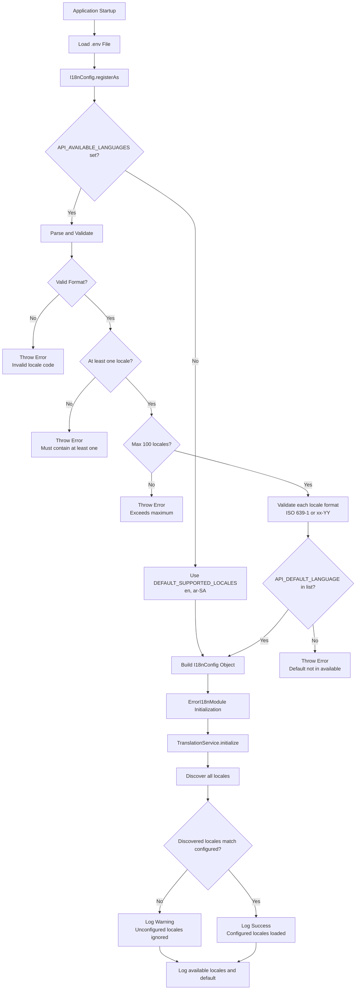
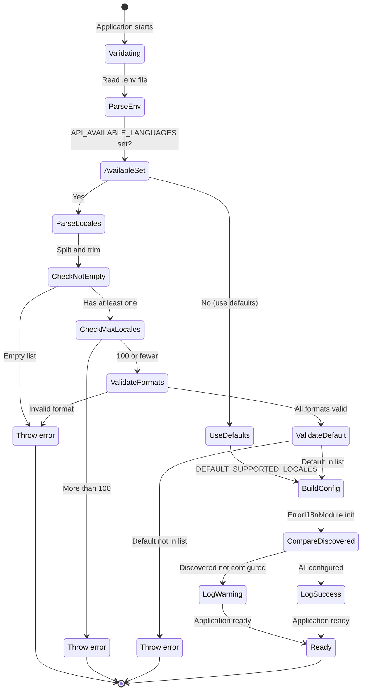

# I18n Configuration

This guide covers environment configuration, validation, and setup for internationalization in the NestJS API.

## Configuration Flow



## Environment Variables

### API_DEFAULT_LANGUAGE

Sets the default language for translations when no locale is specified in the request.

```bash
# .env
API_DEFAULT_LANGUAGE=en
```

**Allowed Values:**

- Any valid locale code (ISO 639-1 or ISO 639-1 + ISO 3166-1 alpha-2)
- Must be included in `API_AVAILABLE_LANGUAGES`

**Default:** `en` (if `API_AVAILABLE_LANGUAGES` is set) or first locale in `API_AVAILABLE_LANGUAGES`

**Validation:**

```typescript
// The config validates that default is in available languages
if (!availableLanguages.includes(defaultLanguage)) {
  throw new Error(
    `API_DEFAULT_LANGUAGE "${defaultLanguage}" is not in API_AVAILABLE_LANGUAGES.\n` +
      `Default language must be one of: ${availableLanguages.join(', ')}`
  );
}
```

### API_AVAILABLE_LANGUAGES

Comma-separated list of available/active locales for the application.

```bash
# .env
API_AVAILABLE_LANGUAGES=en,ar-SA,tl-PH,fr
```

**Allowed Values:**

- Comma-separated list of locale codes
- Format: `xx` or `xx-YY` (ISO 639-1 or ISO 639-1 + ISO 3166-1 alpha-2)
- Minimum 1 locale, maximum 100 locales
- No spaces between locales (use commas only)

**Default:** `en,ar-SA`

**Validation:**

```typescript
// Validates locale format with regex
if (!/^[a-z]{2}(-[A-Z]{2})?$/.test(locale)) {
  throw new Error(
    `Invalid locale code "${locale}" at index ${index}.\n` +
      `Locale codes must follow ISO 639-1 format (e.g., en, ar) ` +
      `or ISO 639-1 + ISO 3166-1 alpha-2 format (e.g., en-US, ar-SA).`
  );
}
```

## Configuration Examples

### English Only

```bash
# .env
API_DEFAULT_LANGUAGE=en
API_AVAILABLE_LANGUAGES=en
```

**Result:**

- All requests use English translations
- No locale detection needed
- Simplified configuration

### English and Arabic

```bash
# .env
API_DEFAULT_LANGUAGE=en
API_AVAILABLE_LANGUAGES=en,ar-SA
```

**Result:**

- Default: English
- Accept-Language: `ar-SA` returns Arabic
- Query param: `?locale=ar-SA` returns Arabic

### All Supported Languages

```bash
# .env
API_DEFAULT_LANGUAGE=en
API_AVAILABLE_LANGUAGES=en,ar-SA,tl-PH,fr
```

**Result:**

- Default: English
- Supports: English, Arabic (Saudi Arabia), Filipino (Philippines), French
- Automatic locale detection from Accept-Language header

### Multi-Region with Defaults

```bash
# .env
API_DEFAULT_LANGUAGE=en-US
API_AVAILABLE_LANGUAGES=en-US,en-GB,fr-FR,de-DE,es-ES
```

**Result:**

- Default: English (United States)
- Region-specific translations for English, French, German, Spanish
- Accept-Language header can specify region (e.g., `en-GB` vs `en-US`)

### Arabic as Default

```bash
# .env
API_DEFAULT_LANGUAGE=ar-SA
API_AVAILABLE_LANGUAGES=en,ar-SA
```

**Result:**

- Default: Arabic (Saudi Arabia)
- English available via Accept-Language or query parameter
- RTL language support needed in frontend

## Configuration Validation States



## Configuration Schema

```typescript
export interface I18nConfig {
  /**
   * Default language/locale to use when no locale is specified
   */
  defaultLanguage: Locale;

  /**
   * List of available/active languages for the application
   */
  availableLanguages: Locale[];
}
```

**Locale Type:**

```typescript
export type Locale =
  | 'en' // English
  | 'ar-SA' // Arabic (Saudi Arabia)
  | 'tl-PH' // Filipino (Philippines)
  | 'fr' // French
  | 'en-US' // English (United States)
  | 'en-GB' // English (United Kingdom)
  | 'de-DE' // German (Germany)
  | 'es-ES' // Spanish (Spain)
  | string; // Any valid ISO locale
```

## I18nConfigService

The `I18nConfigService` provides access to i18n configuration and locale validation.

### Methods

```typescript
@Injectable()
export class I18nConfigService {
  /**
   * Get i18n configuration
   */
  getConfig(): I18nConfig;

  /**
   * Get default language
   */
  getDefaultLanguage(): Locale;

  /**
   * Get available languages
   */
  getAvailableLanguages(): Locale[];

  /**
   * Check if a locale is in the configured available languages
   */
  isLocaleAvailable(locale: Locale): boolean;

  /**
   * Validate that a locale is available, throw error if not
   */
  validateLocaleAvailable(locale: Locale): void;

  /**
   * Validate that all discovered locales are in the configured available languages
   * Logs a warning if any discovered locales are not configured
   */
  validateDiscoveredLocales(discoveredLocales: readonly Locale[]): void;
}
```

### Usage Example

```typescript
import { Injectable } from '@nestjs/common';
import { I18nConfigService } from '@/common/i18n';

@Injectable()
export class MyService {
  constructor(private readonly i18nConfig: I18nConfigService) {}

  getAvailableLanguages() {
    return this.i18nConfig.getAvailableLanguages();
    // Returns: ['en', 'ar-SA', 'tl-PH', 'fr']
  }

  getDefaultLanguage() {
    return this.i18nConfig.getDefaultLanguage();
    // Returns: 'en'
  }

  isLocaleAvailable(locale: string) {
    return this.i18nConfig.isLocaleAvailable(locale);
    // Returns: true if locale is in API_AVAILABLE_LANGUAGES
  }

  validateLocale(locale: string) {
    // Throws error if locale not available
    this.i18nConfig.validateLocaleAvailable(locale);
  }
}
```

## Startup Logging

When the application starts, the `ErrorI18nModule` logs the i18n configuration:

### Successful Initialization

```
[Nest] INFO I18n initialized with 4 configured locales: en, ar-SA, tl-PH, fr
[Nest] INFO Default language: en
```

### Unconfigured Locales Warning

```
[Nest] WARN Some discovered locales are not in API_AVAILABLE_LANGUAGES and will not be used: es, de
[Nest] INFO I18n initialized with 4 configured locales: en, ar-SA, tl-PH, fr
[Nest] INFO Default language: en
```

## Locale Detection Validation

The locale detection logic (`extractLocaleFromRequest`) validates detected locales against the configured available languages:

```typescript
const requestLocaleProvider: Provider = {
  provide: REQUEST_LOCALE,
  useFactory: (request: Request, i18nConfig: I18nConfigService): Locale => {
    const configuredDefault = i18nConfig.getDefaultLanguage();

    // Extract locale with configured default as fallback
    const locale = extractLocaleFromRequest(request, configuredDefault);

    // Validate that the detected locale is in configured available languages
    if (!i18nConfig.isLocaleAvailable(locale)) {
      // Fall back to configured default if detected locale is not available
      return configuredDefault;
    }

    return locale;
  },
  inject: [REQUEST, I18nConfigService],
  scope: Scope.REQUEST
};
```

This ensures that:

1. Detected locales from query parameters or Accept-Language header are validated
2. If a detected locale is not in `API_AVAILABLE_LANGUAGES`, it falls back to the default
3. Only configured locales are used for translations

## Configuration Error Messages

### Missing Available Languages

```
Error: API_AVAILABLE_LANGUAGES must contain at least one locale code.
Example: API_AVAILABLE_LANGUAGES=en,ar-SA
```

**Solution:** Add at least one locale to `API_AVAILABLE_LANGUAGES`.

### Invalid Locale Format

```
Error: Invalid locale code "english" at index 0.
Locale codes must follow ISO 639-1 format (e.g., en, fr)
or ISO 639-1 + ISO 3166-1 alpha-2 format (e.g., en-US, ar-SA).
Examples: en, ar, ar-SA, en-US, de-DE
```

**Solution:** Use ISO locale codes like `en`, `fr`, `ar-SA`, not language names.

### Default Not In Available

```
Error: API_DEFAULT_LANGUAGE "es" is not in the configured available languages.
Available: en, ar-SA, tl-PH, fr
```

**Solution:** Add `es` to `API_AVAILABLE_LANGUAGES` or change `API_DEFAULT_LANGUAGE`.

### Exceeds Maximum Locales

```
Error: API_AVAILABLE_LANGUAGES exceeds maximum number of locales (100).
Current count: 101
```

**Solution:** Reduce the number of locales to 100 or fewer.

## Documentation References

- [Overview](./overview.md) - Architecture and component overview
- [Usage](./usage.md) - How to use i18n in your code
- [Adding Translations](./adding-translations.md) - How to add new translations
- [I18n Config](../../src/config/i18n.config.ts) - Configuration implementation
- [Error I18n Module](../../src/common/i18n/error-i18n.module.ts) - Module implementation
