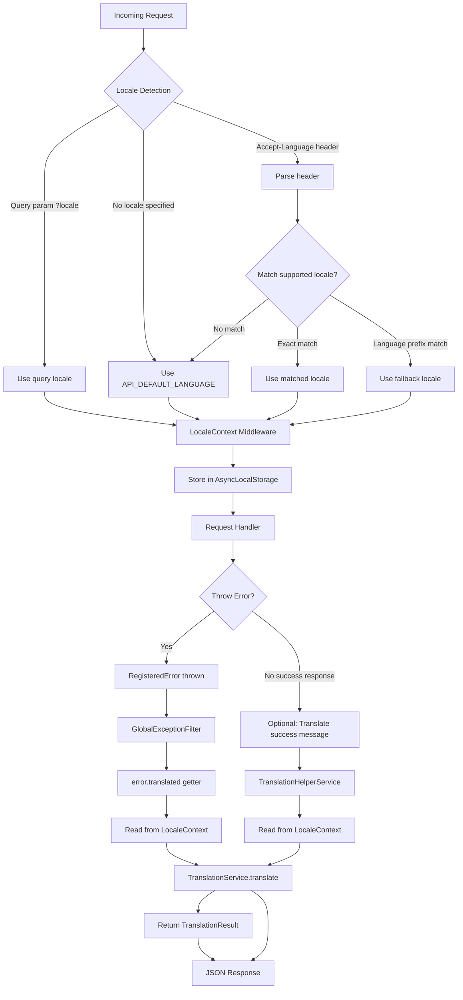
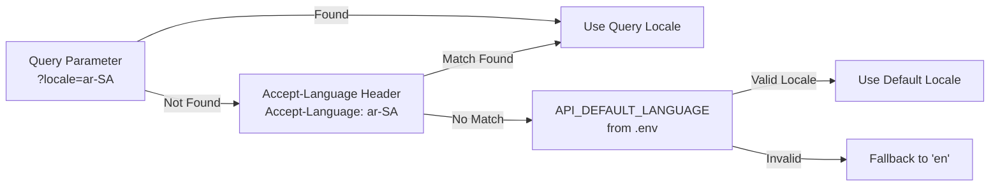

# API Internationalization Overview

This guide explains the internationalization (i18n) architecture for the NestJS API application.

## Architecture

```mermaid
C4Context
    title API Internationalization Architecture
    Person(user, "API Client", "Makes HTTP requests")
    Container(api, "NestJS API", "TypeScript", "Handles i18n via @package/errors")
    ComponentReq(middleware, "LocaleContext Middleware", "Extracts locale from request", "Express/NestJS")
    ComponentCont(localeCtx, "LocaleContext", "AsyncLocalStorage", "Request-scoped locale storage")
    ComponentComp(errors, "@package/errors Package", "TranslationService", "Core translation engine")
    ComponentDb(tfiles, "Translation Files", "TypeScript objects", "en.ts, ar-SA.ts, tl-PH.ts, fr.ts")
    ComponentRel(registry, "Error Registry", "Centralized error codes", "72 predefined errors")

    Rel(user, api, "HTTP + Accept-Language/ ?locale", "JSON")
    Rel(api, middleware, "Uses", "Express middleware")
    Rel(middleware, localeCtx, "Sets locale in", "AsyncLocalStorage")
    Rel(localeCtx, errors, "Provides locale to", "TranslationService")
    Rel(errors, tfiles, "Loads translations from", "Dynamic import")
    Rel(errors, registry, "Merges with", "Base error translations")
```

## Translation Flow



## Key Components

| Component                    | Location                             | Purpose                                            |
| ---------------------------- | ------------------------------------ | -------------------------------------------------- |
| **@package/errors**          | `packages/errors/`                   | Core translation engine with error registry        |
| **TranslationService**       | `@package/errors` package            | Translates error codes with locale context         |
| **LocaleContext**            | `@package/errors` package            | AsyncLocalStorage for request-scoped locale        |
| **ErrorI18nModule**          | `apps/api/src/common/i18n/`          | Initializes i18n on NestJS startup                 |
| **LocaleContextMiddleware**  | `apps/api/src/common/middleware/`    | Extracts and sets locale from HTTP request         |
| **TranslationHelperService** | `apps/api/src/common/i18n/`          | Convenience service for controllers                |
| **App Messages**             | `apps/api/src/i18n/messages/`        | API-specific translations (api.\* namespace)       |
| **I18nConfigService**        | `apps/api/src/common/i18n/`          | Provides config validation and locale availability |
| **I18nConfig**               | `apps/api/src/config/i18n.config.ts` | Environment configuration with validation          |

## Supported Locales

Currently supported locales:

| Locale  | Language               | Translation File Location                   |
| ------- | ---------------------- | ------------------------------------------- |
| `en`    | English                | `packages/errors/src/i18n/locales/en.ts`    |
| `ar-SA` | Arabic (Saudi Arabia)  | `packages/errors/src/i18n/locales/ar-SA.ts` |
| `tl-PH` | Filipino (Philippines) | `packages/errors/src/i18n/locales/tl-PH.ts` |
| `fr`    | French                 | `packages/errors/src/i18n/locales/fr.ts`    |

## Auto-Translation Feature

The `@package/errors` package provides automatic translation via the `error.translated` getter:

```typescript
import { RegisteredError } from '@package/errors';

// In your exception filter or error handler
if (error instanceof RegisteredError) {
  // No need to call TranslationService.translate()!
  // The getter automatically uses LocaleContext locale
  const translation = error.translated;

  console.log(translation.message); // Translated message
  console.log(translation.locale); // The locale used
  console.log(translation.usedFallback); // Whether fallback was used
}
```

**How it works:**

1. `LocaleContextMiddleware` extracts locale from request and sets it in AsyncLocalStorage
2. When `error.translated` is accessed, it automatically reads locale from `LocaleContext`
3. `TranslationService` translates the error using the request-scoped locale
4. Returns `TranslationResult` with translated message and metadata

## Two Translation Sources

The i18n system combines translation from two sources:

### 1. Error Registry Translations (@package/errors)

- **Location**: `packages/errors/src/i18n/locales/`
- **Purpose**: 72 predefined error codes across 8 domains
- **Namespaces**: USER*\*, AUTH*\_, VAL\__, DB*\*, BIZ*_, EXT\_\_, FILE*\*, SYS*\*
- **Usage**: Thrown via `Errors.factory()` methods

### 2. App-Specific Translations (API)

- **Location**: `apps/api/src/i18n/messages/`
- **Purpose**: Custom translations for API-specific messages
- **Namespaces**: `api.success.*`, `api.error.*`, `api.label.*`, `api.validation.*`, `api.tenant.*`
- **Usage**: Used via `TranslationHelperService` or direct `TranslationService` calls

### Merging Process

On application startup:

1. `ErrorI18nModule.onModuleInit()` calls `TranslationService.initialize()`
2. TranslationService discovers and loads all error registry locales
3. `initializeAppTranslations()` merges API translations into TranslationService
4. All translations are available through the same `TranslationService.translate()` API

## Locale Detection Priority

The locale is detected in this order:



**Priority:**

1. **Query parameter**: `?locale=ar-SA` (explicit override)
2. **Accept-Language header**: `Accept-Language: ar-SA,en-US;q=0.9`
3. **Default locale**: From `API_DEFAULT_LANGUAGE` environment variable

**Validation:**

- Detected locales are validated against `API_AVAILABLE_LANGUAGES`
- If a detected locale is not in the configured list, the system falls back to the default language
- This prevents using incomplete/unconfigured translations

## Environment Configuration

### API_DEFAULT_LANGUAGE

Sets the default language for translations when no locale is specified.

```bash
# .env
API_DEFAULT_LANGUAGE=en
```

**Default:** `en`

**Validation:** The default language must be included in `API_AVAILABLE_LANGUAGES`.

### API_AVAILABLE_LANGUAGES

Comma-separated list of available/active locales for the application.

```bash
# .env
API_AVAILABLE_LANGUAGES=en,ar-SA,tl-PH,fr
```

**Default:** `en,ar-SA`

**Format:** Locale codes must follow ISO 639-1 format (`en`, `fr`) or ISO 639-1 + ISO 3166-1 alpha-2 format (`en-US`, `ar-SA`, `tl-PH`).

**Validation:**

- At least one locale must be specified
- Maximum 100 locales allowed
- Default language must be in the list
- Locale codes must be valid (e.g., `en`, `fr`, `ar-SA`, `tl-PH`, `en-US`, `de-DE`)

## Module Registration

The `ErrorI18nModule` should be imported in `AppModule`:

```typescript
import { ErrorI18nModule } from './common/i18n';

@Module({
  imports: [
    ErrorI18nModule // Enables i18n for all error responses
    // ... other imports
  ]
})
export class AppModule {}
```

The module handles:

1. **Initialization**: Calls `TranslationService.initialize()` on startup
2. **Merging**: Merges app translations with error registry translations
3. **Validation**: Validates discovered locales against configured available languages
4. **Providers**: Registers `TranslationService`, `REQUEST_LOCALE`, and `TranslationHelperService`
5. **Logging**: Logs configured locales and default language on startup

## Documentation References

- [Configuration](./configuration.md) - Environment setup and validation details
- [Usage](./usage.md) - How to use i18n in controllers and services
- [Adding Translations](./adding-translations.md) - How to add new translations and locales
- [Adding Locales](../../../../packages/errors/docs/adding-locales.md) - How to add new error registry locales
- [@package/errors Package](../../../../packages/errors/README.md) - Core error handling package documentation
