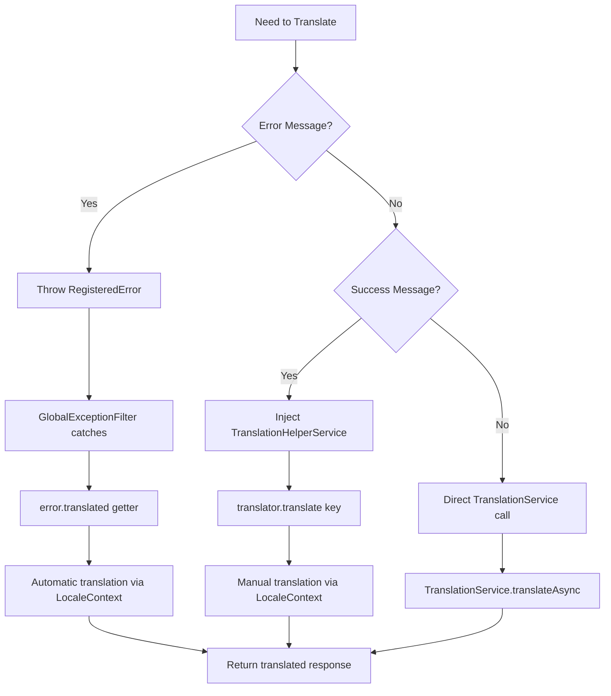
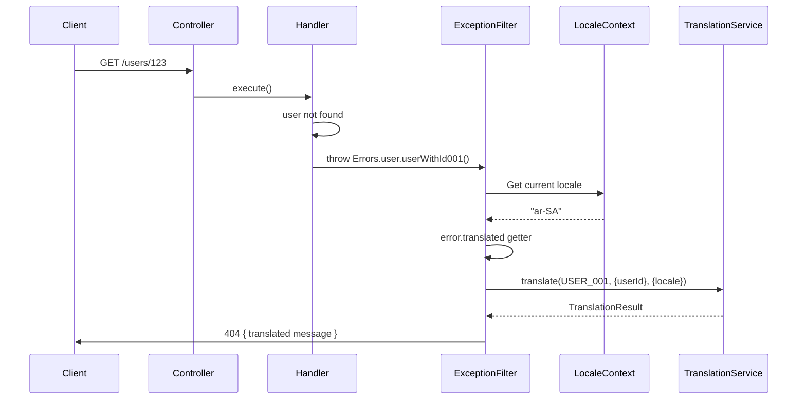

# I18n Usage Guide

This guide explains how to use internationalization in the NestJS API application.

## Usage Patterns



## Error Handling with Auto-Translation

The `GlobalExceptionFilter` automatically translates `RegisteredError` instances using the `error.translated` getter.

### Throwing Errors

Use the `Errors` factory from `@package/errors`:

```typescript
import { Errors } from '@package/errors';

@Get(':id')
async findOne(@Param('id') userId: string) {
  const user = await this.repository.findById(userId);

  if (!user) {
    // Throw error - automatic translation in exception filter
    throw Errors.useruserWithId001({ userId });
  }

  return user;
}
```

### Automatic Translation Flow



### Exception Filter Implementation

The `GlobalExceptionFilter` automatically:

1. Catches the `RegisteredError`
2. Uses `error.translated` getter (reads from `LocaleContext`)
3. Returns translated error response

```typescript
// In GlobalExceptionFilter
catch (error, host) {
  if (error instanceof RegisteredError) {
    // Automatic translation via error.translated getter
    const translation = error.translated;

    return {
      code: error.code,
      message: translation.message,
      locale: translation.locale,
      httpStatus: error.httpStatus,
    };
  }
}
```

**No need to manually call `TranslationService.translate()` for errors!**

## Manual Translation (Non-Error Messages)

For success messages and other non-error translations, inject `TranslationHelperService`.

### Using TranslationHelperService

The easiest way to translate messages is to inject `TranslationHelperService`:

```typescript
import { Controller, Get } from '@nestjs/common';
import { TranslationHelperService } from '@/common/i18n';

@Controller('users')
export class UsersController {
  constructor(private readonly translator: TranslationHelperService) {}

  @Get()
  async findAll() {
    const message = this.translator.translate('api.success.created');
    return { message };
    // Returns: "Resource created successfully" (for en locale)
  }

  @Get('greet')
  async greet() {
    const message = this.translator.translate('api.success.welcome');
    return { message };
    // Returns: "Welcome to our platform!" (for en locale)
  }
}
```

### Translating with Parameters

Use parameters for dynamic values:

```typescript
@Post()
async create() {
  const message = this.translator.translate('VAL_001', {
    field: 'email'
  });
  return { message };
  // Returns: "Invalid value provided: email"
}
```

### Full Translation Result

Get metadata about the translation:

```typescript
async getTranslationWithMetadata() {
  const result = this.translator.translateWithResult('api.error.notFound');
  return {
    message: result.message,
    locale: result.locale,
    usedFallback: result.usedFallback,
    code: result.code,
  };
  // Returns:
  // {
  //   message: "The requested resource was not found",
  //   locale: "en",
  //   usedFallback: false,
  //   code: "api.error.notFound"
  // }
}
```

### Checking Translation Exists

Check if a translation key exists before using it:

```typescript
async safeTranslate() {
  const key = 'api.success.created';

  if (this.translator.hasTranslation(key)) {
    return this.translator.translate(key);
  }

  return 'Default message';
}
```

### Getting Current Locale

Get the current request locale:

```typescript
async getCurrentLocale() {
  const locale = this.translator.getLocale();
  return { currentLocale: locale };
  // Returns: { currentLocale: "en" }
}
```

## Direct TranslationService Usage

For more control, use `TranslationService` directly:

```typescript
import { TranslationService } from '@package/errors';

@Injectable()
export class MyService {
  async sendMessage(locale: string) {
    const result = await TranslationService.translateAsync('api.error.notFound', {}, { locale });
    return result;
    // Returns: { message: "...", locale: "en", usedFallback: false, code: "..." }
  }
}
```

## TranslationHelperService API

```typescript
@Injectable({ scope: Scope.REQUEST })
export class TranslationHelperService {
  /**
   * Translate a message with parameters
   * Uses the current request locale automatically.
   */
  translate(code: string, parameters?: ErrorParameters): string;

  /**
   * Translate a message with full result metadata
   * Returns the full TranslationResult object.
   */
  translateWithResult(code: string, parameters?: ErrorParameters): TranslationResult;

  /**
   * Translate a message async
   * Async version of translate() for consistency.
   */
  async translateAsync(code: string, parameters?: ErrorParameters): Promise<string>;

  /**
   * Get the current request locale
   */
  getLocale(): Locale;

  /**
   * Check if a translation key exists for the current locale
   */
  hasTranslation(code: string): boolean;
}
```

## Namespace Conventions

### API-Specific Namespaces (api.\*)

These are defined in `apps/api/src/i18n/messages/`:

#### Success Messages (`api.success.*`)

```typescript
'api.success.created'; // Resource created successfully
'api.success.updated'; // Resource updated successfully
'api.success.deleted'; // Resource deleted successfully
'api.success.welcome'; // Welcome to our platform!
```

#### Error Messages (`api.error.*`)

```typescript
'api.error.invalidInput'; // The input provided is invalid
'api.error.unauthorized'; // You are not authorized to perform this action
'api.error.forbidden'; // Access to this resource is forbidden
'api.error.notFound'; // The requested resource was not found
'api.error.conflict'; // This action conflicts with existing data
'api.error.rateLimit'; // Too many requests, please try again later
'api.error.internal'; // An internal error occurred, please try again
```

#### UI Labels (`api.label.*`)

```typescript
'api.label.email'; // Email address
'api.label.password'; // Password
'api.label.name'; // Name
'api.label.createdAt'; // Created at
'api.label.updatedAt'; // Updated at
```

#### Tenant Messages (`api.tenant.*`)

```typescript
'api.tenant.invalid'; // Invalid tenant context provided
'api.tenant.notFound'; // Tenant not found
'api.tenant.unauthorized'; // Unauthorized access to tenant
```

#### Validation Messages (`api.validation.*`)

```typescript
'api.validation.email.required'; // Email is required
'api.validation.email.invalid'; // Email format is invalid
'api.validation.password.weak'; // Password is too weak
'api.validation.password.required'; // Password is required
```

### Error Registry Namespaces

These are defined in `packages/errors/src/i18n/locales/`:

- **USER\_\*** - User domain errors (not found, already exists, invalid format)
- **AUTH\_\*** - Authentication domain errors (invalid credentials, token issues, permissions)
- **VAL\_\*** - Validation domain errors (required fields, invalid values, format errors)
- **DB\_\*** - Database domain errors (connection issues, query failures, constraints)
- **BIZ\_\*** - Business logic domain errors (operation restrictions, workflow transitions)
- **EXT\_\*** - External services (third-party API failures, timeouts)
- **FILE\_\*** - File operations (upload failures, format errors, storage issues)
- **SYS\_\*** - System errors (internal errors, configuration, infrastructure)

## Usage Examples

### Controller with Translations

```typescript
import { Controller, Get, Post, Put, Delete, Param, Body } from '@nestjs/common';
import { TranslationHelperService } from '@/common/i18n';
import { Errors } from '@package/errors';

@Controller('products')
export class ProductsController {
  constructor(private readonly translator: TranslationHelperService) {}

  @Get()
  async findAll() {
    return {
      message: this.translator.translate('api.success.welcome'),
      products: []
    };
  }

  @Get(':id')
  async findOne(@Param('id') id: string) {
    const product = await this.productsService.findById(id);

    if (!product) {
      // Automatic translation via error.translated
      throw Errors.databaserecordNotFound004({ entity: 'Product' });
    }

    return {
      message: this.translator.translate('api.success.found', { id }),
      product
    };
  }

  @Post()
  async create(@Body() dto: CreateProductDto) {
    const product = await this.productsService.create(dto);

    return {
      message: this.translator.translate('api.success.created'),
      product
    };
  }
}
```

### Service with Translations

```typescript
import { Injectable } from '@nestjs/common';
import { TranslationHelperService } from '@/common/i18n';

@Injectable()
export class EmailService {
  constructor(private readonly translator: TranslationHelperService) {}

  async sendWelcomeEmail(user: User) {
    const subject = this.translator.translate('api.email.welcome.subject');
    const body = this.translator.translate('api.email.welcome.body', {
      name: user.name
    });

    await this.emailProvider.send({
      to: user.email,
      subject,
      body
    });
  }
}
```

### Command Handler with Event Publishing

```typescript
import { CommandHandler, ICommandHandler } from '@nestjs/cqrs';
import { EventBus } from '@nestjs/cqrs';
import { Errors } from '@package/errors';
import { TranslationHelperService } from '@/common/i18n';

@CommandHandler(CreateUserCommand)
export class CreateUserHandler implements ICommandHandler<CreateUserCommand> {
  constructor(
    private readonly repository: UserRepository,
    private readonly eventBus: EventBus,
    private readonly translator: TranslationHelperService
  ) {}

  async execute(command: CreateUserCommand) {
    // Check if email exists
    const existing = await this.repository.findByEmail(command.tenantId, command.email);

    if (existing) {
      // Automatic translation via error.translated
      throw Errors.useruserWithEmail002({ email: command.email });
    }

    // Create user
    const user = await this.repository.create(command.tenantId, command);

    // Publish domain event
    await this.eventBus.publish(new UserCreatedEvent(command.tenantId, user.id, user.email));

    return user;
  }
}
```

## Testing Translations

### Testing Different Locales

```bash
# Test English (default)
curl http://localhost:3000/api/v1/users

# Test Arabic
curl -H "Accept-Language: ar-SA" http://localhost:3000/api/v1/users

# Test Tagalog
curl -H "Accept-Language: tl-PH" http://localhost:3000/api/v1/users

# Test with query parameter
curl http://localhost:3000/api/v1/users?locale=fr
```

### Testing in Unit Tests

```typescript
import { Test, TestingModule } from '@nestjs/testing';
import { TranslationHelperService } from '@/common/i18n';

describe('MyService', () => {
  let service: MyService;
  let translator: TranslationHelperService;

  beforeEach(async () => {
    const module: TestingModule = await Test.createTestingModule({
      providers: [
        MyService,
        {
          provide: TranslationHelperService,
          useValue: {
            translate: jest.fn().mockReturnValue('Test message')
          }
        }
      ]
    }).compile();

    service = module.get<MyService>(MyService);
    translator = module.get<TranslationHelperService>(TranslationHelperService);
  });

  it('should translate success message', () => {
    const result = service.getWelcomeMessage();
    expect(translator.translate).toHaveBeenCalledWith('api.success.welcome');
    expect(result).toBe('Test message');
  });
});
```

## Best Practices

### 1. Use Namespaces

Always use the `api.*` namespace for app-specific translations:

```typescript
// Good
'api.users.created';

// Avoid
'users_created'; // No namespace
```

### 2. Provide Context

Make translation keys descriptive:

```typescript
// Good
'api.validation.email.invalid';

// Avoid
'api.error.bad'; // Not descriptive
```

### 3. Use Parameters

Use parameters instead of concatenation:

```typescript
// Good
'api.error.invalidField': 'Invalid value for {field}'
this.translator.translate('api.error.invalidField', { field: 'email' })

// Avoid
`Invalid value for ${field}` // Not translatable
```

### 4. Add to All Locales

When adding a new translation, add it to all locale files at the same time:

```typescript
// en.ts
'api.success.verified': 'Email verified successfully',

// ar-SA.ts
'api.success.verified': 'تم التحقق من البريد الإلكتروني بنجاح',

// tl-PH.ts
'api.success.verified': 'Naberipikado ang email',

// fr.ts
'api.success.verified': 'E-mail vérifié avec succès',
```

## Documentation References

- [Overview](./overview.md) - Architecture and component overview
- [Configuration](./configuration.md) - Environment setup and validation
- [Adding Translations](./adding-translations.md) - How to add new translations
- [TranslationHelperService](../../src/common/i18n/translation-helper.service.ts) - Service implementation
