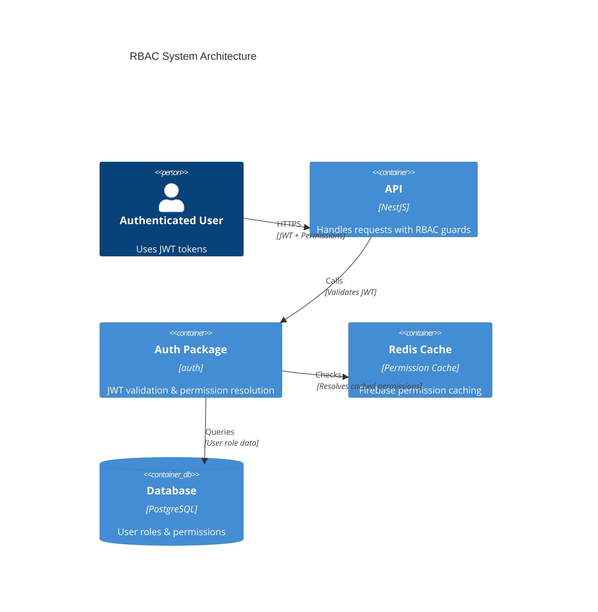

# Role-Based Access Control (RBAC) Documentation

Complete documentation for the RBAC system in the Node Monorepo Boilerplate API.

## Authorization Options

This codebase supports **two authorization approaches**:

### Option 1: Built-in RBAC (Current Implementation)

- **Guards**: `EnhancedPermissionsGuard`, `RolesGuard`
- **Decorators**: `@RequirePermissions`, `@RequireTenantRole`
- **Permissions**: Embedded in JWT or resolved from Firebase/Redis cache
- **Repository-Level Authorization**: Defense-in-depth at data layer
- **Documentation**: See sections below

### Option 2: Open Policy Agent (OPA) - Not Yet Integrated

- **Status**: Package created (`@package/opa`) but **not yet integrated** into API
- **Benefits**:
  - Centralized policy management (Rego policies separate from code)
  - Fine-grained authorization with resource + action evaluation
  - Version-controlled policies
  - Tenant isolation enforcement at policy level
- **Integration Required**: See [OPA Integration Guide](#opa-integration-guide) below
- **Documentation**: [`packages/opa/README.md`](../../../../packages/opa/README.md)

**Recommendation**: Use built-in RBAC for now. Consider OPA when you need:

- Complex, evolving authorization rules
- Externalized policy management
- Fine-grained resource-level authorization
- Policy versioning without code deployment

---

## Table of Contents

1. [Overview](./overview.md) - RBAC architecture and dual-provider support
2. [Permissions](./permissions.md) - Permission system and constants reference
3. [Roles](./roles.md) - Role hierarchy and permission mapping
4. [Guards](./guards.md) - EnhancedPermissionsGuard and authorization flow
5. [Decorators](./decorators.md) - RBAC decorators (@RequirePermissions, @RequireTenantRole)
6. [Repository-Level Authorization](./repository-level.md) - Defense-in-depth at data layer
7. [Multi-Tenancy](./multi-tenancy.md) - Tenant-scoped vs System permissions
8. [Testing](./testing.md) - Unit, integration, and E2E testing patterns

## Quick Links

### Getting Started

- [Overview](./overview.md) - Learn about RBAC architecture
- [Permissions](./permissions.md) - Permission format and constants
- [Roles](./roles.md) - Role hierarchy and mapping

### Implementation

- [Guards](./guards.md) - Using EnhancedPermissionsGuard
- [Decorators](./decorators.md) - Applying @RequirePermissions
- [Repository-Level](./repository-level.md) - Data layer authorization

### Advanced

- [Multi-Tenancy](./multi-tenancy.md) - Tenant isolation patterns
- [Testing](./testing.md) - Testing RBAC with mocks and Testcontainers

## Common Tasks

### Protect an Endpoint with Permissions

```typescript
import { Controller, Get, UseGuards } from '@nestjs/common';
import { JwtAuthGuard } from '@package/auth';
import { RequirePermissions } from '@package/auth';
import { TENANT_PERMISSIONS } from '@package/constants';
import { EnhancedPermissionsGuard } from '@/modules/auth/guards';

@Controller('users')
@ApiBearerAuth()
@UseGuards(JwtAuthGuard, EnhancedPermissionsGuard)
export class UsersController {
  @Get()
  @RequirePermissions(TENANT_PERMISSIONS.USERS_READ)
  findAll() {
    return { message: 'Requires tenant:users:read permission' };
  }
}
```

### Require Tenant Owner Role

```typescript
import { RequireTenantRole } from '@package/auth';
import { TENANT_ROLE } from '@package/constants';

@Patch('settings')
@RequireTenantRole(TENANT_ROLE.OWNER)
updateSettings() {
  return { message: 'Only tenant owners can update settings' };
}
```

### Add Repository-Level Authorization

```typescript
import { BaseRepository } from '@package/foundation-repositories';
import { CachedPermissionService } from '@package/auth';

@Injectable()
export class UserRepository extends BaseRepository {
  constructor(
    @Inject(MAIN_DB) db: NodePgDatabase,
    @Optional() private permissionService: CachedPermissionService
  ) {
    super(db);
  }

  async delete(id: number, userContext?: RepositoryUserContext) {
    // Authorization check before deletion
    await this.authorizeDelete(userContext, id);

    return await this.db.delete(users).where(eq(users.id, id));
  }

  private async authorizeDelete(
    userContext: RepositoryUserContext | undefined,
    targetUserId: number
  ): Promise<void> {
    if (!userContext) return;

    const { userId, tenantId } = userContext;

    // Self-access rule
    if (userId === targetUserId.toString()) return;

    // Tenant permission check
    const hasPermission = await this.permissionService.hasPermission(
      parseInt(userId),
      parseInt(tenantId),
      TENANT_PERMISSIONS.USERS_DELETE
    );

    if (!hasPermission) {
      throw new ForbiddenException('Insufficient permissions');
    }
  }
}
```

## Architecture Overview



## Key Features

### Dual-Provider Support

- **Custom JWT Provider**: Permissions embedded in access token
- **Firebase/Google Identity Platform**: Permissions resolved from Redis cache

### Permission System

- **Format**: `{scope}:{resource}:{action}`
- **Scopes**: `system` (cross-tenant) or `tenant` (tenant-scoped)
- **Type Safety**: Constants defined in `@package/constants`

### Role Hierarchy

**System Roles** (cross-tenant access):

- `system_owner` - All permissions
- `system_admin` - Limited system permissions

**Tenant Roles** (tenant-scoped):

- `tenant_owner` - All tenant permissions
- `tenant_admin` - Most tenant permissions
- `tenant_user` - Standard user permissions
- `tenant_viewer` - Read-only access

### Defense in Depth

1. **Controller Guards** - `EnhancedPermissionsGuard`
2. **Service Layer** - Permission checks in handlers
3. **Repository Layer** - Authorization before data access

## Permission Format

```
{scope}:{resource}:{action}

Examples:
- system:tenants:create     (Create any tenant)
- tenant:users:read         (Read users in current tenant)
- tenant:projects:update    (Update projects in current tenant)
```

## Available Permissions

### System Permissions

| Permission               | Description                |
| ------------------------ | -------------------------- |
| `system:tenants:create`  | Create new tenants         |
| `system:tenants:read`    | View all tenants           |
| `system:tenants:update`  | Update tenant settings     |
| `system:tenants:delete`  | Delete tenants             |
| `system:users:create`    | Create users across system |
| `system:users:read`      | View users across system   |
| `system:system:monitor`  | Access system monitoring   |
| `system:system:settings` | Modify system settings     |

### Tenant Permissions

| Permission               | Description              |
| ------------------------ | ------------------------ |
| `tenant:settings:update` | Update tenant settings   |
| `tenant:users:create`    | Invite users to tenant   |
| `tenant:users:read`      | View tenant users        |
| `tenant:users:update`    | Modify user roles        |
| `tenant:users:delete`    | Remove users from tenant |
| `tenant:projects:create` | Create projects          |
| `tenant:projects:read`   | View projects            |
| `tenant:projects:update` | Update projects          |
| `tenant:projects:delete` | Delete projects          |

## Package Exports

```typescript
// Permissions
import { SYSTEM_PERMISSIONS, TENANT_PERMISSIONS } from '@package/constants';

// Roles
import { SYSTEM_ROLE, TENANT_ROLE } from '@package/constants';

// Guards
import { EnhancedPermissionsGuard } from '@/modules/auth/guards';

// Decorators
import { RequirePermissions, RequireAnyPermission, RequireTenantRole } from '@package/auth';

// Services
import { CachedPermissionService } from '@package/auth';
```

## Documentation References

### API Documentation

- [Authentication](../auth/README.md) - JWT authentication
- [Guards](../auth/guards.md) - Authentication guards
- [Decorators](../auth/decorators.md) - User and tenant decorators

### Testing

- [Unit Testing](../testing/unit-testing-guide.md) - Testing with mocks
- [E2E Testing](../testing/e2e-testing-guide.md) - Testing with Testcontainers

## Support

### Issues

For RBAC-related issues:

1. Check the documentation in this folder
2. Review permission constants in `@package/constants`
3. Check `packages/auth` for implementation details

### Contributing

When contributing to RBAC features:

1. Follow existing RBAC patterns
2. Add tests for new permissions/roles
3. Update documentation
4. Ensure multi-tenancy is maintained

**Next Steps:**

- New to RBAC? Start with [Overview](./overview.md)
- Need permission reference? See [Permissions](./permissions.md)
- Implementing authorization? Check [Guards](./guards.md)

---

## OPA Integration Guide

### What is OPA?

**Open Policy Agent (OPA)** is a separate authorization service that evaluates policies written in **Rego** (a policy language). It provides:

- Centralized policy management (policies separate from code)
- Fine-grained resource + action authorization
- Version-controlled policy changes
- Multi-tenant isolation enforcement

### Current Status

| Component              | Status                                      |
| ---------------------- | ------------------------------------------- |
| `@package/opa` package | ✅ Created                                  |
| Rego policies          | ✅ Created (`packages/opa/policies/authz/`) |
| Docker service         | ✅ Added (`docker-compose.yml`)             |
| API integration        | ❌ Not done                                 |

### Integration Steps

To integrate OPA into your API:

#### 1. Start OPA Server

```bash
docker-compose up -d opa
```

This starts OPA on `http://localhost:8181` with policies from `packages/opa/policies/authz/`.

#### 2. Add Dependencies

In `apps/api/package.json`:

```json
{
  "dependencies": {
    "@nestjs/axios": "^latest",
    "@package/opa": "*"
  }
}
```

Then `pnpm install`.

#### 3. Configure App Module

In `apps/api/src/app.module.ts`:

```typescript
import { HttpModule } from '@nestjs/axios';
import { OpaModule } from '@package/opa';

@Module({
  imports: [
    ConfigModule,
    HttpModule, // Required for OPA
    OpaModule.forRootAsync({
      imports: [ConfigModule],
      inject: [ConfigService],
      useFactory: (config: ConfigService) => ({
        url: config.get('OPA_URL', 'http://localhost:8181'),
        policyPath: config.get('OPA_POLICY_PATH', '/v1/data/authz/allow'),
        timeout: config.get('OPA_TIMEOUT', 5000)
      })
    })
    // ... other imports
  ]
})
export class AppModule {}
```

#### 4. Add Environment Variables

In `apps/api/.env`:

```bash
OPA_URL=http://localhost:8181
OPA_POLICY_PATH=/v1/data/authz/allow
OPA_TIMEOUT=5000
```

#### 5. Use OPA Guards

```typescript
import { OpaGuard, Resource, Action } from '@package/opa';

@Controller('users')
@UseGuards(JwtAuthGuard, OpaGuard) // Auth first, then OPA
@Resource('users')
export class UsersController {
  @Get()
  @Action('read')
  findAll() {
    return this.usersService.findAll();
  }

  @Delete(':id')
  @Action('delete')
  remove(@Param('id') id: string) {
    return this.usersService.remove(id);
  }
}
```

### OPA vs Built-in RBAC

| Feature            | Built-in RBAC                | OPA                              |
| ------------------ | ---------------------------- | -------------------------------- |
| **Location**       | In-code (guards, decorators) | External service (Rego policies) |
| **Policy Changes** | Requires deployment          | Update policy, reload OPA        |
| **Complexity**     | Simple permissions           | Resource + action evaluation     |
| **Performance**    | In-memory (fastest)          | HTTP call (cached available)     |
| **Use Case**       | Most applications            | Complex auth requirements        |

### When to Use OPA

Consider OPA when you need:

- Frequently changing authorization rules
- Fine-grained resource-level permissions
- External policy management
- Policy versioning without code deployment
- Complex conditional logic (ownership, attributes, etc.)

### Documentation

- [OPA Package README](../../../../packages/opa/README.md)
- [Policy Management Guide](../../../../docs/security/authorization.md)
- [Rego Language Reference](https://www.openpolicyagent.org/docs/latest/policy-language/)
