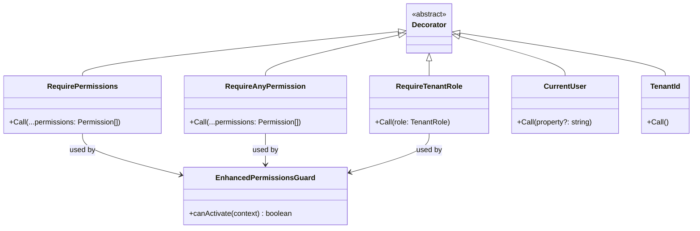
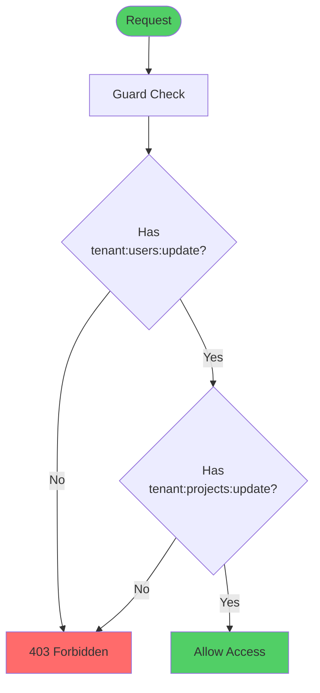
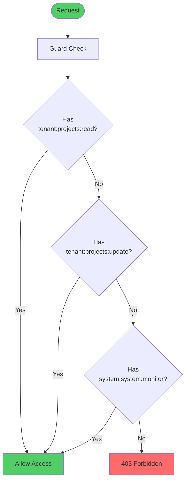
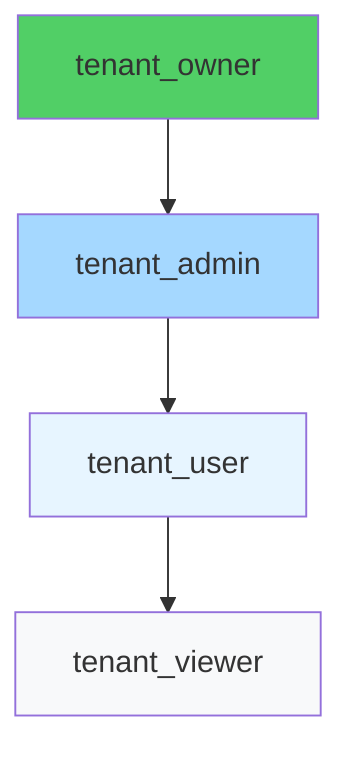

# Decorators Reference

Complete guide to RBAC decorators for authorization and user context extraction.

## Table of Contents

1. [Overview](#overview)
2. [@RequirePermissions](#requirepermissions)
3. [@RequireTenantRole](#requiretenantrole)
4. [@CurrentUser](#currentuser)
5. [@TenantId](#tenantid)
6. [Usage Patterns](#usage-patterns)
7. [Best Practices](#best-practices)

## Overview

RBAC decorators provide declarative authorization and context extraction for NestJS controllers and handlers.



### Import Locations

```typescript
// Permission decorators
import { RequirePermissions, RequireAnyPermission } from '@package/auth';

// Role decorator
import { RequireTenantRole } from '@package/auth';

// User context decorators
import { CurrentUser } from '@/common/decorators/current-user.decorator';
import { TenantId } from '@/common/decorators/tenant-id.decorator';

// Permission constants
import { SYSTEM_PERMISSIONS, TENANT_PERMISSIONS } from '@package/constants';
import { SYSTEM_ROLE, TENANT_ROLE } from '@package/constants';
```

## @RequirePermissions

### Purpose

Requires the user to have **all** specified permissions to access the endpoint.

### Signature

```typescript
RequirePermissions(...permissions: Permission[])
```

### Usage Example

```typescript
import { Controller, Get, Post, Delete, UseGuards } from '@nestjs/common';
import { RequirePermissions } from '@package/auth';
import { TENANT_PERMISSIONS } from '@package/constants';
import { JwtAuthGuard } from '@package/auth';
import { EnhancedPermissionsGuard } from '@/modules/auth/guards';

@Controller('users')
@ApiBearerAuth()
@UseGuards(JwtAuthGuard, EnhancedPermissionsGuard)
export class UsersController {
  @Get()
  @RequirePermissions(TENANT_PERMISSIONS.USERS_READ)
  findAll() {
    // Requires: tenant:users:read
    return this.queryBus.execute(new ListUsersQuery());
  }

  @Post()
  @RequirePermissions(TENANT_PERMISSIONS.USERS_CREATE)
  create() {
    // Requires: tenant:users:create
    return this.commandBus.execute(new CreateUserCommand());
  }

  @Delete(':id')
  @RequirePermissions(TENANT_PERMISSIONS.USERS_DELETE)
  delete() {
    // Requires: tenant:users:delete
    return this.commandBus.execute(new DeleteUserCommand());
  }

  @Post('admin-action')
  @RequirePermissions(TENANT_PERMISSIONS.USERS_UPDATE, TENANT_PERMISSIONS.PROJECTS_UPDATE)
  adminAction() {
    // Requires: BOTH tenant:users:update AND tenant:projects:update
    return this.commandBus.execute(new AdminActionCommand());
  }
}
```

### Multiple Permissions

When multiple permissions are specified, **all** must be present:



### System Permissions

```typescript
@Controller('system/tenants')
@UseGuards(JwtAuthGuard, EnhancedPermissionsGuard)
export class SystemTenantsController {
  @Get()
  @RequirePermissions(SYSTEM_PERMISSIONS.TENANTS_READ)
  findAll() {
    // Requires: system:tenants:read
    return this.queryBus.execute(new ListTenantsQuery());
  }

  @Post()
  @RequirePermissions(SYSTEM_PERMISSIONS.TENANTS_CREATE)
  create() {
    // Requires: system:tenants:create
    return this.commandBus.execute(new CreateTenantCommand());
  }

  @Delete(':id')
  @RequirePermissions(SYSTEM_PERMISSIONS.TENANTS_DELETE)
  delete() {
    // Requires: system:tenants:delete
    return this.commandBus.execute(new DeleteTenantCommand());
  }
}
```

## @RequireAnyPermission

### Purpose

Requires the user to have **at least one** of the specified permissions.

### Signature

```typescript
RequireAnyPermission(...permissions: Permission[])
```

### Usage Example

```typescript
import { RequireAnyPermission } from '@package/auth';

@Controller('projects')
@UseGuards(JwtAuthGuard, EnhancedPermissionsGuard)
export class ProjectsController {
  @Get('reports')
  @RequireAnyPermission(
    TENANT_PERMISSIONS.PROJECTS_READ,
    TENANT_PERMISSIONS.PROJECTS_UPDATE,
    SYSTEM_PERMISSIONS.SYSTEM_MONITOR
  )
  getReports() {
    // Requires: ONE OF:
    // - tenant:projects:read
    // - tenant:projects:update
    // - system:system:monitor
    return this.queryBus.execute(new GetReportsQuery());
  }
}
```

### Logic Diagram



## @RequireTenantRole

### Purpose

Requires the user to have a specific tenant role. This is a shortcut for requiring all permissions associated with a role.

### Signature

```typescript
RequireTenantRole(role: TenantRole)
```

### Available Roles

```typescript
import { TENANT_ROLE } from '@package/constants';

TENANT_ROLE.OWNER; // tenant_owner - All tenant permissions
TENANT_ROLE.ADMIN; // tenant_admin - Most tenant permissions
TENANT_ROLE.USER; // tenant_user - Standard user permissions
TENANT_ROLE.VIEWER; // tenant_viewer - Read-only access
```

### Usage Example

```typescript
import { RequireTenantRole } from '@package/auth';
import { TENANT_ROLE } from '@package/constants';

@Controller('tenants/settings')
@UseGuards(JwtAuthGuard, EnhancedPermissionsGuard)
export class TenantSettingsController {
  @Patch()
  @RequireTenantRole(TENANT_ROLE.OWNER)
  updateSettings() {
    // Only tenant owners can update settings
    return this.commandBus.execute(new UpdateSettingsCommand());
  }

  @Delete()
  @RequireTenantRole(TENANT_ROLE.OWNER)
  deleteTenant() {
    // Only tenant owners can delete tenant
    return this.commandBus.execute(new DeleteTenantCommand());
  }

  @Post('invite-admin')
  @RequireTenantRole(TENANT_ROLE.ADMIN)
  inviteAdmin() {
    // Tenant admins and owners can invite admins
    return this.commandBus.execute(new InviteAdminCommand());
  }
}
```

### Role Hierarchy



**Important:** Role requirements are **NOT hierarchical**. Each role check requires exactly that role:

```typescript
// This requires EXACTLY tenant_admin role
@RequireTenantRole(TENANT_ROLE.ADMIN)
adminOnly() {
  // tenant_owner will NOT pass this check
  // unless they also have tenant_admin role assigned
}

// Use permissions for hierarchical access
@RequirePermissions(
  TENANT_PERMISSIONS.SETTINGS_UPDATE,
)
adminOrOwner() {
  // Both tenant_admin and tenant_owner pass
  // because both have this permission
}
```

## @CurrentUser

### Purpose

Extracts user context from the JWT token. Can extract the entire user object or specific properties.

### Signature

```typescript
CurrentUser(property?: string)
```

### JWT Payload Structure

```typescript
{
  "sub": "user-123",           // User ID (string)
  "tenant_id": "tenant-456",  // Tenant ID (string)
  "actor_id": "user-123",     // Actor ID (string, same as sub)
  "roles": ["tenant_admin"],  // Array of role strings
  "permissions": [            // Array of permission strings (Custom JWT only)
    "tenant:users:read",
    "tenant:users:create"
  ]
}
```

### Extract Entire User Object

```typescript
import { CurrentUser } from '@/common/decorators/current-user.decorator';
import type { CurrentUserData } from '@/common/decorators/current-user.decorator';

@Get('profile')
getProfile(@CurrentUser() user: CurrentUserData) {
  // user contains:
  // {
  //   userId: string,
  //   tenantId: string,
  //   actorId: string,
  //   roles: string[],
  //   permissions?: string[]  // Only for Custom JWT
  // }
  return { user };
}
```

### Extract Specific Property

```typescript
@Get('actor-id')
getActorId(@CurrentUser('actorId') actorId: string) {
  // Only actorId is extracted
  return { actorId };
}

@Get('tenant-id')
getTenantId(@TenantId() tenantId: string) {
  // Shorthand for @CurrentUser('tenantId')
  return { tenantId };
}

@Get('roles')
getRoles(@CurrentUser('roles') roles: string[]) {
  // Only roles are extracted
  return { roles };
}
```

### Common Patterns

```typescript
@Controller('users')
export class UsersController {
  // Pattern 1: Extract actorId for audit trail
  @Post()
  create(@CurrentUser('actorId') actorId: string, @Body() dto: CreateUserDto) {
    const command = new CreateUserCommand({
      actorId, // From JWT
      ...dto
    });
    return this.commandBus.execute(command);
  }

  // Pattern 2: Extract tenantId for scoping
  @Get()
  findAll(@TenantId() tenantId: string) {
    const query = new ListUsersQuery({
      tenantId // From JWT
    });
    return this.queryBus.execute(query);
  }

  // Pattern 3: Extract multiple properties
  @Post('admin-action')
  adminAction(
    @CurrentUser('actorId') actorId: string,
    @CurrentUser('tenantId') tenantId: string,
    @CurrentUser('roles') roles: string[]
  ) {
    // Use all extracted properties
    return this.commandBus.execute(new AdminActionCommand({ actorId, tenantId, roles }));
  }

  // Pattern 4: Extract full user for complex logic
  @Post('complex-action')
  complexAction(@CurrentUser() user: CurrentUserData) {
    // Access any user property
    const isOwner = user.roles.includes('tenant_owner');
    const hasPermission = user.permissions?.includes('tenant:settings:update');

    if (!isOwner && !hasPermission) {
      throw new ForbiddenException('Insufficient permissions');
    }

    return this.commandBus.execute(new ComplexActionCommand({ user }));
  }
}
```

### Type Safety

```typescript
import type { CurrentUserData } from '@/common/decorators/current-user.decorator';

// CurrentUserData interface
interface CurrentUserData {
  userId: string; // User ID from JWT sub claim
  tenantId: string; // Tenant ID from JWT tenant_id claim
  actorId: string; // Actor ID from JWT actor_id claim
  roles: string[]; // Array of role strings
  permissions?: string[]; // Optional: Array of permissions (Custom JWT only)
  permVersion?: string; // Optional: Permission version (Firebase only)
}
```

## @TenantId

### Purpose

Shorthand decorator for extracting `tenantId` from JWT. Equivalent to `@CurrentUser('tenantId')`.

### Signature

```typescript
@TenantId() tenantId: string
```

### Usage Example

```typescript
import { TenantId } from '@/common/decorators/tenant-id.decorator';

@Controller('projects')
export class ProjectsController {
  @Get()
  findAll(@TenantId() tenantId: string) {
    // Extract tenantId from JWT
    return this.queryBus.execute(new ListProjectsQuery({ tenantId }));
  }

  @Post()
  create(
    @TenantId() tenantId: string,
    @CurrentUser('actorId') actorId: string,
    @Body() dto: CreateProjectDto
  ) {
    return this.commandBus.execute(
      new CreateProjectCommand({
        tenantId,
        actorId,
        ...dto
      })
    );
  }
}
```

## Usage Patterns

### Pattern 1: Permission-Based Authorization

```typescript
@Controller('users')
@UseGuards(JwtAuthGuard, EnhancedPermissionsGuard)
export class UsersController {
  @Get()
  @RequirePermissions(TENANT_PERMISSIONS.USERS_READ)
  findAll() {
    return this.queryBus.execute(new ListUsersQuery());
  }

  @Post()
  @RequirePermissions(TENANT_PERMISSIONS.USERS_CREATE)
  create(@Body() dto: CreateUserDto) {
    return this.commandBus.execute(new CreateUserCommand(dto));
  }

  @Patch(':id')
  @RequirePermissions(TENANT_PERMISSIONS.USERS_UPDATE)
  update(@Param('id') id: string, @Body() dto: UpdateUserDto) {
    return this.commandBus.execute(new UpdateUserCommand(id, dto));
  }

  @Delete(':id')
  @RequirePermissions(TENANT_PERMISSIONS.USERS_DELETE)
  delete(@Param('id') id: string) {
    return this.commandBus.execute(new DeleteUserCommand(id));
  }
}
```

### Pattern 2: Role-Based Authorization

```typescript
@Controller('tenants/settings')
@UseGuards(JwtAuthGuard, EnhancedPermissionsGuard)
export class TenantSettingsController {
  @Patch()
  @RequireTenantRole(TENANT_ROLE.OWNER)
  updateSettings(@Body() dto: UpdateSettingsDto) {
    return this.commandBus.execute(new UpdateSettingsCommand(dto));
  }

  @Post('invite-admin')
  @RequireTenantRole(TENANT_ROLE.ADMIN)
  inviteAdmin(@Body() dto: InviteAdminDto) {
    return this.commandBus.execute(new InviteAdminCommand(dto));
  }
}
```

### Pattern 3: Actor Tracking

```typescript
@Controller('system/tenants')
@UseGuards(JwtAuthGuard, EnhancedPermissionsGuard)
export class SystemTenantsController {
  @Post()
  @RequirePermissions(SYSTEM_PERMISSIONS.TENANTS_CREATE)
  createTenant(@CurrentUser('actorId') actorId: string, @Body() dto: CreateTenantDto) {
    const command = new CreateTenantCommand({
      actorId, // Track who created the tenant
      ...dto
    });
    return this.commandBus.execute(command);
  }

  @Delete(':id')
  @RequirePermissions(SYSTEM_PERMISSIONS.TENANTS_DELETE)
  deleteTenant(@CurrentUser('actorId') actorId: string, @Param('id') id: string) {
    const command = new DeleteTenantCommand({
      actorId, // Track who deleted the tenant
      tenantId: id
    });
    return this.commandBus.execute(command);
  }
}
```

### Pattern 4: Tenant Scoping

```typescript
@Controller('projects')
@UseGuards(JwtAuthGuard, EnhancedPermissionsGuard)
export class ProjectsController {
  @Get()
  @RequirePermissions(TENANT_PERMISSIONS.PROJECTS_READ)
  findAll(@TenantId() tenantId: string) {
    // Automatically scoped to user's tenant
    return this.queryBus.execute(new ListProjectsQuery({ tenantId }));
  }

  @Post()
  @RequirePermissions(TENANT_PERMISSIONS.PROJECTS_CREATE)
  create(
    @TenantId() tenantId: string,
    @CurrentUser('actorId') actorId: string,
    @Body() dto: CreateProjectDto
  ) {
    return this.commandBus.execute(
      new CreateProjectCommand({
        tenantId,
        actorId,
        ...dto
      })
    );
  }
}
```

### Pattern 5: Complex Authorization

```typescript
@Controller('admin')
@UseGuards(JwtAuthGuard, EnhancedPermissionsGuard)
export class AdminController {
  @Post('promote-user')
  promoteUser(@CurrentUser() user: CurrentUserData, @Param('userId') targetUserId: string) {
    // Complex authorization logic
    const isSystemOwner = user.roles.includes(SYSTEM_ROLE.OWNER);
    const isTenantOwner = user.roles.includes(TENANT_ROLE.OWNER);
    const hasPermission = user.permissions?.includes(TENANT_PERMISSIONS.USERS_UPDATE);

    if (!isSystemOwner && !isTenantOwner && !hasPermission) {
      throw new ForbiddenException('Insufficient permissions');
    }

    // Self-promotion prevention
    if (user.userId === targetUserId) {
      throw new BadRequestException('Cannot promote yourself');
    }

    return this.commandBus.execute(
      new PromoteUserCommand({
        actorId: user.actorId,
        targetUserId
      })
    );
  }
}
```

## Best Practices

### 1. Use Constants for Permissions and Roles

```typescript
// Good
import { TENANT_PERMISSIONS, TENANT_ROLE } from '@package/constants';
@RequirePermissions(TENANT_PERMISSIONS.USERS_READ)
@RequireTenantRole(TENANT_ROLE.ADMIN)

// Bad - hardcoded strings
@RequirePermissions('tenant:users:read')
@RequireTenantRole('tenant_admin')
```

### 2. Extract Only What You Need

```typescript
// Good - extract specific property
@CurrentUser('actorId') actorId: string

// Okay - extract full user when needed
@CurrentUser() user: CurrentUserData

// Avoid - extracting full user when only one property is needed
@CurrentUser() user: CurrentUserData
const actorId = user.actorId;  // Just use @CurrentUser('actorId') instead
```

### 3. Combine Guards and Decorators

```typescript
// Good - use both guards and decorators
@Controller('users')
@ApiBearerAuth()
@UseGuards(JwtAuthGuard, EnhancedPermissionsGuard)
export class UsersController {
  @Get()
  @RequirePermissions(TENANT_PERMISSIONS.USERS_READ)
  findAll() {
    // Protected by authentication + authorization
  }
}

// Bad - missing authentication guard
@Controller('users')
@UseGuards(EnhancedPermissionsGuard) // No JwtAuthGuard!
export class UsersController {
  @Get()
  @RequirePermissions(TENANT_PERMISSIONS.USERS_READ)
  findAll() {
    // Will fail - no user context available
  }
}
```

### 4. Document Permission Requirements

```typescript
/**
 * GET /users
 *
 * @requires tenant:users:read
 *
 * Returns a paginated list of users in the current tenant.
 *
 * @returns Paginated list of users
 */
@Get()
@RequirePermissions(TENANT_PERMISSIONS.USERS_READ)
findAll() {
  return this.queryBus.execute(new ListUsersQuery());
}
```

### 5. Use Type Imports for Types

```typescript
// Good
import type { CurrentUserData } from '@/common/decorators/current-user.decorator';

// Avoid - runtime import for type-only
import { CurrentUserData } from '@/common/decorators/current-user.decorator';
```

## Documentation References

- [Overview](./overview.md) - RBAC architecture
- [Permissions](./permissions.md) - Permission system reference
- [Roles](./roles.md) - Role hierarchy and mapping
- [Guards](./guards.md) - EnhancedPermissionsGuard details
- [Repository-Level](./repository-level.md) - Data-layer authorization
