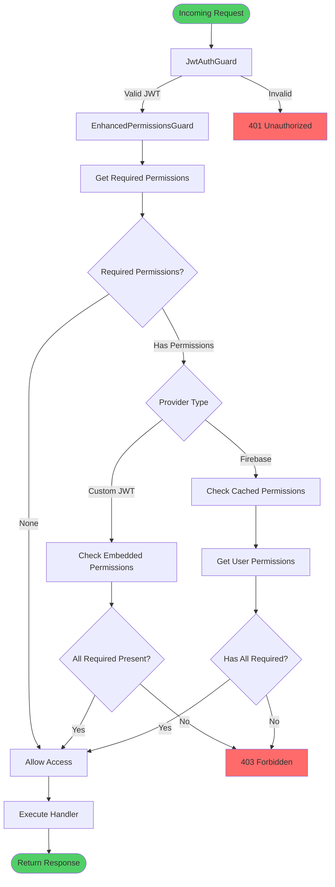
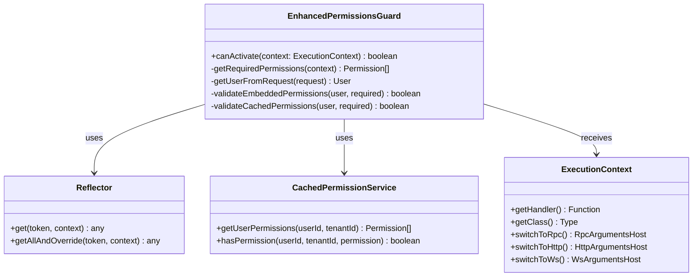
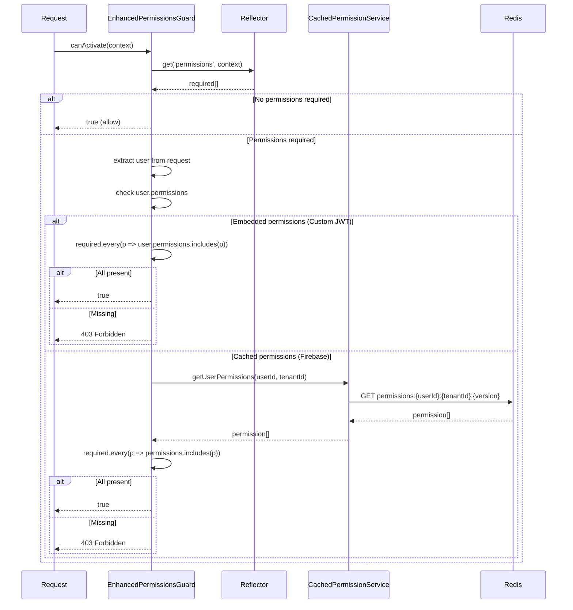
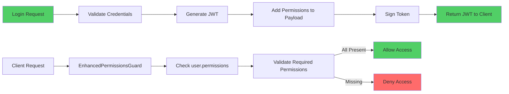
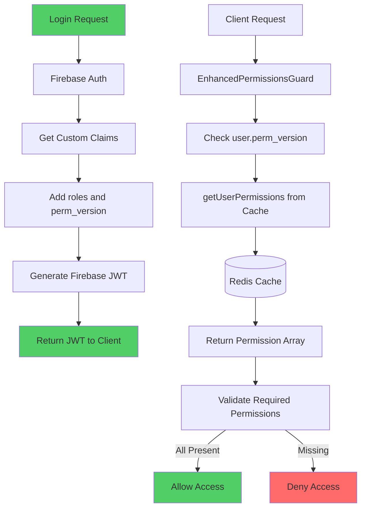

# Guards Reference

Complete guide to authorization guards in the RBAC system.

## Table of Contents

1. [EnhancedPermissionsGuard](#enhancedpermissionsguard)
2. [Guard Registration](#guard-registration)
3. [Permission Resolution](#permission-resolution)
4. [Error Handling](#error-handling)
5. [Best Practices](#best-practices)

## EnhancedPermissionsGuard

### Overview

`EnhancedPermissionsGuard` is the primary authorization guard that supports both Custom JWT and Firebase/Google Identity Platform providers.



### Implementation

The guard is located in the auth module and handles both provider types:



### Source Code Location

```typescript
// apps/api/src/modules/auth/guards/enhanced-permissions.guard.ts
import { Injectable, CanActivate, ExecutionContext } from '@nestjs/common';
import { Reflector } from '@nestjs/core';
import { CachedPermissionService } from '@package/auth';

@Injectable()
export class EnhancedPermissionsGuard implements CanActivate {
  constructor(
    private reflector: Reflector,
    private permissionService: CachedPermissionService
  ) {}

  canActivate(context: ExecutionContext): boolean {
    // Implementation details...
  }
}
```

### Permission Resolution Logic



## Guard Registration

### Module Registration

Register the guard globally in the auth module:

```typescript
import { APP_GUARD } from '@nestjs/core';
import { EnhancedPermissionsGuard } from '@/modules/auth/guards';

@Module({
  providers: [
    {
      provide: APP_GUARD,
      useClass: EnhancedPermissionsGuard
    }
  ]
})
export class AuthModule {}
```

### Controller-Level Usage

Apply guards to controllers:

```typescript
import { Controller, UseGuards } from '@nestjs/common';
import { JwtAuthGuard } from '@package/auth';
import { EnhancedPermissionsGuard } from '@/modules/auth/guards';

@Controller('users')
@ApiBearerAuth()
@UseGuards(JwtAuthGuard, EnhancedPermissionsGuard)
export class UsersController {
  // All endpoints protected by both guards
}
```

### Endpoint-Level Usage

Apply guards to specific endpoints:

```typescript
@Controller('users')
export class UsersController {
  @Get('public')
  publicEndpoint() {
    // No guards - accessible without authentication
  }

  @Get('protected')
  @UseGuards(JwtAuthGuard, EnhancedPermissionsGuard)
  @RequirePermissions(TENANT_PERMISSIONS.USERS_READ)
  protectedEndpoint() {
    // Requires authentication + permission
  }
}
```

## Permission Resolution

### Custom JWT Provider (Embedded Permissions)

Permissions are embedded in the JWT access token:



**JWT Payload Structure:**

```typescript
{
  "sub": "user-123",
  "tenant_id": "tenant-456",
  "actor_id": "user-123",
  "roles": ["tenant_admin"],
  "permissions": [
    "tenant:users:read",
    "tenant:users:create",
    "tenant:users:update",
    "tenant:projects:read",
    "tenant:projects:create"
  ]
}
```

**Validation Logic:**

```typescript
// In EnhancedPermissionsGuard
private validateEmbeddedPermissions(
  user: CurrentUserData,
  required: Permission[],
): boolean {
  if (!user.permissions || user.permissions.length === 0) {
    return false;
  }

  return required.every((permission) =>
    user.permissions.includes(permission),
  );
}
```

### Firebase Provider (Cached Permissions)

Permissions are resolved from Redis cache using `perm_version`:



**Firebase Custom Claims Structure:**

```typescript
{
  "sub": "firebase-uid-123",
  "tenant_id": "tenant-456",
  "actor_id": "firebase-uid-123",
  "roles": ["tenant_admin"],
  "perm_version": "v1"
}
```

**Cache Key Format:**

```
permissions:{userId}:{tenantId}:{permVersion}
```

**Validation Logic:**

```typescript
// In EnhancedPermissionsGuard
private async validateCachedPermissions(
  user: CurrentUserData,
  required: Permission[],
): Promise<boolean> {
  const permissions = await this.permissionService.getUserPermissions(
    parseInt(user.userId),
    parseInt(user.tenantId),
  );

  if (!permissions || permissions.length === 0) {
    return false;
  }

  return required.every((permission) =>
    permissions.includes(permission),
  );
}
```

## Error Handling

### Standard Forbidden Response

When permissions are missing, the guard throws a `ForbiddenException`:

```typescript
import { ForbiddenException } from '@nestjs/common';

// In EnhancedPermissionsGuard
throw new ForbiddenException('You do not have permission to perform this action');
```

### Response Format

```json
{
  "statusCode": 403,
  "message": "You do not have permission to perform this action",
  "error": "Forbidden"
}
```

### Custom Error Messages

For more specific error messages, check permissions in handlers:

```typescript
@CommandHandler(DeleteUserCommand)
export class DeleteUserHandler implements ICommandHandler<DeleteUserCommand> {
  async execute(command: DeleteUserCommand) {
    const hasPermission = await this.permissionService.hasPermission(
      command.actorId,
      command.tenantId,
      TENANT_PERMISSIONS.USERS_DELETE
    );

    if (!hasPermission) {
      throw new ForbiddenException(
        'You do not have permission to delete users. Required: tenant:users:delete'
      );
    }

    // Proceed with deletion
  }
}
```

## Best Practices

### 1. Always Use JwtAuthGuard First

```typescript
// Good
@UseGuards(JwtAuthGuard, EnhancedPermissionsGuard)

// Bad - permission guard will fail without user context
@UseGuards(EnhancedPermissionsGuard)
```

### 2. Specify Permissions Explicitly

```typescript
// Good - explicit permissions
@RequirePermissions(TENANT_PERMISSIONS.USERS_READ)

// Bad - no permission check
// (relies on global guard without required permissions)
```

### 3. Use Constants for Permissions

```typescript
// Good
import { TENANT_PERMISSIONS } from '@package/constants';
@RequirePermissions(TENANT_PERMISSIONS.USERS_READ)

// Bad - hardcoded strings
@RequirePermissions('tenant:users:read')
```

### 4. Document Permission Requirements

```typescript
/**
 * GET /users
 *
 * Requires: tenant:users:read
 *
 * Returns a paginated list of users in the current tenant.
 */
@Get()
@RequirePermissions(TENANT_PERMISSIONS.USERS_READ)
async findAll() {
  // Implementation
}
```

### 5. Handle Self-Access in Repositories

```typescript
// Repository-level authorization
async delete(id: number, userContext?: RepositoryUserContext) {
  // Self-access rule
  if (userContext?.userId === id.toString()) {
    return await this.db.delete(users).where(eq(users.id, id));
  }

  // Permission check
  await this.authorizeDelete(userContext, id);
  return await this.db.delete(users).where(eq(users.id, id));
}
```

### 6. Use Role Decorators for High-Level Access

```typescript
// For high-level role checks
@RequireTenantRole(TENANT_ROLE.OWNER)
updateSettings() {
  // Only tenant owners
}

// For specific permission checks
@RequirePermissions(TENANT_PERMISSIONS.SETTINGS_UPDATE)
updateSpecificSetting() {
  // Anyone with this permission
}
```

## Documentation References

- [Overview](./overview.md) - RBAC architecture and dual-provider support
- [Permissions](./permissions.md) - Permission system reference
- [Roles](./roles.md) - Role hierarchy and mapping
- [Decorators](./decorators.md) - Using RBAC decorators
- [Repository-Level](./repository-level.md) - Data-layer authorization
