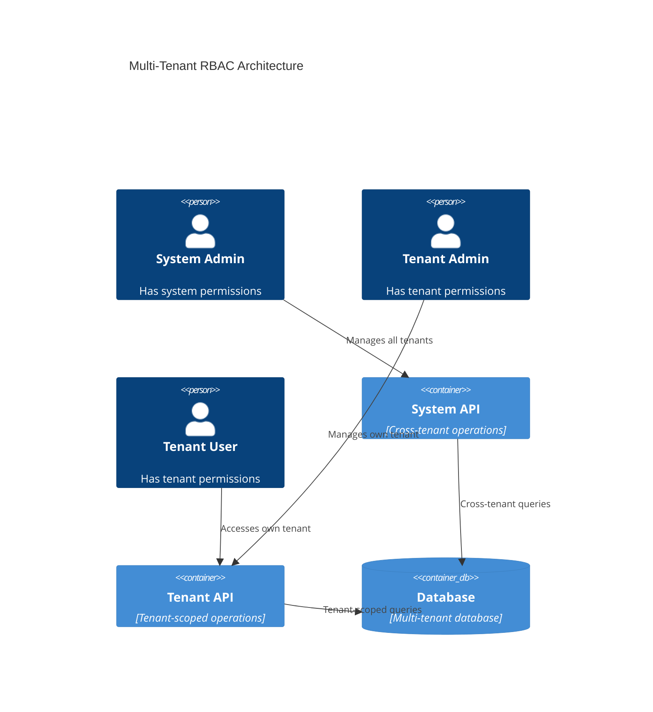
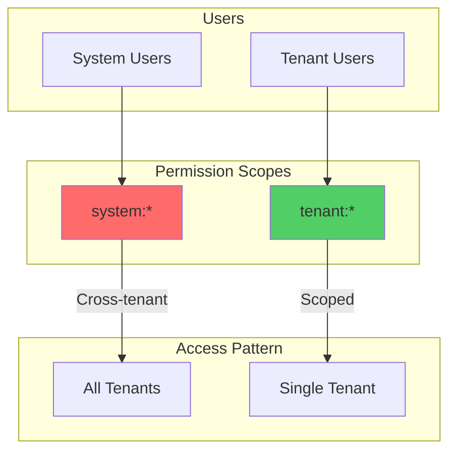
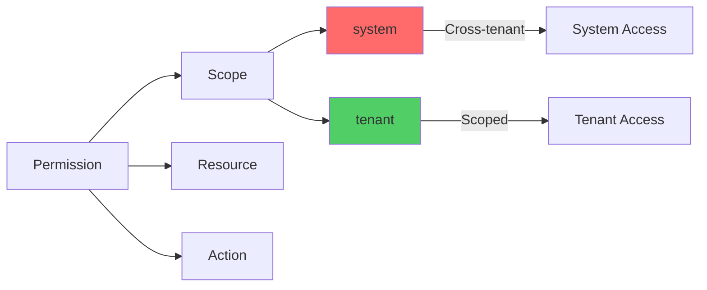
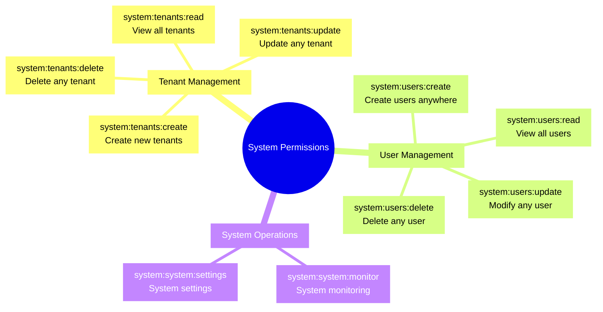
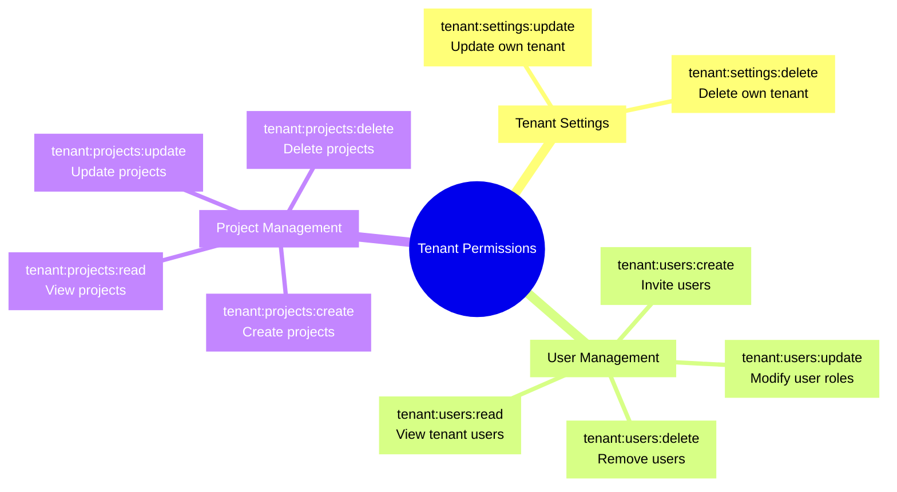
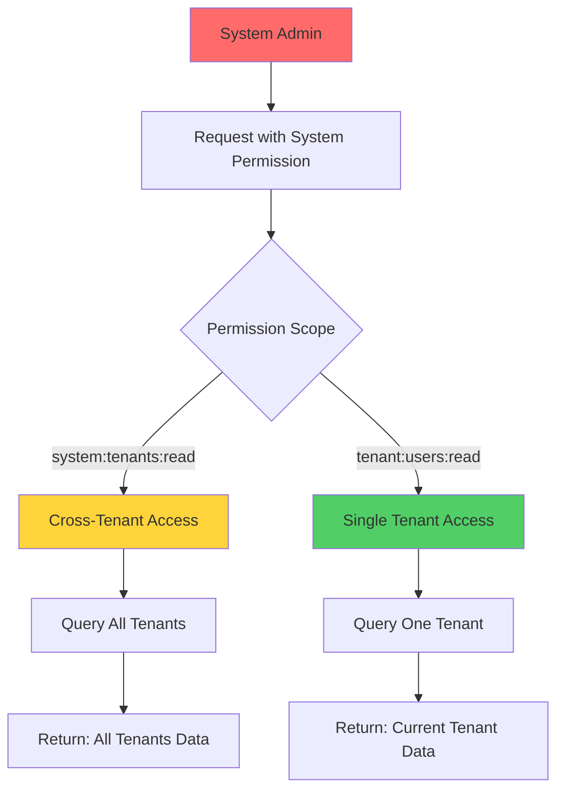
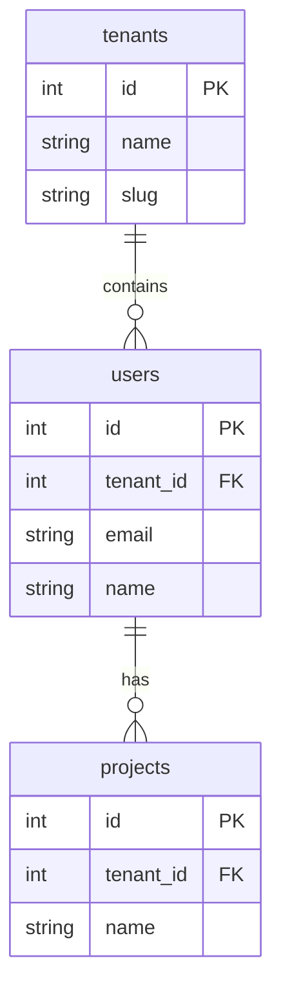
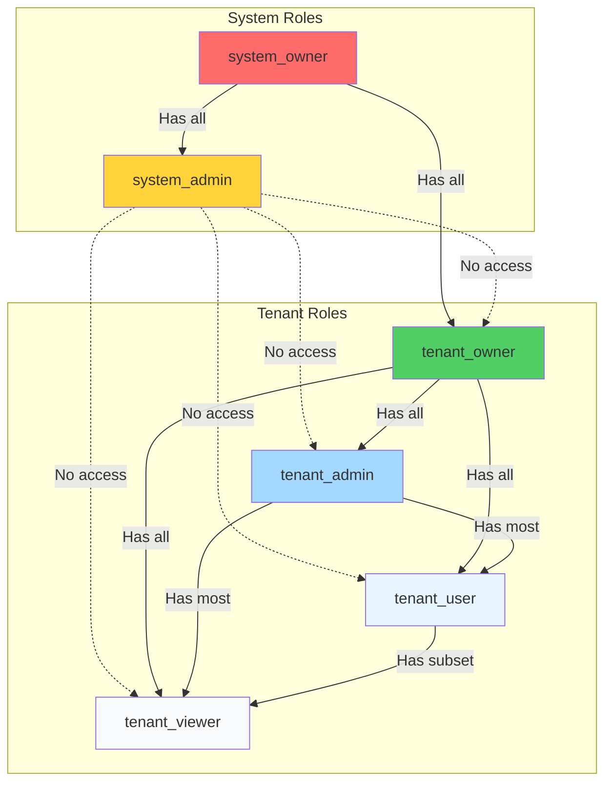

# Multi-Tenancy in RBAC

Complete guide to multi-tenant patterns in the RBAC system.

## Table of Contents

1. [Overview](#overview)
2. [Permission Scopes](#permission-scopes)
3. [System vs Tenant Permissions](#system-vs-tenant-permissions)
4. [Cross-Tenant Access](#cross-tenant-access)
5. [Tenant Isolation](#tenant-isolation)
6. [Best Practices](#best-practices)

## Overview

The RBAC system supports two distinct permission scopes that enable multi-tenant architecture while maintaining proper isolation.



### Scope Hierarchy



## Permission Scopes

### Scope Format

All permissions follow the format: `{scope}:{resource}:{action}`



### Scope Characteristics

| Scope    | Access        | Users        | Example                 |
| -------- | ------------- | ------------ | ----------------------- |
| `system` | Cross-tenant  | System roles | `system:tenants:create` |
| `tenant` | Single tenant | Tenant roles | `tenant:users:read`     |

### Permission Examples

```typescript
// System scope - Cross-tenant access
'system:tenants:create'; // Create any tenant
'system:tenants:read'; // View all tenants
'system:users:read'; // View users across all tenants
'system:system:monitor'; // Access system monitoring

// Tenant scope - Tenant-scoped access
'tenant:users:read'; // View users in current tenant
'tenant:projects:create'; // Create projects in current tenant
'tenant:settings:update'; // Update current tenant settings
```

## System vs Tenant Permissions

### System Permissions

**Purpose:** Administrative operations across all tenants.

**Granted to:** System roles (`system_owner`, `system_admin`)



**Usage Example:**

```typescript
import { Controller, Get, Post, Delete, UseGuards } from '@nestjs/common';
import { RequirePermissions } from '@package/auth';
import { SYSTEM_PERMISSIONS } from '@package/constants';
import { JwtAuthGuard } from '@package/auth';
import { EnhancedPermissionsGuard } from '@/modules/auth/guards';

@Controller('system/tenants')
@ApiBearerAuth()
@UseGuards(JwtAuthGuard, EnhancedPermissionsGuard)
export class SystemTenantsController {
  @Get()
  @RequirePermissions(SYSTEM_PERMISSIONS.TENANTS_READ)
  findAll() {
    // Access: View ALL tenants across system
    return this.queryBus.execute(new ListAllTenantsQuery());
  }

  @Post()
  @RequirePermissions(SYSTEM_PERMISSIONS.TENANTS_CREATE)
  create(@Body() dto: CreateTenantDto) {
    // Access: Create new tenant
    return this.commandBus.execute(new CreateTenantCommand(dto));
  }

  @Delete(':id')
  @RequirePermissions(SYSTEM_PERMISSIONS.TENANTS_DELETE)
  delete(@Param('id') id: string) {
    // Access: Delete any tenant
    return this.commandBus.execute(new DeleteTenantCommand(id));
  }
}
```

**Repository Implementation:**

```typescript
@Injectable()
export class TenantRepository extends BaseRepository {
  async findAllTenants(userContext?: RepositoryUserContext) {
    if (!userContext) {
      throw new ForbiddenException('User context required');
    }

    // Check system permission
    const hasPermission = await this.permissionService.hasPermission(
      parseInt(userContext.userId),
      0, // System tenant
      SYSTEM_PERMISSIONS.TENANTS_READ
    );

    if (!hasPermission) {
      throw new ForbiddenException('System permission required: system:tenants:read');
    }

    // Return all tenants (cross-tenant access)
    return await this.db.select().from(tenants);
  }
}
```

### Tenant Permissions

**Purpose:** Operations within a specific tenant.

**Granted to:** Tenant roles (`tenant_owner`, `tenant_admin`, `tenant_user`, `tenant_viewer`)



**Usage Example:**

```typescript
@Controller('users')
@ApiBearerAuth()
@UseGuards(JwtAuthGuard, EnhancedPermissionsGuard)
export class UsersController {
  @Get()
  @RequirePermissions(TENANT_PERMISSIONS.USERS_READ)
  findAll(@TenantId() tenantId: string) {
    // Access: View users in CURRENT TENANT only
    return this.queryBus.execute(new ListUsersQuery({ tenantId }));
  }

  @Post()
  @RequirePermissions(TENANT_PERMISSIONS.USERS_CREATE)
  create(@TenantId() tenantId: string, @Body() dto: CreateUserDto) {
    // Access: Create user in CURRENT TENANT only
    return this.commandBus.execute(
      new CreateUserCommand({
        tenantId,
        ...dto
      })
    );
  }
}
```

**Repository Implementation:**

```typescript
@Injectable()
export class UserRepository extends BaseRepository {
  async findAll(userContext?: RepositoryUserContext) {
    if (!userContext) {
      throw new ForbiddenException('User context required');
    }

    // Check tenant permission
    const hasPermission = await this.permissionService.hasPermission(
      parseInt(userContext.userId),
      parseInt(userContext.tenantId),
      TENANT_PERMISSIONS.USERS_READ
    );

    if (!hasPermission) {
      throw new ForbiddenException('Tenant permission required: tenant:users:read');
    }

    // Return users in CURRENT TENANT only
    return await this.db
      .select()
      .from(users)
      .where(eq(users.tenantId, parseInt(userContext.tenantId)));
  }
}
```

## Cross-Tenant Access

### What is Cross-Tenant Access?

Cross-tenant access occurs when a user with system permissions accesses data from multiple tenants.



### System Tenant Pattern

System users have `tenantId: 0` in the database:

```typescript
// System user (can access all tenants)
const systemUser = {
  id: 1,
  email: 'admin@system.com',
  tenantId: 0, // System tenant
  roles: ['system_owner']
};

// Regular user (can access only their tenant)
const regularUser = {
  id: 2,
  email: 'user@tenant1.com',
  tenantId: 1, // Specific tenant
  roles: ['tenant_admin']
};
```

### Cross-Tenant Authorization

```typescript
@Injectable()
export class CrossTenantRepository extends BaseRepository {
  async accessAnyTenant(targetTenantId: number, userContext?: RepositoryUserContext) {
    if (!userContext) {
      throw new ForbiddenException('User context required');
    }

    const userTenantId = parseInt(userContext.tenantId);

    // System users can access any tenant
    if (userTenantId === 0) {
      return await this.queryTenant(targetTenantId);
    }

    // Regular users can only access their own tenant
    if (userTenantId !== targetTenantId) {
      throw new ForbiddenException('Cannot access data from another tenant');
    }

    return await this.queryTenant(targetTenantId);
  }
}
```

## Tenant Isolation

### Database-Level Isolation

All tables include `tenant_id` column:



### Query-Level Isolation

All queries are scoped to tenant:

```typescript
@Injectable()
export class ProjectRepository extends BaseRepository {
  async findAll(userContext?: RepositoryUserContext) {
    if (!userContext) {
      throw new ForbiddenException('User context required');
    }

    // Always scope to tenant
    return await this.db
      .select()
      .from(projects)
      .where(eq(projects.tenantId, parseInt(userContext.tenantId)));
  }

  async findById(id: number, userContext?: RepositoryUserContext) {
    const result = await this.db
      .select()
      .from(projects)
      .where(and(eq(projects.id, id), eq(projects.tenantId, parseInt(userContext.tenantId))))
      .limit(1);

    return result[0] || null;
  }
}
```

### Cache-Level Isolation

Cache keys are tenant-prefixed:

```typescript
// Format: {tenantId}:{resource}:{key}
const cacheKey = `${tenantId}:user:${userId}`;
const cacheKey = `${tenantId}:permissions:${userId}`;

// Example
('1:user:123'); // Tenant 1's user
('2:user:456'); // Tenant 2's user (different key)
```

```typescript
@Injectable()
export class CacheService {
  async cacheUser(tenantId: string, userId: string, data: any) {
    const key = `${tenantId}:user:${userId}`;
    await this.redis.set(key, JSON.stringify(data), 'EX', 3600);
  }

  async getCachedUser(tenantId: string, userId: string) {
    const key = `${tenantId}:user:${userId}`;
    const data = await this.redis.get(key);
    return data ? JSON.parse(data) : null;
  }
}
```

## Permission Comparison

### System vs Tenant Permission Matrix

| Operation              | System Permission       | Tenant Permission        | Access                       |
| ---------------------- | ----------------------- | ------------------------ | ---------------------------- |
| View all tenants       | `system:tenants:read`   | ❌ Not available         | All tenants                  |
| Create tenant          | `system:tenants:create` | ❌ Not available         | System-wide                  |
| View all users         | `system:users:read`     | ❌ Not available         | All users                    |
| View tenant users      | ❌ Not available        | `tenant:users:read`      | Current tenant               |
| Create user in tenant  | ❌ Not available        | `tenant:users:create`    | Current tenant               |
| Update tenant settings | `system:tenants:update` | `tenant:settings:update` | System-wide / Current tenant |
| Delete tenant          | `system:tenants:delete` | `tenant:settings:delete` | System-wide / Current tenant |

### Role Comparison



## Usage Patterns

### Pattern 1: System Administration

```typescript
@Controller('system')
@UseGuards(JwtAuthGuard, EnhancedPermissionsGuard)
export class SystemController {
  @Get('tenants')
  @RequirePermissions(SYSTEM_PERMISSIONS.TENANTS_READ)
  getAllTenants() {
    // Cross-tenant access
    return this.queryBus.execute(new ListAllTenantsQuery());
  }

  @Post('tenants')
  @RequirePermissions(SYSTEM_PERMISSIONS.TENANTS_CREATE)
  createTenant(@Body() dto: CreateTenantDto) {
    // System-level operation
    return this.commandBus.execute(new CreateTenantCommand(dto));
  }

  @Get('users')
  @RequirePermissions(SYSTEM_PERMISSIONS.USERS_READ)
  getAllUsers() {
    // Cross-tenant user list
    return this.queryBus.execute(new ListAllUsersQuery());
  }
}
```

### Pattern 2: Tenant Administration

```typescript
@Controller('tenants')
@UseGuards(JwtAuthGuard, EnhancedPermissionsGuard)
export class TenantsController {
  @Get('settings')
  @RequirePermissions(TENANT_PERMISSIONS.SETTINGS_UPDATE)
  getSettings(@TenantId() tenantId: string) {
    // Tenant-scoped access
    return this.queryBus.execute(new GetTenantSettingsQuery({ tenantId }));
  }

  @Patch('settings')
  @RequirePermissions(TENANT_PERMISSIONS.SETTINGS_UPDATE)
  updateSettings(@TenantId() tenantId: string, @Body() dto: UpdateSettingsDto) {
    // Tenant-scoped update
    return this.commandBus.execute(
      new UpdateTenantSettingsCommand({
        tenantId,
        settings: dto
      })
    );
  }
}
```

### Pattern 3: Mixed Access

```typescript
@Controller('users')
@UseGuards(JwtAuthGuard, EnhancedPermissionsGuard)
export class UsersController {
  @Get('system-all')
  @RequirePermissions(SYSTEM_PERMISSIONS.USERS_READ)
  getAllUsersSystem() {
    // System: All users across all tenants
    return this.queryBus.execute(new ListAllUsersQuery());
  }

  @Get('tenant-users')
  @RequirePermissions(TENANT_PERMISSIONS.USERS_READ)
  getTenantUsers(@TenantId() tenantId: string) {
    // Tenant: Only users in current tenant
    return this.queryBus.execute(new ListUsersQuery({ tenantId }));
  }
}
```

## Best Practices

### 1. Always Scope Queries to Tenant

```typescript
// Good - tenant-scoped query
async findAll(userContext?: RepositoryUserContext) {
  return await this.db
    .select()
    .from(users)
    .where(
      eq(users.tenantId, parseInt(userContext.tenantId)),
    );
}

// Bad - returns all users (cross-tenant leak)
async findAll() {
  return await this.db.select().from(users);
}
```

### 2. Use Tenant-Prefixed Cache Keys

```typescript
// Good - tenant-isolated cache
const key = `${tenantId}:user:${userId}`;

// Bad - global cache (cross-tenant leak)
const key = `user:${userId}`;
```

### 3. Check Cross-Tenant Access Explicitly

```typescript
// Good - explicit cross-tenant check
const userTenantId = parseInt(userContext.tenantId);
const isSystemUser = userTenantId === 0;

if (!isSystemUser && userTenantId !== targetTenantId) {
  throw new ForbiddenException('Cannot access another tenant');
}

// Bad - no cross-tenant check
const data = await this.db.select().from(tenants).where(eq(tenants.id, targetTenantId));
```

### 4. Use Correct Permission Scope

```typescript
// Good - correct scope for system operations
@RequirePermissions(SYSTEM_PERMISSIONS.TENANTS_READ)

// Good - correct scope for tenant operations
@RequirePermissions(TENANT_PERMISSIONS.USERS_READ)

// Bad - wrong scope
@RequirePermissions(TENANT_PERMISSIONS.TENANTS_READ)  // Doesn't exist
```

### 5. Document Permission Scope Requirements

```typescript
/**
 * List all tenants in the system.
 *
 * @requires system:tenants:read
 * @scope Cross-tenant access
 * @returns All tenants across system
 */
@Get('tenants')
@RequirePermissions(SYSTEM_PERMISSIONS.TENANTS_READ)
getAllTenants() {
  // Implementation
}
```

## Documentation References

- [Overview](./overview.md) - RBAC architecture overview
- [Permissions](./permissions.md) - Permission system reference
- [Roles](./roles.md) - Role hierarchy and mapping
- [Guards](./guards.md) - EnhancedPermissionsGuard details
- [Repository-Level](./repository-level.md) - Data-layer authorization
