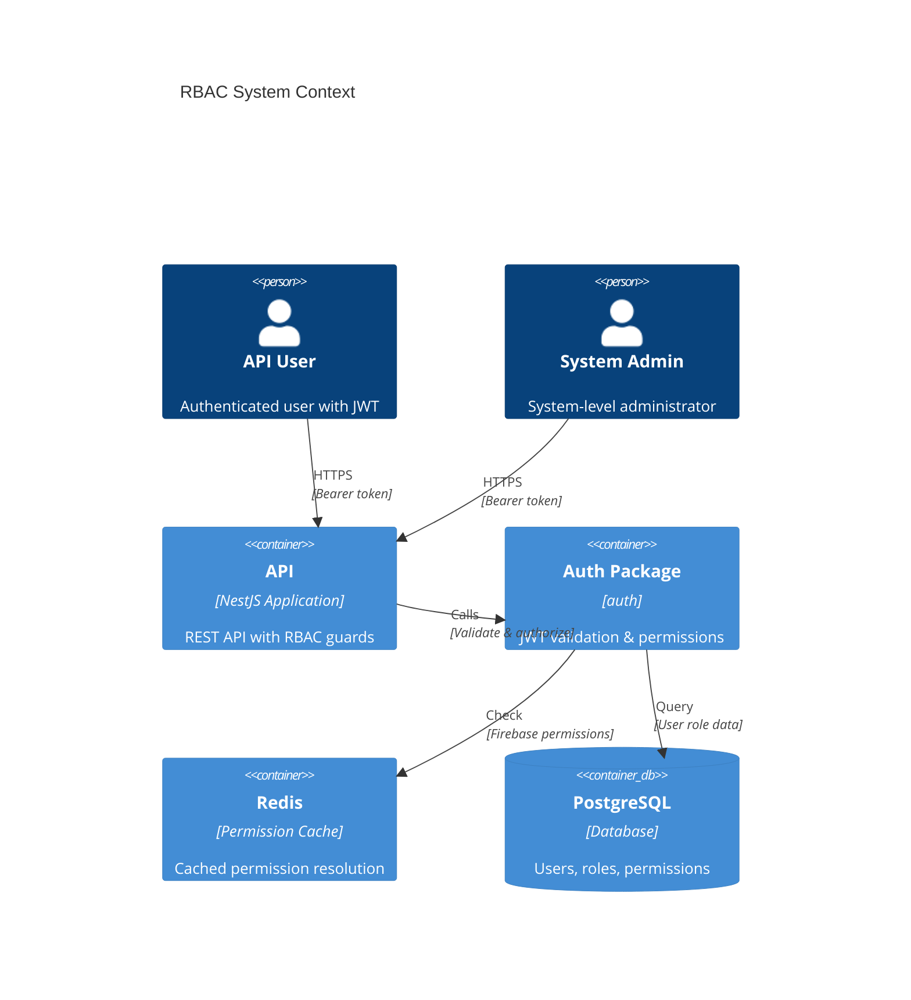
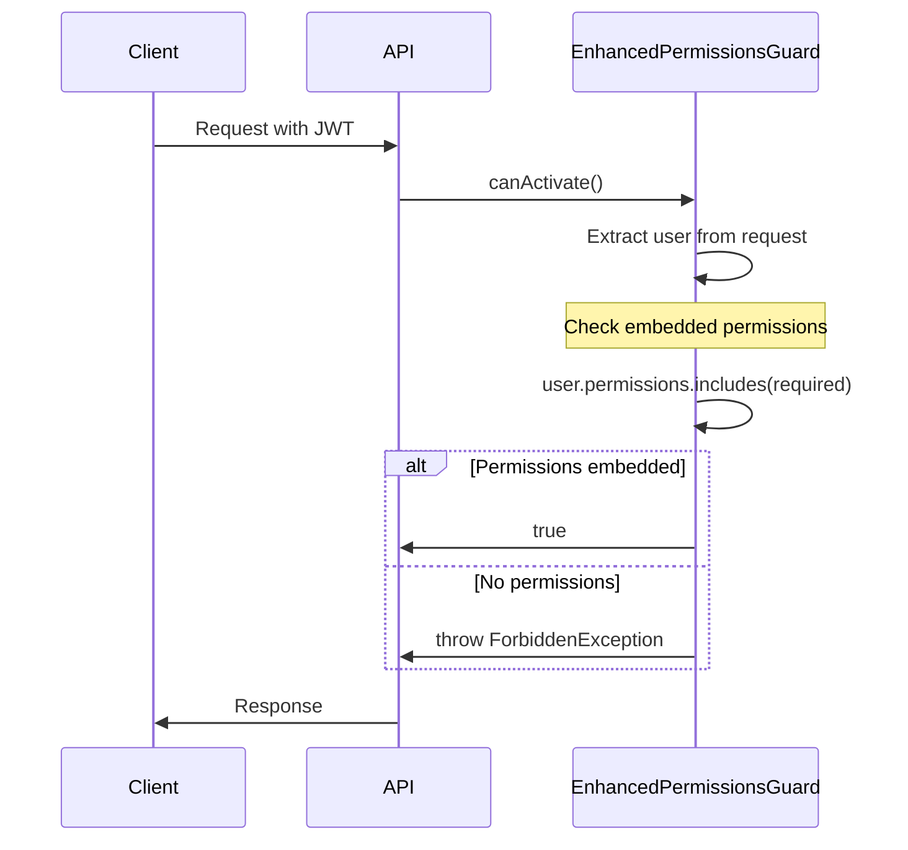
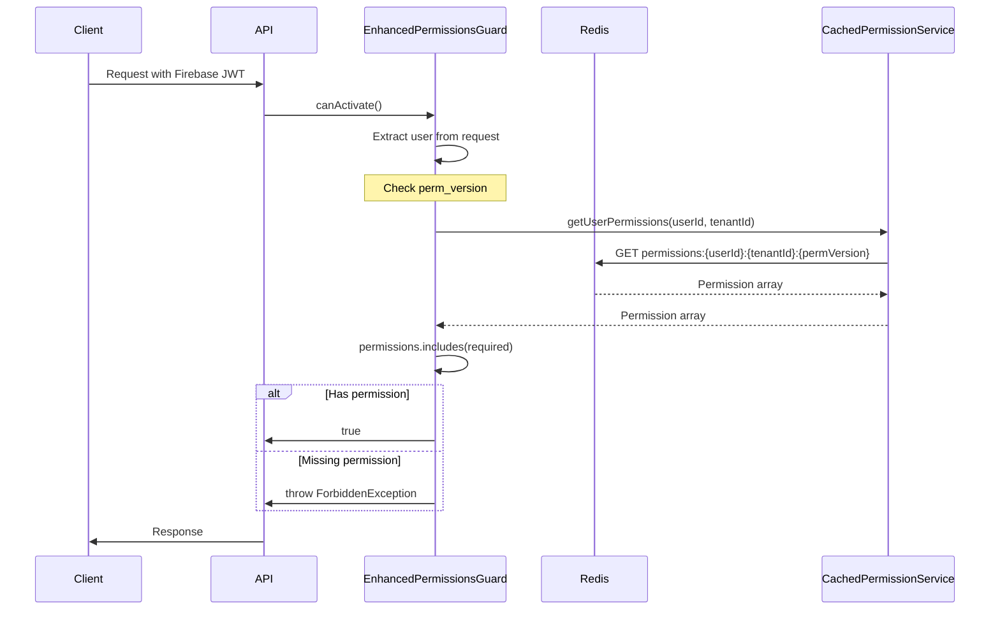
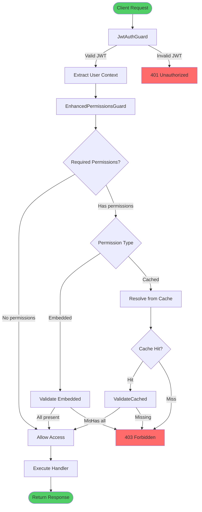
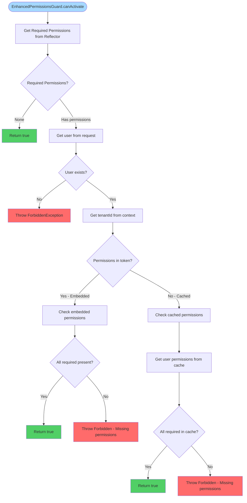
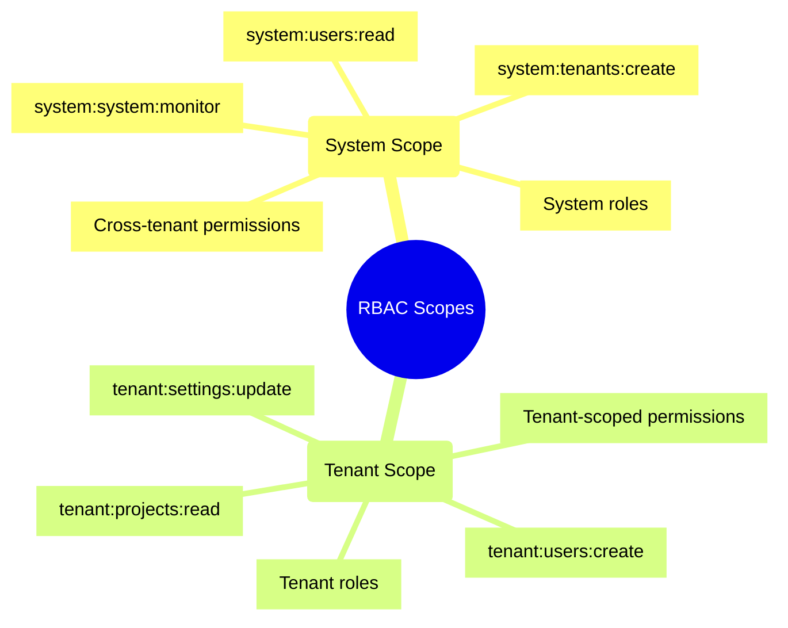
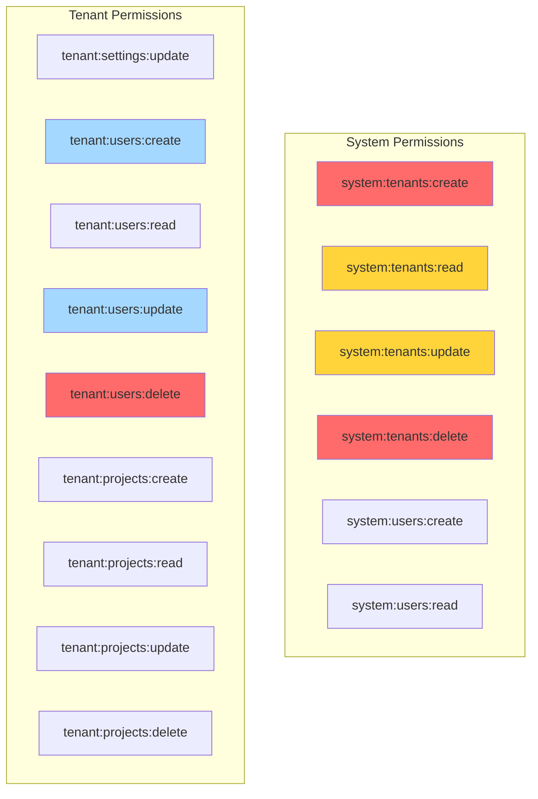
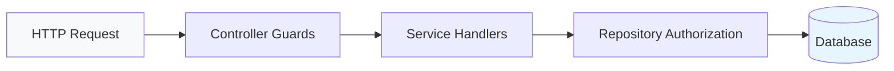
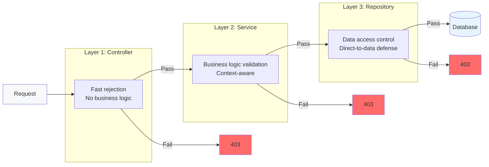

# RBAC Overview

Comprehensive overview of the Role-Based Access Control system in the Node Monorepo Boilerplate API.

## Table of Contents

1. [Architecture](#architecture)
2. [Dual-Provider Support](#dual-provider-support)
3. [Authorization Flow](#authorization-flow)
4. [Permission Model](#permission-model)
5. [Defense in Depth](#defense-in-depth)

## Architecture



### Component Diagram

```mermaid
C4Component
    title RBAC Component Architecture
    Container(api, "API", "NestJS")

    Component(guard, "EnhancedPermissionsGuard", "NestJS Guard", "Authorization entry point")
    Component(provider, "Auth Provider", "Strategy", "JWT validation & user extraction")
    Component(service, "CachedPermissionService", "Service", "Permission resolution")
    Component(mock, "NoOpPermissionService", "Mock", "Test permission service")

    Rel(api, guard, "Uses", "Protect routes")
    Rel(guard, provider, "Extracts", "User from request")
    Rel(guard, service, "Checks", "Has permission")
    Rel(service, cache, "Queries", "Cached permissions")
    Rel(service, db, "Queries", "User roles")
```

## Dual-Provider Support

The RBAC system supports two authentication providers with different permission resolution strategies:

### Custom JWT Provider



**Characteristics:**

- Permissions embedded in JWT access token
- No cache lookup required
- Faster authorization (single token validation)
- Token size increases with permission count

**JWT Payload Structure:**

```typescript
{
  "sub": "user-123",
  "tenant_id": "tenant-456",
  "actor_id": "user-123",
  "roles": ["tenant_admin"],
  "permissions": [
    "tenant:users:read",
    "tenant:users:create",
    "tenant:users:update"
  ]
}
```

### Firebase/Google Identity Platform Provider



**Characteristics:**

- Permissions stored in Redis cache
- `perm_version` in token for cache invalidation
- Requires cache lookup on each request
- Smaller token size (permissions not embedded)

**Firebase Custom Claims Structure:**

```typescript
{
  "sub": "firebase-uid-123",
  "tenant_id": "tenant-456",
  "actor_id": "firebase-uid-123",
  "roles": ["tenant_admin"],
  "perm_version": "v1"
}
```

## Authorization Flow

### Complete Request Flow



### Permission Resolution Logic



## Permission Model

### Permission Format

Permissions follow a hierarchical format:

```
{scope}:{resource}:{action}
```

**Components:**

| Part       | Description               | Values                                     |
| ---------- | ------------------------- | ------------------------------------------ |
| `scope`    | Permission scope          | `system`, `tenant`                         |
| `resource` | Entity being operated on  | `tenants`, `users`, `projects`, `settings` |
| `action`   | Operation being performed | `create`, `read`, `update`, `delete`       |

### Scope Types



**System Permissions** (`system:*`):

- Apply across all tenants
- Granted to users with system roles
- Used for administrative operations

**Tenant Permissions** (`tenant:*`):

- Apply within a specific tenant
- Granted to users with tenant roles
- Used for tenant-scoped operations

### Permission Hierarchy



## Defense in Depth

The RBAC system implements defense-in-depth with authorization checks at multiple layers:



### Layer 1: Controller Guards

**Purpose:** First line of defense - reject unauthorized requests early

**Implementation:** `EnhancedPermissionsGuard`

```typescript
@Controller('users')
@ApiBearerAuth()
@UseGuards(JwtAuthGuard, EnhancedPermissionsGuard)
export class UsersController {
  @RequirePermissions(TENANT_PERMISSIONS.USERS_READ)
  findAll() {
    return this.usersService.findAll();
  }
}
```

### Layer 2: Service Handlers

**Purpose:** Business logic authorization - validate permissions for operations

**Implementation:** Permission checks in command/query handlers

```typescript
@CommandHandler(CreateUserCommand)
export class CreateUserHandler implements ICommandHandler<CreateUserCommand> {
  async execute(command: CreateUserCommand) {
    // Authorization check
    const hasPermission = await this.permissionService.hasPermission(
      command.actorId,
      command.tenantId,
      TENANT_PERMISSIONS.USERS_CREATE
    );

    if (!hasPermission) {
      throw new ForbiddenException('Insufficient permissions');
    }

    // Business logic
    return await this.repository.create(command.data);
  }
}
```

### Layer 3: Repository Authorization

**Purpose:** Data-layer defense - prevent unauthorized data access

**Implementation:** Authorization methods in repositories

```typescript
@Injectable()
export class UserRepository extends BaseRepository {
  async delete(id: number, userContext?: RepositoryUserContext) {
    // Authorization check before deletion
    await this.authorizeDelete(userContext, id);

    return await this.db.delete(users).where(eq(users.id, id));
  }

  private async authorizeDelete(
    userContext: RepositoryUserContext | undefined,
    targetUserId: number
  ): Promise<void> {
    if (!userContext) return;

    const { userId, tenantId } = userContext;

    // Rule 1: Self-access
    if (userId === targetUserId.toString()) return;

    // Rule 2: Tenant permission
    const hasPermission = await this.permissionService.hasPermission(
      parseInt(userId),
      parseInt(tenantId),
      TENANT_PERMISSIONS.USERS_DELETE
    );

    if (!hasPermission) {
      throw new ForbiddenException('Insufficient permissions');
    }
  }
}
```

### Authorization Comparison



## Configuration

### Environment Variables

```bash
# Authentication Provider
AUTH_PROVIDER=custom-jwt  # Options: custom-jwt, google-identity-platform

# Custom JWT Provider
JWT_SECRET=your-secret-key
JWT_EXPIRES_IN=1h
JWT_REFRESH_EXPIRES_IN=7d

# Firebase/Google Identity Platform
GCP_PROJECT_ID=your-project
GCP_API_KEY=your-api-key
GCP_TENANT_ID=your-tenant

# Redis (for Firebase permission caching)
REDIS_HOST=localhost
REDIS_PORT=6379
REDIS_PASSWORD=
```

### Module Configuration

```typescript
import { AuthModule } from '@package/auth';

@Module({
  imports: [
    AuthModule.forRoot({
      provider: 'custom-jwt', // or 'google-identity-platform'
      jwt: {
        secret: process.env.JWT_SECRET,
        expiresIn: process.env.JWT_EXPIRES_IN
      },
      redis: {
        host: process.env.REDIS_HOST,
        port: parseInt(process.env.REDIS_PORT)
      }
    })
  ]
})
export class AppModule {}
```

## Next Steps

- [Permissions Reference](./permissions.md) - Complete permission list
- [Roles](./roles.md) - Role hierarchy and mapping
- [Guards](./guards.md) - EnhancedPermissionsGuard details
- [Decorators](./decorators.md) - Using RBAC decorators
- [Repository-Level](./repository-level.md) - Data-layer authorization
- [Testing](./testing.md) - Testing RBAC features
