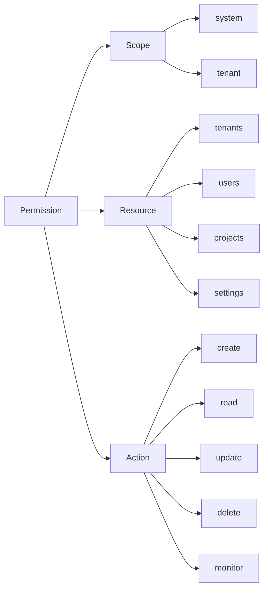
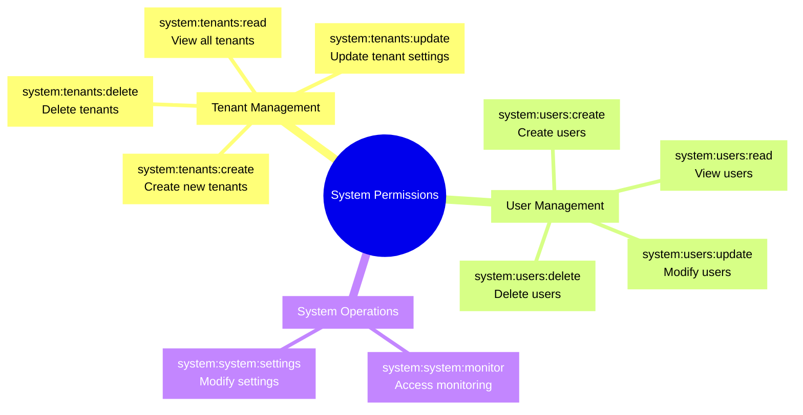
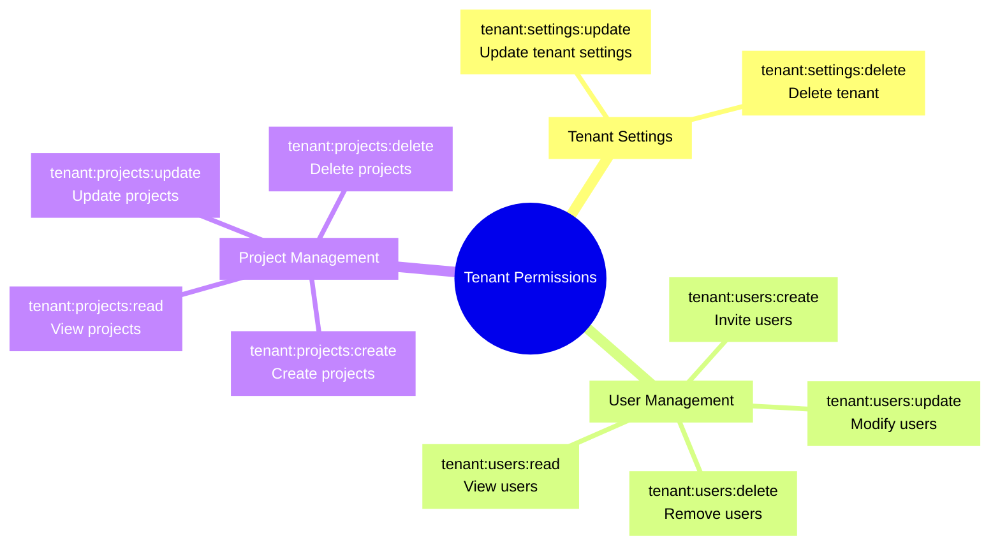

# Permissions Reference

Complete reference for all permissions in the RBAC system.

## Table of Contents

1. [Permission Format](#permission-format)
2. [System Permissions](#system-permissions)
3. [Tenant Permissions](#tenant-permissions)
4. [Usage Examples](#usage-examples)
5. [Constants Reference](#constants-reference)

## Permission Format

All permissions follow the format: `{scope}:{resource}:{action}`



### Components

| Component    | Description               | Valid Values                                    |
| ------------ | ------------------------- | ----------------------------------------------- |
| **Scope**    | Permission boundary       | `system`, `tenant`                              |
| **Resource** | Entity being operated on  | `tenants`, `users`, `projects`, `settings`      |
| **Action**   | Operation being performed | `create`, `read`, `update`, `delete`, `monitor` |

### Examples

```
system:tenants:create     - Create any tenant (system scope)
tenant:users:read        - Read users in current tenant (tenant scope)
tenant:projects:update  - Update projects in current tenant (tenant scope)
system:system:monitor    - Access system monitoring (system scope)
```

## System Permissions

System permissions apply across all tenants and are granted to users with system roles.



### Tenant Management Permissions

| Permission              | Constant                            | Description            | Role                           |
| ----------------------- | ----------------------------------- | ---------------------- | ------------------------------ |
| `system:tenants:create` | `SYSTEM_PERMISSIONS.TENANTS_CREATE` | Create new tenants     | `system_owner`                 |
| `system:tenants:read`   | `SYSTEM_PERMISSIONS.TENANTS_READ`   | View all tenants       | `system_admin`, `system_owner` |
| `system:tenants:update` | `SYSTEM_PERMISSIONS.TENANTS_UPDATE` | Update tenant settings | `system_owner`                 |
| `system:tenants:delete` | `SYSTEM_PERMISSIONS.TENANTS_DELETE` | Delete tenants         | `system_owner`                 |

Admin note:

- read-only admin tenant inventory routes reuse `system:tenants:read`
- no separate admin-specific tenant-read permission is required

### User Management Permissions

| Permission            | Constant                          | Description                | Role                           |
| --------------------- | --------------------------------- | -------------------------- | ------------------------------ |
| `system:users:create` | `SYSTEM_PERMISSIONS.USERS_CREATE` | Create users across system | `system_admin`, `system_owner` |
| `system:users:read`   | `SYSTEM_PERMISSIONS.USERS_READ`   | View users across system   | `system_admin`, `system_owner` |
| `system:users:update` | `SYSTEM_PERMISSIONS.USERS_UPDATE` | Modify users across system | `system_admin`, `system_owner` |
| `system:users:delete` | `SYSTEM_PERMISSIONS.USERS_DELETE` | Delete users across system | `system_owner`                 |

Admin note:

- read-only admin access inventory routes reuse `system:users:read`
- no separate admin-specific access-read permission is required

### System Operation Permissions

| Permission               | Constant                             | Description              | Role                           |
| ------------------------ | ------------------------------------ | ------------------------ | ------------------------------ |
| `system:system:monitor`  | `SYSTEM_PERMISSIONS.SYSTEM_MONITOR`  | Access system monitoring | `system_admin`, `system_owner` |
| `system:system:settings` | `SYSTEM_PERMISSIONS.SYSTEM_SETTINGS` | Modify system settings   | `system_owner`                 |

Admin note:

- read-only admin health, statistics, and inbox routes reuse `system:system:monitor`
- admin settings continues to reuse the existing system/tenant settings permissions instead of introducing a parallel permission namespace

## Tenant Permissions

Tenant permissions apply within a specific tenant and are granted to users with tenant roles.



### Tenant Settings Permissions

| Permission               | Constant                             | Description            | Role                           |
| ------------------------ | ------------------------------------ | ---------------------- | ------------------------------ |
| `tenant:settings:update` | `TENANT_PERMISSIONS.SETTINGS_UPDATE` | Update tenant settings | `tenant_owner`, `tenant_admin` |
| `tenant:settings:delete` | `TENANT_PERMISSIONS.SETTINGS_DELETE` | Delete tenant          | `tenant_owner`                 |

### User Management Permissions

| Permission            | Constant                          | Description              | Role                                                           |
| --------------------- | --------------------------------- | ------------------------ | -------------------------------------------------------------- |
| `tenant:users:create` | `TENANT_PERMISSIONS.USERS_CREATE` | Invite users to tenant   | `tenant_admin`, `tenant_owner`                                 |
| `tenant:users:read`   | `TENANT_PERMISSIONS.USERS_READ`   | View tenant users        | `tenant_user`, `tenant_admin`, `tenant_viewer`, `tenant_owner` |
| `tenant:users:update` | `TENANT_PERMISSIONS.USERS_UPDATE` | Modify user roles        | `tenant_admin`, `tenant_owner`                                 |
| `tenant:users:delete` | `TENANT_PERMISSIONS.USERS_DELETE` | Remove users from tenant | `tenant_owner`                                                 |

### Project Management Permissions

| Permission               | Constant                             | Description     | Role                                                           |
| ------------------------ | ------------------------------------ | --------------- | -------------------------------------------------------------- |
| `tenant:projects:create` | `TENANT_PERMISSIONS.PROJECTS_CREATE` | Create projects | `tenant_user`, `tenant_admin`, `tenant_owner`                  |
| `tenant:projects:read`   | `TENANT_PERMISSIONS.PROJECTS_READ`   | View projects   | `tenant_user`, `tenant_admin`, `tenant_viewer`, `tenant_owner` |
| `tenant:projects:update` | `TENANT_PERMISSIONS.PROJECTS_UPDATE` | Update projects | `tenant_user`, `tenant_admin`, `tenant_owner`                  |
| `tenant:projects:delete` | `TENANT_PERMISSIONS.PROJECTS_DELETE` | Delete projects | `tenant_admin`, `tenant_owner`                                 |

## Usage Examples

### Importing Permissions

```typescript
import { SYSTEM_PERMISSIONS, TENANT_PERMISSIONS } from '@package/constants';
```

### Using in Controllers

```typescript
import { Controller, Get, Post, UseGuards } from '@nestjs/common';
import { RequirePermissions } from '@package/auth';
import { SYSTEM_PERMISSIONS, TENANT_PERMISSIONS } from '@package/constants';
import { EnhancedPermissionsGuard } from '@/modules/auth/guards';

@Controller('system/tenants')
@ApiBearerAuth()
@UseGuards(JwtAuthGuard, EnhancedPermissionsGuard)
export class SystemTenantsController {
  @Get()
  @RequirePermissions(SYSTEM_PERMISSIONS.TENANTS_READ)
  findAll() {
    return { message: 'Requires system:tenants:read' };
  }

  @Post()
  @RequirePermissions(SYSTEM_PERMISSIONS.TENANTS_CREATE)
  create() {
    return { message: 'Requires system:tenants:create' };
  }
}
```

### Using in Services

```typescript
import { Injectable } from '@nestjs/common';
import { CachedPermissionService } from '@package/auth';
import { TENANT_PERMISSIONS } from '@package/constants';

@Injectable()
export class UserService {
  constructor(private permissionService: CachedPermissionService) {}

  async deleteUser(userId: string, actorId: string, tenantId: string) {
    // Check permission before deletion
    const hasPermission = await this.permissionService.hasPermission(
      parseInt(actorId),
      parseInt(tenantId),
      TENANT_PERMISSIONS.USERS_DELETE
    );

    if (!hasPermission) {
      throw new ForbiddenException('Insufficient permissions');
    }

    // Proceed with deletion
    return await this.repository.delete(userId);
  }
}
```

### Using in Repositories

```typescript
import { Injectable } from '@nestjs/common';
import { CachedPermissionService } from '@package/auth';
import { TENANT_PERMISSIONS } from '@package/constants';

@Injectable()
export class UserRepository extends BaseRepository {
  constructor(
    @Inject(MAIN_DB) db: NodePgDatabase,
    @Optional() private permissionService: CachedPermissionService
  ) {
    super(db);
  }

  async delete(id: number, userContext?: RepositoryUserContext) {
    await this.authorizeDelete(userContext, id);
    return await this.db.delete(users).where(eq(users.id, id));
  }

  private async authorizeDelete(
    userContext: RepositoryUserContext | undefined,
    targetUserId: number
  ): Promise<void> {
    if (!userContext) return;

    const hasPermission = await this.permissionService.hasPermission(
      parseInt(userContext.userId),
      parseInt(userContext.tenantId),
      TENANT_PERMISSIONS.USERS_DELETE
    );

    if (!hasPermission) {
      throw new ForbiddenException('Insufficient permissions');
    }
  }
}
```

## Constants Reference

### Import Location

```typescript
import { SYSTEM_PERMISSIONS, TENANT_PERMISSIONS } from '@package/constants';
```

### Type Definition

```typescript
export const SYSTEM_PERMISSIONS = {
  TENANTS_CREATE: 'system:tenants:create',
  TENANTS_READ: 'system:tenants:read',
  TENANTS_UPDATE: 'system:tenants:update',
  TENANTS_DELETE: 'system:tenants:delete',
  USERS_CREATE: 'system:users:create',
  USERS_READ: 'system:users:read',
  USERS_UPDATE: 'system:users:update',
  USERS_DELETE: 'system:users:delete',
  SYSTEM_MONITOR: 'system:system:monitor',
  SYSTEM_SETTINGS: 'system:system:settings'
} as const;

export const TENANT_PERMISSIONS = {
  SETTINGS_UPDATE: 'tenant:settings:update',
  SETTINGS_DELETE: 'tenant:settings:delete',
  USERS_CREATE: 'tenant:users:create',
  USERS_READ: 'tenant:users:read',
  USERS_UPDATE: 'tenant:users:update',
  USERS_DELETE: 'tenant:users:delete',
  PROJECTS_CREATE: 'tenant:projects:create',
  PROJECTS_READ: 'tenant:projects:read',
  PROJECTS_UPDATE: 'tenant:projects:update',
  PROJECTS_DELETE: 'tenant:projects:delete'
} as const;
```

### Type Extraction

```typescript
import type Permission } from '@package/constants';

// Type is a union of all permission string literals
type Permission = 'system:tenants:create' | 'system:tenants:read' | ...;
```

## Next Steps

- [Roles](./roles.md) - Role hierarchy and which roles grant which permissions
- [Guards](./guards.md) - How EnhancedPermissionsGuard validates permissions
- [Decorators](./decorators.md) - Using @RequirePermissions decorator
