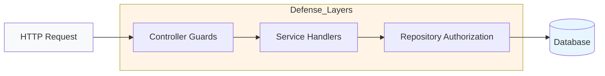
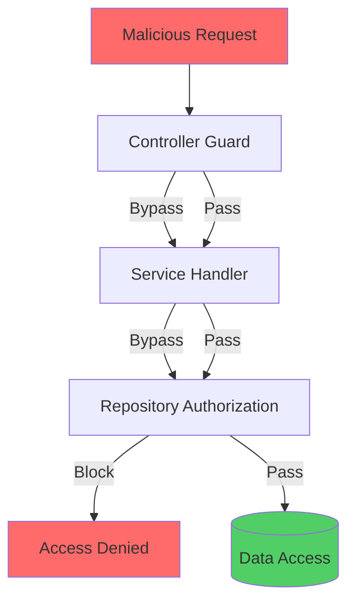

# Repository-Level Authorization

Complete guide to implementing defense-in-depth authorization at the repository layer.

## Table of Contents

1. [Overview](#overview)
2. [BaseRepository Pattern](#baserepository-pattern)
3. [Authorization Methods](#authorization-methods)
4. [Common Authorization Rules](#common-authorization-rules)
5. [Testing with NoOpPermissionService](#testing-with-nooppermissionservice)
6. [Best Practices](#best-practices)

## Overview

Repository-level authorization provides the final layer of defense in the RBAC system, ensuring unauthorized data access is prevented even if controller and service checks are bypassed.



### Why Repository-Level Authorization?

**Defense in Depth:**



**Benefits:**

1. **Data-layer protection** - Direct-to-data defense
2. **Self-access rules** - Users can access their own data
3. **Context-aware checks** - Authorization based on business logic
4. **Testable isolation** - Unit testable without full stack

## BaseRepository Pattern

### RepositoryUserContext

All repository methods receive an optional `RepositoryUserContext`:

```typescript
interface RepositoryUserContext {
  userId: string; // User ID from JWT
  tenantId: string; // Tenant ID from JWT
  actorId: string; // Actor ID (same as userId)
}
```

### Extending BaseRepository

```typescript
import { Injectable } from '@nestjs/common';
import { BaseRepository } from '@package/foundation-repositories';
import { Inject } from '@nestjs/common';
import { MAIN_DB } from '@package/tokens';
import type { NodePgDatabase } from 'drizzle-orm/node-postgres';
import { CachedPermissionService } from '@package/auth';
import { Optional } from '@nestjs/common';

@Injectable()
export class UserRepository extends BaseRepository {
  constructor(
    @Inject(MAIN_DB) db: NodePgDatabase,
    @Optional() private permissionService: CachedPermissionService
  ) {
    super(db);
  }

  async delete(id: number, userContext?: RepositoryUserContext) {
    // Authorization check before deletion
    await this.authorizeDelete(userContext, id);

    return await this.db.delete(users).where(eq(users.id, id));
  }

  private async authorizeDelete(
    userContext: RepositoryUserContext | undefined,
    targetUserId: number
  ): Promise<void> {
    if (!userContext) return;

    const { userId, tenantId } = userContext;

    // Rule 1: Self-access
    if (userId === targetUserId.toString()) return;

    // Rule 2: Tenant permission
    const hasPermission = await this.permissionService.hasPermission(
      parseInt(userId),
      parseInt(tenantId),
      TENANT_PERMISSIONS.USERS_DELETE
    );

    if (!hasPermission) {
      throw new ForbiddenException('Insufficient permissions');
    }
  }
}
```

### Optional PermissionService

The `CachedPermissionService` is marked as `@Optional()` to support:

1. **Unit testing** without permission service
2. **Background jobs** without user context
3. **Migrations** and admin operations

```typescript
// In tests
const mockPermissionService = {
  hasPermission: jest.fn().mockResolvedValue(true)
};

const repository = new UserRepository(db, mockPermissionService);

// In production
const repository = new UserRepository(db, permissionService);
```

## Authorization Methods

### Method 1: Pre-Operation Authorization

Authorization checks **before** the data operation:

```typescript
async update(
  id: number,
  data: UpdateUserDto,
  userContext?: RepositoryUserContext,
) {
  // Check authorization first
  await this.authorizeUpdate(userContext, id);

  // Then perform operation
  return await this.db
    .update(users)
    .set(data)
    .where(eq(users.id, id));
}

private async authorizeUpdate(
  userContext: RepositoryUserContext | undefined,
  targetUserId: number,
): Promise<void> {
  if (!userContext) return;

  const { userId, tenantId } = userContext;

  // Self-access rule
  if (userId === targetUserId.toString()) return;

  // Permission check
  const hasPermission = await this.permissionService.hasPermission(
    parseInt(userId),
    parseInt(tenantId),
    TENANT_PERMISSIONS.USERS_UPDATE,
  );

  if (!hasPermission) {
    throw new ForbiddenException('Insufficient permissions');
  }
}
```

### Method 2: Query Filtering

Filter query results based on user context:

```typescript
async findAll(
  userContext?: RepositoryUserContext,
): Promise<User[]> {
  if (!userContext) {
    // No context - return only active users in system tenant
    return await this.db
      .select()
      .from(users)
      .where(eq(users.tenantId, 0));
  }

  // With context - scope to tenant
  return await this.db
    .select()
    .from(users)
    .where(
      and(
        eq(users.tenantId, parseInt(userContext.tenantId)),
        eq(users.status, 'active'),
      ),
    );
}
```

### Method 3: Hybrid Approach

Combine pre-operation checks with query filtering:

```typescript
async findSensitiveData(
  id: number,
  userContext?: RepositoryUserContext,
): Promise<SensitiveData | null> {
  if (!userContext) {
    throw new ForbiddenException('User context required');
  }

  // Check permission first
  const hasPermission = await this.permissionService.hasPermission(
    parseInt(userContext.userId),
    parseInt(userContext.tenantId),
    TENANT_PERMISSIONS.SENSITIVE_DATA_READ,
  );

  if (!hasPermission) {
    throw new ForbiddenException(
      'Insufficient permissions for sensitive data',
    );
  }

  // Then query
  const results = await this.db
    .select()
    .from(sensitiveData)
    .where(eq(sensitiveData.id, id))
    .limit(1);

  return results[0] || null;
}
```

## Common Authorization Rules

### Rule 1: Self-Access

Users can always access their own data:

```typescript
private async authorizeAccess(
  userContext: RepositoryUserContext | undefined,
  targetUserId: number,
): Promise<void> {
  if (!userContext) return;

  // Self-access rule
  if (userContext.userId === targetUserId.toString()) {
    return;  // Allow
  }

  // Otherwise, check permission
  const hasPermission = await this.permissionService.hasPermission(
    parseInt(userContext.userId),
    parseInt(userContext.tenantId),
    TENANT_PERMISSIONS.USERS_READ,
  );

  if (!hasPermission) {
    throw new ForbiddenException('Insufficient permissions');
  }
}
```

### Rule 2: Tenant Ownership

Tenant owners have full access within their tenant:

```typescript
private async authorizeTenantAccess(
  userContext: RepositoryUserContext | undefined,
): Promise<void> {
  if (!userContext) return;

  // Check if user is tenant owner
  const isOwner = await this.permissionService.hasRole(
    parseInt(userContext.userId),
    parseInt(userContext.tenantId),
    TENANT_ROLE.OWNER,
  );

  if (isOwner) {
    return;  // Allow full access
  }

  // Otherwise, check specific permission
  const hasPermission = await this.permissionService.hasPermission(
    parseInt(userContext.userId),
    parseInt(userContext.tenantId),
    TENANT_PERMISSIONS.SETTINGS_UPDATE,
  );

  if (!hasPermission) {
    throw new ForbiddenException(
      'Only tenant owners can update settings',
    );
  }
}
```

### Rule 3: Cross-Tenant Access Prevention

Prevent users from accessing other tenants' data:

```typescript
async findById(
  id: number,
  userContext?: RepositoryUserContext,
): Promise<User | null> {
  const results = await this.db
    .select()
    .from(users)
    .where(eq(users.id, id))
    .limit(1);

  const user = results[0] || null;

  if (!user) return null;

  // Cross-tenant check
  if (userContext) {
    const userTenantId = parseInt(userContext.tenantId);
    const targetTenantId = user.tenantId;

    // System users (tenantId: 0) can access any tenant
    const isSystemUser = userTenantId === 0;

    if (!isSystemUser && userTenantId !== targetTenantId) {
      throw new ForbiddenException(
        'Cannot access data from another tenant',
      );
    }
  }

  return user;
}
```

### Rule 4: System-Level Operations

System permissions for cross-tenant operations:

```typescript
async deleteTenant(
  tenantId: number,
  userContext?: RepositoryUserContext,
) {
  if (!userContext) {
    throw new ForbiddenException('User context required');
  }

  // Check system permission
  const hasPermission = await this.permissionService.hasPermission(
    parseInt(userContext.userId),
    0,  // System tenant
    SYSTEM_PERMISSIONS.TENANTS_DELETE,
  );

  if (!hasPermission) {
    throw new ForbiddenException(
      'System permission required: system:tenants:delete',
    );
  }

  return await this.db
    .delete(tenants)
    .where(eq(tenants.id, tenantId));
}
```

### Rule 5: Role-Based Access

Check roles instead of specific permissions:

```typescript
async assignRole(
  targetUserId: number,
  newRole: string,
  userContext?: RepositoryUserContext,
) {
  if (!userContext) {
    throw new ForbiddenException('User context required');
  }

  const { userId, tenantId } = userContext;

  // Self-role assignment prevention
  if (userId === targetUserId.toString()) {
    throw new BadRequestException(
      'Cannot modify your own role',
    );
  }

  // Check if user has tenant owner or admin role
  const hasRole = await this.permissionService.hasAnyRole(
    parseInt(userId),
    parseInt(tenantId),
    [TENANT_ROLE.OWNER, TENANT_ROLE.ADMIN],
  );

  if (!hasRole) {
    throw new ForbiddenException(
      'Only tenant owners and admins can assign roles',
    );
  }

  return await this.db
    .update(userRoles)
    .set({ role: newRole })
    .where(
      and(
        eq(userRoles.userId, targetUserId),
        eq(userRoles.tenantId, parseInt(tenantId)),
      ),
    );
}
```

## Complete Repository Example

```typescript
import { Injectable } from '@nestjs/common';
import { eq, and } from 'drizzle-orm';
import { BaseRepository } from '@package/foundation-repositories';
import { Inject, Optional } from '@nestjs/common';
import { MAIN_DB } from '@package/tokens';
import type { NodePgDatabase } from 'drizzle-orm/node-postgres';
import { CachedPermissionService } from '@package/auth';
import { ForbiddenException, BadRequestException } from '@nestjs/common';
import { TENANT_PERMISSIONS, TENANT_ROLE, SYSTEM_PERMISSIONS } from '@package/constants';
import { users } from '@package/db-core/schema';
import type { RepositoryUserContext } from '@package/foundation-repositories';

@Injectable()
export class UserRepository extends BaseRepository {
  constructor(
    @Inject(MAIN_DB) db: NodePgDatabase,
    @Optional() private permissionService: CachedPermissionService
  ) {
    super(db);
  }

  async findAll(userContext?: RepositoryUserContext) {
    if (!userContext) {
      return await this.db.select().from(users).where(eq(users.tenantId, 0));
    }

    return await this.db
      .select()
      .from(users)
      .where(eq(users.tenantId, parseInt(userContext.tenantId)));
  }

  async findById(id: number, userContext?: RepositoryUserContext) {
    const results = await this.db.select().from(users).where(eq(users.id, id)).limit(1);

    const user = results[0] || null;

    if (!user) return null;

    // Cross-tenant check
    if (userContext) {
      const userTenantId = parseInt(userContext.tenantId);
      const isSystemUser = userTenantId === 0;

      if (!isSystemUser && userTenantId !== user.tenantId) {
        throw new ForbiddenException('Cannot access data from another tenant');
      }
    }

    return user;
  }

  async update(
    id: number,
    data: Partial<typeof users.$inferInsert>,
    userContext?: RepositoryUserContext
  ) {
    await this.authorizeUpdate(userContext, id);

    return await this.db.update(users).set(data).where(eq(users.id, id));
  }

  async delete(id: number, userContext?: RepositoryUserContext) {
    await this.authorizeDelete(userContext, id);

    return await this.db.delete(users).where(eq(users.id, id));
  }

  private async authorizeUpdate(
    userContext: RepositoryUserContext | undefined,
    targetUserId: number
  ): Promise<void> {
    if (!userContext) return;

    const { userId, tenantId } = userContext;

    // Self-access rule
    if (userId === targetUserId.toString()) return;

    // Permission check
    const hasPermission = await this.permissionService.hasPermission(
      parseInt(userId),
      parseInt(tenantId),
      TENANT_PERMISSIONS.USERS_UPDATE
    );

    if (!hasPermission) {
      throw new ForbiddenException('Insufficient permissions');
    }
  }

  private async authorizeDelete(
    userContext: RepositoryUserContext | undefined,
    targetUserId: number
  ): Promise<void> {
    if (!userContext) return;

    const { userId, tenantId } = userContext;

    // Self-access rule
    if (userId === targetUserId.toString()) return;

    // Tenant owner check
    const isOwner = await this.permissionService.hasRole(
      parseInt(userId),
      parseInt(tenantId),
      TENANT_ROLE.OWNER
    );

    if (isOwner) return;

    // Permission check
    const hasPermission = await this.permissionService.hasPermission(
      parseInt(userId),
      parseInt(tenantId),
      TENANT_PERMISSIONS.USERS_DELETE
    );

    if (!hasPermission) {
      throw new ForbiddenException('Insufficient permissions');
    }
  }
}
```

## Testing with NoOpPermissionService

### NoOpPermissionService

A no-op implementation for testing:

```typescript
import { Injectable } from '@nestjs/common';
import { CachedPermissionService } from '@package/auth';

@Injectable()
export class NoOpPermissionService extends CachedPermissionService {
  async getUserPermissions(): Promise<string[]> {
    return ['tenant:users:read', 'tenant:users:create'];
  }

  async hasPermission(): Promise<boolean> {
    return true; // Always allow
  }

  async hasRole(): Promise<boolean> {
    return true; // Always allow
  }
}
```

### Unit Test Example

```typescript
import { describe, it, expect, beforeEach } from 'node:test';
import { UserRepository } from '../user.repository';
import { NoOpPermissionService } from './no-op-permission.service';
import { users } from '@package/db-core/schema';

describe('UserRepository', () => {
  let repository: UserRepository;
  let mockPermissionService: NoOpPermissionService;

  beforeEach(() => {
    mockPermissionService = new NoOpPermissionService();
    repository = new UserRepository(db, mockPermissionService);
  });

  it('should allow users to update their own profile', async () => {
    const userContext = {
      userId: '123',
      tenantId: '1',
      actorId: '123'
    };

    // Self-access should succeed
    await expect(repository.update(123, { name: 'Updated' }, userContext)).resolves.toBeDefined();
  });

  it('should require permission to update other users', async () => {
    const userContext = {
      userId: '123',
      tenantId: '1',
      actorId: '123'
    };

    // Mock permission check to return false
    jest.spyOn(mockPermissionService, 'hasPermission').mockResolvedValue(false);

    // Should throw ForbiddenException
    await expect(repository.update(456, { name: 'Updated' }, userContext)).rejects.toThrow(
      ForbiddenException
    );
  });
});
```

### Integration Test with Testcontainers

```typescript
import { describe, it, before, after } from 'node:test';
import { UserRepository } from '../user.repository';
import { CachedPermissionService } from '@package/auth';
import { getTestDb } from '@package/test-utils';

describe('UserRepository Integration', () => {
  let db: NodePgDatabase;
  let repository: UserRepository;
  let permissionService: CachedPermissionService;

  before(async () => {
    // Setup test database with Testcontainers
    db = await getTestDb();
    permissionService = new CachedPermissionService(redis);
    repository = new UserRepository(db, permissionService);
  });

  after(async () => {
    await db.close();
  });

  it('should enforce tenant isolation', async () => {
    const tenant1Context = {
      userId: '1',
      tenantId: '1',
      actorId: '1'
    };

    const tenant2Context = {
      userId: '2',
      tenantId: '2',
      actorId: '2'
    };

    // Create user in tenant 1
    await repository.create({
      tenantId: 1,
      name: 'Tenant 1 User'
    });

    // Tenant 2 should not access tenant 1's user
    await expect(repository.findById(1, tenant2Context)).rejects.toThrow(ForbiddenException);
  });
});
```

## Best Practices

### 1. Always Use Optional PermissionService

```typescript
// Good
constructor(
  @Inject(MAIN_DB) db: NodePgDatabase,
  @Optional() private permissionService: CachedPermissionService,
) {
  super(db);
}

// Bad - will break in tests without permission service
constructor(
  @Inject(MAIN_DB) db: NodePgDatabase,
  private permissionService: CachedPermissionService,
) {
  super(db);
}
```

### 2. Check for UserContext Early

```typescript
// Good
async delete(id: number, userContext?: RepositoryUserContext) {
  if (!userContext) {
    throw new ForbiddenException('User context required');
  }

  await this.authorizeDelete(userContext, id);
  // ...
}

// Bad - authorization check may be skipped
async delete(id: number, userContext?: RepositoryUserContext) {
  if (userContext) {
    await this.authorizeDelete(userContext, id);
  }
  // ...continues even without authorization
}
```

### 3. Use Specific Permission Checks

```typescript
// Good - specific permission
const hasPermission = await this.permissionService.hasPermission(
  parseInt(userId),
  parseInt(tenantId),
  TENANT_PERMISSIONS.USERS_DELETE
);

// Okay - role check
const hasRole = await this.permissionService.hasRole(
  parseInt(userId),
  parseInt(tenantId),
  TENANT_ROLE.OWNER
);

// Avoid - too broad
const isAdmin = user.roles.includes('admin');
```

### 4. Implement Self-Access Rules

```typescript
// Good - self-access rule
if (userId === targetUserId.toString()) {
  return;  // Allow
}

// Then check permission
const hasPermission = await this.permissionService.hasPermission(...);
```

### 5. Throw ForbiddenException for Authorization Failures

```typescript
// Good
if (!hasPermission) {
  throw new ForbiddenException('Insufficient permissions');
}

// Avoid - returning null or undefined
if (!hasPermission) {
  return null; // May be interpreted as "not found" instead of "forbidden"
}
```

### 6. Document Authorization Rules

```typescript
/**
 * Delete a user from the tenant.
 *
 * Authorization Rules:
 * - Users can delete themselves
 * - Tenant owners can delete any user in their tenant
 * - Users with tenant:users:delete permission can delete
 *
 * @param id - User ID to delete
 * @param userContext - Current user context
 * @throws ForbiddenException if insufficient permissions
 */
async delete(id: number, userContext?: RepositoryUserContext) {
  // Implementation
}
```

## Documentation References

- [Overview](./overview.md) - RBAC architecture and defense-in-depth
- [Permissions](./permissions.md) - Permission system reference
- [Roles](./roles.md) - Role hierarchy and mapping
- [Guards](./guards.md) - EnhancedPermissionsGuard details
- [Testing](./testing.md) - Testing RBAC with mocks and Testcontainers
