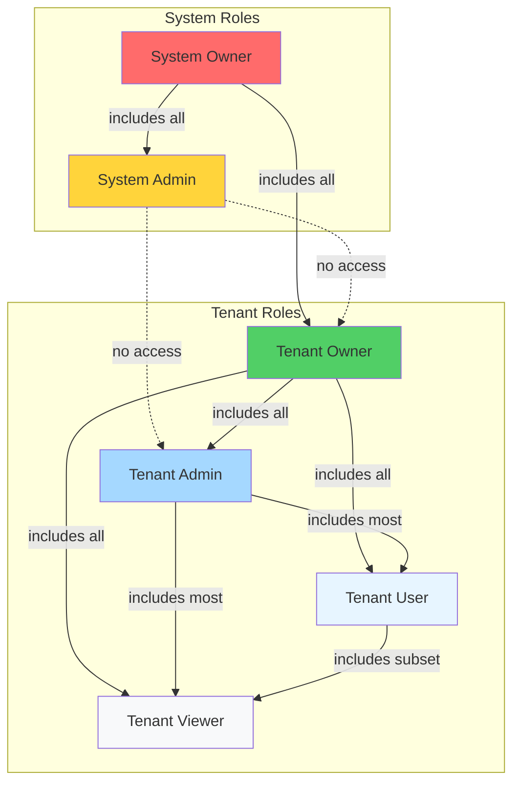
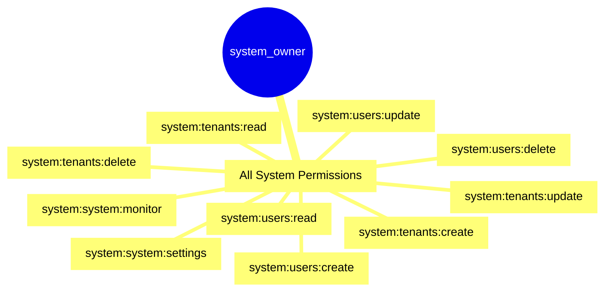
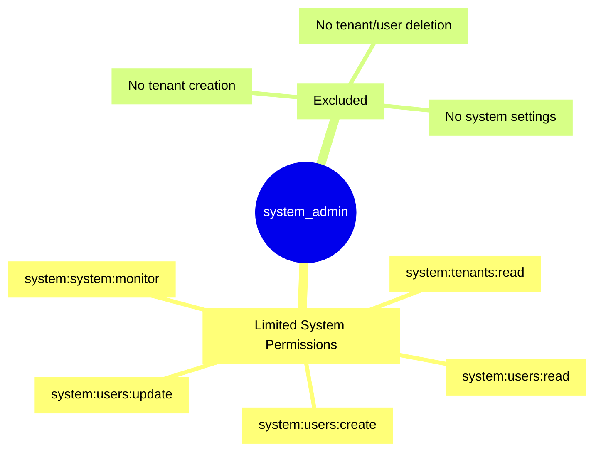
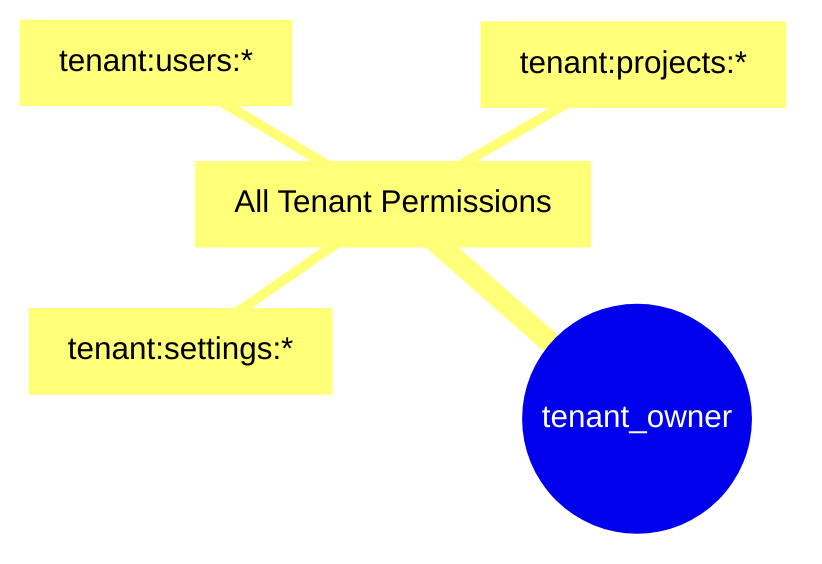
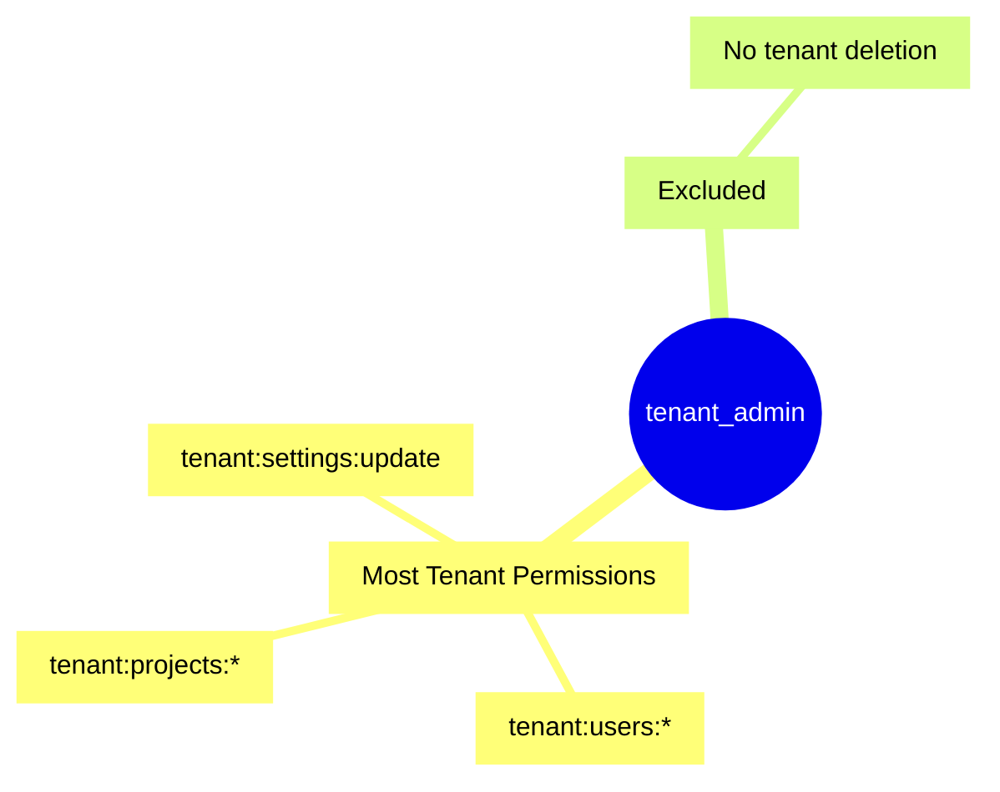
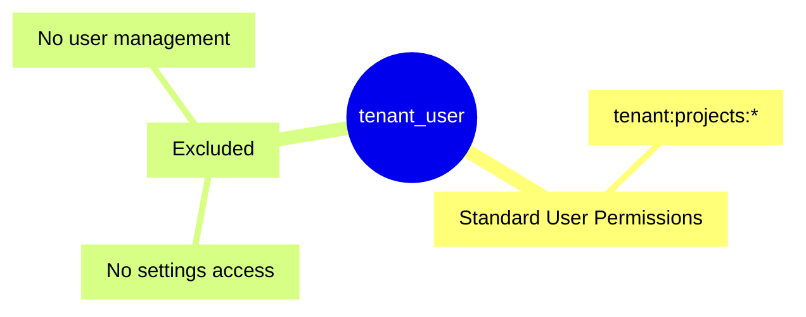
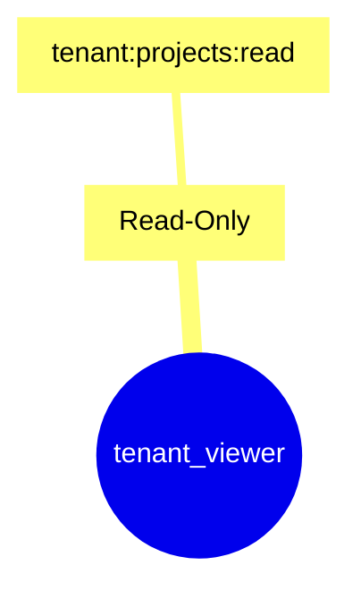

# Roles Reference

Complete guide to roles in the RBAC system, including hierarchy and permission mapping.

## Table of Contents

1. [Role Hierarchy](#role-hierarchy)
2. [System Roles](#system-roles)
3. [Tenant Roles](#tenant-roles)
4. [Permission Mapping](#permission-mapping)
5. [Usage Examples](#usage-examples)

## Role Hierarchy



## System Roles

System roles have cross-tenant access and are granted system permissions.

### System Owner



**Description:** Highest level role with all system permissions.

**Permissions:** All `SYSTEM_PERMISSIONS` values

**Use Case:** Platform administrators who need full control over all tenants and system settings.

### System Admin



**Description:** Administrative role with limited system permissions (no destructive operations).

**Permissions:** Subset of `SYSTEM_PERMISSIONS`

- `system:tenants:read`
- `system:users:create`
- `system:users:read`
- `system:users:update`
- `system:system:monitor`

**Use Case:** Support staff who need visibility and user management but cannot perform destructive operations.

## Tenant Roles

Tenant roles are scoped to a specific tenant and grant tenant permissions.

### Tenant Owner



**Description:** Highest tenant role with all tenant permissions.

**Permissions:** All `TENANT_PERMISSIONS` values

**Use Case:** Tenant administrators who need full control within their tenant.

### Tenant Admin



**Description:** Administrative role with most tenant permissions (excluding tenant deletion).

**Permissions:** Subset of `TENANT_PERMISSIONS`

- `tenant:settings:update`
- `tenant:users:create`
- `tenant:users:read`
- `tenant:users:update`
- `tenant:projects:create`
- `tenant:projects:read`
- `tenant:projects:update`
- `tenant:projects:delete`

**Use Case:** Tenant managers who need to manage users and projects but cannot delete the tenant.

### Tenant User



**Description:** Standard user role with project permissions.

**Permissions:** Subset of `TENANT_PERMISSIONS`

- `tenant:projects:read`
- `tenant:projects:create`
- `tenant:projects:update`

**Use Case:** Regular users who work with projects but don't manage other users or settings.

### Tenant Viewer



**Description:** Read-only role with minimal permissions.

**Permissions:** Subset of `TENANT_PERMISSIONS`

- `tenant:projects:read`

**Use Case:** Users who need read-only access to view projects but cannot modify anything.

## Permission Mapping

### Complete Role-to-Permission Map

```mermaid
graph TD
    subgraph System Roles
        SO[system_owner]
        SA[system_admin]
    end

    subgraph Tenant Roles
        TO[tenant_owner]
        TA[tenant_admin]
        TU[tenant_user]
        TV[tenant_viewer]
    end

    subgraph Permissions
        STC[system:tenants:create]
        STR[system:tenants:read]
        STU[system:tenants:update]
        STD[system:tenants:delete]
        SUC[system:users:create]
        SUR[system:users:read]
        SUU[system:users:update]
        SUD[system:users:delete]
        SSM[system:system:monitor]
        SSS[system:system:settings]

        TTSU[tenant:settings:update]
        TTD[tenant:settings:delete]
        TUC[tenant:users:create]
        TUR[tenant:users:read]
        TUU[tenant:users:update]
        TUD[tenant:users:delete]
        TPC[tenant:projects:create]
        TPR[tenant:projects:read]
        TPU[tenant:projects:update]
        TPD[tenant:projects:delete]
    end

    SO --> STC
    SO --> STR
    SO --> STU
    SO --> STD
    SO --> SUC
    SO --> SUR
    SO --> SUU
    SO --> SUD
    SO --> SSM
    SO --> SSS

    SA --> STR
    SA --> SUC
    SA --> SUR
    SA --> SUU
    SA --> SSM

    TO --> TTSU
    TO --> TTD
    TO --> TUC
    TO --> TUR
    TO --> TUU
    TO --> TUD
    TO --> TUAR
    TO --> TPC
    TO --> TPR
    TO --> TPU
    TO --> TPD

    TA --> TTSU
    TA --> TUC
    TA --> TUR
    TA --> TUU
    TA --> TUAR
    TA --> TPC
    TA --> TPR
    TA --> TPU
    TA --> TPD

    TU --> TPR
    TU --> TPC
    TU --> TPU

    TV --> TPR

    style SO fill:#ff6b6b
    style SA fill:#ffd43b
    style TO fill:#51cf66
    style TA fill:#a5d8ff
    style TU fill:#e7f5ff
    style TV fill:#f8f9fa
```



### Import Location

```typescript
import { SYSTEM_ROLE, TENANT_ROLE } from '@package/constants';
import { ROLE_PERMISSIONS } from '@package/constants';
```

### Role Constants

```typescript
export const SYSTEM_ROLE = {
  OWNER: 'system_owner',
  ADMIN: 'system_admin'
} as const;

export const TENANT_ROLE = {
  OWNER: 'tenant_owner',
  ADMIN: 'tenant_admin',
  USER: 'tenant_user',
  VIEWER: 'tenant_viewer'
} as const;
```

## Usage Examples

### Using in Controllers

```typescript
import { Controller, Post, UseGuards } from '@nestjs/common';
import { RequireTenantRole } from '@package/auth';
import { TENANT_ROLE } from '@package/constants';
import { EnhancedPermissionsGuard } from '@/modules/auth/guards';

@Controller('tenants/settings')
@ApiBearerAuth()
@UseGuards(JwtAuthGuard, EnhancedPermissionsGuard)
export class TenantSettingsController {
  @Patch()
  @RequireTenantRole(TENANT_ROLE.OWNER)
  updateSettings() {
    return { message: 'Only tenant owners can update settings' };
  }
}
```

### Getting Permissions for Role

```typescript
import { getPermissionsForRole } from '@package/constants';

const tenantAdminPermissions = getPermissionsForRole('tenant_admin');
// Returns: [
//   'tenant:settings:update',
//   'tenant:users:create',
//   'tenant:users:read',
//   'tenant:users:update',
//   'tenant:projects:create',
//   'tenant:projects:read',
//   'tenant:projects:update',
//   'tenant:projects:delete'
// ]
```

### Checking User Role

```typescript
import { User, TenantId } from '@/common/decorators/current-user.decorator';

@Get('admin-only')
adminOnly(@User() user: CurrentUserData) {
  if (!user.roles?.includes('tenant_owner')) {
    throw new ForbiddenException('Only tenant owners can access');
  }
  return { message: 'Admin access granted' };
}
```

### Repository Authorization with Roles

```typescript
import { Injectable } from '@nestjs/common';
import { CachedPermissionService } from '@package/auth';
import { TENANT_ROLE } from '@package/constants';

@Injectable()
export class UserRepository extends BaseRepository {
  constructor(
    @Inject(MAIN_DB) db: NodePgDatabase,
    @Optional() private permissionService: CachedPermissionService
  ) {
    super(db);
  }

  async delete(id: number, userContext?: RepositoryUserContext) {
    await this.authorizeDelete(userContext, id);
    return await this.db.delete(users).where(eq(users.id, id));
  }

  private async authorizeDelete(
    userContext: RepositoryUserContext | undefined,
    targetUserId: number
  ): Promise<void> {
    if (!userContext) return;

    const { userId, tenantId } = userContext;

    // Rule 1: Self-access
    if (userId === targetUserId.toString()) return;

    // Rule 2: Tenant owner can delete any user
    const isTenantOwner = await this.permissionService.hasRole(
      parseInt(userId),
      parseInt(tenantId),
      TENANT_ROLE.OWNER
    );

    if (isTenantOwner) return;

    // Rule 3: Check delete permission
    const hasPermission = await this.permissionService.hasPermission(
      parseInt(userId),
      parseInt(tenantId),
      TENANT_PERMISSIONS.USERS_DELETE
    );

    if (!hasPermission) {
      throw new ForbiddenException('Insufficient permissions');
    }
  }
}
```

## Next Steps

- [Permissions](./permissions.md) - Complete permission reference
- [Guards](./guards.md) - How guards validate roles and permissions
- [Decorators](./decorators.md) - Using @RequireTenantRole decorator
