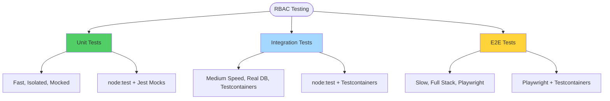
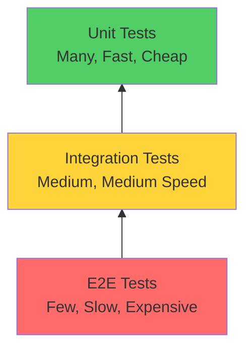

# Testing RBAC

Complete guide to testing RBAC features at all levels.

## Table of Contents

1. [Overview](#overview)
2. [Unit Testing](#unit-testing)
3. [Integration Testing](#integration-testing)
4. [E2E Testing](#e2e-testing)
5. [Test Fixtures](#test-fixtures)
6. [Best Practices](#best-practices)

## Overview

RBAC testing ensures authorization works correctly across all layers using mocks, Testcontainers, and Playwright.



### Testing Pyramid



## Unit Testing

### Purpose

Test authorization logic in isolation with mocked dependencies.

### Testing Guards

```typescript
import { describe, it, mock } from 'node:test';
import assert from 'node:assert';
import { EnhancedPermissionsGuard } from '../guards/enhanced-permissions.guard';
import { Reflector } from '@nestjs/core';
import { ExecutionContext } from '@nestjs/common';

describe('EnhancedPermissionsGuard', () => {
  let guard: EnhancedPermissionsGuard;
  let reflector: Reflector;
  let permissionService: CachedPermissionService;

  beforeEach(() => {
    // Mock Reflector
    reflector = {
      get: mock.fn((token, context) => {
        if (token === 'permissions') {
          return ['tenant:users:read'];
        }
        return null;
      }),
      getAllAndOverride: mock.fn()
    } as unknown as Reflector;

    // Mock PermissionService
    permissionService = {
      getUserPermissions: mock.fn(async (userId, tenantId) => {
        return ['tenant:users:read', 'tenant:users:create'];
      }),
      hasPermission: mock.fn(async (userId, tenantId, permission) => {
        return true;
      })
    } as unknown as CachedPermissionService;

    guard = new EnhancedPermissionsGuard(reflector, permissionService);
  });

  it('should allow access when user has all required permissions', async () => {
    const context = createMockContext({
      permissions: ['tenant:users:read', 'tenant:users:create']
    });

    const result = await guard.canActivate(context);

    assert.strictEqual(result, true);
  });

  it('should deny access when user lacks required permission', async () => {
    const context = createMockContext({
      permissions: ['tenant:users:read'] // Missing :create
    });

    const result = await guard.canActivate(context);

    assert.strictEqual(result, false);
  });

  it('should allow access when no permissions required', async () => {
    // Mock reflector to return no permissions
    reflector.get = mock.fn(() => null);

    const context = createMockContext({
      permissions: []
    });

    const result = await guard.canActivate(context);

    assert.strictEqual(result, true);
  });

  function createMockContext(user: any): ExecutionContext {
    return {
      getHandler: () => ({}),
      getClass: () => ({}),
      switchToHttp: () => ({
        getRequest: () => ({ user })
      }),
      switchToRpc: () => ({}) as any,
      switchToWs: () => ({}) as any
    } as ExecutionContext;
  }
});
```

### Testing Handlers

```typescript
import { describe, it, mock } from 'node:test';
import assert from 'node:assert';
import { DeleteUserHandler } from '../handlers/delete-user.handler';
import { ForbiddenException } from '@nestjs/common';

describe('DeleteUserHandler', () => {
  let handler: DeleteUserHandler;
  let repository: UserRepository;
  let permissionService: CachedPermissionService;

  beforeEach(() => {
    // Mock repository
    repository = {
      delete: mock.fn(async (id, userContext) => {
        return { id, deleted: true };
      })
    } as unknown as UserRepository;

    // Mock permission service
    permissionService = {
      hasPermission: mock.fn(async (userId, tenantId, permission) => {
        // Allow tenant:users:delete permission
        return permission === 'tenant:users:delete';
      })
    } as unknown as CachedPermissionService;

    handler = new DeleteUserHandler(repository, permissionService);
  });

  it('should allow deletion when user has permission', async () => {
    const command = new DeleteUserCommand({
      tenantId: '1',
      actorId: '123',
      userId: '456'
    });

    const result = await handler.execute(command);

    assert.strictEqual(result.success, true);
    assert.strictEqual(repository.delete.mock.calls.length, 1);
  });

  it('should deny deletion when user lacks permission', async () => {
    const command = new DeleteUserCommand({
      tenantId: '1',
      actorId: '789', // Different user with no permission
      userId: '456'
    });

    // Mock hasPermission to return false for this user
    permissionService.hasPermission = mock.fn(async () => false);

    await assert.rejects(
      async () => handler.execute(command),
      (error: Error) => {
        assert(error instanceof ForbiddenException);
        assert.strictEqual(error.message, 'Insufficient permissions');
        return true;
      }
    );

    // Repository should not be called
    assert.strictEqual(repository.delete.mock.calls.length, 0);
  });

  it('should allow self-deletion without permission check', async () => {
    const command = new DeleteUserCommand({
      tenantId: '1',
      actorId: '123',
      userId: '123' // Same as actorId (self-deletion)
    });

    const result = await handler.execute(command);

    assert.strictEqual(result.success, true);
    // hasPermission should not be called for self-deletion
    assert.strictEqual(permissionService.hasPermission.mock.calls.length, 0);
  });
});
```

### Testing Repositories

```typescript
import { describe, it, mock } from 'node:test';
import assert from 'node:assert';
import { UserRepository } from '../user.repository';
import { ForbiddenException } from '@nestjs/common';

describe('UserRepository', () => {
  let repository: UserRepository;
  let db: NodePgDatabase;
  let permissionService: CachedPermissionService;

  beforeEach(() => {
    // Mock database
    db = {
      delete: mock.fn(() => ({ where: mock.fn(() => ({ return: mock.fn() })) }))
    } as unknown as NodePgDatabase;

    // Mock permission service
    permissionService = {
      hasPermission: mock.fn(async (userId, tenantId, permission) => {
        // Allow for user 123, deny for user 456
        return userId === 123;
      }),
      hasRole: mock.fn(async () => false)
    } as unknown as CachedPermissionService;

    repository = new UserRepository(db, permissionService);
  });

  it('should allow self-deletion', async () => {
    const userContext = {
      userId: '123',
      tenantId: '1',
      actorId: '123'
    };

    await repository.delete(123, userContext);

    // Should not check permissions for self-deletion
    assert.strictEqual(permissionService.hasPermission.mock.calls.length, 0);
    assert.strictEqual(db.delete.mock.calls.length, 1);
  });

  it('should require permission to delete other users', async () => {
    const userContext = {
      userId: '123',
      tenantId: '1',
      actorId: '123'
    };

    await repository.delete(456, userContext);

    // Should check permissions
    assert.strictEqual(permissionService.hasPermission.mock.calls.length, 1);
    assert.strictEqual(db.delete.mock.calls.length, 1);
  });

  it('should deny deletion when permission check fails', async () => {
    const userContext = {
      userId: '456', // User without permission
      tenantId: '1',
      actorId: '456'
    };

    await assert.rejects(
      async () => repository.delete(123, userContext),
      (error: Error) => {
        assert(error instanceof ForbiddenException);
        return true;
      }
    );

    // Database should not be called
    assert.strictEqual(db.delete.mock.calls.length, 0);
  });
});
```

## Integration Testing

### Purpose

Test RBAC with real database using Testcontainers.

### Setting Up Testcontainers

```typescript
import { before, after } from 'node:test';
import { drizzle } from 'drizzle-orm/node-postgres';
import { Pool } from 'pg';
import { migrate } from 'drizzle-orm/node-postgres/migrator';
import { GenericContainer } from 'testcontainers';

let db: NodePgDatabase;
let container: StartedTestContainer;

before(async () => {
  // Start PostgreSQL container
  container = await new GenericContainer('postgres:18')
    .withExposedPorts(5432)
    .withEnvironment({
      POSTGRES_USER: 'test',
      POSTGRES_PASSWORD: 'test',
      POSTGRES_DB: 'testdb'
    })
    .start();

  // Create database connection
  const pool = new Pool({
    host: container.getHost(),
    port: container.getMappedPort(5432),
    user: 'test',
    password: 'test',
    database: 'testdb'
  });

  db = drizzle(pool);

  // Run migrations
  await migrate(db, { migrationsFolder: 'drizzle' });
});

after(async () => {
  await db.close();
  await container.stop();
});
```

### Testing Permission Resolution

```typescript
import { describe, it, before, after } from 'node:test';
import assert from 'node:assert';
import { CachedPermissionService } from '@package/auth';

describe('CachedPermissionService Integration', () => {
  let permissionService: CachedPermissionService;
  let redisContainer: StartedTestContainer;
  let db: NodePgDatabase;

  before(async () => {
    // Setup Redis container
    redisContainer = await new GenericContainer('redis:7').withExposedPorts(6379).start();

    // Setup permission service
    permissionService = new CachedPermissionService(
      redisContainer.getHost(),
      redisContainer.getMappedPort(6379),
      db
    );
  });

  after(async () => {
    await redisContainer.stop();
  });

  it('should cache user permissions', async () => {
    const userId = 123;
    const tenantId = 1;

    // Cache permissions
    await permissionService.cacheUserPermissions(userId, tenantId, [
      'tenant:users:read',
      'tenant:users:create'
    ]);

    // Retrieve from cache
    const permissions = await permissionService.getUserPermissions(userId, tenantId);

    assert.deepStrictEqual(permissions, ['tenant:users:read', 'tenant:users:create']);
  });

  it('should invalidate cache on perm_version change', async () => {
    const userId = 123;
    const tenantId = 1;
    const oldVersion = 'v1';
    const newVersion = 'v2';

    // Cache with old version
    await permissionService.cacheUserPermissions(
      userId,
      tenantId,
      ['tenant:users:read'],
      oldVersion
    );

    // Update perm_version
    await permissionService.updatePermVersion(userId, tenantId, newVersion);

    // Old cache should be invalidated
    const oldCache = await permissionService.getUserPermissions(userId, tenantId, oldVersion);
    assert.strictEqual(oldCache, null);

    // New cache should be empty
    const newCache = await permissionService.getUserPermissions(userId, tenantId, newVersion);
    assert.strictEqual(newCache, null);
  });
});
```

### Testing Repository Authorization

```typescript
import { describe, it, before, after } from 'node:test';
import assert from 'node:assert';
import { UserRepository } from '../user.repository';
import { users, userRoles } from '@package/db-core/schema';
import { ForbiddenException } from '@nestjs/common';

describe('UserRepository Integration', () => {
  let repository: UserRepository;
  let permissionService: CachedPermissionService;

  before(async () => {
    // Setup database and permission service
    permissionService = new CachedPermissionService(/* ... */);
    repository = new UserRepository(db, permissionService);

    // Seed test data
    await db.insert(users).values([
      {
        id: 1,
        email: 'user1@test.com',
        tenantId: 1,
        name: 'User 1'
      },
      {
        id: 2,
        email: 'user2@test.com',
        tenantId: 2,
        name: 'User 2'
      }
    ]);

    await db.insert(userRoles).values([
      {
        userId: 1,
        tenantId: 1,
        role: 'tenant_owner'
      }
    ]);
  });

  after(async () => {
    await db.delete(users);
    await db.delete(userRoles);
  });

  it('should enforce tenant isolation', async () => {
    const tenant1Context = {
      userId: '1',
      tenantId: '1',
      actorId: '1'
    };

    const tenant2Context = {
      userId: '2',
      tenantId: '2',
      actorId: '2'
    };

    // Tenant 1 can only see their users
    const tenant1Users = await repository.findAll(tenant1Context);
    assert.strictEqual(tenant1Users.length, 1);
    assert.strictEqual(tenant1Users[0].tenantId, 1);

    // Tenant 2 can only see their users
    const tenant2Users = await repository.findAll(tenant2Context);
    assert.strictEqual(tenant2Users.length, 1);
    assert.strictEqual(tenant2Users[0].tenantId, 2);
  });

  it('should prevent cross-tenant access', async () => {
    const tenant1Context = {
      userId: '1',
      tenantId: '1',
      actorId: '1'
    };

    // Try to access tenant 2's user
    await assert.rejects(
      async () => repository.findById(2, tenant1Context),
      (error: Error) => {
        assert(error instanceof ForbiddenException);
        assert.strictEqual(error.message, 'Cannot access data from another tenant');
        return true;
      }
    );
  });
});
```

## E2E Testing

### Purpose

Test complete RBAC flow from HTTP request to database.

### Setting Up E2E Tests

```typescript
import { describe, it, before, after } from 'node:test';
import assert from 'node:assert/strict';
import { NestApplication } from '@nestjs/core';
import { Test } from '@nestjs/testing';
import { AppModule } from '@/app.module';
import * as request from 'supertest';
import { JwtService } from '@nestjs/jwt';
import { Redis } from 'ioredis';
import { migrate } from 'drizzle-orm/node-postgres/migrator';

describe('RBAC E2E', () => {
  let app: NestApplication;
  let jwtService: JwtService;
  let redis: Redis;
  let db: NodePgDatabase;

  before(async () => {
    const module = await Test.createTestingModule({
      imports: [AppModule]
    }).compile();

    app = module.createNestApplication();
    await app.init();

    jwtService = module.get<JwtService>(JwtService);
    redis = module.get<Redis>('REDIS_CONNECTION');
    db = module.get<NodePgDatabase>(MAIN_DB);

    // Run migrations
    await migrate(db, { migrationsFolder: 'drizzle' });
  });

  after(async () => {
    await app.close();
  });

  // Helper: Create JWT token
  function createToken(user: any): string {
    return jwtService.sign({
      sub: user.userId,
      tenant_id: user.tenantId,
      actor_id: user.actorId,
      roles: user.roles,
      permissions: user.permissions
    });
  }

  // Helper: Create Firebase token
  function createFirebaseToken(user: any): string {
    return jwtService.sign({
      sub: user.userId,
      tenant_id: user.tenantId,
      actor_id: user.actorId,
      roles: user.roles,
      perm_version: user.permVersion
    });
  }
});
```

### Testing Permission Guards

```typescript
describe('Permission Guards', () => {
  it('should allow access with correct permission', async () => {
    const token = createToken({
      userId: '123',
      tenantId: '1',
      actorId: '123',
      roles: ['tenant_admin'],
      permissions: ['tenant:users:read']
    });

    const response = await request(app.getHttpServer())
      .get('/users')
      .set('Authorization', `Bearer ${token}`)
      .expect(200);

    assert.strictEqual(response.data.length, 0);
  });

  it('should deny access without permission', async () => {
    const token = createToken({
      userId: '123',
      tenantId: '1',
      actorId: '123',
      roles: ['tenant_viewer'],
      permissions: ['tenant:projects:read'] // Wrong permission
    });

    await request(app.getHttpServer())
      .get('/users')
      .set('Authorization', `Bearer ${token}`)
      .expect(403);
  });

  it('should deny access without token', async () => {
    await request(app.getHttpServer()).get('/users').expect(401);
  });
});
```

### Testing Role Guards

```typescript
describe('Role Guards', () => {
  it('should allow tenant owner', async () => {
    const token = createToken({
      userId: '123',
      tenantId: '1',
      actorId: '123',
      roles: ['tenant_owner'],
      permissions: []
    });

    await request(app.getHttpServer())
      .patch('/tenants/settings')
      .set('Authorization', `Bearer ${token}`)
      .send({ name: 'Updated' })
      .expect(200);
  });

  it('should deny non-owner', async () => {
    const token = createToken({
      userId: '123',
      tenantId: '1',
      actorId: '123',
      roles: ['tenant_viewer'], // Not owner
      permissions: []
    });

    await request(app.getHttpServer())
      .patch('/tenants/settings')
      .set('Authorization', `Bearer ${token}`)
      .send({ name: 'Updated' })
      .expect(403);
  });
});
```

### Testing Firebase Provider

```typescript
describe('Firebase Provider', () => {
  it('should resolve permissions from cache', async () => {
    const userId = '123';
    const tenantId = '1';
    const permVersion = 'v1';

    // Cache permissions
    await redis.set(
      `permissions:${userId}:${tenantId}:${permVersion}`,
      JSON.stringify(['tenant:users:read', 'tenant:users:create']),
      'EX',
      3600
    );

    const token = createFirebaseToken({
      userId,
      tenantId,
      actorId: userId,
      roles: ['tenant_admin'],
      permVersion
    });

    const response = await request(app.getHttpServer())
      .get('/users')
      .set('Authorization', `Bearer ${token}`)
      .expect(200);

    assert.strictEqual(response.data.length, 0);
  });

  it('should deny when cache miss', async () => {
    const token = createFirebaseToken({
      userId: '123',
      tenantId: '1',
      actorId: '123',
      roles: ['tenant_admin'],
      permVersion: 'v1'
    });

    // No cached permissions
    await request(app.getHttpServer())
      .get('/users')
      .set('Authorization', `Bearer ${token}`)
      .expect(403);
  });
});
```

### Testing Tenant Isolation

```typescript
describe('Tenant Isolation', () => {
  before(async () => {
    // Create users in different tenants
    await db.insert(users).values([
      {
        id: 1,
        email: 'tenant1@example.com',
        tenantId: 1,
        name: 'Tenant 1 User'
      },
      {
        id: 2,
        email: 'tenant2@example.com',
        tenantId: 2,
        name: 'Tenant 2 User'
      }
    ]);
  });

  it('should only show users from current tenant', async () => {
    const token1 = createToken({
      userId: '1',
      tenantId: '1',
      actorId: '1',
      roles: ['tenant_admin'],
      permissions: ['tenant:users:read']
    });

    const response1 = await request(app.getHttpServer())
      .get('/users')
      .set('Authorization', `Bearer ${token1}`)
      .expect(200);

    assert.strictEqual(response1.data.length, 1);
    assert.strictEqual(response1.data[0].tenantId, 1);

    const token2 = createToken({
      userId: '2',
      tenantId: '2',
      actorId: '2',
      roles: ['tenant_admin'],
      permissions: ['tenant:users:read']
    });

    const response2 = await request(app.getHttpServer())
      .get('/users')
      .set('Authorization', `Bearer ${token2}`)
      .expect(200);

    assert.strictEqual(response2.data.length, 1);
    assert.strictEqual(response2.data[0].tenantId, 2);
  });

  it('should prevent cross-tenant access', async () => {
    const token1 = createToken({
      userId: '1',
      tenantId: '1',
      actorId: '1',
      roles: ['tenant_admin'],
      permissions: ['tenant:users:read']
    });

    // Try to access tenant 2's user
    await request(app.getHttpServer())
      .get(`/users/2`)
      .set('Authorization', `Bearer ${token1}`)
      .expect(403);
  });
});
```

## Test Fixtures

### User Fixtures

```typescript
// test/fixtures/users.ts
export interface UserFixture {
  userId: string;
  tenantId: string;
  actorId: string;
  roles: string[];
  permissions?: string[];
  permVersion?: string;
}

export const fixtures = {
  systemOwner: {
    userId: '1',
    tenantId: '0', // System tenant
    actorId: '1',
    roles: ['system_owner'],
    permissions: [
      'system:tenants:create',
      'system:tenants:read',
      'system:tenants:update',
      'system:tenants:delete',
      'system:users:create',
      'system:users:read',
      'system:users:update',
      'system:users:delete',
      'system:system:monitor',
      'system:system:settings'
    ]
  },

  tenantOwner: {
    userId: '2',
    tenantId: '1',
    actorId: '2',
    roles: ['tenant_owner'],
    permissions: [
      'tenant:settings:update',
      'tenant:settings:delete',
      'tenant:users:create',
      'tenant:users:read',
      'tenant:users:update',
      'tenant:users:delete',
      'tenant:projects:create',
      'tenant:projects:read',
      'tenant:projects:update',
      'tenant:projects:delete'
    ]
  },

  tenantAdmin: {
    userId: '3',
    tenantId: '1',
    actorId: '3',
    roles: ['tenant_admin'],
    permissions: [
      'tenant:settings:update',
      'tenant:users:create',
      'tenant:users:read',
      'tenant:users:update',
      'tenant:projects:create',
      'tenant:projects:read',
      'tenant:projects:update',
      'tenant:projects:delete'
    ]
  },

  tenantUser: {
    userId: '4',
    tenantId: '1',
    actorId: '4',
    roles: ['tenant_user'],
    permissions: ['tenant:projects:read', 'tenant:projects:create', 'tenant:projects:update']
  },

  tenantViewer: {
    userId: '5',
    tenantId: '1',
    actorId: '5',
    roles: ['tenant_viewer'],
    permissions: ['tenant:projects:read']
  }
};

export function createToken(fixture: keyof typeof fixtures): string {
  const user = fixtures[fixture];
  return jwtService.sign(user);
}
```

### Using Fixtures in Tests

```typescript
describe('RBAC with Fixtures', () => {
  it('should allow system owner to create tenant', async () => {
    const token = createToken('systemOwner');

    await request(app.getHttpServer())
      .post('/system/tenants')
      .set('Authorization', `Bearer ${token}`)
      .send({
        name: 'New Tenant',
        slug: 'new-tenant'
      })
      .expect(201);
  });

  it('should deny tenant user from creating tenant', async () => {
    const token = createToken('tenantUser');

    await request(app.getHttpServer())
      .post('/system/tenants')
      .set('Authorization', `Bearer ${token}`)
      .send({
        name: 'New Tenant',
        slug: 'new-tenant'
      })
      .expect(403);
  });

  it('should allow tenant owner to delete tenant', async () => {
    const token = createToken('tenantOwner');

    await request(app.getHttpServer())
      .delete(`/tenants/${tenantId}`)
      .set('Authorization', `Bearer ${token}`)
      .expect(200);
  });

  it('should deny tenant viewer from deleting tenant', async () => {
    const token = createToken('tenantViewer');

    await request(app.getHttpServer())
      .delete(`/tenants/${tenantId}`)
      .set('Authorization', `Bearer ${token}`)
      .expect(403);
  });
});
```

## Best Practices

### 1. Test at Multiple Layers

```typescript
// Unit test - test handler logic
it('should check permission before deletion', async () => {
  // Mock repository and permission service
  const handler = new DeleteUserHandler(mockRepo, mockPermissions);
  // Test permission check logic
});

// Integration test - test repository authorization
it('should enforce repository-level authorization', async () => {
  // Use real DB with Testcontainers
  const repository = new UserRepository(db, permissionService);
  // Test repository authorization
});

// E2E test - test complete flow
it('should deny unauthorized deletion', async () => {
  // Use real HTTP layer
  await request(app.getHttpServer())
    .delete('/users/123')
    .set('Authorization', `Bearer ${token}`)
    .expect(403);
});
```

### 2. Use Fixtures for Common Users

```typescript
// Good - use fixtures
const token = createToken('tenantOwner');

// Bad - inline user creation
const token = jwtService.sign({
  userId: '123',
  tenantId: '1',
  actorId: '123',
  roles: ['tenant_owner'],
  permissions: ['tenant:settings:update' /* ... */]
});
```

### 3. Test Both Success and Failure Cases

```typescript
// Test success
it('should allow with correct permission', async () => {
  const token = createToken('tenantAdmin');
  await request(app.getHttpServer())
    .get('/users')
    .set('Authorization', `Bearer ${token}`)
    .expect(200);
});

// Test failure
it('should deny without permission', async () => {
  const token = createToken('tenantViewer');
  await request(app.getHttpServer())
    .get('/users')
    .set('Authorization', `Bearer ${token}`)
    .expect(403);
});
```

### 4. Test Edge Cases

```typescript
it('should handle missing user context', async () => {
  await assert.rejects(async () => repository.delete(123), ForbiddenException);
});

it('should allow self-access without permission', async () => {
  const userContext = {
    userId: '123',
    tenantId: '1',
    actorId: '123'
  };

  await repository.delete(123, userContext);
  // Should succeed even without tenant:users:delete permission
});
```

### 5. Clean Up Test Data

```typescript
afterEach(async () => {
  // Clean up test data
  await db.delete(users);
  await db.delete(userRoles);
  await redis.flushall();
});
```

## Documentation References

- [Overview](./overview.md) - RBAC architecture
- [Permissions](./permissions.md) - Permission system reference
- [Roles](./roles.md) - Role hierarchy and mapping
- [Guards](./guards.md) - EnhancedPermissionsGuard details
- [Repository-Level](./repository-level.md) - Data-layer authorization
