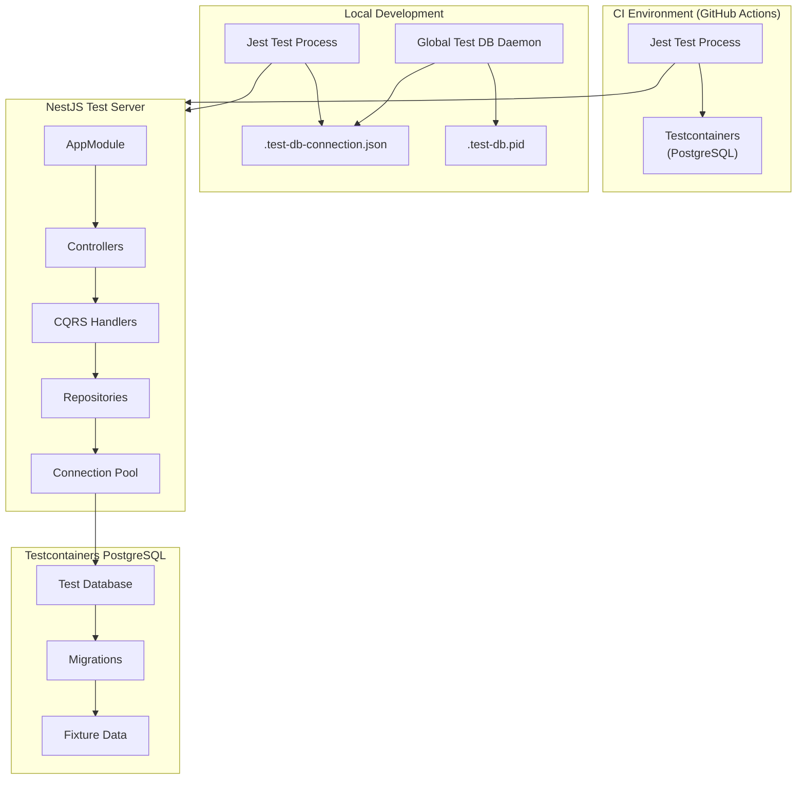
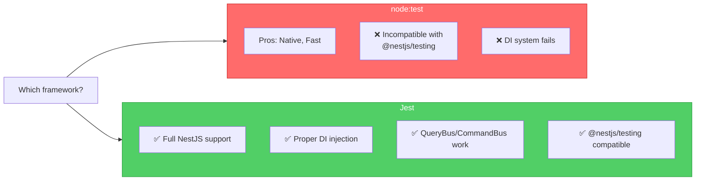
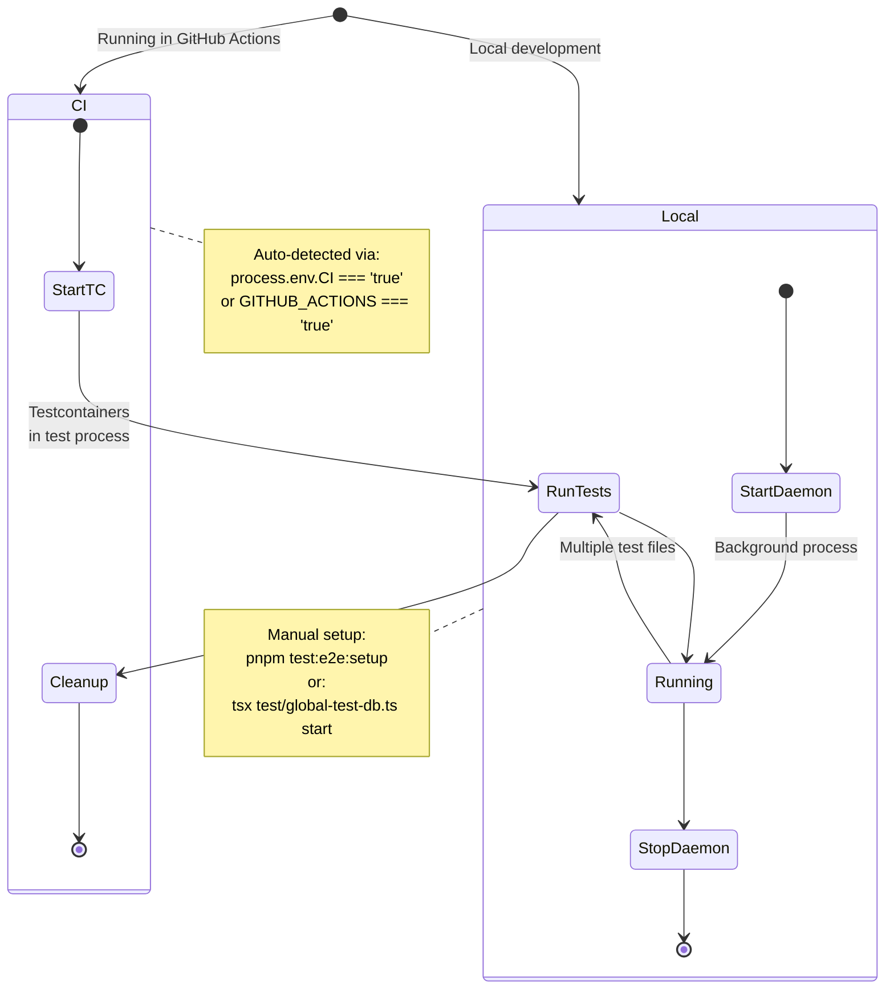
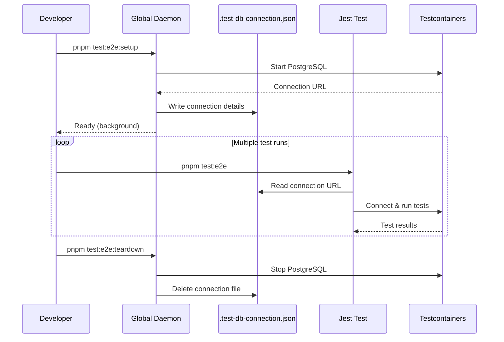
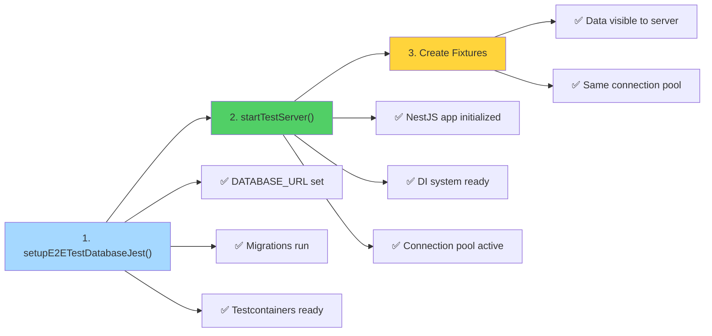
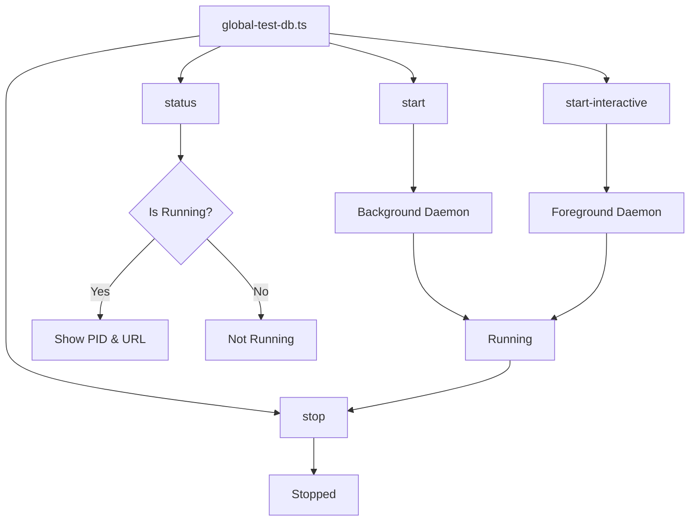

# E2E Testing Guide

Comprehensive guide to writing End-to-End (E2E) tests for the NestJS API using Jest and Testcontainers.

## Architecture Overview



## Why Jest for E2E Tests?



**Critical Reason**: NestJS `@nestjs/testing` module is incompatible with `node:test` due to module resolution issues. Jest is required for proper DI initialization.

## Test Database Architecture

### Two Modes of Operation



### CI Mode (GitHub Actions)

In CI, Testcontainers starts directly in the test process:

```typescript
// Auto-detected in setupE2ETestDatabaseJest()
const isCI = process.env.CI === 'true' || process.env.GITHUB_ACTIONS === 'true';

if (isCI) {
  // Start Testcontainers directly
  await startPostgresContainer();
  testDb = await createTestDatabase(superuserUrl);
}
```

### Local Mode (Daemon)

For local development, a global daemon keeps the database running:



## Directory Structure

```
apps/api/test/
├── global-test-db.ts              # Global database daemon manager
├── jest.global-setup.ts           # Jest global teardown
├── jest.global.d.ts               # Global type declarations
├── users.e2e.spec.ts              # Example E2E test
├── helpers/
│   ├── bootstrap.ts               # NestJS server startup
│   └── database.ts                # Database setup utilities
└── fixtures/
    └── user.fixture.ts            # Test data factories
```

## Writing E2E Tests

### Basic Test Structure

```typescript
import { startTestServer } from './helpers/bootstrap';
import {
  setupE2ETestDatabaseJest,
  createTestOrganization,
  cleanupOrganization
} from './helpers/database';
import { createUserFixture, deleteUserFixture } from './fixtures/user.fixture';

describe('Users E2E Tests', () => {
  let server: TestServer;
  let tenantId: number;
  let testUserId: number;

  beforeAll(async () => {
    // 1. Setup test database FIRST
    await setupE2ETestDatabaseJest();

    // 2. Start server SECOND
    server = await startTestServer();

    // 3. Create test data
    tenantId = await createTestOrganization(server.app);
    const user = await createUserFixture(server.app, { organizationId: tenantId });
    testUserId = user.id;
  });

  afterAll(async () => {
    // Cleanup
    await deleteUserFixture(server.app, tenantId, testUserId);
    await server?.close();
  });

  it('should return user data', async () => {
    const response = await server.request({
      method: 'GET',
      url: `/users/${testUserId}`,
      headers: { 'x-tenant-id': tenantId.toString() }
    });

    expect(response.status).toBe(200);
    expect(response.body.data.id).toBe(testUserId);
  });
});
```

### Critical Setup Order



**Why this order matters:**

1. **Database first**: Sets `DATABASE_URL` and runs migrations
2. **Server second**: Initializes NestJS with correct database connection
3. **Fixtures last**: Uses server's connection pool for data visibility

## Test Patterns

### 1. Single Resource Retrieval

```typescript
describe('GET /users/:id', () => {
  it('should return 200 with user data', async () => {
    const response = await server.request({
      method: 'GET',
      url: `/users/${testUserId}`,
      headers: { 'x-tenant-id': tenantId.toString() }
    });

    expect(response.status).toBe(200);
    expect(response.body.data.id).toBe(testUserId);
  });

  it('should return 404 for non-existent ID', async () => {
    const response = await server.request({
      method: 'GET',
      url: '/users/99999',
      headers: { 'x-tenant-id': tenantId.toString() }
    });

    expect(response.status).toBe(404);
    expect(response.body.data.code).toBe('DB_004');
  });
});
```

### 2. Paginated List

```typescript
describe('GET /users (list)', () => {
  it('should return paginated list', async () => {
    const response = await server.request({
      method: 'GET',
      url: '/users?page=1&pageSize=10',
      headers: { 'x-tenant-id': tenantId.toString() }
    });

    expect(response.status).toBe(200);
    expect(response.body.data).toBeInstanceOf(Array);
    expect(response.body.metadata.pagination.page).toBe(1);
    expect(response.body.metadata.pagination.pageSize).toBe(10);
  });
});
```

### 3. Multi-Tenancy Isolation

```typescript
it('should not return users from other tenants', async () => {
  // Create another tenant
  const otherTenantId = await createTestOrganization(server.app);
  const otherUser = await createUserFixture(server.app, { organizationId: otherTenantId });

  // Query original tenant
  const response = await server.request({
    method: 'GET',
    url: `/users/${otherUser.id}`,
    headers: { 'x-tenant-id': tenantId.toString() }
  });

  // Should not find user from other tenant
  expect(response.status).toBe(404);

  // Cleanup
  await deleteUserFixture(server.app, otherTenantId, otherUser.id);
  await cleanupOrganization(server.app, otherTenantId);
});
```

### 4. Validation Errors

```typescript
it('should return 400 for invalid input', async () => {
  const response = await server.request({
    method: 'GET',
    url: '/users?page=0',
    headers: { 'x-tenant-id': tenantId.toString() }
  });

  expect(response.status).toBe(400);
});
```

## Helper Functions Reference

### setupE2ETestDatabaseJest()

```typescript
/**
 * Setup test database for E2E tests
 *
 * AUTO-DETECTS environment:
 * - CI: Starts Testcontainers directly
 * - Local: Uses global database daemon
 *
 * Sets required environment variables
 * Runs migrations
 */
await setupE2ETestDatabaseJest();
```

### startTestServer()

```typescript
/**
 * Start NestJS test server
 *
 * Uses Test.createTestingModule() for proper DI
 * Applies ValidationPipe
 * Sets global prefix to 'api'
 *
 * @returns TestServer with request() and close() methods
 */
const server = await startTestServer();
```

### TestServer Interface

```typescript
interface TestServer {
  app: INestApplication;
  request: (options: {
    method: string;
    url: string;
    headers?: Record<string, string>;
    body?: unknown;
  }) => Promise<{ status: number; body: unknown }>;
  close: () => Promise<void>;
}
```

### createTestOrganization()

```typescript
/**
 * Create a test organization (tenant)
 *
 * Uses app's database connection for data visibility
 *
 * @param app - NestJS application instance
 * @param name - Optional organization name
 * @returns Organization ID
 */
const tenantId = await createTestOrganization(server.app, 'Test Org');
```

### createUserFixture()

```typescript
/**
 * Create a test user
 *
 * @param app - NestJS application instance
 * @param options - { organizationId: number }
 * @returns Created user
 */
const user = await createUserFixture(server.app, { organizationId: tenantId });
```

### cleanupOrganization()

```typescript
/**
 * Clean up all test data for an organization
 *
 * Deletes all users belonging to the organization
 *
 * @param app - NestJS application instance
 * @param organizationId - Organization to clean up
 */
await cleanupOrganization(server.app, tenantId);
```

## Type Guards for Responses

```typescript
// Define response data interface
interface UserResponseData {
  id: number;
  organizationId: number;
  createdAt: string | Date;
}

// Create type guard
function isUserResponseData(data: unknown): data is UserResponseData {
  return typeof data === 'object' && data !== null && 'id' in data;
}

// Use in tests
it('should return valid user data', async () => {
  const response = await server.request({
    method: 'GET',
    url: `/users/${testUserId}`,
    headers: { 'x-tenant-id': tenantId.toString() }
  });

  expect(response.status).toBe(200);
  expect(isUserResponseData(response.body.data)).toBe(true);
});
```

## Running Tests

### Local Development

```bash
# 1. Start the global database daemon
pnpm test:e2e:setup

# 2. Run E2E tests
pnpm test:e2e

# 3. (Optional) Stop the daemon when done
pnpm test:e2e:teardown

# Check daemon status
pnpm test:e2e:status

# Interactive mode (see logs)
pnpm test:e2e:manual
```

### Watch Mode

```bash
# Run tests in watch mode
pnpm test:e2e:watch
```

### CI Environment

In CI, tests run automatically with Testcontainers started in-process:

```bash
# No setup needed - auto-detected
pnpm test:e2e
```

## Database Daemon Commands



| Command             | Mode       | Description                             |
| ------------------- | ---------- | --------------------------------------- |
| `start`             | Background | Start daemon, exit immediately          |
| `start-interactive` | Foreground | Start with visible logs, Ctrl+C to stop |
| `stop`              | -          | Stop daemon and cleanup                 |
| `status`            | -          | Check if daemon is running              |

## Jest Configuration

Key settings in `jest.config.js`:

```javascript
module.exports = {
  preset: 'ts-jest',
  testEnvironment: 'node',
  rootDir: '.',
  roots: ['<rootDir>/test'],
  testMatch: ['**/*.e2e-spec.ts', '**/*.e2e.test.ts'],
  globalSetup: '<rootDir>/test/jest.global-setup.ts',
  testTimeout: 300000, // 5 minutes for Testcontainers
  forceExit: true,
  detectOpenHandles: true
};
```

## Best Practices

### 1. Use App's Database Connection

```typescript
// ✅ CORRECT - Uses app's connection pool
const user = await createUserFixture(server.app, { organizationId: tenantId });

// ❌ WRONG - Separate connection, data not visible
const db = getE2ETestDb();
const user = await createUserFixtureWithDb(db, { organizationId: tenantId });
```

### 2. Cleanup After Tests

```typescript
afterAll(async () => {
  // Clean up test data
  await deleteUserFixture(server.app, tenantId, testUserId);
  await cleanupOrganization(server.app, tenantId);

  // Close server
  await server?.close();
});
```

### 3. Test Multi-Tenancy

Always verify data isolation between tenants:

```typescript
it('should isolate data by tenant', async () => {
  const otherTenantId = await createTestOrganization(server.app);

  // Create user in other tenant
  const otherUser = await createUserFixture(server.app, { organizationId: otherTenantId });

  // Query from original tenant - should not find
  const response = await server.request({
    method: 'GET',
    url: `/users/${otherUser.id}`,
    headers: { 'x-tenant-id': tenantId.toString() }
  });

  expect(response.status).toBe(404);
});
```

### 4. Test Error Cases

```typescript
it('should return 404 for non-existent resource', async () => {
  const response = await server.request({
    method: 'GET',
    url: '/users/99999',
    headers: { 'x-tenant-id': tenantId.toString() }
  });

  expect(response.status).toBe(404);
  expect(response.body.data.code).toBe('DB_004');
});
```

### 5. Use Type Guards

```typescript
function isErrorResponseData(data: unknown): data is { code: string; message: string } {
  return typeof data === 'object' && data !== null && 'code' in data;
}

expect(isErrorResponseData(response.body.data)).toBe(true);
```

## Common Issues

### Issue: Data Not Visible to Server

**Symptom**: Test creates data but server returns 404

**Cause**: Using separate database connection

**Solution**: Use app-based fixtures:

```typescript
// ✅ Use app's connection
const user = await createUserFixture(server.app, { organizationId: tenantId });
```

### Issue: "Global test database not found"

**Symptom**: Error when running tests locally

**Cause**: Daemon not started

**Solution**: Start the daemon first:

```bash
pnpm test:e2e:setup
```

### Issue: Tests Timeout in CI

**Symptom**: Tests timeout after 60 seconds

**Cause**: Testcontainers taking too long to start

**Solution**: Jest config has `testTimeout: 300000` (5 minutes)

### Issue: Port Already in Use

**Symptom**: Testcontainers fails to start

**Cause**: Previous daemon still running

**Solution**: Stop the daemon:

```bash
pnpm test:e2e:teardown
```

## Documentation References

- [General Standards](../../../../.agents/standards/engineering.md) - Unit and integration testing patterns
- [CQRS Patterns](../../../../.agents/standards/cqrs.md) - CQRS architecture for tests
- [Auth Multi-Tenancy](../auth/multi-tenancy.md) - Tenant isolation patterns
