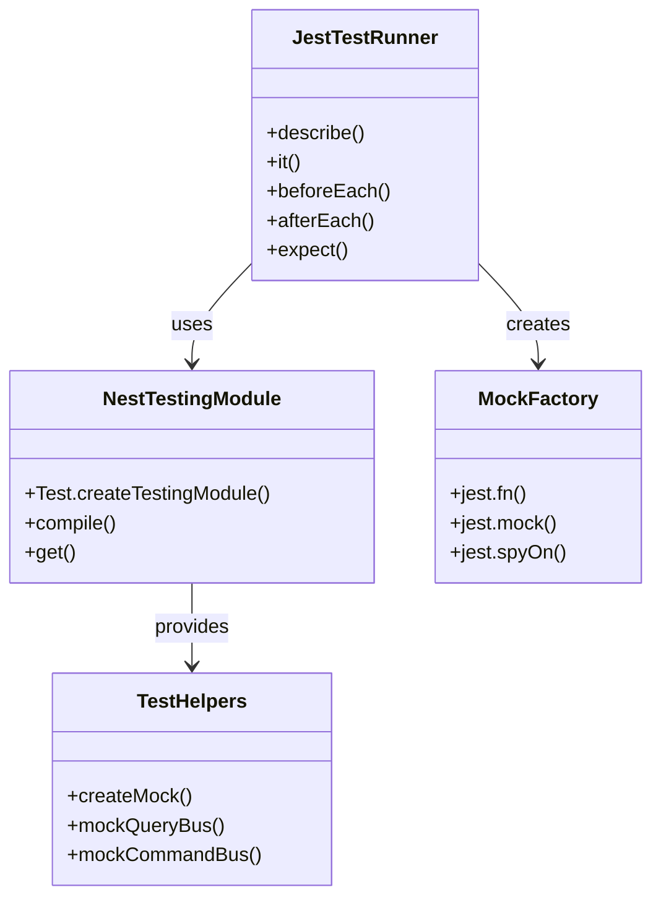

# Unit Testing Guide

This guide explains how to write effective unit tests for the NestJS API application using Jest.

## Overview

Unit tests in this codebase use **Jest** as the testing framework. All tests should be:

- **Fast** - Run in milliseconds
- **Isolated** - No external dependencies (database, network, file system)
- **Deterministic** - Same input always produces same output
- **Readable** - Clear test names and structure

## Architecture



## Test Structure

### File Organization

Tests are co-located with source code in `__tests__/` directories:

```
modules/
└── {feature}/
    ├── __tests__/
    │   ├── controllers/
    │   │   └── {feature}.controller.unit.test.ts
    │   ├── handlers/
    │   │   ├── commands/
    │   │   │   └── {command}.handler.unit.test.ts
    │   │   └── queries/
    │   │       └── {query}.handler.unit.test.ts
    │   └── repositories/
    │       └── {feature}.repository.unit.test.ts
```

### Test File Template

```typescript
/**
 * {ComponentName} Unit Tests
 *
 * Tests the {ComponentName} functionality.
 * Mocks {dependencies} to isolate the unit under test.
 */

import { Test, TestingModule } from '@nestjs/testing';

import { {ComponentName} } from '../{component-name}';

describe('{ComponentName}', () => {
  let component: {ComponentName};
  let dependency: jest.Mocked<DependencyType>;

  const mockDependencyValue = {
    // Mock data
  };

  beforeEach(async () => {
    const module: TestingModule = await Test.createTestingModule({
      providers: [
        {ComponentName},
        {
          provide: Dependency,
          useValue: {
            method: jest.fn(),
          },
        },
      ],
    }).compile();

    component = module.get<{ComponentName}>({ComponentName});
    // Cast to any to bypass jest.Mocked type issues
    dependency = module.get<Dependency>(Dependency) as any;
  });

  afterEach(() => {
    jest.clearAllMocks();
  });

  describe('{method or scenario}', () => {
    it('should {expected behavior}', async () => {
      // Arrange
      dependency.method.mockResolvedValue(mockValue);

      // Act
      const result = await component.method();

      // Assert
      expect(result).toEqual(expected);
      expect(dependency.method).toHaveBeenCalledWith(expectedArgs);
    });
  });
});
```

## NestJS Testing Module

### Basic Setup

The `Test.createTestingModule()` creates a test module with mocked dependencies:

```typescript
import { Test, TestingModule } from '@nestjs/testing';
import { UsersController } from '../controllers/users.controller';
import { QueryBus } from '@nestjs/cqrs';

describe('UsersController', () => {
  let controller: UsersController;
  let queryBus: jest.Mocked<QueryBus>;

  beforeEach(async () => {
    const module: TestingModule = await Test.createTestingModule({
      controllers: [UsersController],
      providers: [
        {
          provide: QueryBus,
          useValue: {
            execute: jest.fn()
          }
        }
      ]
    }).compile();

    controller = module.get<UsersController>(UsersController);
    // Cast to any to bypass jest.Mocked type issues
    queryBus = module.get<QueryBus>(QueryBus) as any;
  });
});
```

### Module Imports

If the controller depends on modules, import them with mocked providers:

```typescript
beforeEach(async () => {
  const module: TestingModule = await Test.createTestingModule({
    controllers: [UsersController],
    imports: [CqrsModule],
    providers: [
      {
        provide: QueryBus,
        useValue: {
          execute: jest.fn()
        }
      }
    ]
  }).compile();
});
```

### Override Providers

Use `overrideProvider()` to replace providers from imported modules:

```typescript
beforeEach(async () => {
  const module: TestingModule = await Test.createTestingModule({
    imports: [UsersModule]
  })
    .overrideProvider(UserRepository)
    .useValue({
      findById: jest.fn()
    })
    .compile();
});
```

## Mocking Dependencies

### Mocking QueryBus

```typescript
const queryBus = {
  execute: jest.fn()
};

// Setup mock return value
queryBus.execute.mockResolvedValue(mockUserResponse);

// Reset after test
afterEach(() => {
  jest.clearAllMocks();
});

// Assert calls
expect(queryBus.execute).toHaveBeenCalledWith(
  expect.objectContaining({
    tenantId: 123
  })
);
```

### Mocking CommandBus

```typescript
const commandBus = {
  execute: jest.fn()
};

commandBus.execute.mockResolvedValue({ id: 1, name: 'John' });

expect(commandBus.execute).toHaveBeenCalledTimes(1);
```

### Mocking Repositories

```typescript
const mockRepository = {
  findById: jest.fn(),
  create: jest.fn(),
  update: jest.fn(),
  delete: jest.fn()
};

// Setup different return values
mockRepository.findById.mockResolvedValueOnce(user);
mockRepository.findById.mockResolvedValueOnce(null);

// Or use mockImplementation
mockRepository.findById.mockImplementation((id) => {
  if (id === 1) return Promise.resolve(user);
  return Promise.resolve(null);
});
```

### Mocking Services

```typescript
const mockTranslationService = {
  translate: jest.fn().mockReturnValue('Translated text'),
  translateAsync: jest.fn().mockResolvedValue({
    message: 'Translated text',
    locale: 'en',
    usedFallback: false
  })
};
```

### Spying on Methods

Use `jest.spyOn()` to spy on existing methods:

```typescript
// Spy on repository method
jest.spyOn(repository, 'findByIdOrThrow' as any).mockResolvedValue(mockUser);

// Spy on private/protected methods
jest.spyOn(service['privateMethod'] as any).mockReturnValue('mocked value');

// Restore after test
afterEach(() => {
  jest.restoreAllMocks();
});
```

## Testing Controllers

### Controller Test Template

```typescript
import { Test, TestingModule } from '@nestjs/testing';
import { QueryBus } from '@nestjs/cqrs';
import { UsersController } from '../controllers/users.controller';

describe('UsersController', () => {
  let controller: UsersController;
  let queryBus: jest.Mocked<QueryBus>;

  const mockUserResponse = {
    id: 1,
    name: 'John Doe'
  };

  beforeEach(async () => {
    const module: TestingModule = await Test.createTestingModule({
      controllers: [UsersController],
      providers: [
        {
          provide: QueryBus,
          useValue: {
            execute: jest.fn()
          }
        }
      ]
    }).compile();

    controller = module.get<UsersController>(UsersController);
    queryBus = module.get<QueryBus>(QueryBus) as any;
  });

  afterEach(() => {
    jest.clearAllMocks();
  });

  describe('findOne', () => {
    it('should return user wrapped in BaseResponseDto', async () => {
      // Arrange
      queryBus.execute.mockResolvedValue(mockUserResponse);

      // Act
      const result = await controller.findOne('123', 1);

      // Assert
      expect(result.data).toEqual(mockUserResponse);
      expect(queryBus.execute).toHaveBeenCalledWith(
        expect.objectContaining({
          tenantId: 123,
          userId: 1
        })
      );
    });

    it('should throw error for invalid tenant ID', async () => {
      // Arrange & Act & Assert
      await expect(controller.findOne('invalid', 1)).rejects.toThrow(
        Errors.validationinvalidValueFor002({
          field: 'x-tenant-id',
          expectedType: 'integer'
        })
      );
    });
  });

  describe('findAll', () => {
    it('should return paginated users', async () => {
      // Arrange
      const mockPaginatedResponse = {
        data: [mockUserResponse],
        metadata: {
          pagination: {
            page: 1,
            pageSize: 20,
            total: 1,
            totalPages: 1,
            hasNext: false,
            hasPrevious: false
          },
          timestamp: new Date()
        }
      };
      queryBus.execute.mockResolvedValue(mockPaginatedResponse);

      const queryDto = new QueryUsersDto();
      Object.assign(queryDto, { page: 1, pageSize: 20 });

      // Act
      const result = await controller.findAll('123', queryDto);

      // Assert
      expect(result).toEqual(mockPaginatedResponse);
    });
  });
});
```

### Key Points

1. **Mock QueryBus/CommandBus** - Controllers should never execute actual queries/commands
2. **Test validation** - Verify DTO validation errors
3. **Test tenant parsing** - Verify tenant ID string to number conversion
4. **Use Object.assign for readonly DTOs** - Bypass TypeScript readonly in tests

## Testing Handlers

### Command Handler Test Template

```typescript
import { Test, TestingModule } from '@nestjs/testing';
import { CommandBus } from '@nestjs/cqrs';
import { CreateUserCommand } from '../commands/create-user.command';
import { CreateUserHandler } from './create-user.handler';
import { UserRepository } from '../repositories/user.repository';

describe('CreateUserHandler', () => {
  let handler: CreateUserHandler;
  let repository: jest.Mocked<UserRepository>;
  let eventBus: jest.Mocked<CommandBus>;

  const mockUser = {
    id: 1,
    email: 'test@example.com',
    name: 'Test User'
  };

  beforeEach(async () => {
    const module: TestingModule = await Test.createTestingModule({
      providers: [
        CreateUserHandler,
        {
          provide: UserRepository,
          useValue: {
            findByEmail: jest.fn(),
            create: jest.fn()
          }
        },
        {
          provide: CommandBus,
          useValue: {
            publish: jest.fn(),
            execute: jest.fn()
          }
        }
      ]
    }).compile();

    handler = module.get<CreateUserHandler>(CreateUserHandler);
    repository = module.get<UserRepository>(UserRepository) as any;
    eventBus = module.get<CommandBus>(CommandBus) as any;
  });

  it('should create user and publish event', async () => {
    // Arrange
    const command = new CreateUserCommand({
      tenantId: 123,
      actorId: 1,
      email: 'test@example.com',
      password: 'hashedPassword',
      name: 'Test User'
    });

    repository.findByEmail.mockResolvedValue(null);
    repository.create.mockResolvedValue(mockUser);

    // Act
    const result = await handler.execute(command);

    // Assert
    expect(result).toEqual(mockUser);
    expect(repository.findByEmail).toHaveBeenCalledWith(123, 'test@example.com');
    expect(repository.create).toHaveBeenCalledWith(123, expect.any(Object));
    expect(eventBus.publish).toHaveBeenCalled();
  });

  it('should throw error if email already exists', async () => {
    // Arrange
    const command = new CreateUserCommand({
      tenantId: 123,
      actorId: 1,
      email: 'test@example.com',
      password: 'hashedPassword',
      name: 'Test User'
    });

    repository.findByEmail.mockResolvedValue(mockUser);

    // Act & Assert
    await expect(handler.execute(command)).rejects.toThrow(
      Errors.useruserWithEmail002({ email: 'test@example.com' })
    );
    expect(repository.create).not.toHaveBeenCalled();
    expect(eventBus.publish).not.toHaveBeenCalled();
  });
});
```

### Query Handler Test Template

```typescript
import { Test, TestingModule } from '@nestjs/testing';
import { GetUserQuery } from '../queries/get-user.query';
import { GetUserHandler } from './get-user.handler';
import { UserRepository } from '../repositories/user.repository';

describe('GetUserHandler', () => {
  let handler: GetUserHandler;
  let repository: jest.Mocked<UserRepository>;

  const mockUser = {
    id: 1,
    email: 'test@example.com',
    name: 'Test User'
  };

  beforeEach(async () => {
    const module: TestingModule = await Test.createTestingModule({
      providers: [
        GetUserHandler,
        {
          provide: UserRepository,
          useValue: {
            findById: jest.fn()
          }
        }
      ]
    }).compile();

    handler = module.get<GetUserHandler>(GetUserHandler);
    repository = module.get<UserRepository>(UserRepository) as any;
  });

  it('should return user by ID', async () => {
    // Arrange
    const query = new GetUserQuery({ tenantId: 123, userId: 1 });
    repository.findById.mockResolvedValue(mockUser);

    // Act
    const result = await handler.execute(query);

    // Assert
    expect(result).toEqual(mockUser);
    expect(repository.findById).toHaveBeenCalledWith(123, 1);
  });

  it('should throw error if user not found', async () => {
    // Arrange
    const query = new GetUserQuery({ tenantId: 123, userId: 999 });
    repository.findById.mockResolvedValue(null);

    // Act & Assert
    await expect(handler.execute(query)).rejects.toThrow(
      Errors.databaserecordNotFound004({ entity: 'User' })
    );
  });
});
```

### Key Points

1. **Mock repositories** - Never use real database in unit tests
2. **Test business logic** - Validation, error handling, event publishing
3. **Verify side effects** - Check events are published after state changes
4. **Test error cases** - Verify errors are thrown for invalid input

## Testing Repositories

### Repository Test Template

```typescript
import { Test, TestingModule } from '@nestjs/testing';
import { UserRepository } from '../user.repository';
import { users } from '@package/db-core';
import { MAIN_DB } from '@/common/database/database.constants';
import type { NodePgDatabase } from 'drizzle-orm/node-postgres';

describe('UserRepository', () => {
  let repository: UserRepository;
  let db: jest.Mocked<NodePgDatabase>;

  const mockUser = {
    id: 1,
    organizationId: 123,
    email: 'test@example.com',
    name: 'Test User'
  };

  beforeEach(async () => {
    const module: TestingModule = await Test.createTestingModule({
      providers: [
        UserRepository,
        {
          provide: MAIN_DB,
          useValue: {
            select: jest.fn(),
            insert: jest.fn(),
            update: jest.fn(),
            delete: jest.fn()
          }
        }
      ]
    }).compile();

    repository = module.get<UserRepository>(UserRepository);
    // Cast to any to bypass complex Drizzle mock typing
    db = module.get<NodePgDatabase>(MAIN_DB) as any;
  });

  afterEach(() => {
    jest.clearAllMocks();
  });

  describe('findById', () => {
    it('should find user by ID within tenant scope', async () => {
      // Arrange
      const mockDbSelect = {
        from: jest.fn().mockReturnThis(),
        where: jest.fn().mockReturnThis(),
        limit: jest.fn().mockResolvedValue([mockUser])
      };
      db.select.mockReturnValue(mockDbSelect);

      // Act
      const result = await repository.findById(123, 1);

      // Assert
      expect(result).toEqual(mockUser);
      expect(db.select).toHaveBeenCalled();
    });

    it('should return null if user not found', async () => {
      // Arrange
      const mockDbSelect = {
        from: jest.fn().mockReturnThis(),
        where: jest.fn().mockReturnThis(),
        limit: jest.fn().mockResolvedValue([])
      };
      db.select.mockReturnValue(mockDbSelect);

      // Act
      const result = await repository.findById(123, 999);

      // Assert
      expect(result).toBeNull();
    });
  });

  describe('create', () => {
    it('should create user within tenant', async () => {
      // Arrange
      const mockDbInsert = {
        values: jest.fn().mockReturnThis(),
        returning: jest.fn().mockResolvedValue([mockUser])
      };
      db.insert.mockReturnValue(mockDbInsert);

      // Act
      const result = await repository.create(123, {
        email: 'test@example.com',
        name: 'Test User'
      });

      // Assert
      expect(result).toEqual(mockUser);
      expect(db.insert).toHaveBeenCalled();
    });
  });

  describe('update', () => {
    it('should verify user exists before updating', async () => {
      // Arrange
      const mockDbUpdate = {
        set: jest.fn().mockReturnThis(),
        where: jest.fn().mockReturnThis(),
        returning: jest.fn().mockResolvedValue([mockUser])
      };
      db.update.mockReturnValue(mockDbUpdate);

      jest.spyOn(repository, 'findByIdOrThrow' as any).mockResolvedValue(mockUser);

      // Act
      const result = await repository.update(123, 1, {
        updatedAt: new Date()
      });

      // Assert
      expect(result).toEqual(mockUser);
    });

    it('should throw error if user not found', async () => {
      // Arrange
      const notFoundError = Errors.databaserecordNotFound004({ entity: 'User' });
      jest.spyOn(repository, 'findByIdOrThrow' as any).mockRejectedValue(notFoundError);

      // Act & Assert
      await expect(repository.update(123, 999, {})).rejects.toThrow(notFoundError);
    });
  });
});
```

### Key Points

1. **Mock Drizzle ORM** - Use jest.fn() for chained methods
2. **Test tenant scoping** - Verify queries include tenant filters
3. **Test error cases** - Verify proper errors are thrown
4. **Test existence checks** - Verify findByIdOrThrow is called before updates/deletes

## Testing Services

### Service Test Template

```typescript
import { Test, TestingModule } from '@nestjs/testing';
import { TranslationHelperService } from './translation-helper.service';
import { TranslationService } from '@package/errors';

describe('TranslationHelperService', () => {
  let service: TranslationHelperService;
  let translationService: jest.Mocked<TranslationService>;

  beforeEach(async () => {
    const module: TestingModule = await Test.createTestingModule({
      providers: [
        TranslationHelperService,
        {
          provide: TranslationService,
          useValue: {
            translate: jest.fn(),
            translateAsync: jest.fn()
          }
        }
      ]
    }).compile();

    service = module.get<TranslationHelperService>(TranslationHelperService);
    translationService = module.get<TranslationService>(TranslationService) as any;
  });

  it('should translate message using TranslationService', () => {
    // Arrange
    translationService.translate.mockReturnValue('Translated message');

    // Act
    const result = service.translate('api.test.key');

    // Assert
    expect(result).toBe('Translated message');
    expect(translationService.translate).toHaveBeenCalledWith('api.test.key');
  });

  it('should translate message with parameters', () => {
    // Arrange
    translationService.translate.mockReturnValue('Hello John');

    // Act
    const result = service.translate('api.greeting', { name: 'John' });

    // Assert
    expect(result).toBe('Hello John');
    expect(translationService.translate).toHaveBeenCalledWith('api.greeting', { name: 'John' });
  });
});
```

## Common Patterns

### Testing Error Cases

```typescript
it('should throw error for invalid input', async () => {
  // Arrange
  const invalidInput = { email: 'not-an-email' };

  // Act & Assert
  await expect(service.create(invalidInput)).rejects.toThrow(
    Errors.validationinvalidValueFor002({
      field: 'email',
      expectedType: 'email'
    })
  );
});
```

### Testing Async Operations

```typescript
it('should handle async operation', async () => {
  // Arrange
  const promise = Promise.resolve(mockData);
  repository.findById.mockReturnValue(promise);

  // Act
  const result = await service.getData();

  // Assert
  expect(result).toEqual(mockData);
});
```

### Testing Multiple Scenarios

```typescript
describe('validateEmail', () => {
  it.each([
    ['test@example.com', true],
    ['invalid-email', false],
    ['', false],
    ['@example.com', false]
  ])('should validate "%s" as %s', (email, expected) => {
    // Act
    const result = service.validateEmail(email);

    // Assert
    expect(result).toBe(expected);
  });
});
```

### Testing with Mock Implementations

```typescript
it('should handle different scenarios', async () => {
  // Arrange
  repository.findById.mockImplementation((id) => {
    if (id === 1) return Promise.resolve({ id: 1, name: 'Active' });
    if (id === 2) return Promise.resolve({ id: 2, name: 'Inactive' });
    return Promise.resolve(null);
  });

  // Act & Assert - Test case 1
  const result1 = await service.getUser(1);
  expect(result1.name).toBe('Active');

  // Act & Assert - Test case 2
  const result2 = await service.getUser(2);
  expect(result2.name).toBe('Inactive');

  // Act & Assert - Test case 3
  const result3 = await service.getUser(3);
  expect(result3).toBeNull();
});
```

## Best Practices

### 1. Test Naming

Use descriptive test names that follow the pattern: `should {expected behavior} when {condition}`

```typescript
// Good
it('should return user when user exists');
it('should throw error when user not found');
it('should create user with valid input');

// Avoid
it('works');
it('test user');
```

### 2. Arrange-Act-Assert (AAA) Pattern

Structure your tests with clear sections:

```typescript
it('should update user', async () => {
  // Arrange - Set up test data and mocks
  const updateData = { name: 'Updated Name' };
  repository.findById.mockResolvedValue(mockUser);
  repository.update.mockResolvedValue(updatedUser);

  // Act - Execute the code being tested
  const result = await service.update(1, updateData);

  // Assert - Verify the result
  expect(result.name).toBe('Updated Name');
  expect(repository.update).toHaveBeenCalledWith(1, updateData);
});
```

### 3. One Assertion Per Test

Keep tests focused on one behavior:

```typescript
// Good
it('should set tenant ID on user', () => {
  const user = service.createWithTenant(123, data);
  expect(user.organizationId).toBe(123);
});

it('should set timestamps on user', () => {
  const user = service.create(data);
  expect(user.createdAt).toBeInstanceOf(Date);
  expect(user.updatedAt).toBeInstanceOf(Date);
});

// Avoid
it('should set tenant ID and timestamps', () => {
  // Tests two different things
});
```

### 4. Use Test-Specific Fixtures

Create reusable test fixtures:

```typescript
// __tests__/fixtures/user.fixture.ts
export function createMockUser(overrides = {}) {
  return {
    id: 1,
    organizationId: 123,
    email: 'test@example.com',
    name: 'Test User',
    ...overrides
  };
}

// In test
import { createMockUser } from '../fixtures/user.fixture';

it('should return user', () => {
  const mockUser = createMockUser({ name: 'Custom Name' });
  repository.findById.mockResolvedValue(mockUser);

  const result = await service.getUser(1);

  expect(result.name).toBe('Custom Name');
});
```

### 5. Mock External Dependencies

Never call real external services in unit tests:

```typescript
// Good
const mockEmailService = {
  sendEmail: jest.fn().mockResolvedValue({ success: true })
};

// Bad
const emailService = new EmailService(); // Real service!
```

### 6. Reset Mocks Between Tests

Always clear mocks in `afterEach`:

```typescript
afterEach(() => {
  jest.clearAllMocks();
  jest.restoreAllMocks();
});
```

### 7. Use Type Assertions for Complex Mocks

For complex dependency injection, use `as any`:

```typescript
const queryBus = module.get<QueryBus>(QueryBus) as any;
```

### 8. Test Edge Cases

Don't forget to test boundary conditions:

```typescript
describe('pagination', () => {
  it('should handle page 1');
  it('should handle last page');
  it('should handle empty results');
  it('should handle page number less than 1');
  it('should handle page size greater than max');
});
```

## Running Tests

### Run All Unit Tests

```bash
pnpm nx test api
```

### Run Specific Test File

```bash
pnpm nx run api:test:file -- src/modules/users/__tests__/controllers/users.controller.unit.test.ts
```

### Run Tests in Watch Mode

```bash
pnpm nx test api -- --watch
```

### Runtime Parity with CI

Use the Node version from `package.json` engines (`>=25.0.0`) when validating test behavior locally. Test selection and Jest/Nx CLI behavior can differ on older Node runtimes.

## Test Examples from Codebase

See these files for complete examples:

- `src/modules/health/__tests__/controllers/health.controller.unit.test.ts` - Controller test
- `src/modules/users/__tests__/controllers/users.controller.unit.test.ts` - Controller with validation
- `src/modules/users/__tests__/handlers/queries/get-user.handler.unit.test.ts` - Query handler
- `src/modules/users/__tests__/repositories/user.repository.unit.test.ts` - Repository test

## Documentation References

- [E2E Testing Guide](e2e-testing-guide.md) - Integration and end-to-end tests
- [Jest Documentation](https://jestjs.io/docs/getting-started) - Official Jest docs
- [NestJS Testing](https://docs.nestjs.com/fundamentals/testing) - NestJS testing guide
