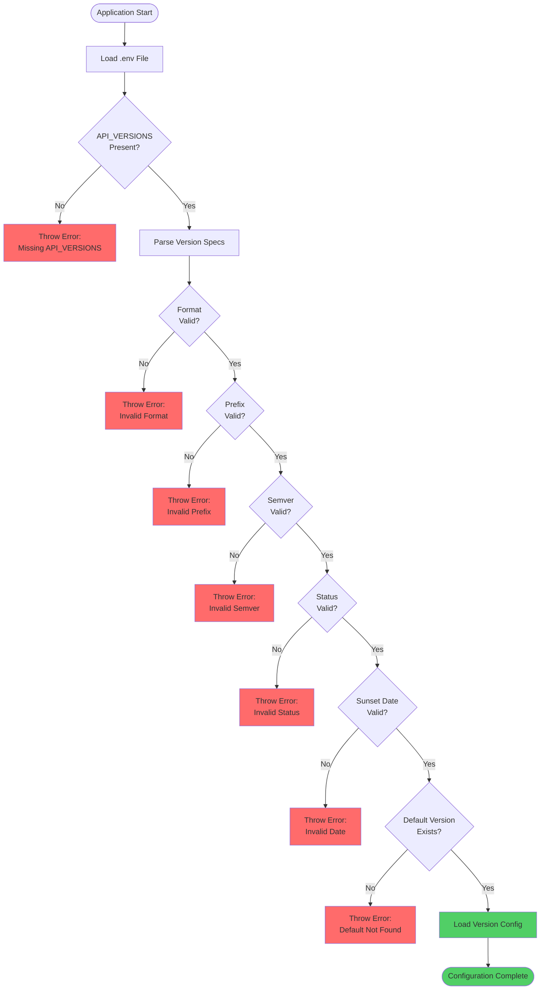
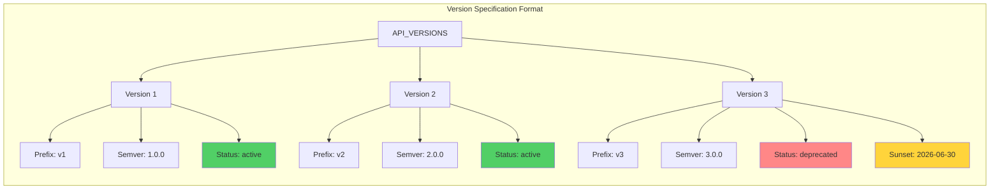

# API Versioning Configuration

## Configuration Flow



## Environment Variables

### Required Variables

| Variable              | Type   | Default | Description                                          |
| --------------------- | ------ | ------- | ---------------------------------------------------- |
| `API_VERSIONS`        | string | -       | **Required.** Comma-separated version specifications |
| `API_DEFAULT_VERSION` | string | First   | Default version prefix to use                        |

### Optional Variables

| Variable                       | Type   | Default   | Description                                        |
| ------------------------------ | ------ | --------- | -------------------------------------------------- |
| `API_DEPRECATION_WARNING_DAYS` | number | `90`      | Default days until sunset for deprecation warnings |
| `GIT_COMMIT`                   | string | `unknown` | Full Git commit hash (set during build)            |
| `GIT_SHORT_COMMIT`             | string | `unknown` | Short 7-character Git hash (set during build)      |

## API_VERSIONS Format

### Version Specification Diagram



The `API_VERSIONS` variable is **required** and uses the following format:

```
API_VERSIONS=prefix:version:status[:sunsetDate],prefix:version:status[:sunsetDate],...
```

### Format Specification

| Field        | Description                                            | Example                | Required |
| ------------ | ------------------------------------------------------ | ---------------------- | -------- |
| `prefix`     | URL prefix for this version (must match `^v\d+$`)      | `v1`, `v2`             | Yes      |
| `version`    | Semantic version (must match `^\d+\.\d+\.\d+$`)        | `1.0.0`, `2.1.3`       | Yes      |
| `status`     | Version status: `active`, `deprecated`, or `sunset`    | `active`, `deprecated` | Yes      |
| `sunsetDate` | (Optional) ISO date when deprecated version is removed | `2026-06-30`           | No       |

### Valid Status Values

The `status` field accepts the following values (case-sensitive):

- `active` - Current stable version, recommended for use
- `deprecated` - Scheduled for removal, deprecation warnings enabled
- `sunset` - Past sunset date, no longer accessible

### Validation Rules

**Prefix validation:**

- Must match pattern: `^v\d+$` (v followed by number)
- Valid: `v1`, `v2`, `v10`
- Invalid: `v1.0`, `version1`, `1`, `v-1`

**Semantic version validation:**

- Must match pattern: `^\d+\.\d+\.\d+$`
- Valid: `1.0.0`, `2.1.3`, `10.20.30`
- Invalid: `1.0`, `v1.0.0`, `2025.12.30`

**Sunset date validation:**

- Must be valid ISO 8601 date format
- Valid: `2026-06-30`, `2026-06-30T23:59:59Z`
- Invalid: `06-30-2026`, `June 30, 2026`

### Configuration Examples

```env
# Single active version
API_VERSIONS=v1:1.0.0:active
API_DEFAULT_VERSION=v1

# Multiple active versions
API_VERSIONS=v1:1.0.0:active,v2:2.0.0:active
API_DEFAULT_VERSION=v2

# With deprecated version
API_VERSIONS=v1:1.0.0:deprecated:2026-06-30,v2:2.0.0:active
API_DEFAULT_VERSION=v2

# Multiple versions with varying statuses
API_VERSIONS=v1:1.0.0:deprecated:2026-06-30,v2:2.0.0:active,v3:3.0.0:active
API_DEFAULT_VERSION=v3
```

## Configuration Files

### `.env` Example

```env
# API Versioning (required)
API_VERSIONS=v1:1.0.0:active,v2:2.0.0:active
API_DEFAULT_VERSION=v1
API_DEPRECATION_WARNING_DAYS=90

# Git Information (set during build)
GIT_COMMIT=a1b2c3d4e5f6g7h8i9j0k1l2m3n4o5p6q7r8s9t0
GIT_SHORT_COMMIT=a1b2c3d
```

### Error Messages

The system provides clear error messages for misconfigurations:

**Missing API_VERSIONS:**

```
Error: API_VERSIONS environment variable is required.
Format: API_VERSIONS=v1:1.0.0:active,v2:2.0.0:active
Format: prefix:version:status[:sunsetDate]
  - prefix: Version URL prefix (e.g., v1, v2)
  - version: Semantic version (e.g., 1.0.0)
  - status: active, deprecated, or sunset
  - sunsetDate: (optional) ISO date when deprecated version will be removed
```

**Invalid version spec:**

```
Error: Invalid API_VERSIONS spec at index 0: "v1.0:1.0.0:active".
Expected format: prefix:version:status[:sunsetDate]
Example: v1:1.0.0:active or v1:1.0.0:deprecated:2026-06-30
```

**Invalid prefix:**

```
Error: Invalid version prefix "v1.0" at index 0.
Prefix must match format: v<number> (e.g., v1, v2, v3)
```

**Invalid semantic version:**

```
Error: Invalid semantic version "1.0" at index 0.
Version must match format: MAJOR.MINOR.PATCH (e.g., 1.0.0, 2.1.3)
```

**Invalid status:**

```
Error: Invalid API version status "production".
Valid values are: active, deprecated, sunset
```

**Invalid sunset date:**

```
Error: Invalid sunset date "June 30, 2026" at index 0.
Date must be in ISO 8601 format (e.g., 2026-06-30 or 2026-06-30T23:59:59Z)
```

**Default version not found:**

```
Error: API_DEFAULT_VERSION "v3" not found in API_VERSIONS.
Available versions: v1, v2
```

## Version Format

### Semantic Versioning

```
MAJOR.MINOR.PATCH

Example: 1.2.3
- MAJOR: 1 (breaking changes)
- MINOR: 2 (new features)
- PATCH: 3 (bug fixes)
```

### Version Prefix

```
v{major_version}

Example: v1 (for version 1.x.x)
```

## Build-Time Git Information

### Dockerfile Example

```dockerfile
# Set Git info during build
ARG GIT_COMMIT
ARG GIT_SHORT_COMMIT

ENV GIT_COMMIT=${GIT_COMMIT}
ENV GIT_SHORT_COMMIT=${GIT_SHORT_COMMIT}
```

### Docker Build Command

```bash
docker build \
  --build-arg GIT_COMMIT=$(git rev-parse HEAD) \
  --build-arg GIT_SHORT_COMMIT=$(git rev-parse --short=7 HEAD) \
  -t myapp:latest .
```

### CI/CD Example (GitHub Actions)

```yaml
- name: Set Git environment variables
  run: |
    echo "GIT_COMMIT=$(git rev-parse HEAD)" >> $GITHUB_ENV
    echo "GIT_SHORT_COMMIT=$(git rev-parse --short=7 HEAD)" >> $GITHUB_ENV

- name: Build and run
  run: |
    pnpm nx build api
    GIT_COMMIT=$GIT_COMMIT GIT_SHORT_COMMIT=$GIT_SHORT_COMMIT pnpm nx serve api
```

## ConfigService Integration

### Version Configuration Interface

The version configuration is registered under the `version` key:

```typescript
// src/config/version.config.ts
interface ApiVersionConfig {
  enabled: boolean;
  versions: ApiVersionInfo[];
  defaultVersion: string;
  deprecationWarningDays: number;
}

interface ApiVersionInfo {
  prefix: string; // 'v1', 'v2'
  version: string; // '1.0.0', '2.0.0'
  status: ApiVersionStatus; // 'active', 'deprecated', 'sunset'
  sunsetDate?: string; // ISO date when deprecated version will be removed
}

enum ApiVersionStatus {
  ACTIVE = 'active',
  DEPRECATED = 'deprecated',
  SUNSET = 'sunset'
}
```

### Accessing Configuration

```typescript
import { ConfigService } from '@nestjs/config';

constructor(private readonly configService: ConfigService) {}

const versionConfig = this.configService.get<ApiVersionConfig>('version');
const versions = versionConfig?.versions;
const defaultVersion = versionConfig?.defaultVersion;
```

### VersionService

The `VersionService` provides convenient methods for accessing version information:

```typescript
import { VersionService } from '@/common/services/version.service';

constructor(private readonly versionService: VersionService) {}

// Get specific version info
const v1Info = this.versionService.getVersion('v1');

// Get all versions
const allVersions = this.versionService.getAllVersions();

// Get active versions only
const activeVersions = this.versionService.getActiveVersions();

// Check if version is deprecated
const isDeprecated = this.versionService.isVersionDeprecated('v1');

// Get deprecation info
const deprecationInfo = this.versionService.getDeprecationInfo('v1');
// { deprecated: true, sunsetDate: '2026-06-30', daysUntilSunset: 180 }
```

## Version Information Endpoints

### Health Endpoint

The health endpoint automatically includes version information:

```bash
curl http://localhost:3000/api/v1/health
```

Response:

```json
{
  "status": "ok",
  "message": "API is healthy",
  "version": "1.0.0",
  "timestamp": "2025-12-30T23:00:00.000Z"
}
```

The health endpoint uses `getSemanticVersion()` to retrieve the default version number.

### Full Version Info Endpoint

Create a custom endpoint for detailed version information:

```typescript
@Get('version')
getVersion() {
  return this.versionService.getFullVersionInfo();
}
```

Response:

```json
{
  "version": "1.0.0",
  "gitCommit": "a1b2c3d4e5f6g7h8i9j0k1l2m3n4o5p6q7r8s9t0",
  "gitShortCommit": "a1b2c3d",
  "buildDate": "2025-12-30T23:00:00.000Z"
}
```

## Configuration Best Practices

### 1. Use Semantic Versioning

```env
# ✅ Good - Clear semantic version
API_VERSIONS=v1:1.2.3:active

# ❌ Bad - Arbitrary version
API_VERSIONS=v1:2025.12.30:active
```

### 2. Match Version Prefix to Major Version

```env
# For version 2.x.x
API_VERSIONS=v2:2.1.0:active
```

### 3. Always Provide Required Variables

```env
# ✅ Good - All required variables set
API_VERSIONS=v1:1.0.0:active,v2:2.0.0:active
API_DEFAULT_VERSION=v2

# ❌ Bad - Missing API_VERSIONS will cause startup error
API_DEFAULT_VERSION=v1
```

### 4. Set Git Info During Build

```bash
# Set before starting the application
export GIT_COMMIT=$(git rev-parse HEAD)
export GIT_SHORT_COMMIT=$(git rev-parse --short=7 HEAD)

pnpm nx serve api
```

### 5. Validate Configuration Early

The system validates configuration at startup and provides clear error messages. Fix all errors before deploying.

## Troubleshooting

### Application Won't Start

**Problem**: Application throws error during startup

**Solution**:

1. Check that `API_VERSIONS` is set
2. Verify format: `prefix:version:status[:sunsetDate]`
3. Check error message for specific validation failure
4. Ensure semantic version format: `MAJOR.MINOR.PATCH`

### Version Prefix Not Working

**Problem**: Endpoints not accessible under `/api/v1/`

**Solution**:

1. Check `API_VERSIONS` format in `.env`
2. Verify prefix matches `^v\d+$` pattern
3. Ensure application starts successfully
4. Check logs for validation errors

### Git Info Shows 'unknown'

**Problem**: `gitCommit` and `gitShortCommit` return `'unknown'`

**Solution**:

1. Set `GIT_COMMIT` and `GIT_SHORT_COMMIT` environment variables
2. Set these during build, not runtime
3. Verify variables are exported before starting the app

### Default Version Not Found

**Problem**: Error says default version not found

**Solution**:

1. Check `API_DEFAULT_VERSION` matches a prefix in `API_VERSIONS`
2. Example: If `API_DEFAULT_VERSION=v2`, ensure `v2:...` exists in `API_VERSIONS`

```

```
