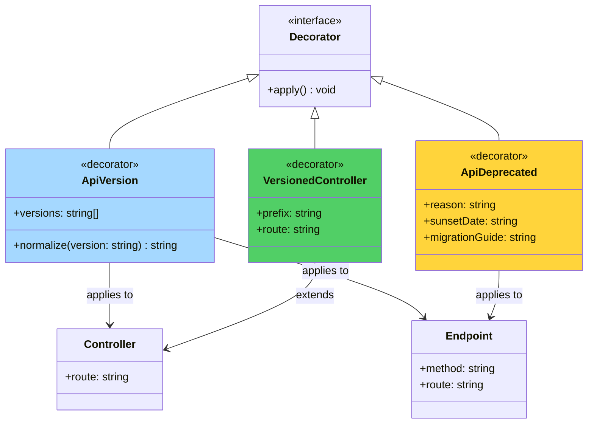
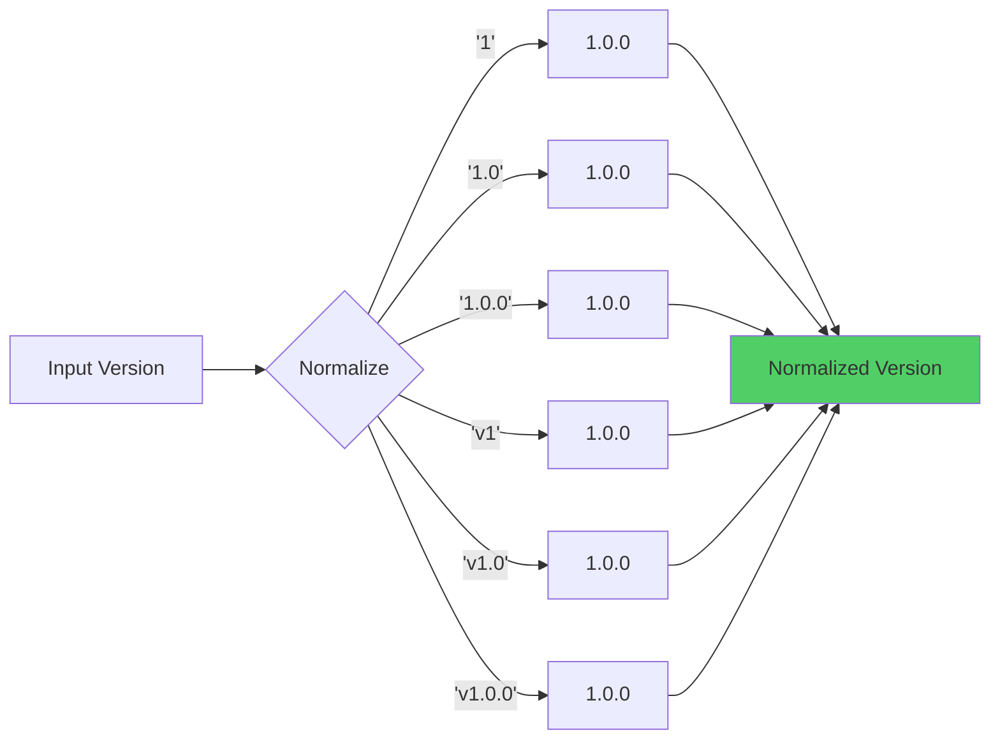

# API Version Decorators

## Decorator Application Flow

```mermaid
flowchart TD
    Start([Controller Definition]) --> Choose{Decorator Type}

    Choose -->|@ApiVersion| ApiVer[Set Version Metadata]
    Choose -->|@ApiDeprecated| ApiDep[Set Deprecation Metadata]
    Choose -->|@VersionedController| VerCon[Combined Decorator]

    ApiVer --> ClassOrMethod{Application Level}
    ClassOrMethod -->|Class Level| ClassMeta[Apply to All Methods]
    ClassOrMethod -->|Method Level| MethodMeta[Apply to Single Method]

    ApiDep --> SetReason[Set Deprecation Reason]
    SetReason --> SetSunset[Optional Sunset Date]

    VerCon --> SetPrefix[Set Version Prefix]
    SetPrefix --> SetRoute[Set Controller Route]

    ClassMeta --> End([Metadata Stored])
    MethodMeta --> End
    SetSunset --> End
    SetRoute --> End

    style ApiVer fill:#a5d8ff
    style ApiDep fill:#ffd43b
    style VerCon fill:#51cf66
```

## Decorator Hierarchy



## Version Normalization



## Overview

The API versioning system provides decorators for declaring version requirements on controllers and endpoints.

## Available Decorators

### @ApiVersion

Declares which API versions are allowed for a controller or endpoint.

**Location**: `src/common/decorators/version.decorator.ts`

#### Signature

```typescript
@ApiVersion(...versions: string[])
```

#### Parameters

- `versions` - One or more version strings (e.g., `'1.0'`, `'2.0.0'`, `'v1'`)

#### Usage

**Class-level (entire controller)**:

```typescript
import { Controller, Get } from '@nestjs/common';
import { ApiVersion } from '../common/decorators';

@ApiVersion('1.0')
@Controller('users')
export class UsersController {
  // All endpoints require API version 1.0
  @Get()
  findAll() {
    return { users: [] };
  }
}
```

**Method-level (specific endpoint)**:

```typescript
import { Controller, Get } from '@nestjs/common';
import { ApiVersion } from '../common/decorators';

@Controller('products')
export class ProductsController {
  @Get()
  findAll() {
    // Public endpoint - no version required
    return { products: [] };
  }

  @Get('advanced')
  @ApiVersion('1.0')
  findAdvanced() {
    // Requires API version 1.0
    return { products: [], advanced: true };
  }
}
```

**Multiple versions**:

```typescript
@ApiVersion('1.0', '2.0')
@Controller('reports')
export class ReportsController {
  // This controller supports both v1 and v2
  @Get()
  findAll() {
    return { reports: [] };
  }
}
```

### @ApiDeprecated

Marks an endpoint as deprecated with an optional reason.

**Location**: `src/common/decorators/version.decorator.ts`

#### Signature

```typescript
@ApiDeprecated(reason?: string)
```

#### Parameters

- `reason` - Optional deprecation message

#### Usage

```typescript
import { Controller, Get } from '@nestjs/common';
import { ApiVersion, ApiDeprecated } from '../common/decorators';

@ApiVersion('1.0')
@Controller('old-endpoint')
export class OldController {
  @Get()
  @ApiDeprecated('Use /new-endpoint instead')
  oldMethod() {
    return { message: 'This is deprecated' };
  }

  @Get('alternative')
  @ApiDeprecated() // No reason specified
  alternativeMethod() {
    return { message: 'Also deprecated' };
  }
}
```

## Version Format

### Accepted Formats

The decorator accepts various version formats and normalizes them:

| Input     | Normalized | Description                  |
| --------- | ---------- | ---------------------------- |
| `'1'`     | `'1.0.0'`  | Major version only           |
| `'1.0'`   | `'1.0.0'`  | Major.minor version          |
| `'1.0.0'` | `'1.0.0'`  | Full semantic version        |
| `'v1'`    | `'1.0.0'`  | With 'v' prefix              |
| `'v1.0'`  | `'1.0.0'`  | With 'v' prefix, major.minor |

### Examples

```typescript
// All of these are equivalent:
@ApiVersion('1')
@ApiVersion('1.0')
@ApiVersion('1.0.0')
@ApiVersion('v1')
@ApiVersion('v1.0')
@ApiVersion('v1.0.0')
```

## Composing Decorators

### Combining with Other Decorators

```typescript
import { Controller, Get, UseGuards, UseInterceptors } from '@nestjs/common';
import { ApiTags, ApiOperation } from '@nestjs/swagger';
import { ApiVersion, ApiDeprecated } from '../common/decorators';
import { ApiVersionGuard } from '../common/guards';

@ApiTags('users')
@ApiVersion('1.0')
@UseGuards(ApiVersionGuard)
@Controller('users')
export class UsersController {
  @Get()
  @ApiOperation({ summary: 'Get all users' })
  findAll() {
    return { users: [] };
  }

  @Get('admin')
  @ApiOperation({ summary: 'Admin users endpoint' })
  @UseGuards(AdminGuard)
  getAdminUsers() {
    return { adminUsers: [] };
  }

  @Get('old')
  @ApiOperation({ summary: 'Old users endpoint' })
  @ApiDeprecated('Use /users instead')
  getOldUsers() {
    return { users: [] };
  }
}
```

### Custom Version Decorator

Create a custom decorator for common version combinations:

```typescript
import { SetMetadata } from '@nestjs/common';
import { API_VERSION_KEY } from '../guards/version.guard';

// Support v1 through v1.9
export const ApiV1 = () =>
  ApiVersion('1.0', '1.1', '1.2', '1.3', '1.4', '1.5', '1.6', '1.7', '1.8', '1.9');

// Support v2 only
export const ApiV2 = () => ApiVersion('2.0');

// Usage
@ApiV1()
@Controller('users')
export class UsersControllerV1 {}
```

## Real-World Examples

### Example 1: Versioned Controllers

```typescript
import { Controller, Get, Post, Body, Param } from '@nestjs/common';
import { ApiVersion } from '../common/decorators';

// V1 - Basic functionality
@ApiVersion('1.0')
@Controller('users')
export class UsersControllerV1 {
  @Get()
  findAll() {
    return { users: [] };
  }

  @Get(':id')
  findOne(@Param('id') id: string) {
    return { user: { id, name: 'John' } };
  }
}

// V2 - Enhanced functionality
@ApiVersion('2.0')
@Controller('users')
export class UsersControllerV2 {
  @Get()
  findAll() {
    return {
      users: [],
      pagination: { page: 1, limit: 10, total: 100 }
    };
  }

  @Get(':id')
  findOne(@Param('id') id: string) {
    return {
      user: {
        id,
        name: 'John',
        email: 'john@example.com',
        metadata: { lastLogin: '2025-12-30' }
      }
    };
  }

  @Post()
  create(@Body() createUserDto: CreateUserDto) {
    return { user: createUserDto, created: true };
  }
}
```

### Example 2: Mixed Version Support

```typescript
import { Controller, Get, Post, Body } from '@nestjs/common';
import { ApiVersion } from '../common/decorators';

@Controller('products')
export class ProductsController {
  @Get()
  @ApiVersion('1.0', '2.0') // Both versions
  findAll() {
    return { products: [] };
  }

  @Get('search')
  @ApiVersion('2.0') // V2 only
  search() {
    return { products: [], searchResults: true };
  }

  @Post('batch')
  @ApiVersion('2.0') // V2 only
  batchCreate(@Body() products: CreateProductDto[]) {
    return { created: products.length };
  }
}
```

### Example 3: Deprecated Endpoint

```typescript
import { Controller, Get, Post, Put, Delete } from '@nestjs/common';
import { ApiVersion, ApiDeprecated } from '../common/decorators';

@Controller('items')
export class ItemsController {
  @Get()
  @ApiVersion('1.0', '2.0')
  findAll() {
    return { items: [] };
  }

  @Get('old-list')
  @ApiVersion('1.0')
  @ApiDeprecated('Use GET /items instead. Will be removed in v3.0')
  findOldList() {
    return { items: [], legacy: true };
  }

  @Post('create-old')
  @ApiVersion('1.0')
  @ApiDeprecated('Use POST /items instead')
  createOld(@Body() item: CreateItemDto) {
    return { item, created: true };
  }
}
```

## Advanced Usage

### Conditional Versioning

```typescript
import { Controller, Get, Req } from '@nestjs/common';
import { ApiVersion } from '../common/decorators';

@Controller('data')
@ApiVersion('1.0', '2.0')
export class DataController {
  @Get()
  findAll(@Req() req: any) {
    const version = req.headers['x-api-version'];

    if (version?.startsWith('2.')) {
      // V2 logic - return more fields
      return {
        data: [],
        fields: ['id', 'name', 'description', 'metadata']
      };
    }

    // V1 logic - return fewer fields
    return {
      data: [],
      fields: ['id', 'name']
    };
  }
}
```

### Version Feature Flags

```typescript
import { Controller, Get } from '@nestjs/common';
import { ApiVersion } from '../common/decorators';

const FEATURES = {
  v1: ['basic', 'search'],
  v2: ['basic', 'search', 'pagination', 'filtering', 'sorting']
};

@Controller('features')
@ApiVersion('1.0', '2.0')
export class FeaturesController {
  @Get()
  getFeatures() {
    return { features: FEATURES };
  }
}
```

## Testing

### Unit Testing Decorators

```typescript
import 'reflect-metadata';
import { ApiVersion, ApiDeprecated, API_VERSION_KEY } from '../decorators';

describe('ApiVersion Decorator', () => {
  it('should set version metadata', () => {
    class TestController {
      @ApiVersion('1.0')
      testMethod() {}
    }

    const metadata = Reflect.getMetadata(API_VERSION_KEY, TestController.prototype.testMethod);
    expect(metadata).toEqual(['1.0.0']);
  });

  it('should normalize version formats', () => {
    class TestController {
      @ApiVersion('v1')
      testMethod() {}
    }

    const metadata = Reflect.getMetadata(API_VERSION_KEY, TestController.prototype.testMethod);
    expect(metadata).toEqual(['1.0.0']);
  });

  it('should support multiple versions', () => {
    class TestController {
      @ApiVersion('1.0', '2.0')
      testMethod() {}
    }

    const metadata = Reflect.getMetadata(API_VERSION_KEY, TestController.prototype.testMethod);
    expect(metadata).toEqual(['1.0.0', '2.0.0']);
  });
});

describe('ApiDeprecated Decorator', () => {
  it('should set deprecation metadata', () => {
    class TestController {
      @ApiDeprecated('Use new method instead')
      testMethod() {}
    }

    const metadata = Reflect.getMetadata('api:deprecated', TestController.prototype.testMethod);
    expect(metadata).toEqual({
      deprecated: true,
      reason: 'Use new method instead'
    });
  });
});
```

## Best Practices

### 1. Be Explicit with Versions

```typescript
// ✅ Good - Explicit version
@ApiVersion('1.0.0')
@Controller('users')
export class UsersController {}

// ❌ Bad - Ambiguous version
@ApiVersion('1')
@Controller('users')
export class UsersController {}
```

### 2. Use Semantic Versioning

```typescript
// ✅ Good - Semantic version
@ApiVersion('1.2.3')

// ❌ Bad - Non-semantic
@ApiVersion('2025.12.30')
```

### 3. Document Deprecations

```typescript
// ✅ Good - Clear deprecation message
@ApiDeprecated('Use POST /api/v2/users instead. Will be removed in v3.0 on 2026-06-30')

// ⚠️ Acceptable - Simple deprecation
@ApiDeprecated('Use new endpoint')

// ❌ Bad - No context
@ApiDeprecated()
```

### 4. Group Related Versions

```typescript
// ✅ Good - Multiple related versions
@ApiVersion('1.0', '1.1', '1.2')

// ⚠️ Acceptable - Distinct versions
@ApiVersion('1.0', '2.0')

// ❌ Bad - Unrelated versions
@ApiVersion('1.0', '2.0', '3.0', '4.0')
```

## Troubleshooting

### Decorator Not Working

**Problem**: Version decorator not applying

**Solution**:

1. Ensure decorator is imported: `import { ApiVersion } from '../common/decorators'`
2. Check decorator is placed before `@Controller()`
3. Verify metadata is being read by guard
4. Add logging to debug

### Version Not Normalizing

**Problem**: Version format not being normalized

**Solution**:

1. Check version format matches accepted formats
2. Verify decorator implementation
3. Test with different format inputs
4. Check for typos in version string

### Multiple Decorators Conflicting

**Problem**: Multiple version decorators on same controller

**Solution**:

```typescript
// ❌ Bad - Conflicting decorators
@ApiVersion('1.0')
@ApiVersion('2.0')
@Controller('users')
export class UsersController {}

// ✅ Good - Single decorator with multiple versions
@ApiVersion('1.0', '2.0')
@Controller('users')
export class UsersController {}
```
