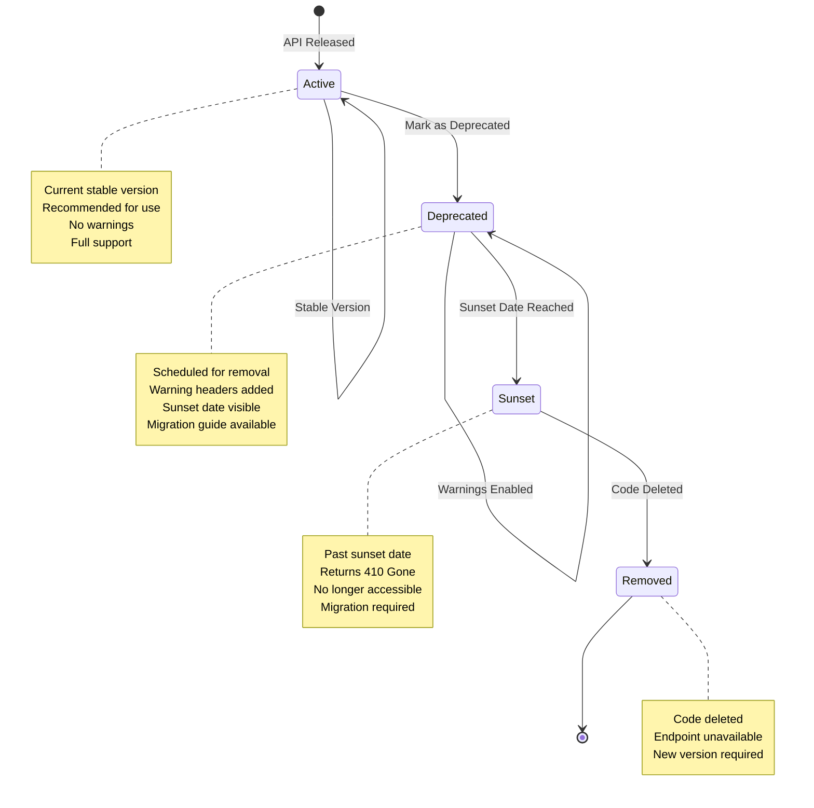
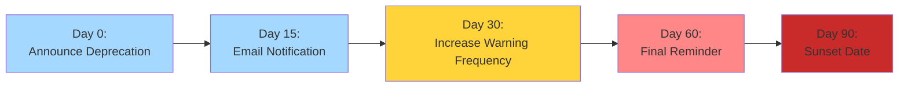
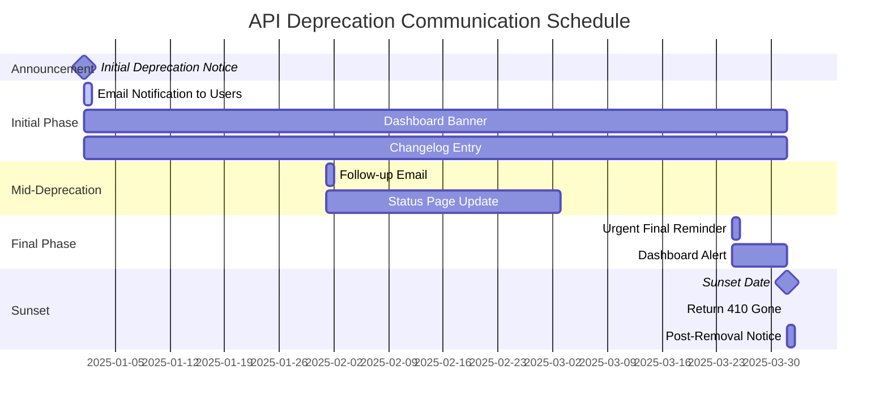

# API Deprecation Strategy

This guide outlines the recommended strategy for deprecating API versions in this application.

## Deprecation Lifecycle



## Deprecation Timeline Flow



## Communication Timeline



## Version Status Enum

The `ApiVersionStatus` const enum defines the lifecycle states of an API version:

```typescript
enum ApiVersionStatus {
  ACTIVE = 'active', // Current stable version, recommended for use
  DEPRECATED = 'deprecated', // Scheduled for removal, deprecation warnings enabled
  SUNSET = 'sunset' // Past sunset date, no longer accessible
}
```

## Deprecation Lifecycle

```
active → deprecated → sunset → removed
   ↓         ↓          ↓         ↓
  ready   announce    warning   delete
```

| Status                        | Description                                 | Duration      |
| ----------------------------- | ------------------------------------------- | ------------- |
| `ApiVersionStatus.ACTIVE`     | Current stable version, recommended for use | Ongoing       |
| `ApiVersionStatus.DEPRECATED` | Scheduled for removal, warnings added       | 90+ days      |
| `ApiVersionStatus.SUNSET`     | Past sunset date, returns 410 Gone          | Until removed |
| `removed`                     | No longer accessible (code deleted)         | N/A           |

## Deprecation Timeline

### Recommended Schedule

```
Day 0: Announce deprecation
Day 30: Increase warning frequency
Day 60: Final reminder before sunset
Day 90: Sunset (remove or return 410)
```

### Example Timeline

```
January 1:  Announce v1 deprecation, set sunset to April 1
January 15: Send email notification to API users
February 1: Add prominent warnings in dashboard
March 1:    Final reminder (30 days remaining)
April 1:    Sunset v1 (return 410 Gone)
```

## Configuration

### Mark Version as Deprecated

Update `.env`:

```env
API_VERSIONS=v1:1.0.0:deprecated:2026-06-30,v2:2.0.0:active
API_DEFAULT_VERSION=v2
```

The status value uses the `ApiVersionStatus` enum:

- `status`: Set to `ApiVersionStatus.DEPRECATED` (or `'deprecated'` string)
- `sunsetDate`: ISO date when version will be removed (required for deprecated status)

### Mark Endpoint as Deprecated

Use the `@ApiDeprecated` decorator:

```typescript
import { Get } from '@nestjs/common';
import { ApiDeprecated } from '@/common/decorators';

@Get('old-endpoint')
@ApiDeprecated({
  reason: 'Use /new-endpoint instead',
  sunsetDate: '2026-06-30',
  migrationGuide: 'https://docs.example.com/migration-v1-to-v2',
})
oldEndpoint() {
  return { message: 'Deprecated' };
}
```

## Deprecation Headers

### Version-Level Headers

When a version is deprecated, all responses include:

| Header              | Value                                                                                |
| ------------------- | ------------------------------------------------------------------------------------ |
| `X-API-Version`     | `v1`                                                                                 |
| `X-API-Deprecated`  | `true`                                                                               |
| `X-API-Sunset`      | `2026-06-30`                                                                         |
| `X-API-Deprecation` | `API version v1 is deprecated and will be removed on 2026-06-30. 90 days remaining.` |
| `Sunset`            | `2026-06-30`                                                                         |

### Endpoint-Level Headers

When an endpoint is deprecated:

| Header                   | Value                                                     |
| ------------------------ | --------------------------------------------------------- |
| `X-Endpoint-Deprecated`  | `true`                                                    |
| `X-Endpoint-Deprecation` | `This endpoint is deprecated. Use /new-endpoint instead.` |

## Response Metadata

### Version Metadata

```json
{
  "data": [...],
  "meta": {
    "version": "v1",
    "deprecated": true,
    "sunset": "2026-06-30",
    "migrationGuide": "https://docs.example.com/migration"
  }
}
```

### Sunset Response (410 Gone)

After sunset date, deprecated versions return:

```json
{
  "error": {
    "code": "API_VERSION_SUNSET",
    "message": "API version v1 has been removed. Please use v2.",
    "documentation": "https://docs.example.com/migration-v1-to-v2"
  }
}
```

HTTP Status: `410 Gone`

## Communication Strategy

### 1. Initial Announcement

**When:** Day 0 (when marking as deprecated)

**Channels:**

- Email notification to registered API users
- Changelog entry
- Banner in developer portal
- In-app notification for dashboard users

**Template:**

```
Subject: API v1 Deprecation Notice

Hello,

We are deprecating API v1. It will be removed on June 30, 2026.

What you need to do:
- Migrate to API v2 by June 30, 2026
- Review our migration guide: https://docs.example.com/migration
- Test your integration with v2 in sandbox environment

Timeline:
- March 1, 2026: v1 marked as deprecated
- June 30, 2026: v1 sunset (removed)

If you have questions, reply to this email or contact support@example.com.

Thanks,
API Team
```

### 2. Mid-Deprecation Reminder

**When:** 30-45 days after announcement

**Channels:**

- Follow-up email
- Dashboard notification
- API status page update

### 3. Final Reminder

**When:** 7-14 days before sunset

**Channels:**

- Urgent email with "Action Required" subject
- Dashboard banner
- Status page incident

## Monitoring

### Track Deprecated Version Usage

The application logs deprecation warnings:

```
[WARN] Deprecated API version v1 accessed at /api/v1/users.
       Sunset: 2026-06-30, Days remaining: 45
       User: api-key-123, IP: 192.168.1.1
```

### Metrics to Track

1. **Request volume** to deprecated endpoints
2. **Unique API keys** still using deprecated version
3. **Error rates** during migration
4. **Adoption rate** of new version

### Example Monitoring Query

```sql
-- Find top users of deprecated API
SELECT
  api_key,
  COUNT(*) as request_count,
  MAX(created_at) as last_request
FROM api_logs
WHERE version = 'v1'
  AND created_at > NOW() - INTERVAL '30 days'
GROUP BY api_key
ORDER BY request_count DESC;
```

## Sunset Process

### Pre-Sunset Checklist

- [ ] Send final reminder email
- [ ] Update status page
- [ ] Verify migration guide is complete
- [ ] Confirm critical clients have migrated
- [ ] Prepare rollback plan

### On Sunset Date

1. **Change status to `ApiVersionStatus.SUNSET`** (optional, can remove directly):

```env
API_VERSIONS=v1:1.0.0:sunset,v2:2.0.0:active
```

2. **Or remove the version entirely**:

```env
API_VERSIONS=v2:2.0.0:active
```

3. **Delete version-specific code** (controllers, DTOs, services)

4. **Post announcement** that version is removed

### Post-Sunset

Requests to sunset versions return `410 Gone`:

```json
{
  "error": {
    "code": "API_VERSION_SUNSET",
    "message": "API version v1 has been removed. Please use v2.",
    "documentation": "https://docs.example.com/migration-v1-to-v2"
  }
}
```

## Migration Support

### Migration Guide Template

Create a detailed migration guide:

````markdown
# Migrating from v1 to v2

## Breaking Changes

### 1. Response Format

**v1:**

```json
{ "id": 1, "name": "Alice" }
```
````

**v2:**

```json
{ "data": { "id": 1, "name": "Alice" }, "meta": { "version": "v2" } }
```

### 2. Pagination

**v1:** Returns all records (no pagination)

**v2:** Requires pagination parameters

## Endpoint Mapping

| v1 Endpoint       | v2 Equivalent       | Notes                               |
| ----------------- | ------------------- | ----------------------------------- |
| GET /users        | GET /v2/users       | Now requires `?page=` and `?limit=` |
| POST /users       | POST /v2/users      | Added validation for phone field    |
| DELETE /users/:id | PATCH /v2/users/:id | Changed to soft delete              |

## Code Examples

### JavaScript

```javascript
// v1
const users = await fetch('/api/users').then((r) => r.json());

// v2
const users = await fetch('/api/v2/users?page=1&limit=10')
  .then((r) => r.json())
  .then((r) => r.data);
```

````

### Testing Environment

Provide a sandbox environment for testing v2:

```bash
# Test v2 in sandbox
curl https://sandbox.example.com/api/v2/users
````

## Rollback Plan

If critical issues arise after sunset:

1. **Re-add the version with `ApiVersionStatus.ACTIVE` status**:

```env
API_VERSIONS=v1:1.0.0:active,v2:2.0.0:active
```

2. **Announce emergency restoration**

3. **Fix v2 issues**

4. **Schedule new sunset date**

## Best Practices

1. **Give ample notice**: Minimum 90 days for minor changes, 180+ days for breaking changes
2. **Provide clear migration paths**: Document every breaking change with examples
3. **Monitor adoption**: Track how many users have migrated
4. **Offer support**: Provide direct support during migration period
5. **Test thoroughly**: Ensure v2 is stable before deprecating v1
6. **Communicate frequently**: Multiple reminders before sunset
7. **Be flexible**: Extend sunset date if adoption is slow

## Legal and Compliance

### Data Retention

After removing a version, retain logs for audit purposes:

- API request logs: 90 days
- Error logs: 180 days
- Deprecation notices: 1 year

### SLA Impact

Deprecation does not affect SLA for:

- Active versions
- Supported endpoints

SLA exclusions:

- Deprecated versions (best-effort only)
- Sunset versions (no SLA)

## References

- [API Versioning Guide](./guide.md)
- [Migration Guide](./migration.md)
- [RFC 8594: The Sunset HTTP Header](https://www.rfc-editor.org/rfc/rfc8594.html)
