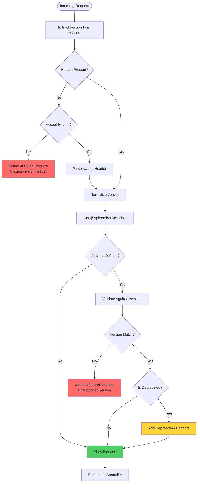
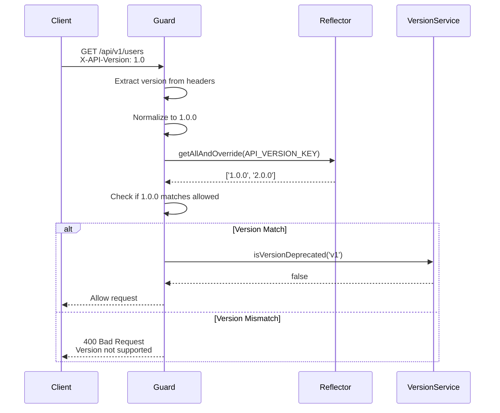
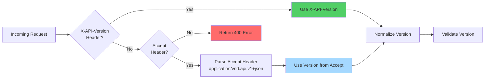
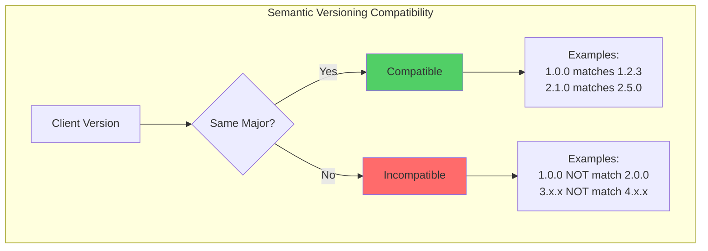

# API Version Guards

## Guard Validation Flow



## Request Validation Sequence



## Version Detection Priority



## Version Compatibility Rules



## Overview

The `ApiVersionGuard` is a NestJS guard that validates API versions from request headers against allowed versions defined by the `@ApiVersion` decorator.

## ApiVersionGuard

### Location

`src/common/guards/version.guard.ts`

### Purpose

- Extracts API version from request headers
- Validates against allowed versions
- Enforces semantic versioning compatibility
- Returns descriptive errors for invalid versions

## Version Detection

### Header Priority

The guard checks headers in this order:

1. **X-API-Version** header (primary)
2. **Accept** header with vendor MIME type (fallback)

### X-API-Version Header

```bash
curl -H "X-API-Version: 1.0" http://localhost:3000/api/v1/users
```

Format: `X-API-Version: {major}.{minor}` or `X-API-Version: {major}.{minor}.{patch}`

Examples:

- `X-API-Version: 1.0`
- `X-API-Version: 1.0.0`
- `X-API-Version: 2.1`

### Accept Header

```bash
curl -H "Accept: application/vnd.api.v1+json" http://localhost:3000/api/v1/users
```

Format: `application/vnd.api.v{major}+json`

Examples:

- `Accept: application/vnd.api.v1+json`
- `Accept: application/vnd.api.v2+json`

## Version Normalization

The guard normalizes version strings to semantic format:

| Input    | Normalized |
| -------- | ---------- |
| `1`      | `1.0.0`    |
| `1.0`    | `1.0.0`    |
| `1.0.0`  | `1.0.0`    |
| `v1`     | `1.0.0`    |
| `v1.0`   | `1.0.0`    |
| `v1.0.0` | `1.0.0`    |

## Version Compatibility

### Compatibility Rules

The guard uses semantic versioning compatibility:

- **Exact match**: `1.0.0` matches `1.0.0`
- **Major version match**: `1.0.0` compatible with `1.2.3`
- **Incompatible**: `1.0.0` not compatible with `2.0.0`

### Examples

```typescript
// Controller allows v1.0
@ApiVersion('1.0')
@Controller('users')
export class UsersController {}

// These requests are ALLOWED:
X-API-Version: 1.0     // Exact match
X-API-Version: 1.0.0   // Exact match
X-API-Version: 1.2.3   // Same major version

// These requests are REJECTED:
X-API-Version: 2.0     // Different major version
X-API-Version: 3.0     // Different major version
```

## Usage

### Basic Guard Usage

```typescript
import { Controller, Get, UseGuards } from '@nestjs/common';
import { ApiVersion } from '../common/decorators';
import { ApiVersionGuard } from '../common/guards';

@ApiVersion('1.0')
@Controller('users')
@UseGuards(ApiVersionGuard)
export class UsersController {
  @Get()
  findAll() {
    return { users: [] };
  }
}
```

### Global Guard Usage

Apply guard globally in `main.ts`:

```typescript
import { ValidationPipe } from '@nestjs/common';
import { ApiVersionGuard } from './common/guards';

async function bootstrap() {
  const app = await NestFactory.create(AppModule);

  // Apply guard globally
  app.useGlobalGuards(new ApiVersionGuard(app.get(Reflector), app.get(ConfigService)));

  await app.listen(3000);
}
```

### Per-Method Guard Usage

```typescript
import { Controller, Get, UseGuards } from '@nestjs/common';
import { ApiVersion } from '../common/decorators';
import { ApiVersionGuard } from '../common/guards';

@Controller('products')
export class ProductsController {
  @Get()
  @ApiVersion('1.0')
  @UseGuards(ApiVersionGuard)
  findAllV1() {
    return { products: [] };
  }

  @Get()
  @ApiVersion('2.0')
  @UseGuards(ApiVersionGuard)
  findAllV2() {
    return { products: [], advanced: true };
  }
}
```

## Error Responses

### Missing Version Header

```typescript
// Request without version header
curl http://localhost:3000/api/v1/users
```

Response (400 Bad Request):

```json
{
  "statusCode": 400,
  "message": "API version header is required. Use the X-API-Version header.",
  "error": "Bad Request"
}
```

### Unsupported Version

```typescript
// Request with unsupported version
curl -H "X-API-Version: 3.0" http://localhost:3000/api/v1/users
```

Response (400 Bad Request):

```json
{
  "statusCode": 400,
  "message": "API version 3.0.0 is not supported. Supported versions: 1.0.0",
  "error": "Bad Request"
}
```

## Advanced Usage

### Custom Version Extraction

Extend the guard to support custom version sources:

```typescript
import { Injectable, CanActivate, ExecutionContext } from '@nestjs/common';
import { ApiVersionGuard } from '../common/guards';

@Injectable()
export class CustomVersionGuard extends ApiVersionGuard {
  constructor(reflector: Reflector, configService: ConfigService) {
    super(reflector, configService);
  }

  private extractVersionFromRequest(request: any): string | null {
    // Check custom header first
    const customHeader = request.headers['x-custom-version'];
    if (customHeader) {
      return this.normalizeVersion(customHeader);
    }

    // Fall back to parent implementation
    return super.extractVersionFromRequest(request);
  }
}
```

### Version-Based Throttling

Combine with throttling guard for different rate limits per version:

```typescript
import { Injectable } from '@nestjs/common';
import { ApiVersionGuard } from '../common/guards';

@Injectable()
export class VersionThrottlerGuard extends ApiVersionGuard {
  constructor(reflector: Reflector, configService: ConfigService) {
    super(reflector, configService);
  }

  canActivate(context: ExecutionContext): boolean {
    const request = context.switchToHttp().getRequest();
    const version = this.extractVersionFromRequest(request);

    // Apply different rate limits based on version
    if (version?.startsWith('1.')) {
      // V1: 100 requests per minute
      request.rateLimit = 100;
    } else if (version?.startsWith('2.')) {
      // V2: 200 requests per minute
      request.rateLimit = 200;
    }

    return super.canActivate(context);
  }
}
```

### Logging Version Usage

Track which API versions clients are using:

```typescript
import { Injectable, Logger } from '@nestjs/common';
import { ApiVersionGuard } from '../common/guards';

@Injectable()
export class LoggingVersionGuard extends ApiVersionGuard {
  private readonly logger = new Logger(LoggingVersionGuard.name);

  constructor(reflector: Reflector, configService: ConfigService) {
    super(reflector, configService);
  }

  canActivate(context: ExecutionContext): boolean {
    const request = context.switchToHttp().getRequest();
    const version = this.extractVersionFromRequest(request);

    if (version) {
      this.logger.log(`API version ${version} requested for ${request.method} ${request.url}`);
    }

    return super.canActivate(context);
  }
}
```

## Testing

### Unit Testing

```typescript
import { Test } from '@nestjs/testing';
import { ApiVersionGuard } from '../common/guards';
import { Reflector } from '@nestjs/core';
import { ConfigService } from '@nestjs/config';
import { ExecutionContext } from '@nestjs/common';

describe('ApiVersionGuard', () => {
  let guard: ApiVersionGuard;
  let reflector: Reflector;

  beforeEach(async () => {
    const module = await Test.createTestingModule({
      providers: [
        ApiVersionGuard,
        {
          provide: Reflector,
          useValue: {
            getAllAndOverride: jest.fn()
          }
        },
        {
          provide: ConfigService,
          useValue: {
            get: jest.fn().ReturnValue('v1')
          }
        }
      ]
    }).compile();

    guard = module.get<ApiVersionGuard>(ApiVersionGuard);
    reflector = module.get<Reflector>(Reflector);
  });

  it('should allow access when no versions specified', () => {
    jest.spyOn(reflector, 'getAllAndOverride').mockReturnValue(undefined);

    const context = createMockContext();
    const result = guard.canActivate(context);

    expect(result).toBe(true);
  });

  it('should allow access when version matches', () => {
    jest.spyOn(reflector, 'getAllAndOverride').mockReturnValue(['1.0.0']);

    const context = createMockContext({
      headers: { 'x-api-version': '1.0' }
    });
    const result = guard.canActivate(context);

    expect(result).toBe(true);
  });

  it('should deny access when version does not match', () => {
    jest.spyOn(reflector, 'getAllAndOverride').mockReturnValue(['1.0.0']);

    const context = createMockContext({
      headers: { 'x-api-version': '2.0' }
    });

    expect(() => guard.canActivate(context)).toThrow(BadRequestException);
  });
});

function createMockContext(request: any = {}) {
  return {
    switchToHttp: () => ({
      getRequest: () => ({
        headers: {},
        ...request
      })
    }),
    getHandler: () => ({}),
    getClass: () => ({})
  } as any as ExecutionContext;
}
```

### Integration Testing

```typescript
import { Test } from '@nestjs/testing';
import * as request from 'supertest';
import { AppModule } from '../app.module';

describe('ApiVersionGuard (e2e)', () => {
  let app;

  beforeAll(async () => {
    const moduleFixture = await Test.createTestingModule({
      imports: [AppModule]
    }).compile();

    app = moduleFixture.createNestApplication();
    await app.init();
  });

  it('should allow access with valid version', () => {
    return request(app.getHttpServer())
      .get('/api/v1/users')
      .set('X-API-Version', '1.0')
      .expect(200);
  });

  it('should deny access with invalid version', () => {
    return request(app.getHttpServer())
      .get('/api/v1/users')
      .set('X-API-Version', '99.0')
      .expect(400);
  });

  it('should deny access without version header', () => {
    return request(app.getHttpServer()).get('/api/v1/users').expect(400);
  });

  afterAll(async () => {
    await app.close();
  });
});
```

## Best Practices

### 1. Always Specify Allowed Versions

```typescript
// ✅ Good - Explicit version
@ApiVersion('1.0')
@UseGuards(ApiVersionGuard)
@Controller('users')
export class UsersController {}

// ❌ Bad - No version specified
@UseGuards(ApiVersionGuard)
@Controller('users')
export class UsersController {}
```

### 2. Use Semantic Versioning

```typescript
// ✅ Good - Semantic version
@ApiVersion('1.0.0')

// ⚠️ Acceptable - Short form
@ApiVersion('1.0')

// ❌ Bad - Non-semantic
@ApiVersion('v1')
```

### 3. Combine with Authentication

```typescript
@ApiVersion('1.0')
@UseGuards(AuthGuard, ApiVersionGuard)
@Controller('admin')
export class AdminController {}
```

### 4. Handle Errors Gracefully

```typescript
@ApiVersion('1.0')
@UseGuards(ApiVersionGuard)
@Controller('users')
export class UsersController {
  @Get()
  findAll() {
    try {
      return { users: [] };
    } catch (error) {
      throw new BadRequestException('Failed to fetch users');
    }
  }
}
```

## Troubleshooting

### Guard Not Working

**Problem**: Guard not validating versions

**Solution**:

1. Verify `@UseGuards(ApiVersionGuard)` is applied
2. Check `@ApiVersion` decorator is set
3. Ensure guard is imported correctly
4. Check for conflicting global guards

### Version Always Rejected

**Problem**: Valid versions being rejected

**Solution**:

1. Check version format in header
2. Verify allowed versions in decorator
3. Check guard logs for rejection reason
4. Test with normalized version format

### Headers Not Being Read

**Problem**: Guard not reading version headers

**Solution**:

1. Verify header name: `X-API-Version` (case-insensitive)
2. Check for CORS issues blocking headers
3. Ensure proxy/pass-through not stripping headers
4. Test with curl to rule out client issues
