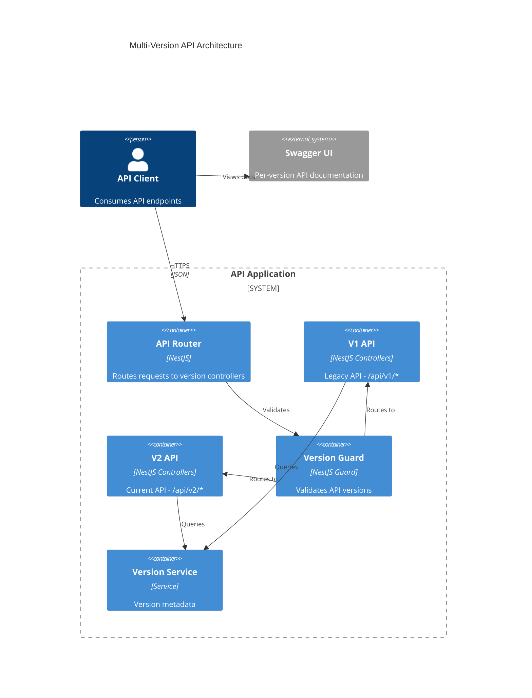
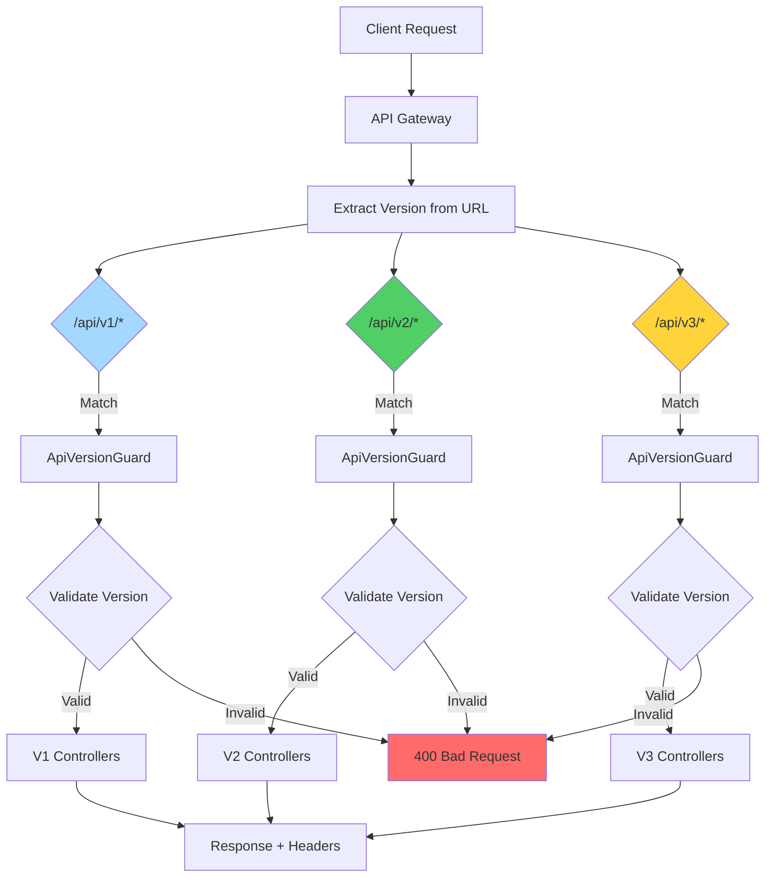
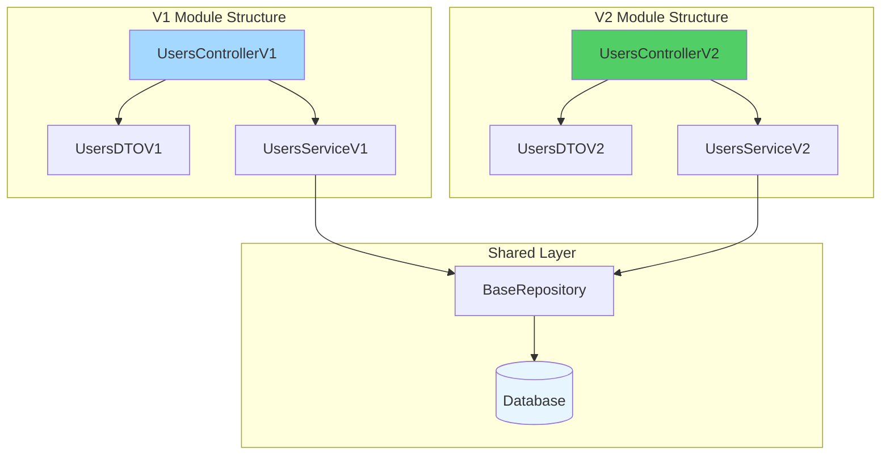

# API Versioning Guide

This guide explains how API versioning works in this application and how to create versioned endpoints.

## Multi-Version API Architecture



## Request Routing Flow



## Versioned Controller Structure



## Overview

The application supports **multi-version API mode**, allowing you to run multiple API versions simultaneously. This enables gradual migration and deprecation of old API versions.

### Key Features

- **URL-based versioning**: Each version has its own URL path (e.g., `/api/v1/users`, `/api/v2/users`)
- **Deprecation headers**: Deprecated versions return warning headers
- **Per-version Swagger docs**: Each version has separate documentation
- **Graceful sunset**: Track days until deprecated versions are removed
- **Required configuration**: The `API_VERSIONS` environment variable is required for startup

## Configuration

### Multi-Version Mode (Default & Only Mode)

```env
# .env - Required format
API_VERSIONS=v1:1.0.0:active,v2:2.0.0:active,v3:3.0.0:deprecated:2026-06-30
API_DEFAULT_VERSION=v2
API_DEPRECATION_WARNING_DAYS=90
```

**Format:** `prefix:semantic_version:status[:sunset_date]`

| Field              | Description                                            | Example          | Required |
| ------------------ | ------------------------------------------------------ | ---------------- | -------- |
| `prefix`           | URL prefix for this version (must match `^v\d+$`)      | `v1`, `v2`       | Yes      |
| `semantic_version` | Semantic version number (must match `^\d+\.\d+\.\d+$`) | `1.0.0`, `2.1.0` | Yes      |
| `status`           | Version status: `active`, `deprecated`, or `sunset`    | `active`         | Yes      |
| `sunset_date`      | (Optional) ISO date when deprecated version is removed | `2026-06-30`     | No       |

### Version Status Values

The `status` field accepts the following values:

- `active` (or `ApiVersionStatus.ACTIVE`) - Current stable version, recommended for use
- `deprecated` (or `ApiVersionStatus.DEPRECATED`) - Scheduled for removal, warnings enabled
- `sunset` (or `ApiVersionStatus.SUNSET`) - Past sunset date, no longer accessible

### Validation

The system provides comprehensive validation at startup:

- **Prefix validation**: Must match `^v\d+$` (e.g., `v1`, `v2`, `v10`)
- **Semantic version validation**: Must match `^\d+\.\d+\.\d+$` (e.g., `1.0.0`, `2.1.3`)
- **Status validation**: Must be one of `active`, `deprecated`, or `sunset`
- **Sunset date validation**: If provided, must be valid ISO 8601 date format

The application will **fail to start** if `API_VERSIONS` is missing or invalid, with clear error messages indicating the issue.

## Creating Versioned Controllers

### Using @VersionedController Decorator

The simplest way to create a versioned controller:

```typescript
import { Get, Post, Body } from '@nestjs/common';
import { ApiTags } from '@nestjs/swagger';
import { VersionedController } from '@/common/decorators';

@ApiTags('users')
@VersionedController('v1', 'users') // Routes to /api/v1/users
export class UsersControllerV1 {
  @Get()
  findAll() {
    return [{ id: 1, name: 'John' }];
  }

  @Post()
  create(@Body() createUserDto: CreateUserDto) {
    return { id: 2, ...createUserDto };
  }
}
```

### Using @ApiVersion + @Controller

Alternative approach using separate decorators:

```typescript
import { Controller, Get } from '@nestjs/common';
import { ApiTags } from '@nestjs/swagger';
import { ApiVersion } from '@/common/decorators';

@ApiTags('users')
@ApiVersion('v1')
@Controller('users')
export class UsersControllerV1 {
  @Get()
  findAll() {
    return [];
  }
}
```

### Version Module Structure

Organize versioned controllers by feature and version:

```
src/modules/
├── users/
│   ├── v1/
│   │   ├── users.controller.v1.ts
│   │   ├── users.dto.v1.ts
│   │   └── users.service.v1.ts
│   ├── v2/
│   │   ├── users.controller.v2.ts
│   │   ├── users.dto.v2.ts
│   │   └── users.service.v2.ts
│   └── users.module.ts
```

### Example: V1 vs V2 Controllers

**V1 Controller (Simple):**

```typescript
// src/modules/users/v1/users.controller.v1.ts
import { Get, Param } from '@nestjs/common';
import { ApiTags, ApiOperation } from '@nestjs/swagger';
import { VersionedController } from '@/common/decorators';

@ApiTags('users')
@VersionedController('v1', 'users')
export class UsersControllerV1 {
  @Get()
  @ApiOperation({ summary: 'Get all users (V1)' })
  findAll() {
    // Simple list without pagination
    return [
      { id: 1, name: 'Alice', email: 'alice@example.com' },
      { id: 2, name: 'Bob', email: 'bob@example.com' }
    ];
  }

  @Get(':id')
  @ApiOperation({ summary: 'Get user by ID (V1)' })
  findOne(@Param('id') id: string) {
    return { id, name: 'Alice', email: 'alice@example.com' };
  }
}
```

**V2 Controller (Enhanced):**

```typescript
// src/modules/users/v2/users.controller.v2.ts
import { Get, Post, Body, Param, Query } from '@nestjs/common';
import { ApiTags, ApiOperation } from '@nestjs/swagger';
import { VersionedController } from '@/common/decorators';

@ApiTags('users')
@VersionedController('v2', 'users')
export class UsersControllerV2 {
  @Get()
  @ApiOperation({ summary: 'Get users with pagination (V2)' })
  findAll(@Query() query: PaginationDto) {
    // Enhanced with pagination
    return {
      data: [{ id: 1, name: 'Alice', email: 'alice@example.com', createdAt: '2024-01-01' }],
      meta: {
        page: query.page || 1,
        limit: query.limit || 10,
        total: 100
      }
    };
  }

  @Get(':id')
  @ApiOperation({ summary: 'Get user with expanded fields (V2)' })
  findOne(@Param('id') id: string) {
    return {
      id,
      name: 'Alice',
      email: 'alice@example.com',
      profile: { bio: 'Developer', location: 'NYC' },
      createdAt: '2024-01-01',
      updatedAt: '2024-01-15'
    };
  }

  @Get('search')
  @ApiOperation({ summary: 'Search users (V2 only feature)' })
  search(@Query('q') query: string) {
    return [{ id: 1, name: 'Alice', email: 'alice@example.com' }];
  }
}
```

## Deprecating API Versions

### Step 1: Mark Version as Deprecated

Update `.env`:

```env
API_VERSIONS=v1:1.0.0:deprecated:2026-06-30,v2:2.0.0:active
API_DEFAULT_VERSION=v2
```

Change the status from `active` to `deprecated` and add the sunset date.

### Step 2: Add Endpoint-Level Deprecation

Use the `@ApiDeprecated` decorator on specific endpoints:

```typescript
import { Get } from '@nestjs/common';
import { ApiDeprecated } from '@/common/decorators';

@Get('old-endpoint')
@ApiDeprecated({
  reason: 'Use /new-endpoint instead',
  sunsetDate: '2026-06-30',
  migrationGuide: 'https://docs.example.com/migration-v1-to-v2',
})
oldEndpoint() {
  return { message: 'This endpoint is deprecated' };
}
```

### Step 3: Monitor Usage

The application logs deprecation warnings:

```
[WARN] Deprecated API version v1 accessed at /api/v1/users. Sunset: 2026-06-30, Days remaining: 180
```

## Deprecation Headers

When a version is deprecated, responses include these headers:

| Header              | Example                                                             |
| ------------------- | ------------------------------------------------------------------- |
| `X-API-Version`     | `v1`                                                                |
| `X-API-Deprecated`  | `true`                                                              |
| `X-API-Sunset`      | `2026-06-30`                                                        |
| `X-API-Deprecation` | `API version v1 is deprecated and will be removed on 2026-06-30...` |
| `Sunset`            | `2026-06-30`                                                        |

## Response Metadata

All responses include version metadata:

```json
{
  "data": [...],
  "meta": {
    "version": "v1",
    "deprecated": true,
    "sunset": "2026-06-30",
    "migrationGuide": "https://docs.example.com/migration-v1-to-v2"
  }
}
```

## Running Tests Versioned Endpoints

```bash
# Test V1
curl http://localhost:3000/api/v1/users

# Test V2
curl http://localhost:3000/api/v2/users

# Check deprecation headers
curl -I http://localhost:3000/api/v1/users
```

## Swagger Documentation

Each version has its own Swagger docs:

- **Index:** http://localhost:3000/api/docs
- **V1 docs:** http://localhost:3000/api/docs/v1
- **V2 docs:** http://localhost:3000/api/docs/v2

## Best Practices

1. **Use semantic versioning**: Follow MAJOR.MINOR.PATCH (e.g., `1.0.0`, `2.1.3`)
2. **Deprecate gradually**: Give at least 90 days notice before removing a version
3. **Document breaking changes**: Clearly explain what changed between versions
4. **Maintain backward compatibility**: Keep old versions working until sunset
5. **Set clear sunset dates**: Communicate when deprecated versions will be removed
6. **Monitor usage**: Track which versions are still being used
7. **Provide migration guides**: Help users migrate between versions

## Migration Guide

For migration information, see the [Migration](./migration.md) documentation.
