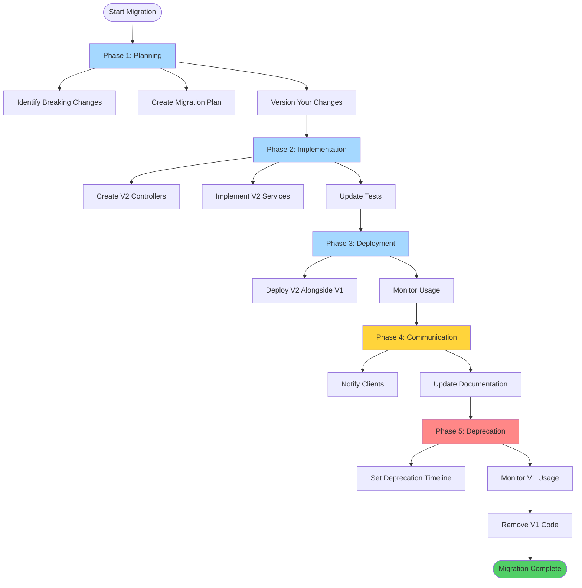
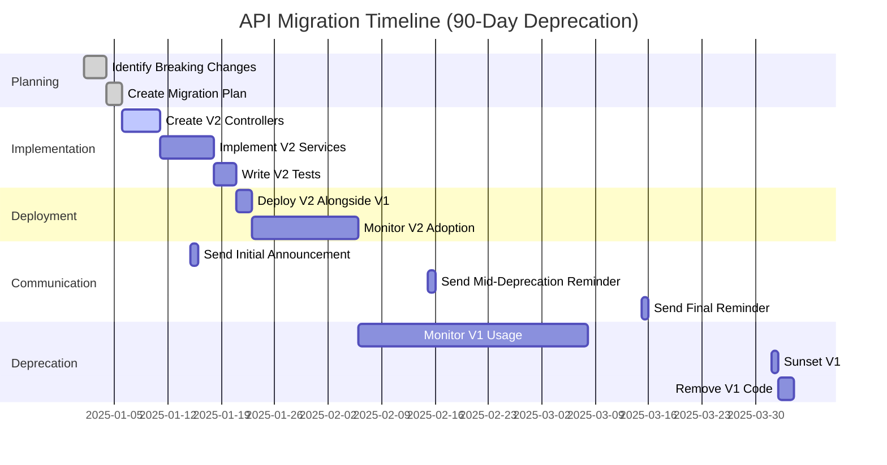
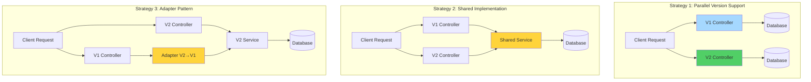

# API Version Migration Guide

## Migration Process Flow



## Migration Timeline



## Overview

This guide covers strategies and best practices for migrating between API versions.

## Migration Strategies

### Strategy Comparison



### Strategy 1: Parallel Version Support

Run multiple versions simultaneously with separate controllers.

**Pros**:

- Zero downtime
- Clients can migrate at their own pace
- Easy to rollback

**Cons**:

- More code to maintain
- Higher memory usage

**Implementation**:

```typescript
// V1 Controller (existing)
@ApiVersion('1.0')
@Controller('users')
export class UsersControllerV1 {
  @Get()
  findAll() {
    return { users: [] };
  }
}

// V2 Controller (new)
@ApiVersion('2.0')
@Controller('users')
export class UsersControllerV2 {
  @Get()
  findAll() {
    return {
      users: [],
      pagination: { page: 1, limit: 10, total: 100 }
    };
  }
}
```

### Strategy 2: Shared Implementation

Multiple versions share the same service layer.

**Pros**:

- Less code duplication
- Single source of truth for business logic
- Easier to maintain

**Cons**:

- Version-specific logic in services
- More complex service methods

**Implementation**:

```typescript
// Service handles both versions
@Injectable()
export class UsersService {
  findAll(version: string) {
    const users = this.getUsers();

    if (version.startsWith('2.')) {
      // V2: Include pagination
      return {
        users,
        pagination: { page: 1, limit: 10, total: users.length }
      };
    }

    // V1: Simple list
    return { users };
  }
}

// V1 Controller
@ApiVersion('1.0')
@Controller('users')
export class UsersControllerV1 {
  constructor(private readonly usersService: UsersService) {}

  @Get()
  findAll() {
    return this.usersService.findAll('1.0');
  }
}

// V2 Controller
@ApiVersion('2.0')
@Controller('users')
export class UsersControllerV2 {
  constructor(private readonly usersService: UsersService) {}

  @Get()
  findAll() {
    return this.usersService.findAll('2.0');
  }
}
```

### Strategy 3: Adapter Pattern

Use adapters to transform data between versions.

**Pros**:

- Clean separation of concerns
- Easy to test
- Reusable adapters

**Cons**:

- More initial setup
- Additional abstraction layer

**Implementation**:

```typescript
// V1 User interface
interface UserV1 {
  id: string;
  name: string;
}

// V2 User interface
interface UserV2 {
  id: string;
  firstName: string;
  lastName: string;
  email: string;
}

// Adapter to convert V2 to V1
@Injectable()
export class UserV1Adapter {
  toV1(userV2: UserV2): UserV1 {
    return {
      id: userV2.id,
      name: `${userV2.firstName} ${userV2.lastName}`
    };
  }

  toV1Array(usersV2: UserV2[]): UserV1[] {
    return usersV2.map((user) => this.toV1(user));
  }
}

// V1 Controller uses adapter
@ApiVersion('1.0')
@Controller('users')
export class UsersControllerV1 {
  constructor(
    private readonly usersService: UsersService,
    private readonly adapter: UserV1Adapter
  ) {}

  @Get()
  findAll() {
    const usersV2 = this.usersService.findAll();
    return { users: this.adapter.toV1Array(usersV2) };
  }
}
```

## Step-by-Step Migration Process

### Phase 1: Planning

1. **Identify Breaking Changes**
   - List all changes that break backward compatibility
   - Document which endpoints are affected
   - Estimate migration effort

2. **Create Migration Plan**
   - Set timeline for deprecation
   - Define communication strategy
   - Plan rollback strategy

3. **Version Your Changes**
   - Determine new version number (e.g., 1.0.0 → 2.0.0)
   - Document all changes in changelog

### Phase 2: Implementation

1. **Create V2 Controllers**

```typescript
@ApiVersion('2.0')
@Controller('users')
export class UsersControllerV2 {
  @Get()
  findAll() {
    // New implementation
  }
}
```

2. **Implement V2 Services**

```typescript
@Injectable()
export class UsersServiceV2 {
  findAll() {
    // New business logic
  }
}
```

3. **Update Tests**

```typescript
describe('UsersControllerV2', () => {
  it('should return paginated results', () => {
    // V2 tests
  });
});
```

### Phase 3: Deployment

1. **Deploy V2 Alongside V1**

Both versions run simultaneously:

```typescript
// V1 remains available
@ApiVersion('1.0')
@Controller('users')
export class UsersControllerV1 {}

// V2 is now available
@ApiVersion('2.0')
@Controller('users')
export class UsersControllerV2 {}
```

2. **Monitor Usage**

Track which versions clients are using:

```typescript
@Injectable()
export class VersionLoggingGuard {
  private readonly logger = new Logger(VersionLoggingGuard.name);

  constructor(private readonly metricsService: MetricsService) {}

  canActivate(context: ExecutionContext): boolean {
    const request = context.switchToHttp().getRequest();
    const version = request.headers['x-api-version'];

    this.metricsService.increment(`api.version.${version}`);
    this.logger.log(`API version ${version} used`);

    return true;
  }
}
```

### Phase 4: Communication

1. **Notify Clients**

Add deprecation headers to V1 endpoints:

```typescript
@ApiVersion('1.0')
@Controller('users')
export class UsersControllerV1 {
  @Get()
  findAll(@Res() res: Response) {
    res.setHeader('X-API-Deprecation', 'This endpoint is deprecated. Use /api/v2/users');
    res.setHeader('X-API-Sunset', '2026-06-30'); // Deprecation date

    res.json({ users: [] });
  }
}
```

2. **Update Documentation**

Document migration in README and changelog:

````markdown
## Migration Guide (V1 → V2)

### Breaking Changes

- `/api/v1/users` response format changed
- `name` field split into `firstName` and `lastName`

### Migration Steps

1. Update API endpoint to `/api/v2/users`
2. Update response parsing to handle new fields
3. Update request format for POST/PUT

### Example

**V1 Response**:

```json
{
  "users": [{ "id": "1", "name": "John Doe" }]
}
```
````

**V2 Response**:

```json
{
  "users": [
    {
      "id": "1",
      "firstName": "John",
      "lastName": "Doe",
      "email": "john@example.com"
    }
  ],
  "pagination": {
    "page": 1,
    "limit": 10,
    "total": 100
  }
}
```

````

### Phase 5: Deprecation

1. **Set Deprecation Timeline**

Typical timeline: 6-12 months

2. **Monitor V1 Usage**

Track V1 usage and contact remaining clients:

```typescript
@Injectable()
export class UsersServiceV1 {
  private readonly logger = new Logger(UsersServiceV1.name);

  findAll() {
    // Log usage for follow-up
    this.logger.warn('V1 endpoint called. Client may need migration.');
    return { users: [] };
  }
}
````

3. **Remove V1**

After deprecation period, remove V1 code:

```typescript
// Remove V1 controller
// @ApiVersion('1.0')
// @Controller('users')
// export class UsersControllerV1 {}

// Keep V2
@ApiVersion('2.0')
@Controller('users')
export class UsersControllerV2 {}
```

## Common Migration Scenarios

### Scenario 1: Adding New Field

**V1**:

```json
{
  "user": {
    "id": "1",
    "name": "John Doe"
  }
}
```

**V2**: Add email field

```json
{
  "user": {
    "id": "1",
    "name": "John Doe",
    "email": "john@example.com"
  }
}
```

**Strategy**: Extend response (backward compatible)

```typescript
@ApiVersion('1.0', '2.0')
@Controller('users')
export class UsersController {
  @Get(':id')
  findOne(@Param('id') id: string) {
    const user = this.usersService.findOne(id);

    // Both V1 and V2 get the same response
    // V1 clients ignore the new field
    return { user };
  }
}
```

### Scenario 2: Renaming Field

**V1**:

```json
{
  "user": {
    "id": "1",
    "name": "John Doe"
  }
}
```

**V2**: Split name into firstName and lastName

```json
{
  "user": {
    "id": "1",
    "firstName": "John",
    "lastName": "Doe"
  }
}
```

**Strategy**: Parallel controllers with adapters

```typescript
// V1 Controller (existing)
@ApiVersion('1.0')
@Controller('users')
export class UsersControllerV1 {
  @Get(':id')
  findOne(@Param('id') id: string) {
    const user = this.usersService.findOne(id);
    return { user: { id: user.id, name: `${user.firstName} ${user.lastName}` } };
  }
}

// V2 Controller (new)
@ApiVersion('2.0')
@Controller('users')
export class UsersControllerV2 {
  @Get(':id')
  findOne(@Param('id') id: string) {
    const user = this.usersService.findOne(id);
    return { user };
  }
}
```

### Scenario 3: Changing Data Structure

**V1**: Array response

```json
{
  "users": [
    { "id": "1", "name": "John" },
    { "id": "2", "name": "Jane" }
  ]
}
```

**V2**: Paginated response

```json
{
  "data": [
    { "id": "1", "firstName": "John", "lastName": "Doe" },
    { "id": "2", "firstName": "Jane", "lastName": "Smith" }
  ],
  "pagination": {
    "page": 1,
    "limit": 10,
    "total": 2
  }
}
```

**Strategy**: Separate controllers

```typescript
// V1
@ApiVersion('1.0')
@Controller('users')
export class UsersControllerV1 {
  @Get()
  findAll() {
    const users = this.usersService.findAll();
    return { users };
  }
}

// V2
@ApiVersion('2.0')
@Controller('users')
export class UsersControllerV2 {
  @Get()
  findAll(@Query('page') page = 1, @Query('limit') limit = 10) {
    const result = this.usersService.findPaginated(page, limit);
    return {
      data: result.users,
      pagination: {
        page: result.page,
        limit: result.limit,
        total: result.total
      }
    };
  }
}
```

## Rollback Strategy

### If V2 Has Issues

1. **Direct Traffic Back to V1**

```typescript
// Update load balancer or API gateway
// Route all traffic to V1
```

2. **Fix V2 Issues**

```typescript
// Fix bugs in V2 controller
@ApiVersion('2.0')
@Controller('users')
export class UsersControllerV2 {
  @Get()
  findAll() {
    // Fix implementation
  }
}
```

3. **Re-deploy V2**

```bash
# Deploy fixed V2
pnpm nx build api
pnpm nx deploy api
```

### Canary Deployment

Gradually rollout V2 to subset of users:

```typescript
@Injectable()
export class CanaryGuard implements CanActivate {
  constructor(private readonly configService: ConfigService) {}

  canActivate(context: ExecutionContext): boolean {
    const canaryPercentage = this.configService.get<number>('CANARY_PERCENTAGE', 0);

    if (canaryPercentage === 0) {
      return false; // No canary, use V1
    }

    if (canaryPercentage === 100) {
      return true; // Full rollout, use V2
    }

    // Random assignment
    return Math.random() * 100 < canaryPercentage;
  }
}

// V1 Controller
@ApiVersion('1.0')
@Controller('users')
export class UsersControllerV1 {
  @Get()
  @UseGuards(CanaryGuard) // Only if canary false
  findAll() {
    return { users: [] };
  }
}

// V2 Controller
@ApiVersion('2.0')
@Controller('users')
export class UsersControllerV2 {
  @Get()
  @UseGuards(CanaryGuard) // Only if canary true
  findAll() {
    return { users: [], v2: true };
  }
}
```

## Testing Migration

### Test Both Versions

```typescript
describe('API Version Migration', () => {
  describe('V1', () => {
    it('should return V1 format', () => {
      return request(app.getHttpServer())
        .get('/api/v1/users')
        .expect(200)
        .expect((res) => {
          expect(res.body.users).toBeDefined();
          expect(res.body.pagination).toBeUndefined();
        });
    });
  });

  describe('V2', () => {
    it('should return V2 format', () => {
      return request(app.getHttpServer())
        .get('/api/v2/users')
        .expect(200)
        .expect((res) => {
          expect(res.body.data).toBeDefined();
          expect(res.body.pagination).toBeDefined();
        });
    });
  });
});
```

## Best Practices

### 1. Maintain V1 During Migration

Keep V1 available until all clients migrate:

```typescript
// ✅ Good - Both versions available
@ApiVersion('1.0')
@Controller('users')
export class UsersControllerV1 {}

@ApiVersion('2.0')
@Controller('users')
export class UsersControllerV2 {}

// ❌ Bad - Only V2 available, breaks clients
@ApiVersion('2.0')
@Controller('users')
export class UsersControllerV2 {}
```

### 2. Set Clear Deprecation Timeline

Communicate when V1 will be removed:

```typescript
@Get()
@ApiDeprecated('Use /api/v2/users. V1 will be removed on 2026-06-30')
findAll() {
  return { users: [] };
}
```

### 3. Monitor Migration Progress

Track usage of both versions:

```typescript
@Injectable()
export class MetricsService {
  constructor(private readonly versionService: VersionService) {}

  logVersionUsage(version: string) {
    // Send to metrics system (e.g., Prometheus, DataDog)
    console.log(`API version ${version} used at ${new Date().toISOString()}`);
  }
}
```

### 4. Provide Migration Guide

Document how clients should migrate:

```markdown
## Migration Guide

### Step 1: Update Endpoint URL

Change from `/api/v1/users` to `/api/v2/users`

### Step 2: Update Response Parsing

Handle new response structure

### Step 3: Update Request Format

Use new request fields

### Step 4: Test in Staging

Verify migration before production

### Step 5: Deploy to Production

Roll out to production users
```

### 5. Test Thoroughly

Test both versions before deprecating V1:

```bash
# Test V1
curl http://localhost:3000/api/v1/users

# Test V2
curl http://localhost:3000/api/v2/users

# Test with version headers
curl -H "X-API-Version: 1.0" http://localhost:3000/api/v1/users
curl -H "X-API-Version: 2.0" http://localhost:3000/api/v2/users
```
