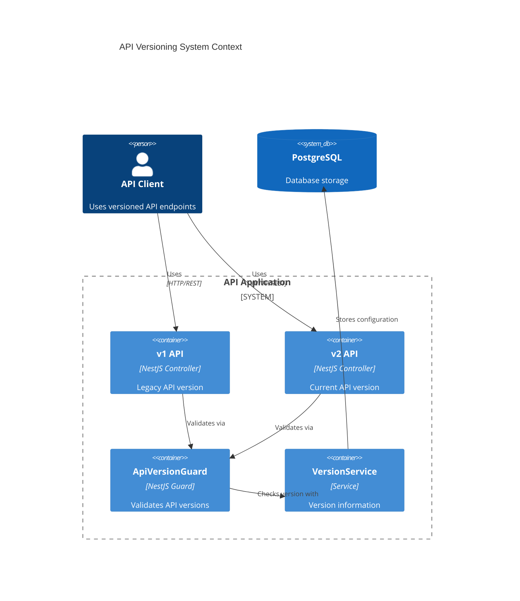
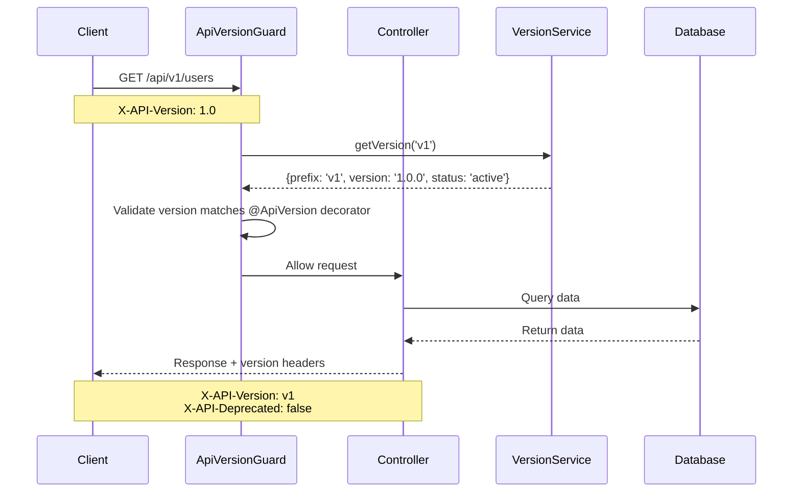
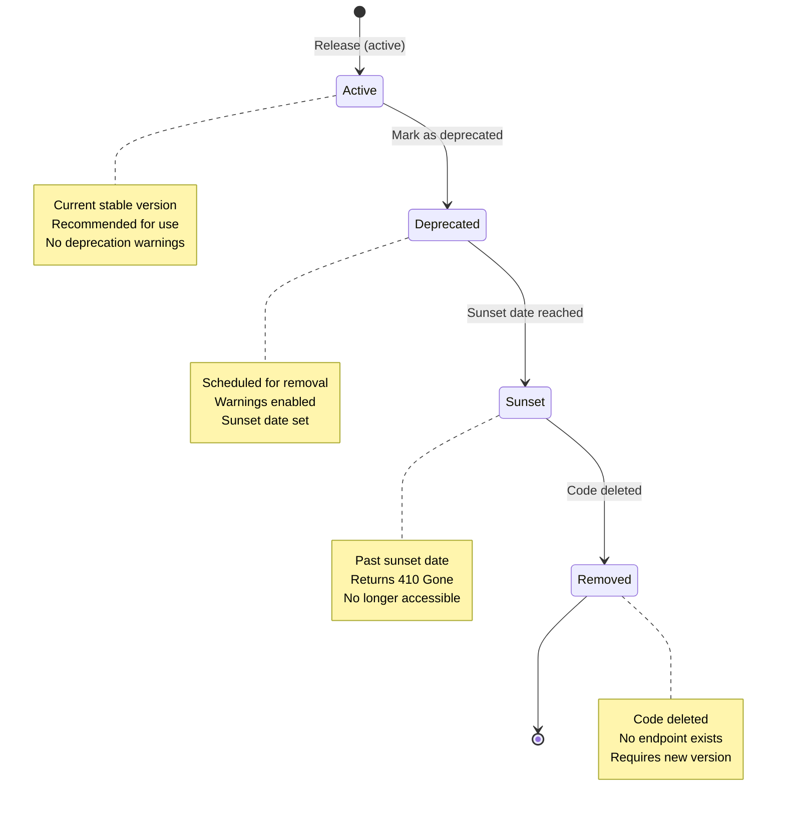

# API Versioning Overview

## Architecture

### System Context



### Request Flow Sequence



### Version Lifecycle State



### Component Architecture

The API versioning system consists of several interconnected components:

```mermaid
graph TB
    subgraph "Client Layer"
        Client[Client Application]
    end

    subgraph "API Layer"
        Main[main.ts<br/>Global Prefix Setup]
        Guard[ApiVersionGuard<br/>Version Validation]
        Controller[@ApiVersion<br/>Controller]
        Interceptor[VersionInterceptor<br/>Deprecation Headers]
    end

    subgraph "Service Layer"
        VersionService[VersionService<br/>Version Information]
        ConfigService[ConfigService<br/>Environment Config]
    end

    subgraph "Data Layer"
        Env[.env File<br/>API_VERSIONS]
    end

    Client -->|HTTP Request| Main
    Main --> Guard
    Guard -->|Extract Version| Controller
    Guard -->|Check Version| VersionService
    VersionService --> ConfigService
    ConfigService --> Env
    Controller --> Interceptor
    Interceptor -->|Add Headers| Client
    Controller -->|Response| Client
```

## Components

### 1. VersionService

**Location**: `src/common/services/version.service.ts`

**Purpose**: Central service for managing API version information.

**Features**:

- Caches version information at startup
- Provides version, git commit, and build metadata
- No blocking operations (uses environment variables for git info)

### 2. ApiVersionGuard

**Location**: `src/common/guards/version.guard.ts`

**Purpose**: Validates API version from request headers.

**Features**:

- Extracts version from `X-API-Version` or `Accept` header
- Validates against decorator-defined allowed versions
- Semantic versioning compatibility (major version matching)
- Automatic version normalization

### 3. ApiVersion Decorator

**Location**: `src/common/decorators/version.decorator.ts`

**Purpose**: Declares allowed API versions for controllers/endpoints.

**Features**:

- Class-level or method-level application
- Multiple version support
- Automatic version normalization

### 4. VersionModule

**Location**: `src/common/version/version.module.ts`

**Purpose**: Global module providing version system throughout the application.

**Features**:

- `@Global()` decorator for automatic availability
- Exports `VersionService` for dependency injection

## Versioning Strategy

### URL Structure

```
/{API_PREFIX}/{API_VERSION_PREFIX}/{endpoint}
Example: /api/v1/users
```

### Semantic Versioning

- **Format**: `MAJOR.MINOR.PATCH`
- **MAJOR**: Breaking changes (e.g., 1.0.0 → 2.0.0)
- **MINOR**: New features, backward compatible (e.g., 1.0.0 → 1.1.0)
- **PATCH**: Bug fixes, backward compatible (e.g., 1.0.0 → 1.0.1)

### Version Detection Methods

1. **URL Prefix** (Primary): `/api/v1/`
2. **X-API-Version Header** (Optional): `X-API-Version: 1.0`
3. **Accept Header** (Optional): `Accept: application/vnd.api.v1+json`

## Global Prefix Configuration

The global prefix is set in `main.ts`:

```typescript
const versionPrefix = configService.get<string>('API_VERSION_PREFIX', 'v1');
const globalPrefix = `${appConfig.apiPrefix}/${versionPrefix}`;
app.setGlobalPrefix(globalPrefix);
```

Result: All endpoints are served under `/api/v1/`

## Version Compatibility

The guard uses semantic versioning compatibility:

- **Exact match**: `1.0.0` matches `1.0.0`
- **Major version compatible**: `1.0.0` compatible with `1.2.3`
- **Incompatible**: `1.0.0` not compatible with `2.0.0`

## Swagger Integration

Swagger documentation automatically includes:

- API version number
- Version prefix in server URL
- Versioning strategy description

Access at: `http://localhost:3000/api/v1/api/docs`
