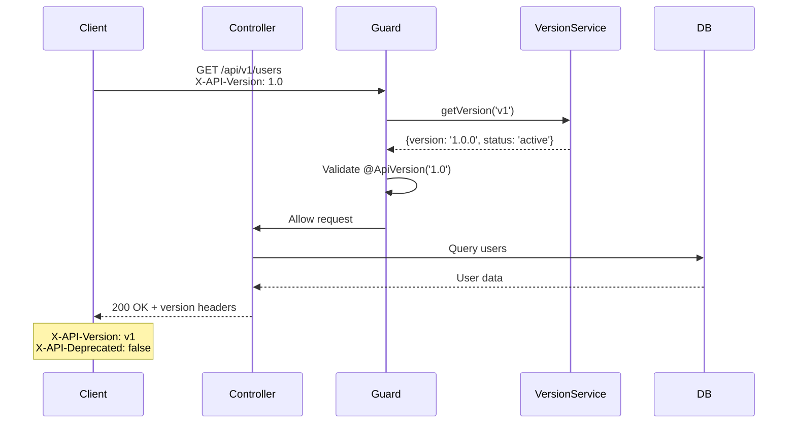

# API Versioning Usage Guide

## Request Flow



## Version Service Usage Flow

```mermaid
flowchart TD
    Start[Controller Request] --> Inject[Inject VersionService]
    Inject --> GetVersion{What Info Needed?}

    GetVersion -->|Semantic Version| GetSem[getSemanticVersion]
    GetVersion -->|Version Info| GetVer[getVersion]
    GetVersion -->|All Versions| GetAll[getAllVersions]
    GetVersion -->|Active Only| GetActive[getActiveVersions]
    GetVersion -->|Deprecation Check| GetDep[isVersionDeprecated]
    GetVersion -->|Full Info| GetFull[getFullVersionInfo]

    GetSem --> Return1[Return: '1.0.0']
    GetVer --> Return2[Return: {prefix, version, status}]
    GetAll --> Return3[Return: Array of versions]
    GetActive --> Return4[Return: Active versions only]
    GetDep --> Return5[Return: boolean]
    GetFull --> Return6[Return: {version, gitCommit, buildDate}]

    style GetSem fill:#a5d8ff
    style GetVer fill:#a5d8ff
    style GetAll fill:#a5d8ff
    style GetActive fill:#a5d8ff
    style GetDep fill:#ffd43b
    style GetFull fill:#a5d8ff
```

## Basic Usage

### Versioned Controllers

Create version-specific controllers using the `@ApiVersion` decorator:

```typescript
import { Controller, Get } from '@nestjs/common';
import { ApiVersion } from '../common/decorators';

@ApiVersion('1.0')
@Controller('users')
export class UsersControllerV1 {
  @Get()
  findAll() {
    return { version: 'v1', users: [] };
  }
}

@ApiVersion('2.0')
@Controller('users')
export class UsersControllerV2 {
  @Get()
  findAll() {
    return { version: 'v2', users: [], features: ['pagination', 'sorting'] };
  }
}
```

### Accessing Endpoints

```bash
# V1 endpoints
curl http://localhost:3000/api/v1/users

# V2 endpoints
curl http://localhost:3000/api/v2/users
```

## Version Service

### Injecting VersionService

```typescript
import { Injectable } from '@nestjs/common';
import { VersionService } from '../common/services/version.service';

@Injectable()
export class UsersService {
  constructor(private readonly versionService: VersionService) {}

  getUsers() {
    return {
      version: this.versionService.getVersion(),
      data: []
    };
  }
}
```

### Getting Version Information

```typescript
// Get semantic version (e.g., '1.0.0') for default version
const version = this.versionService.getSemanticVersion();

// Get version info for specific prefix
const v1Info = this.versionService.getVersion('v1');
// { prefix: 'v1', version: '1.0.0', status: 'active' }

// Get all versions
const allVersions = this.versionService.getAllVersions();

// Get active versions only
const activeVersions = this.versionService.getActiveVersions();

// Get full version info (with git metadata)
const info = this.versionService.getFullVersionInfo();
// {
//   version: '1.0.0',
//   gitCommit: 'a1b2c3d4...',
//   gitShortCommit: 'a1b2c3d',
//   buildDate: '2025-12-30T23:00:00.000Z'
// }

// Check version support
const isSupported = this.versionService.isVersionSupported('v1'); // true/false

// Check if version is deprecated
const isDeprecated = this.versionService.isVersionDeprecated('v1'); // true/false

// Get deprecation info
const deprecationInfo = this.versionService.getDeprecationInfo('v1');
// { deprecated: true, sunsetDate: '2026-06-30', daysUntilSunset: 180 }
```

## Response Headers

### Adding Version Headers

```typescript
import { Controller, Get, Res } from '@nestjs/common';
import { Response } from 'express';
import { VersionService } from '../common/services/version.service';

@Controller()
export class AppController {
  constructor(private readonly versionService: VersionService) {}

  @Get('users')
  findAll(@Res() res: Response) {
    const versionInfo = this.versionService.getFullVersionInfo();

    res.setHeader('X-API-Version', versionInfo.version);
    res.setHeader('X-Git-Commit', versionInfo.gitShortCommit);
    res.setHeader('X-Build-Date', versionInfo.buildDate);

    res.json({ users: [] });
  }
}
```

## Multiple Version Support

### Supporting Multiple Versions

An endpoint can support multiple API versions:

```typescript
import { Controller, Get } from '@nestjs/common';
import { ApiVersion } from '../common/decorators';

@Controller('products')
export class ProductsController {
  @Get()
  @ApiVersion('1.0', '2.0') // Supports both versions
  findAll() {
    // This endpoint works for both v1 and v2 clients
    return { products: [] };
  }

  @Get('v2-features')
  @ApiVersion('2.0') // Only v2
  getV2Features() {
    return { products: [], advanced: true };
  }
}
```

### Conditional Logic Based on Version

```typescript
import { Controller, Get, Req } from '@nestjs/common';
import { ApiVersion } from '../common/decorators';

@Controller('reports')
@ApiVersion('1.0', '2.0')
export class ReportsController {
  @Get()
  findAll(@Req() req: any) {
    const clientVersion = req.headers['x-api-version'];

    if (clientVersion?.startsWith('2.')) {
      // V2 logic
      return { reports: [], format: 'detailed' };
    }

    // V1 logic
    return { reports: [], format: 'simple' };
  }
}
```

## Version Guard Usage

### Enforcing Version Validation

```typescript
import { Controller, Get, UseGuards } from '@nestjs/common';
import { ApiVersion } from '../common/decorators';
import { ApiVersionGuard } from '../common/guards';

@Controller('admin')
@ApiVersion('1.0')
@UseGuards(ApiVersionGuard)
export class AdminController {
  @Get()
  dashboard() {
    return { data: 'admin dashboard' };
  }
}
```

### Custom Version Headers

Clients can specify version using headers:

```bash
# Using X-API-Version header
curl -H "X-API-Version: 1.0" http://localhost:3000/api/v1/users

# Using Accept header with vendor MIME type
curl -H "Accept: application/vnd.api.v1+json" http://localhost:3000/api/v1/users
```

## Controller Inheritance

### Base Versioned Controller

```typescript
import { Controller } from '@nestjs/common';
import { ApiVersion } from '../common/decorators';

@ApiVersion('1.0')
@Controller('users')
export class BaseUsersController {
  // Common methods for v1
}
```

### Extended Version Controller

```typescript
export class UsersControllerV2 extends BaseUsersController {
  // Additional methods for v2
}
```

## Deprecating Endpoints

### Using @ApiDeprecated Decorator

```typescript
import { Controller, Get } from '@nestjs/common';
import { ApiVersion, ApiDeprecated } from '../common/decorators';

@Controller('old-endpoint')
@ApiVersion('1.0')
export class OldController {
  @Get()
  @ApiDeprecated('Use /new-endpoint instead')
  oldMethod() {
    return { message: 'This is deprecated' };
  }
}
```

## Real-World Examples

### Example 1: Users API

```typescript
import { Controller, Get, Post, Body, Param } from '@nestjs/common';
import { ApiVersion, ApiDeprecated } from '../common/decorators';
import { VersionService } from '../common/services/version.service';

// V1 - Basic user operations
@ApiVersion('1.0')
@Controller('users')
export class UsersControllerV1 {
  constructor(private readonly versionService: VersionService) {}

  @Get()
  findAll() {
    return {
      version: this.versionService.getSemanticVersion(),
      users: []
    };
  }

  @Get(':id')
  findOne(@Param('id') id: string) {
    return { user: { id, name: 'John Doe' } };
  }
}

// V2 - Enhanced user operations with pagination
@ApiVersion('2.0')
@Controller('users')
export class UsersControllerV2 {
  @Get()
  findAll() {
    return {
      users: [],
      pagination: { page: 1, limit: 10, total: 100 },
      filters: ['active', 'verified']
    };
  }

  @Get(':id')
  findOne(@Param('id') id: string) {
    return {
      user: {
        id,
        name: 'John Doe',
        email: 'john@example.com',
        metadata: { lastLogin: '2025-12-30' }
      }
    };
  }

  @Post()
  create(@Body() createUserDto: CreateUserDto) {
    return { user: createUserDto, created: true };
  }
}
```

### Example 2: Health Endpoint with Version Info

```typescript
import { Controller, Get } from '@nestjs/common';
import { ApiTags, ApiOperation } from '@nestjs/swagger';
import { VersionService } from '../common/services/version.service';

@ApiTags('app')
@Controller()
export class AppController {
  constructor(
    private readonly appService: AppService,
    private readonly versionService: VersionService
  ) {}

  @Get('health')
  @ApiOperation({ summary: 'Health check endpoint' })
  health() {
    return {
      status: 'ok',
      message: 'API is healthy',
      version: this.versionService.getSemanticVersion(),
      timestamp: new Date().toISOString()
    };
  }

  @Get('version')
  @ApiOperation({ summary: 'Get detailed version information' })
  version() {
    return this.versionService.getFullVersionInfo();
  }
}
```

## Testing Versioned Endpoints

### Unit Testing

```typescript
import { Test } from '@nestjs/testing';
import { UsersControllerV1 } from './users.controller';
import { VersionService } from '../common/services/version.service';

describe('UsersControllerV1', () => {
  let controller: UsersControllerV1;
  let versionService: VersionService;

  beforeEach(async () => {
    const module = await Test.createTestingModule({
      controllers: [UsersControllerV1],
      providers: [
        {
          provide: VersionService,
          useValue: {
            getSemanticVersion: jest.fn().mockReturnValue('1.0.0'),
            getVersion: jest
              .fn()
              .mockReturnValue({ prefix: 'v1', version: '1.0.0', status: 'active' })
          }
        }
      ]
    }).compile();

    controller = module.get<UsersControllerV1>(UsersControllerV1);
    versionService = module.get<VersionService>(VersionService);
  });

  it('should return users with version', () => {
    const result = controller.findAll();
    expect(result.version).toBe('1.0.0');
  });
});
```

### Integration Testing

```typescript
import { Test } from '@nestjs/testing';
import * as request from 'supertest';
import { AppModule } from '../app.module';

describe('API Versioning (e2e)', () => {
  let app;

  beforeAll(async () => {
    const moduleFixture = await Test.createTestingModule({
      imports: [AppModule]
    }).compile();

    app = moduleFixture.createNestApplication();
    await app.init();
  });

  it('/api/v1/users (GET)', () => {
    return request(app.getHttpServer())
      .get('/api/v1/users')
      .expect(200)
      .expect((res) => {
        expect(res.body.version).toBeDefined();
      });
  });

  afterAll(async () => {
    await app.close();
  });
});
```

## Best Practices

### 1. Version Early

Start versioning from the beginning. It's harder to add later.

```typescript
// ✅ Good - Version from v1
@ApiVersion('1.0')
@Controller('users')
export class UsersController {}

// ❌ Bad - No version initially
@Controller('users')
export class UsersController {}
```

### 2. Use Semantic Versioning

Follow semantic versioning principles:

- **MAJOR**: Breaking changes (create v2)
- **MINOR**: New features (v1.1.0)
- **PATCH**: Bug fixes (v1.0.1)

### 3. Document Changes

Keep a changelog for each version:

```markdown
## v2.0.0 (2025-12-30)

### Breaking Changes

- Users endpoint now requires authentication

### New Features

- Added pagination support
- Added filtering and sorting

### Deprecated

- `/users/old-endpoint` - Use `/users/new-endpoint`
```

### 4. Maintain Old Versions

Support old versions for a deprecation period:

```typescript
// Keep v1 for 6 months after v2 release
@ApiVersion('1.0')
@Controller('users')
export class UsersControllerV1 {
  // V1 implementation
}

@ApiVersion('2.0')
@Controller('users')
export class UsersControllerV2 {
  // V2 implementation
}
```

### 5. Communicate Deprecations

Use headers to communicate deprecation:

```typescript
@Get()
@ApiDeprecated('Use v2 endpoint')
findAll(@Res() res: Response) {
  res.setHeader('X-API-Deprecation', 'This endpoint is deprecated. Use /api/v2/users');
  res.setHeader('Sunset', '2026-06-30'); // Deprecation date

  res.json({ users: [] });
}
```
