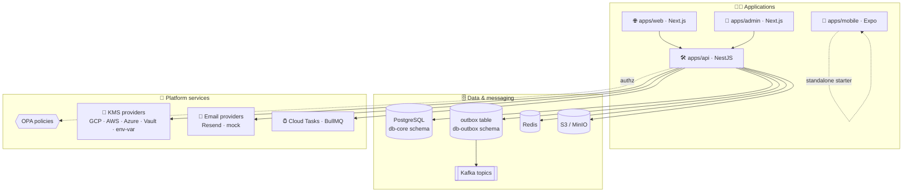
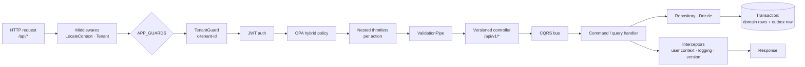
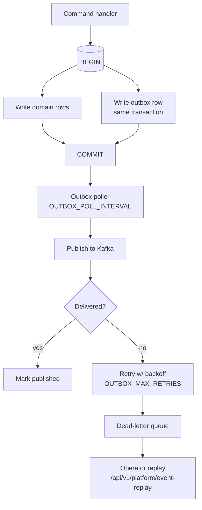
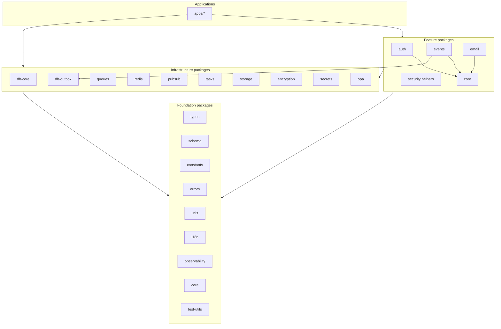

# 🏗️ Architecture

> Grounded in `apps/api/src/app.module.ts`, `apps/api/src/main.ts`, and the
> package sources — not aspirational design notes.

## 🌐 System context

- **`apps/api`** — the only writer of domain data. NestJS 12, `@nestjs/cqrs`,
  Drizzle ORM, Passport JWT, `@nestjs/throttler`, `@nestjs/schedule`.
- **`apps/web` / `apps/admin`** — Next.js 16 apps that call the API through
  route handlers (`apps/*/src/app/api/**`) and tRPC routers for server data.
- **`apps/mobile`** — self-contained Expo starter with mocked auth; intended to
  be pointed at the API later.

## 🚦 Request lifecycle

Wired in `AppModule` (`apps/api/src/app.module.ts`) and `main.ts`:

Cross-cutting pieces:

| Piece            | Where                                       | Notes                                                                                                                                                                       |
| ---------------- | ------------------------------------------- | --------------------------------------------------------------------------------------------------------------------------------------------------------------------------- |
| Global prefix    | `main.ts`                                   | every route mounts under `/api`                                                                                                                                             |
| API versioning   | `@VersionedController('v1', '...')`         | URI versioning; **v1 only** — no v2 routes exist                                                                                                                            |
| Tenant isolation | `TenantMiddleware` + `TenantGuard`          | requires tenant context on protected routes                                                                                                                                 |
| Authorization    | `HybridPolicyGuard` + OPA                   | RBAC + OPA policy decision, shadow/strict modes                                                                                                                             |
| Rate limiting    | `ThrottlerModule`                           | named buckets: `login`, `registration`, `refreshToken`, `oauth`, `phoneLogin`, `validateToken`, `invitationPreview`, `passwordReset`, `bootstrapStatus`, `bootstrapInstall` |
| Error model      | `GlobalExceptionFilter` + `@package/errors` | typed error codes, i18n-ready messages                                                                                                                                      |
| Observability    | `ObservabilityModule`                       | pino logging, OpenTelemetry tracing/metrics                                                                                                                                 |

## 📤 Transactional outbox

`packages/db-outbox` owns the outbox table + NestJS module;
`packages/events` owns the poller, publisher, dead-letter, and replay services.

Consumers subscribe by topic (Kafka) with per-topic consumer groups; failed
handlers land in the dead-letter queue and can be replayed from the admin
console.

## 🧩 Package layering

Rules of thumb:

- **foundation** packages depend on nothing internal (types, utils, constants…)
- **infrastructure** packages wrap one external system and depend on foundation
- **feature** packages compose infrastructure (auth, events, email)
- **apps** compose everything and hold the business modules

## 🗂️ API module map

Module class names are domain-renamed; directories keep a stable lowercase
name. Verified in `apps/api/src/app.module.ts`:

| Module class        | Directory                 | Domain                         | Base route                      |
| ------------------- | ------------------------- | ------------------------------ | ------------------------------- |
| `PeopleModule`      | `modules/users`           | people directory & addresses   | `/api/v1/people`                |
| `AuthModule`        | `modules/auth`            | identity, tokens, sessions     | `/api/v1/iam`                   |
| `WorkspacesModule`  | `modules/tenants`         | tenants & memberships          | `/api/v1/workspaces`            |
| `SpacesModule`      | `modules/projects`        | projects                       | `/api/v1/spaces`                |
| `TicketsModule`     | `modules/issues`          | issues                         | `/api/v1/tickets`               |
| `PagesModule`       | `modules/content`         | content pages                  | `/api/v1/pages`                 |
| `SecureVaultModule` | `modules/encrypted-store` | encrypted field storage        | `/api/v1/secure-vault`          |
| `StorageModule`     | `modules/storage`         | object storage                 | `/api/v1/objects`               |
| `ConsoleModule`     | `modules/admin`           | operator console               | `/api/v1/console`               |
| `PlatformModule`    | `modules/system`          | settings, metrics, replay, DLQ | `/api/v1/platform`              |
| `InboundMailModule` | `modules/email-webhooks`  | mail webhook ingestion         | `/api/v1/webhooks/inbound-mail` |
| `OpsHealthModule`   | `modules/health`          | health checks                  | `/api/v1/ops/health`            |
| `SetupModule`       | `modules/bootstrap`       | first-run install              | `/api/v1/setup`                 |
| `ApiKeysModule`     | `modules/api-keys`        | API key schema & repository    | — (no HTTP surface)             |
| `SecurityModule`    | `modules/security`        | security monitoring            | — (guards/services)             |
| email module        | `modules/email`           | outbound email send            | `/api/v1/messaging`             |

Feature folders inside each module follow the same shape:
`commands/ · queries/ · handlers/ · controllers/ · repositories/ · dto/ ·
events/ · jobs/ · consumers/ · __tests__/`.
