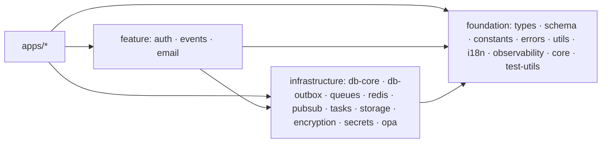

# 🧩 Packages

22 shared packages live under `packages/`. Layering rule of thumb:
**foundation → infrastructure → feature → apps** (see
[architecture.md](architecture.md)).

## 🏛️ Foundation

| Package         | Purpose                                                                                                                          |
| --------------- | -------------------------------------------------------------------------------------------------------------------------------- |
| `types`         | Shared domain & infrastructure types (CQRS command/query/event, results, multitenancy, CloudEvents)                              |
| `schema`        | Schema/validation primitives: base string/number/bool/date validators, domain schemas (pagination, sorting, filtering, entities) |
| `constants`     | Domain constants: statuses, roles, permissions, tenant isolation, rate limits, timeouts, HTTP status                             |
| `errors`        | Typed error registry (`<DOMAIN>_<NNN>` codes), factories, i18n message resolution                                                |
| `utils`         | Pure helpers: array, date, number, object, string (chunk, groupBy, slugify, …)                                                   |
| `i18n`          | Internationalization utilities                                                                                                   |
| `observability` | pino logging, OpenTelemetry tracing/metrics, GCP providers, PII/audit redaction patterns                                         |
| `core`          | Config resolution, `@Instrumented` telemetry decorators, testing helpers                                                         |
| `test-utils`    | Testcontainers (PostgreSQL, Redis, Kafka), fixtures, DB setup helpers used by API & package integration tests                    |

## 🏗️ Infrastructure

| Package      | Purpose                                                                                                                                                                    |
| ------------ | -------------------------------------------------------------------------------------------------------------------------------------------------------------------------- |
| `db-core`    | Main PostgreSQL schema (Drizzle): 32 tables — users, organizations, tenants, projects, issues, content, files, addresses, … Includes migrations, seed datasets & factories |
| `db-outbox`  | Outbox schema (`outbox` table), migrations, and `OutboxDbModule` (NestJS)                                                                                                  |
| `redis`      | Redis client, cache service, pub/sub, `@Cached`-style decorators                                                                                                           |
| `queues`     | Queue abstraction over BullMQ (Redis), Google Cloud Tasks, and Pub/Sub — queue/worker/scheduler APIs with retries & DLQ                                                    |
| `pubsub`     | Google Pub/Sub provider + deterministic mock provider                                                                                                                      |
| `tasks`      | Google Cloud Tasks provider + mock provider                                                                                                                                |
| `storage`    | S3-compatible object storage, deterministic mock provider, NestJS module                                                                                                   |
| `encryption` | Envelope encryption & key rotation over multi-provider KMS (GCP KMS, AWS KMS, Azure KeyVault, Vault Transit, env-var)                                                      |
| `secrets`    | Secret providers: GCP Secret Manager, HashiCorp Vault, 1Password, mock                                                                                                     |
| `opa`        | Open Policy Agent integration: guards (`opa.guard`, `opa-cached.guard`), service, Rego policies under `packages/opa/policies`                                              |

## ⚙️ Feature

| Package  | Purpose                                                                                                                                                        |
| -------- | -------------------------------------------------------------------------------------------------------------------------------------------------------------- |
| `auth`   | Multi-provider identity: custom JWT, Google Identity Platform, Keycloak; permission & role services, session/token services, admin-credential config           |
| `events` | Event bus (Kafka), transactional outbox poller/publisher, dead-letter service, event replay, routing bridges (Pub/Sub, queues, tasks), versioning & validation |
| `email`  | Outbound email providers (Resend + mock) and an inbound webhook provider registry with conformance tests                                                       |

## 🔌 Who depends on what (verified)

- `events` → `db-outbox`, `core`, `observability`, `pubsub`, `queues`, `schema`, `tasks`
- `auth` → `constants`, `core`, `db-core`, `redis`
- `test-utils` → `db-core`, `db-outbox`
- `email` → `core`, `queues`
- regenerated graph: `pnpm docs:package-deps` →
  `.agents/docs/reference/packages/dependency-graph.md`

## ➕ Adding a package

1. `pnpm nx g @nx/js:lib packages/<name> --publishable` (or copy a minimal
   existing package: `package.json`, `project.json`, `tsconfig.json`,
   `tsconfig.lib.json`, `src/index.ts`).
2. Register the TS path alias in `tsconfig.base.json`
   (`@package/<name>`).
3. Import order/layering: never import **upward** (feature → foundation is
   fine, the reverse is not).
4. Add the package to the CI typecheck list in
   `.github/workflows/ci.yml` and regenerate docs
   (`pnpm docs:generate`).
